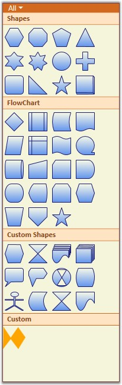

::: {style="DISPLAY: none"}
{#d2h_url_template}{#d2h_package_url style="WIDTH: 0px; DISPLAY: none; HEIGHT: 0px"}
:::

::::: {#nsbanner .d2h_main_nsbanner style="BORDER-BOTTOM: #999999 1px solid; POSITION: relative; PADDING-BOTTOM: 0px; BACKGROUND-COLOR: transparent; PADDING-LEFT: 0px; PADDING-RIGHT: 0px; DISPLAY: none; BORDER-TOP: #999999 1px solid; PADDING-TOP: 0px; LEFT: 0px"}
:::: {#TitleRow .d2h_main_titlerow style="PADDING-BOTTOM: 4px; BACKGROUND-COLOR: transparent; PADDING-LEFT: 22px; WIDTH: 100%; PADDING-RIGHT: 10px; DISPLAY: none; PADDING-TOP: 4px"}
::: {#ienav .d2h_main_ienav style="DISPLAY: none"}
{#D2HPrevious .D2HPreviousEnabled}  {#D2HNext .D2HNextEnabled}
:::
::::
:::::

:::: {#nstext .d2h_main_nstext style="PADDING-BOTTOM: 10px; BACKGROUND-COLOR: transparent; PADDING-LEFT: 22px; PADDING-RIGHT: 10px; HEIGHT: 100%; OVERFLOW: auto; PADDING-TOP: 5px" hasuserbackground="true" valign="bottom"}
::: {#d2h_breadcrumbs .d2h_breadcrumbs}
[Essential Studio User Guide Documentation](ms-xhelp:///?Id=12457748-09e3-4d74-a240-8e049cedf030){.d2h_breadcrumbsNormal}[ \> ]{.d2h_breadcrumbsLinkSeparator}[User Interface Edition](ms-xhelp:///?Id=c29296b7-531c-413b-a0ec-488ca1f7f669){.d2h_breadcrumbsNormal}[ \> ]{.d2h_breadcrumbsLinkSeparator}[Essential Silverlight](ms-xhelp:///?Id=66221bd1-ba2e-43c2-94a7-618f50e01d24){.d2h_breadcrumbsNormal}[ \> ]{.d2h_breadcrumbsLinkSeparator}[Essential Diagram]{.d2h_breadcrumbsContentsOnly}[ \> ]{.d2h_breadcrumbsLinkSeparator}[Concepts and Features](ms-xhelp:///?Id=d592a058-dcc0-44a4-994e-e7901da8db52){.d2h_breadcrumbsNormal}[ \> ]{.d2h_breadcrumbsLinkSeparator}[Symbol Palette](ms-xhelp:///?Id=1beb97d8-d59c-47be-ad18-730d53d299b4){.d2h_breadcrumbsNormal}
:::

### Symbol Palette Item {#symbol-palette-item style="tab-stops: 0pt"}

[]{style="FONT-FAMILY: 'Trebuchet MS','sans-serif'; COLOR: #15428b; FONT-SIZE: 9pt"} 

Symbol Palette items are contained in the Symbol Palette group. A Symbol Palette item does not restrict users to the type of content that can be added to it. A Symbol Palette item can be a text box, combo box, image, button, and so on.

 

The **Name** property of the SymbolPaletteItem can be used to refer to the custom item being added in the NodeDrop event. The name of the SymbolPaletteItem becomes the name of the node.

 

The following code snippet can be used to add a Symbol Palette item that has an image as its content.

[]{style="FONT-FAMILY: 'Trebuchet MS','sans-serif'; COLOR: #15428b; FONT-SIZE: 9pt"} 

+----------------------------------------------------------------------------------------------------------------------------------------------------------------------------------------------------------------------------------------------------------------------------------------------+
| **[\[C#\]]{style="FONT-FAMILY: 'Courier New'; COLOR: black"}**[]{style="FONT-FAMILY: 'Courier New'"}                                                                                                                                                                                         |
|                                                                                                                                                                                                                                                                                              |
| [ ]{style="FONT-FAMILY: 'Courier New'"}[ SymbolPaletteGroup]{style="FONT-FAMILY: 'Courier New'; COLOR: #2b91af"}[ group = [new]{style="COLOR: blue"} [SymbolPaletteGroup]{style="COLOR: #2b91af"}();]{style="FONT-FAMILY: 'Courier New'"}                                                    |
|                                                                                                                                                                                                                                                                                              |
| [  group.HeaderName = [\"Custom\"]{style="COLOR: #a31515"};    ]{style="FONT-FAMILY: 'Courier New'"}                                                                                                                                                                                         |
|                                                                                                                                                                                                                                                                                              |
| [  SymbolPalette]{style="FONT-FAMILY: 'Courier New'; COLOR: #2b91af"}[.SetFilterIndexes(group, [new]{style="COLOR: blue"} [List]{style="COLOR: #2b91af"}\<[int]{style="COLOR: blue"}\>() { 0, 6 });]{style="FONT-FAMILY: 'Courier New'"}                                                     |
|                                                                                                                                                                                                                                                                                              |
| [  dc.SymbolPalette.SymbolGroups.Add(group);]{style="FONT-FAMILY: 'Courier New'"}                                                                                                                                                                                                            |
|                                                                                                                                                                                                                                                                                              |
| [  [SymbolPaletteItem]{style="COLOR: #2b91af"} item = [new]{style="COLOR: blue"} [SymbolPaletteItem]{style="COLOR: #2b91af"}();]{style="FONT-FAMILY: 'Courier New'"}                                                                                                                         |
|                                                                                                                                                                                                                                                                                              |
| [  [Image]{style="COLOR: #2b91af"} i = [new]{style="COLOR: blue"} [Image]{style="COLOR: #2b91af"}();]{style="FONT-FAMILY: 'Courier New'"}                                                                                                                                                    |
|                                                                                                                                                                                                                                                                                              |
| [  ]{style="FONT-FAMILY: 'Courier New'"}[BitmapImage ]{style="FONT-FAMILY: 'Courier New'; COLOR: #2b91af"}[bi3 = [new]{style="COLOR: blue"} ]{style="FONT-FAMILY: 'Courier New'"}[BitmapImage]{style="FONT-FAMILY: 'Courier New'; COLOR: #2b91af"}[ ();]{style="FONT-FAMILY: 'Courier New'"} |
|                                                                                                                                                                                                                                                                                              |
| [  bi3.BeginInit();]{style="FONT-FAMILY: 'Courier New'"}                                                                                                                                                                                                                                     |
|                                                                                                                                                                                                                                                                                              |
| [  bi3.UriSource = [new]{style="COLOR: blue"} [Uri]{style="COLOR: #2b91af"}([\"Custom.png\"]{style="COLOR: #a31515"},        [UriKind]{style="COLOR: #2b91af"}.RelativeOrAbsolute);]{style="FONT-FAMILY: 'Courier New'"}                                                                     |
|                                                                                                                                                                                                                                                                                              |
| [  bi3.EndInit();]{style="FONT-FAMILY: 'Courier New'"}                                                                                                                                                                                                                                       |
|                                                                                                                                                                                                                                                                                              |
| [  i.Stretch = [Stretch]{style="COLOR: #2b91af"}.Fill;]{style="FONT-FAMILY: 'Courier New'"}                                                                                                                                                                                                  |
|                                                                                                                                                                                                                                                                                              |
| [  i.Source = bi3;]{style="FONT-FAMILY: 'Courier New'"}                                                                                                                                                                                                                                      |
|                                                                                                                                                                                                                                                                                              |
| [  item.Content = i;]{style="FONT-FAMILY: 'Courier New'"}                                                                                                                                                                                                                                    |
|                                                                                                                                                                                                                                                                                              |
| [  group.Items.Add(item);]{style="FONT-FAMILY: 'Courier New'"}                                                                                                                                                                                                                               |
+----------------------------------------------------------------------------------------------------------------------------------------------------------------------------------------------------------------------------------------------------------------------------------------------+

[]{style="FONT-FAMILY: 'Trebuchet MS','sans-serif'; COLOR: #15428b; FONT-SIZE: 9pt"} 

+-----------------------------------------------------------------------------------------------------------------------------------------------------------------------------------------------------------------------------------------------------------------------------------------------------------------------------+
| **[\[VB\]]{style="FONT-FAMILY: 'Courier New'"}**                                                                                                                                                                                                                                                                            |
|                                                                                                                                                                                                                                                                                                                             |
| [Dim]{style="FONT-FAMILY: 'Courier New'; COLOR: blue"}[ group [As]{style="COLOR: blue"} [New]{style="COLOR: blue"} [SymbolPaletteGroup]{style="COLOR: #2b91af"}()]{style="FONT-FAMILY: 'Courier New'"}                                                                                                                      |
|                                                                                                                                                                                                                                                                                                                             |
| [group.HeaderName = [\"Custom\"]{style="COLOR: #a31515"}]{style="FONT-FAMILY: 'Courier New'"}                                                                                                                                                                                                                               |
|                                                                                                                                                                                                                                                                                                                             |
| [SymbolPalette]{style="FONT-FAMILY: 'Courier New'; COLOR: #2b91af"}[.SetFilterIndexes(group, [New]{style="COLOR: blue"} [List]{style="COLOR: #2b91af"}([Of]{style="COLOR: blue"} [Integer]{style="COLOR: blue"}) ([New]{style="COLOR: blue"} [Integer]{style="COLOR: blue"}() {0, 6}))]{style="FONT-FAMILY: 'Courier New'"} |
|                                                                                                                                                                                                                                                                                                                             |
| [diagramControl.SymbolPalette.SymbolGroups.Add(group)]{style="FONT-FAMILY: 'Courier New'"}                                                                                                                                                                                                                                  |
|                                                                                                                                                                                                                                                                                                                             |
| [Dim]{style="FONT-FAMILY: 'Courier New'; COLOR: blue"}[ item [As]{style="COLOR: blue"} [New]{style="COLOR: blue"} [SymbolPaletteItem]{style="COLOR: #2b91af"}()]{style="FONT-FAMILY: 'Courier New'"}                                                                                                                        |
|                                                                                                                                                                                                                                                                                                                             |
| [Dim]{style="FONT-FAMILY: 'Courier New'; COLOR: blue"}[ i [As]{style="COLOR: blue"} [New]{style="COLOR: blue"} [Image]{style="COLOR: #2b91af"}()]{style="FONT-FAMILY: 'Courier New'"}                                                                                                                                       |
|                                                                                                                                                                                                                                                                                                                             |
| [Dim]{style="FONT-FAMILY: 'Courier New'; COLOR: blue"}[ bi3 [As]{style="COLOR: blue"} [New]{style="COLOR: blue"} [BitmapImage]{style="COLOR: #2b91af"}()]{style="FONT-FAMILY: 'Courier New'"}                                                                                                                               |
|                                                                                                                                                                                                                                                                                                                             |
| [bi3.UriSource = [New]{style="COLOR: blue"} [Uri]{style="COLOR: #2b91af"}([\"Custom.png\"]{style="COLOR: #a31515"}, [UriKind]{style="COLOR: #2b91af"}.RelativeOrAbsolute)]{style="FONT-FAMILY: 'Courier New'"}                                                                                                              |
|                                                                                                                                                                                                                                                                                                                             |
| [i.Stretch = [Stretch]{style="COLOR: #2b91af"}.Fill]{style="FONT-FAMILY: 'Courier New'"}                                                                                                                                                                                                                                    |
|                                                                                                                                                                                                                                                                                                                             |
| [i.Source = bi3]{style="FONT-FAMILY: 'Courier New'"}                                                                                                                                                                                                                                                                        |
|                                                                                                                                                                                                                                                                                                                             |
| [item.Content = i]{style="FONT-FAMILY: 'Courier New'"}                                                                                                                                                                                                                                                                      |
|                                                                                                                                                                                                                                                                                                                             |
| [group.Items.Add(item)]{style="FONT-FAMILY: 'Courier New'"}                                                                                                                                                                                                                                                                 |
+-----------------------------------------------------------------------------------------------------------------------------------------------------------------------------------------------------------------------------------------------------------------------------------------------------------------------------+

[]{style="FONT-FAMILY: 'Trebuchet MS','sans-serif'; COLOR: #15428b; FONT-SIZE: 9pt"} 

This adds the image content to the newly created Symbol Palette item that belongs to the Symbol Palette group named \"Custom\".

[]{style="FONT-FAMILY: 'Trebuchet MS','sans-serif'; COLOR: #15428b; FONT-SIZE: 9pt"} 

{border="0"}

Figure 153: Custom Group and Item**[]{style="FONT-STYLE: normal; FONT-FAMILY: 'Trebuchet MS','sans-serif'; COLOR: #15428b"}**

More:

[ ]{#related-topics}

[{border="0" align="absMiddle"}Adding a path as SymbolPaletteItem](ms-xhelp:///?Id=2176eda3-9f92-4960-9b03-cf6a1f02de20){style="TEXT-DECORATION: none"}

[{border="0" align="absMiddle"}Define Node, Port, Group definitions in SymbolPalette](ms-xhelp:///?Id=79146789-982e-4dab-b558-5a329421c783){style="TEXT-DECORATION: none"}
::::
