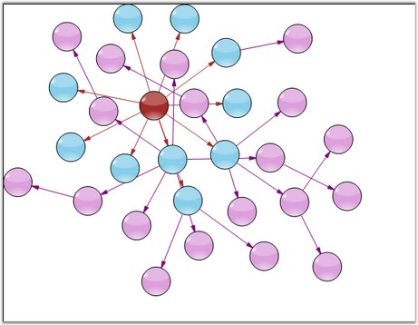
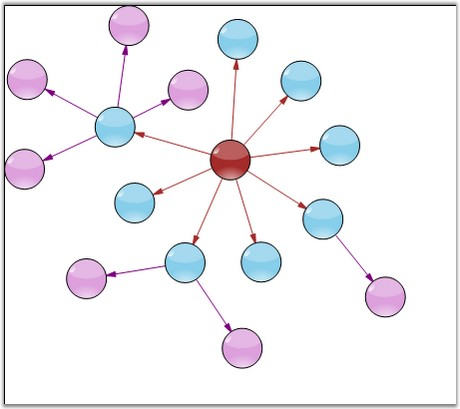

::: {style="DISPLAY: none"}
{#d2h_url_template}{#d2h_package_url style="WIDTH: 0px; DISPLAY: none; HEIGHT: 0px"}
:::

::: {.d2h_secondary_topic style="PADDING-BOTTOM: 10pt; MARGIN: 0pt; PADDING-LEFT: 0pt; PADDING-RIGHT: 0pt; PADDING-TOP: 0pt"}
#### Symmetric Layout {#symmetric-layout style="tab-stops: 0pt"}

[]{style="FONT-FAMILY: 'Trebuchet MS','sans-serif'; COLOR: #15428b; FONT-SIZE: 9pt"} 

The **SymmetricLayoutManager** arranges all the nodes in a symmetric fashion. It includes the following parameters.

[]{style="FONT-FAMILY: 'Trebuchet MS','sans-serif'; COLOR: #15428b; FONT-SIZE: 9pt"} 

[·      ]{style="FONT-FAMILY: Symbol"}**Model**: specifies the Current Model

[·      ]{style="FONT-FAMILY: Symbol"}**VerticalDistance**: specifies the distance between adjacent nodes

[]{style="FONT-FAMILY: 'Trebuchet MS','sans-serif'; COLOR: #15428b; FONT-SIZE: 9pt"} 

The following code example illustrates how to create the SymmetricLayoutManager programmatically.

[]{style="FONT-FAMILY: 'Trebuchet MS','sans-serif'; COLOR: #15428b; FONT-SIZE: 9pt"} 

+------------------------------------------------------------------------------------------------------------------------------------------------------------------------------------------------------------------------------------------------+
| **[\[C#\]]{style="FONT-FAMILY: 'Courier New'"}**                                                                                                                                                                                               |
|                                                                                                                                                                                                                                                |
| []{style="FONT-FAMILY: 'Courier New'"}                                                                                                                                                                                                         |
|                                                                                                                                                                                                                                                |
| [this]{style="FONT-FAMILY: 'Courier New'; COLOR: blue"}[.DiagramWebControl1.LayoutManager = [new]{style="COLOR: blue"} SymmetricLayoutManager([this]{style="COLOR: blue"}.DiagramWebControl1.Model, 200);]{style="FONT-FAMILY: 'Courier New'"} |
+------------------------------------------------------------------------------------------------------------------------------------------------------------------------------------------------------------------------------------------------+

[]{style="FONT-FAMILY: 'Trebuchet MS','sans-serif'; COLOR: #15428b; FONT-SIZE: 9pt"} 

{border="0"}

[]{style="FONT-FAMILY: 'Trebuchet MS','sans-serif'; COLOR: #15428b; FONT-SIZE: 9pt"} 

Figure 27: Diagram with Symmetric Layout

[]{style="FONT-FAMILY: 'Trebuchet MS','sans-serif'; FONT-SIZE: 9pt"} 

{border="0"}

[]{style="FONT-FAMILY: 'Trebuchet MS','sans-serif'; COLOR: #15428b; FONT-SIZE: 9pt"} 

Figure 28: Symmetric Layout with Spring Factor Settings

[]{style="FONT-FAMILY: 'Trebuchet MS','sans-serif'; COLOR: #15428b; FONT-SIZE: 9pt"} 

See Also

[]{style="FONT-FAMILY: 'Trebuchet MS','sans-serif'; COLOR: #15428b; FONT-SIZE: 9pt"} 

[Table Layout]{.UGHyperlink}[, ]{.UGHyperlink}[Directed Tree Layout]{.UGHyperlink}[, ]{.UGHyperlink}[Hierarchical Layout]{.UGHyperlink}[, ]{.UGHyperlink}[Graph Layout]{.UGHyperlink}[, ]{.UGHyperlink}[Subgraph Tree Layout]{.UGHyperlink}[, ]{.UGHyperlink}[Radial Tree Layout]{.UGHyperlink}[, ]{.UGHyperlink}[OrgChart Layout]{.UGHyperlink}[, [Updating the Layout]{style="COLOR: blue"}]{.UGHyperlink}

[]{#p33} 

[]{#related-topics}
:::
