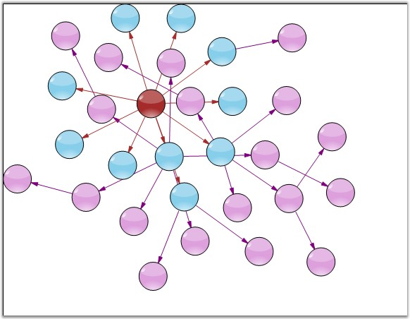
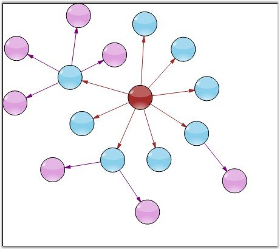

::: {style="DISPLAY: none"}
{#d2h_url_template}{#d2h_package_url style="WIDTH: 0px; DISPLAY: none; HEIGHT: 0px"}
:::

:::: {.d2h_secondary_topic style="PADDING-BOTTOM: 10pt; MARGIN: 0pt; PADDING-LEFT: 0pt; PADDING-RIGHT: 0pt; PADDING-TOP: 0pt"}
#### Symmetric Layout Manager {#symmetric-layout-manager style="tab-stops: 0pt"}

[]{style="FONT-FAMILY: 'Trebuchet MS','sans-serif'; COLOR: #15428b; FONT-SIZE: 9pt"} 

The Symmetric layout manager arranges all the nodes in a symmetric fashion using the vertical input distance, which specifies the distance between the nodes.

 

The Model and Vertical Distance values are passed as parameters to the **SymmetricLayoutManager** class. The parameters and properties of Symmetric Layout Manager is listed below.

 

::: {align="center"}
  ------------------ ----------------------------------------------------------------------------------------
  Property           Description
  Model              Represents the model of the diagram, which has to be displayed out as a directed tree.
  VerticalDistance   Defines the Graph Rotation angle. It accepts only integer values between 0 - 360.
  SpringFactor       Gets or sets the spring factor.
  SpringLength       Defines the spring length.
  MaxIteration       Holds the maximum count of iteration.
  ------------------ ----------------------------------------------------------------------------------------
:::

[]{style="FONT-FAMILY: 'Trebuchet MS','sans-serif'; COLOR: #15428b; FONT-SIZE: 9pt"} 

Programmatically, the symmetric layout manager instance is created with the respective arguments, assigned to the LayoutManager and updated as follows.

[]{style="FONT-FAMILY: 'Trebuchet MS','sans-serif'; COLOR: #15428b; FONT-SIZE: 9pt"} 

+-----------------------------------------------------------------------------------------------------------------------------------------------------------------+
| **[\[C#\]]{style="FONT-FAMILY: 'Courier New'; COLOR: black"}**                                                                                                  |
|                                                                                                                                                                 |
| []{style="FONT-FAMILY: 'Courier New'"}                                                                                                                          |
|                                                                                                                                                                 |
| [SymmetricLayoutManager symmetricLayout = [new]{style="COLOR: blue"} SymmetricLayoutManager(diagram1.Model,100);]{style="FONT-FAMILY: 'Courier New'"}           |
|                                                                                                                                                                 |
| [symmetricLayout.SpringFactor = 0.442;]{style="FONT-FAMILY: 'Courier New'"}                                                                                     |
|                                                                                                                                                                 |
| [symmetricLayout.SpringLength = 100;]{style="FONT-FAMILY: 'Courier New'"}                                                                                       |
|                                                                                                                                                                 |
| [symmetricLayout.MaxIteration = 500;]{style="FONT-FAMILY: 'Courier New'"}                                                                                       |
|                                                                                                                                                                 |
| [this]{style="FONT-FAMILY: 'Courier New'; COLOR: blue"}[.diagram1.LayoutManager = symmetricLayout;]{style="FONT-FAMILY: 'Courier New'"}                         |
|                                                                                                                                                                 |
| [this]{style="FONT-FAMILY: 'Courier New'; COLOR: blue"}[.diagram1.LayoutManager.UpdateLayout([null]{style="COLOR: blue"});]{style="FONT-FAMILY: 'Courier New'"} |
+-----------------------------------------------------------------------------------------------------------------------------------------------------------------+

[]{style="FONT-FAMILY: 'Courier New'"} 

+---------------------------------------------------------------------------------------------------------------------------------------------------------------------------------------------------------------+
| **[\[VB\]]{style="FONT-FAMILY: 'Courier New'; COLOR: black"}**                                                                                                                                                |
|                                                                                                                                                                                                               |
| **[]{style="FONT-FAMILY: 'Courier New'; COLOR: black"}**                                                                                                                                                      |
|                                                                                                                                                                                                               |
| [Dim]{style="FONT-FAMILY: 'Courier New'; COLOR: blue"}[ symmetricLayout [As]{style="COLOR: blue"} [New]{style="COLOR: blue"} SymmetricLayoutManager(diagram1.Model, 100)]{style="FONT-FAMILY: 'Courier New'"} |
|                                                                                                                                                                                                               |
| [symmetricLayout.SpringFactor = 0.442]{style="FONT-FAMILY: 'Courier New'"}                                                                                                                                    |
|                                                                                                                                                                                                               |
| [symmetricLayout.SpringLength = 100]{style="FONT-FAMILY: 'Courier New'"}                                                                                                                                      |
|                                                                                                                                                                                                               |
| [symmetricLayout.MaxIteration = 500]{style="FONT-FAMILY: 'Courier New'"}                                                                                                                                      |
|                                                                                                                                                                                                               |
| [Me]{style="FONT-FAMILY: 'Courier New'; COLOR: blue"}[.diagram1.LayoutManager = symmetricLayout]{style="FONT-FAMILY: 'Courier New'"}                                                                          |
|                                                                                                                                                                                                               |
| [Me]{style="FONT-FAMILY: 'Courier New'; COLOR: blue"}[.diagram1.LayoutManager.UpdateLayout([Nothing]{style="COLOR: blue"})]{style="FONT-FAMILY: 'Courier New'"}                                               |
+---------------------------------------------------------------------------------------------------------------------------------------------------------------------------------------------------------------+

[]{style="FONT-FAMILY: 'Calibri','sans-serif'"} 

Sample Diagrams are as follows.

**[]{style="FONT-FAMILY: 'Trebuchet MS','sans-serif'; COLOR: #15428b; FONT-SIZE: 9pt"}** 

{border="0"}

**[]{style="FONT-FAMILY: 'Trebuchet MS','sans-serif'; COLOR: #15428b; FONT-SIZE: 9pt"}** 

Figure 56: Diagram With Symmetric Layout

**[]{style="FONT-FAMILY: 'Trebuchet MS','sans-serif'; COLOR: #15428b; FONT-SIZE: 9pt"}** 

{border="0"}

**[]{style="FONT-FAMILY: 'Trebuchet MS','sans-serif'; COLOR: #15428b; FONT-SIZE: 9pt"}** 

Figure 57: Symmetric Layout with Spring Factor Settings

 

[]{#p36} 

 

[]{#related-topics}
::::
