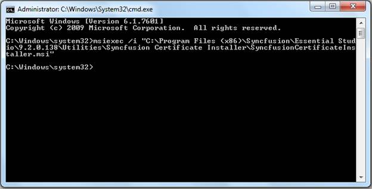
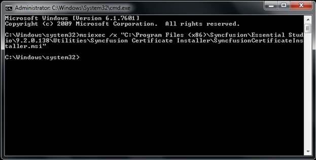
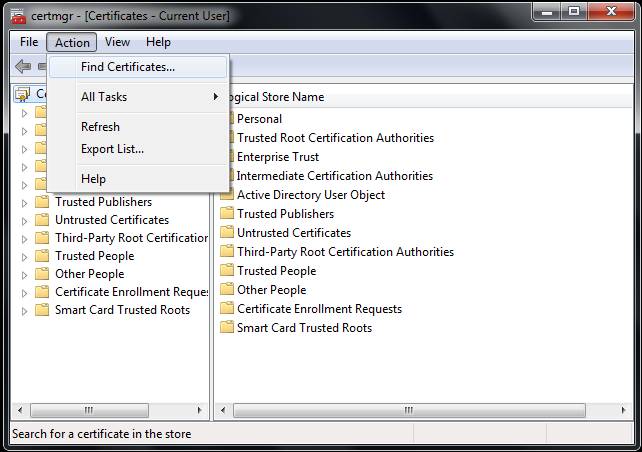
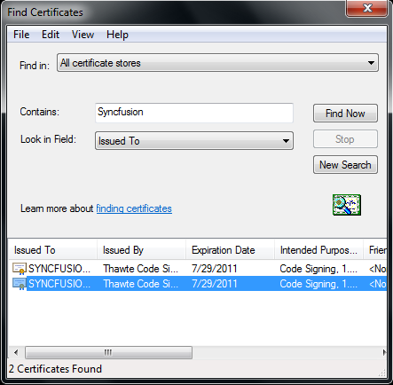
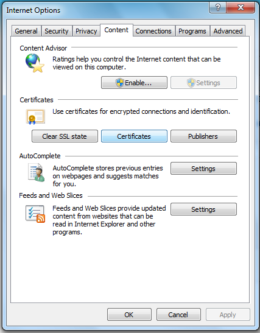
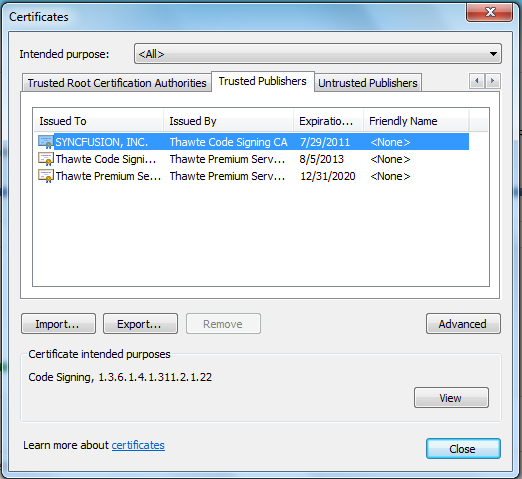

::: {style="DISPLAY: none"}
{#d2h_url_template}{#d2h_package_url style="WIDTH: 0px; DISPLAY: none; HEIGHT: 0px"}
:::

::::: {#nsbanner .d2h_main_nsbanner style="BORDER-BOTTOM: #999999 1px solid; POSITION: relative; PADDING-BOTTOM: 0px; BACKGROUND-COLOR: transparent; PADDING-LEFT: 0px; PADDING-RIGHT: 0px; DISPLAY: none; BORDER-TOP: #999999 1px solid; PADDING-TOP: 0px; LEFT: 0px"}
:::: {#TitleRow .d2h_main_titlerow style="PADDING-BOTTOM: 4px; BACKGROUND-COLOR: transparent; PADDING-LEFT: 22px; WIDTH: 100%; PADDING-RIGHT: 10px; DISPLAY: none; PADDING-TOP: 4px"}
::: {#ienav .d2h_main_ienav style="DISPLAY: none"}
{#D2HPrevious .D2HPreviousEnabled}  {#D2HNext .D2HNextEnabled}
:::
::::
:::::

:::: {#nstext .d2h_main_nstext style="PADDING-BOTTOM: 10px; BACKGROUND-COLOR: transparent; PADDING-LEFT: 22px; PADDING-RIGHT: 10px; HEIGHT: 100%; OVERFLOW: auto; PADDING-TOP: 5px" hasuserbackground="true" valign="bottom"}
::: {#d2h_breadcrumbs .d2h_breadcrumbs}
[Essential Studio User Guide Documentation](ms-xhelp:///?Id=12457748-09e3-4d74-a240-8e049cedf030){.d2h_breadcrumbsNormal}[ \> ]{.d2h_breadcrumbsLinkSeparator}[Essential Common](ms-xhelp:///?Id=2bfe10b6-fac1-4f91-a173-04db314f10c3){.d2h_breadcrumbsNormal}[ \> ]{.d2h_breadcrumbsLinkSeparator}[Other Utilities](ms-xhelp:///?Id=a8cc7430-cdfc-4de3-a351-6b323ce09ef1){.d2h_breadcrumbsNormal}
:::

## Syncfusion Certificate Installer {#syncfusion-certificate-installer style="tab-stops: 0pt"}

Syncfusion Certificate Installer installs the Syncfusion Certificate in client machine. From 9.2.0.138, this is available in installer setup.

 

**Installing Syncfusion Certificate installer**

The following steps illustrate how to install Syncfusion Certificate installer:

1.   Open command prompt in admin mode and run the following command:

 

 **\>msiexec  /i "(SyncfusionCertificateInstaller.msi location)\\ SyncfusionCertificateInstaller.msi"**

 

**Example**

** \>msiexec  /i \"C:\\Program Files\\Syncfusion\\Essential Studio\\9.2.0.138\\Utilities\\Certificate Installer\\SyncfusionCertificateInstaller.msi"**

 

{border="0"}

Figure 142: Syncfusion Certificate Install

[]{style="COLOR: #1f497d"} 

**Uninstalling the Syncfusion Certificate Installer**

The following code illustrates how to uninstall the Syncfusion Certificate Installer:

1.  Open command prompt in admin mode.

2.  Run the following command:

          ***\>msiexec  /x "(SyncfusionCertificateInstaller.msi location)\\ SyncfusionCertificateInstaller.msi"***

**Example**

*** \>msiexec  /x \"C:\\Program Files\\Syncfusion\\Essential Studio\\9.2.0.138\\Utilities\\Certificate Installer\\SyncfusionCertificateInstaller.msi"***

 

{border="0"}

Figure 143: Syncfusion Certificate Uninstall

[]{style="COLOR: #1f497d"} 

**Viewing the Syncfusion Certificate**

The following steps illustrate how to view the Syncfusion Certificate:

1.  Open **certmgr.msc\[Certificate-Current user\]** from the following location:\
**Start -\> Run -\> certmgr msc**

2.  Open **Action** from tools menu.

3.  Click **Find** **Certificates** from the menu list.

{border="0"}

Figure 3: Certificate Manager (certmgr.msc)

 

4.  Enter Syncfusion into **Contains** textbox.

5.  Select **Issued To** from the **Look in Fields** drop-down list.

6.  Click **Find Now**.\
\

{border="0"}

Figure 4: Find Certificates

 

 

You can view Syncfusion Certificate, if you have installed the certificate. You can also view the certificates using the Internet Explorer.

To view the Syncfusion Certificate through the Internet Explorer:

 

1.  Select **Tools** \> **Internet Options**. The **Internet Options** dialog box opens.

 

{border="0"}

Figure 144: Internet Options

\
\

2.  In **Content** tab, click the **Certificates** button. certificates dialog box

 

{border="0"}

Figure 145:Certificates Dialog

 

3.  Select **Trusted Publishers** tab. It will show the Syncfusion certificate to be installed.

 

 

[]{#related-topics}
::::
