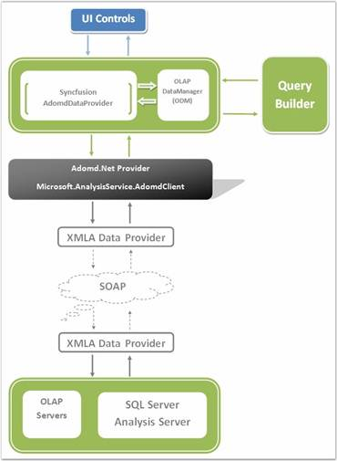

::: {style="DISPLAY: none"}
{#d2h_url_template}{#d2h_package_url style="WIDTH: 0px; DISPLAY: none; HEIGHT: 0px"}
:::

::::: {#nsbanner .d2h_main_nsbanner style="BORDER-BOTTOM: #999999 1px solid; POSITION: relative; PADDING-BOTTOM: 0px; BACKGROUND-COLOR: transparent; PADDING-LEFT: 0px; PADDING-RIGHT: 0px; DISPLAY: none; BORDER-TOP: #999999 1px solid; PADDING-TOP: 0px; LEFT: 0px"}
:::: {#TitleRow .d2h_main_titlerow style="PADDING-BOTTOM: 4px; BACKGROUND-COLOR: transparent; PADDING-LEFT: 22px; WIDTH: 100%; PADDING-RIGHT: 10px; DISPLAY: none; PADDING-TOP: 4px"}
::: {#ienav .d2h_main_ienav style="DISPLAY: none"}
{#D2HPrevious .D2HPreviousEnabled}  {#D2HNext .D2HNextEnabled}
:::
::::
:::::

:::: {#nstext .d2h_main_nstext style="PADDING-BOTTOM: 10px; BACKGROUND-COLOR: transparent; PADDING-LEFT: 22px; PADDING-RIGHT: 10px; HEIGHT: 100%; OVERFLOW: auto; PADDING-TOP: 5px" hasuserbackground="true" valign="bottom"}
::: {#d2h_breadcrumbs .d2h_breadcrumbs}
[Essential Studio User Guide Documentation](ms-xhelp:///?Id=12457748-09e3-4d74-a240-8e049cedf030){.d2h_breadcrumbsNormal}[ \> ]{.d2h_breadcrumbsLinkSeparator}[Business Intelligence Edition](ms-xhelp:///?Id=fdf33dd8-62b2-47b9-ad7b-fc50e590bca5){.d2h_breadcrumbsNormal}[ \> ]{.d2h_breadcrumbsLinkSeparator}[Essential BI Common](ms-xhelp:///?Id=51cb28d1-f201-4ea8-9963-a8afa451f64c){.d2h_breadcrumbsNormal}
:::

# Syncfusion OLAP Architecture {#syncfusion-olap-architecture style="tab-stops: 0pt"}

[]{style="FONT-FAMILY: 'Times New Roman','serif'; COLOR: black"} 

Syncfusion OLAP architecture allows you to build a full life cycle reporting solution for your enterprise. Here are the important pieces of the architecture:

[·      ]{style="FONT-FAMILY: Symbol"}**OLAP Access Layer** - Built on top of ADOMD.NET and provides a high level object model to let you easily define reports.

[·      ]{style="FONT-FAMILY: Symbol"}**OLAP Controls** - Chart, Grid, Gauge, Client for ASP.NET (excluding Gauge), WPF, Silverlight, ASP.NET MVC (Grid only).

[·      ]{style="FONT-FAMILY: Symbol"}**OLAP Report Builder** -- RAD (Rapid Application Development) tool lets you select the dimensions you are interested in visualizing and also lets you define the appearance for the Chart and Grid.

[]{style="FONT-FAMILY: 'Trebuchet MS','sans-serif'; COLOR: #15428b; FONT-SIZE: 9pt"} 

The following screenshot shows how the Syncfusion OLAP components allow you to build a full life cycle reporting solution for your enterprise.

[]{style="FONT-FAMILY: 'Trebuchet MS','sans-serif'; COLOR: #15428b; FONT-SIZE: 9pt"} 

[]{style="FONT-FAMILY: 'Trebuchet MS','sans-serif'; COLOR: #15428b; FONT-SIZE: 9pt"} 

{border="0"}

 

Figure 1: Syncfusion OLAP Architecture

 

More:

[ ]{#related-topics}

[{border="0" align="absMiddle"}OLAP Base](ms-xhelp:///?Id=ea6e03e5-b5da-4557-a798-a1ca69a6c270){style="TEXT-DECORATION: none"}

[{border="0" align="absMiddle"}OLAP Silverlight Base](ms-xhelp:///?Id=ebe93458-6f07-4941-8a71-6ea9e574d37d){style="TEXT-DECORATION: none"}

[{border="0" align="absMiddle"}OLAP Silverlight Base Wrapper](ms-xhelp:///?Id=3fc52040-6aeb-41b2-b772-09c204f8be4e){style="TEXT-DECORATION: none"}
::::
