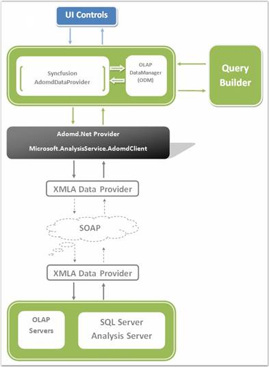

::: {style="DISPLAY: none"}
{#d2h_url_template} {#d2h_package_url style="WIDTH: 0px; DISPLAY: none; HEIGHT: 0px"}
:::

::::: {#nsbanner .d2h_main_nsbanner style="BORDER-BOTTOM: #999999 1px solid; POSITION: relative; PADDING-BOTTOM: 0px; BACKGROUND-COLOR: transparent; PADDING-LEFT: 0px; PADDING-RIGHT: 0px; DISPLAY: none; BORDER-TOP: #999999 1px solid; PADDING-TOP: 0px; LEFT: 0px"}
:::: {#TitleRow .d2h_main_titlerow style="PADDING-BOTTOM: 4px; BACKGROUND-COLOR: transparent; PADDING-LEFT: 22px; WIDTH: 100%; PADDING-RIGHT: 10px; DISPLAY: none; PADDING-TOP: 4px"}
::: {#ienav .d2h_main_ienav style="DISPLAY: none"}
{#D2HPrevious .D2HPreviousEnabled}  {#D2HNext .D2HNextEnabled}
:::
::::
:::::

:::: {#nstext .d2h_main_nstext style="PADDING-BOTTOM: 10px; BACKGROUND-COLOR: transparent; PADDING-LEFT: 22px; PADDING-RIGHT: 10px; HEIGHT: 100%; OVERFLOW: auto; PADDING-TOP: 5px" hasuserbackground="true" valign="bottom"}
::: {#d2h_breadcrumbs .d2h_breadcrumbs}
[Essential Studio User Guide Documentation](ms-xhelp:///?Id=12457748-09e3-4d74-a240-8e049cedf030){.d2h_breadcrumbsNormal} [ \> ]{.d2h_breadcrumbsLinkSeparator} [Business Intelligence Edition](ms-xhelp:///?Id=fdf33dd8-62b2-47b9-ad7b-fc50e590bca5){.d2h_breadcrumbsNormal} [ \> ]{.d2h_breadcrumbsLinkSeparator} [Essential BI WPF](ms-xhelp:///?Id=41e3d586-d922-4a01-8272-679fe4ae7343){.d2h_breadcrumbsNormal} [ \> ]{.d2h_breadcrumbsLinkSeparator} [Essential BI Gauge]{.d2h_breadcrumbsContentsOnly}
:::

# Syncfusion OLAP Architecture {#syncfusion-olap-architecture style="tab-stops: 0pt"}

[]{style="FONT-FAMILY: 'Times New Roman','serif'; COLOR: black"} 

Syncfusion\'s OLAP architecture allows you to build a full life cycle reporting solution for your enterprise. Here are the important pieces of the architecture

[]{style="FONT-FAMILY: 'Trebuchet MS','sans-serif'; COLOR: #15428b; FONT-SIZE: 9pt"} 

[·      ]{style="FONT-FAMILY: Symbol"} **OLAP Access Layer** - Built on top of ADOMD.NET and provides a high level object model to let you easily define reports.

[·      ]{style="FONT-FAMILY: Symbol"} **OLAP Controls** - Chart, Grid, Gauge for ASP.NET, WPF and Silverlight.

[·      ]{style="FONT-FAMILY: Symbol"} **OLAP Report Builder** - RAD tool to let you select the dimensions you are interested in visualizing and also lets you define the appearance for the chart, grid and gauge.

[]{style="FONT-FAMILY: 'Trebuchet MS','sans-serif'; COLOR: #15428b; FONT-SIZE: 9pt"} 

Let us see how the Syncfusion OLAP components allow you to build a full life cycle reporting solution for your enterprise.

[]{style="FONT-FAMILY: 'Trebuchet MS','sans-serif'; COLOR: #15428b; FONT-SIZE: 9pt"} 

[]{style="FONT-FAMILY: 'Trebuchet MS','sans-serif'; COLOR: #15428b; FONT-SIZE: 9pt"} 

[]{style="FONT-FAMILY: 'Times New Roman','serif'; COLOR: black"} 

{border="0"}

Figure 5: Syncfusion OLAP Architecture

More:

[ ]{#related-topics}

[{border="0" align="absMiddle"}Class Diagram](ms-xhelp:///?Id=043d006e-47b3-4806-9783-0c1e75b53fd6){style="TEXT-DECORATION: none"}

[{border="0" align="absMiddle"}Properties and Methods](ms-xhelp:///?Id=ca5280cd-5e8f-41e4-af2a-ce49201cf427){style="TEXT-DECORATION: none"}
::::
