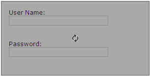

::: {style="DISPLAY: none"}
{#d2h_url_template}{#d2h_package_url style="WIDTH: 0px; DISPLAY: none; HEIGHT: 0px"}
:::

::: {.d2h_secondary_topic style="PADDING-BOTTOM: 10pt; MARGIN: 0pt; PADDING-LEFT: 0pt; PADDING-RIGHT: 0pt; PADDING-TOP: 0pt"}
##### Syncfusion Themes {#syncfusion-themes style="tab-stops: 0pt"}

 

The waiting pop-up control supports fourteen predefined skins.

**[]{style="FONT-FAMILY: 'Calibri','sans-serif'; FONT-SIZE: 12pt"}** 

**[Properties]{style="FONT-FAMILY: 'Calibri','sans-serif'; FONT-SIZE: 12pt"}[]{style="FONT-FAMILY: 'Calibri','sans-serif'"}**

 

+-------------+-----------------------------------------------+----------------------------------+------------------------------------------------------------------------------------------+--------------------------------------------------------------+
| Name        | Description                                   | Type of property                 | Value it accepts                                                                         | Dependency                                                   |
+=============+===============================================+==================================+==========================================================================================+==============================================================+
| Skin        | Defines one of the fourteen predefined skins. | [enum]{style="FONT-SIZE: 9.5pt"} | [·      ]{style="FONT-FAMILY: Symbol"}[Skins]{style="FONT-SIZE: 9.5pt"}.Office2007Blue   | This property is not applicable for Waiting pop-up in HTML5. |
|             |                                               |                                  |                                                                                          |                                                              |
|             |                                               |                                  | [·      ]{style="FONT-FAMILY: Symbol"}[Skins]{style="FONT-SIZE: 9.5pt"}.Office2007Silver |                                                              |
|             |                                               |                                  |                                                                                          |                                                              |
|             |                                               |                                  | [·      ]{style="FONT-FAMILY: Symbol"}[Skins]{style="FONT-SIZE: 9.5pt"}.Office2007Black  |                                                              |
|             |                                               |                                  |                                                                                          |                                                              |
|             |                                               |                                  | [·      ]{style="FONT-FAMILY: Symbol"}[Skins]{style="FONT-SIZE: 9.5pt"}.Vista            |                                                              |
|             |                                               |                                  |                                                                                          |                                                              |
|             |                                               |                                  | [·      ]{style="FONT-FAMILY: Symbol"}[Skins]{style="FONT-SIZE: 9.5pt"}.Almond           |                                                              |
|             |                                               |                                  |                                                                                          |                                                              |
|             |                                               |                                  | [·      ]{style="FONT-FAMILY: Symbol"}[Skins]{style="FONT-SIZE: 9.5pt"}.Blueberry        |                                                              |
|             |                                               |                                  |                                                                                          |                                                              |
|             |                                               |                                  | [·      ]{style="FONT-FAMILY: Symbol"}[Skins]{style="FONT-SIZE: 9.5pt"}.Blend            |                                                              |
|             |                                               |                                  |                                                                                          |                                                              |
|             |                                               |                                  | [·      ]{style="FONT-FAMILY: Symbol"}[Skins]{style="FONT-SIZE: 9.5pt"}.Olive            |                                                              |
|             |                                               |                                  |                                                                                          |                                                              |
|             |                                               |                                  | [·      ]{style="FONT-FAMILY: Symbol"}[Skins]{style="FONT-SIZE: 9.5pt"}.Turquoise        |                                                              |
|             |                                               |                                  |                                                                                          |                                                              |
|             |                                               |                                  | [·      ]{style="FONT-FAMILY: Symbol"}[Skins]{style="FONT-SIZE: 9.5pt"}.Monochrome       |                                                              |
|             |                                               |                                  |                                                                                          |                                                              |
|             |                                               |                                  | [·      ]{style="FONT-FAMILY: Symbol"}[Skins]{style="FONT-SIZE: 9.5pt"}.Sandune          |                                                              |
|             |                                               |                                  |                                                                                          |                                                              |
|             |                                               |                                  | [·      ]{style="FONT-FAMILY: Symbol"}[Skins]{style="FONT-SIZE: 9.5pt"}.VS2010           |                                                              |
|             |                                               |                                  |                                                                                          |                                                              |
|             |                                               |                                  | [·      ]{style="FONT-FAMILY: Symbol"}[Skins]{style="FONT-SIZE: 9.5pt"}.Marble           |                                                              |
|             |                                               |                                  |                                                                                          |                                                              |
|             |                                               |                                  | [·      ]{style="FONT-FAMILY: Symbol"}[Skins]{style="FONT-SIZE: 9.5pt"}.Midnight         |                                                              |
+-------------+-----------------------------------------------+----------------------------------+------------------------------------------------------------------------------------------+--------------------------------------------------------------+

*[[]{style="TEXT-DECORATION: none"}]{.underline}* 

Using Builder

The following steps explain how to set Syncfusion themes for the waiting pop-up through the builder.

1.   In **View**, create the target element over which the waiting pop-up is to be displayed.

2.   Invoke the waiting pop-up helper followed by the **Skin** method with the desired theme as an argument.

**[]{style="FONT-FAMILY: 'Calibri','sans-serif'"}** 

**[]{style="FONT-FAMILY: 'Calibri','sans-serif'"}** 

+----------------------------------------------------------------------------------------------------------------------------------------------------------------------------------------------------------------------------------------------------------------------------------------------------------------------------------------------------------------------------------------------------+
| **View\[ASPX\]**                                                                                                                                                                                                                                                                                                                                                                                   |
|                                                                                                                                                                                                                                                                                                                                                                                                    |
| **[]{style="FONT-FAMILY: 'Courier New'"}**                                                                                                                                                                                                                                                                                                                                                         |
|                                                                                                                                                                                                                                                                                                                                                                                                    |
| [\<]{style="FONT-FAMILY: 'Courier New'; COLOR: blue"}[div]{style="FONT-FAMILY: 'Courier New'; COLOR: maroon"}[ [id]{style="COLOR: red"}[=\"targetArea\"]{style="COLOR: blue"} [style]{style="COLOR: red"}[=\"]{style="COLOR: blue"}[width]{style="COLOR: red"}[: 300px; ]{style="COLOR: blue"}[height]{style="COLOR: red"}[: 150px;\"\>]{style="COLOR: blue"}]{style="FONT-FAMILY: 'Courier New'"} |
|                                                                                                                                                                                                                                                                                                                                                                                                    |
| [        [\<]{style="COLOR: blue"}[div]{style="COLOR: maroon"}[\>]{style="COLOR: blue"}]{style="FONT-FAMILY: 'Courier New'"}                                                                                                                                                                                                                                                                       |
|                                                                                                                                                                                                                                                                                                                                                                                                    |
| [            User Name:]{style="FONT-FAMILY: 'Courier New'"}                                                                                                                                                                                                                                                                                                                                       |
|                                                                                                                                                                                                                                                                                                                                                                                                    |
| [            [\<%]{style="BACKGROUND: yellow"}[=]{style="COLOR: blue"}Html.Syncfusion().TextBox([\"userName\"]{style="COLOR: #a31515"}) [%\>]{style="BACKGROUND: yellow"}[\</]{style="COLOR: blue"}[div]{style="COLOR: maroon"}[\>]{style="COLOR: blue"}]{style="FONT-FAMILY: 'Courier New'"}                                                                                                      |
|                                                                                                                                                                                                                                                                                                                                                                                                    |
| [        [\<]{style="COLOR: blue"}[div]{style="COLOR: maroon"}[\>]{style="COLOR: blue"}]{style="FONT-FAMILY: 'Courier New'"}                                                                                                                                                                                                                                                                       |
|                                                                                                                                                                                                                                                                                                                                                                                                    |
| [            Password:]{style="FONT-FAMILY: 'Courier New'"}                                                                                                                                                                                                                                                                                                                                        |
|                                                                                                                                                                                                                                                                                                                                                                                                    |
| [            [\<%]{style="BACKGROUND: yellow"}[=]{style="COLOR: blue"}Html.Syncfusion().Password([\"password\"]{style="COLOR: #a31515"}) [%\>]{style="BACKGROUND: yellow"}[\</]{style="COLOR: blue"}[div]{style="COLOR: maroon"}[\>]{style="COLOR: blue"}]{style="FONT-FAMILY: 'Courier New'"}                                                                                                     |
|                                                                                                                                                                                                                                                                                                                                                                                                    |
| [      [\</]{style="COLOR: blue"}[div]{style="COLOR: maroon"}[\>]{style="COLOR: blue"}]{style="FONT-FAMILY: 'Courier New'"}                                                                                                                                                                                                                                                                        |
|                                                                                                                                                                                                                                                                                                                                                                                                    |
| [      [\<%]{style="BACKGROUND: yellow"}[=]{style="COLOR: blue"}Html.Syncfusion().WaitingPopup([\"myPopup\"]{style="COLOR: #a31515"})]{style="FONT-FAMILY: 'Courier New'"}                                                                                                                                                                                                                         |
|                                                                                                                                                                                                                                                                                                                                                                                                    |
| [.TargetId([\"targetArea\"]{style="COLOR: #a31515"})]{style="FONT-FAMILY: 'Courier New'"}                                                                                                                                                                                                                                                                                                          |
|                                                                                                                                                                                                                                                                                                                                                                                                    |
| **[.Skin([Skins]{style="COLOR: #2b91af"}.Midnight)]{style="FONT-FAMILY: 'Courier New'"}**[%\>]{style="FONT-FAMILY: 'Courier New'; BACKGROUND: yellow"}[]{style="FONT-FAMILY: 'Courier New'"}                                                                                                                                                                                                       |
|                                                                                                                                                                                                                                                                                                                                                                                                    |
| []{style="FONT-FAMILY: 'Courier New'; BACKGROUND: yellow"}                                                                                                                                                                                                                                                                                                                                         |
+----------------------------------------------------------------------------------------------------------------------------------------------------------------------------------------------------------------------------------------------------------------------------------------------------------------------------------------------------------------------------------------------------+

 

**[]{style="FONT-FAMILY: 'Calibri','sans-serif'"}** 

+----------------------------------------------------------------------------------------------------------------------------------------------------------------------------------------------------------------------------------------------------------------------------------------------------------------------------------------------------------------------------------------------------+
| **View\[cshtml\]**                                                                                                                                                                                                                                                                                                                                                                                 |
|                                                                                                                                                                                                                                                                                                                                                                                                    |
| **[]{style="FONT-FAMILY: 'Courier New'"}**                                                                                                                                                                                                                                                                                                                                                         |
|                                                                                                                                                                                                                                                                                                                                                                                                    |
| [\<]{style="FONT-FAMILY: 'Courier New'; COLOR: blue"}[div]{style="FONT-FAMILY: 'Courier New'; COLOR: maroon"}[ [id]{style="COLOR: red"}[=\"targetArea\"]{style="COLOR: blue"} [style]{style="COLOR: red"}[=\"]{style="COLOR: blue"}[width]{style="COLOR: red"}[: 300px; ]{style="COLOR: blue"}[height]{style="COLOR: red"}[: 150px;\"\>]{style="COLOR: blue"}]{style="FONT-FAMILY: 'Courier New'"} |
|                                                                                                                                                                                                                                                                                                                                                                                                    |
| [        [\<]{style="COLOR: blue"}[div]{style="COLOR: maroon"}[\>]{style="COLOR: blue"}]{style="FONT-FAMILY: 'Courier New'"}                                                                                                                                                                                                                                                                       |
|                                                                                                                                                                                                                                                                                                                                                                                                    |
| [            User Name:]{style="FONT-FAMILY: 'Courier New'"}                                                                                                                                                                                                                                                                                                                                       |
|                                                                                                                                                                                                                                                                                                                                                                                                    |
| [            [@]{style="BACKGROUND: yellow"}Html.Syncfusion().TextBox([\"userName\"]{style="COLOR: #a31515"})[\</]{style="COLOR: blue"}[div]{style="COLOR: maroon"}[\>]{style="COLOR: blue"}]{style="FONT-FAMILY: 'Courier New'"}                                                                                                                                                                  |
|                                                                                                                                                                                                                                                                                                                                                                                                    |
| [        [\<]{style="COLOR: blue"}[div]{style="COLOR: maroon"}[\>]{style="COLOR: blue"}]{style="FONT-FAMILY: 'Courier New'"}                                                                                                                                                                                                                                                                       |
|                                                                                                                                                                                                                                                                                                                                                                                                    |
| [            Password:]{style="FONT-FAMILY: 'Courier New'"}                                                                                                                                                                                                                                                                                                                                        |
|                                                                                                                                                                                                                                                                                                                                                                                                    |
| [            [@]{style="BACKGROUND: yellow"}Html.Syncfusion().Password([\"password\"]{style="COLOR: #a31515"})[\</]{style="COLOR: blue"}[div]{style="COLOR: maroon"}[\>]{style="COLOR: blue"}]{style="FONT-FAMILY: 'Courier New'"}                                                                                                                                                                 |
|                                                                                                                                                                                                                                                                                                                                                                                                    |
| [      [\</]{style="COLOR: blue"}[div]{style="COLOR: maroon"}[\>]{style="COLOR: blue"}]{style="FONT-FAMILY: 'Courier New'"}                                                                                                                                                                                                                                                                        |
|                                                                                                                                                                                                                                                                                                                                                                                                    |
| [      [\@{]{style="BACKGROUND: yellow"} Html.Syncfusion().WaitingPopup([\"myPopup\"]{style="COLOR: #a31515"})]{style="FONT-FAMILY: 'Courier New'"}                                                                                                                                                                                                                                                |
|                                                                                                                                                                                                                                                                                                                                                                                                    |
| [.TargetId([\"targetArea\"]{style="COLOR: #a31515"})]{style="FONT-FAMILY: 'Courier New'"}                                                                                                                                                                                                                                                                                                          |
|                                                                                                                                                                                                                                                                                                                                                                                                    |
| **[.Skin([Skins]{style="COLOR: #2b91af"}.Midnight)]{style="FONT-FAMILY: 'Courier New'"}**[%\>]{style="FONT-FAMILY: 'Courier New'; BACKGROUND: yellow"}[]{style="FONT-FAMILY: 'Courier New'"}                                                                                                                                                                                                       |
|                                                                                                                                                                                                                                                                                                                                                                                                    |
| []{style="FONT-FAMILY: 'Courier New'; BACKGROUND: yellow"}                                                                                                                                                                                                                                                                                                                                         |
+----------------------------------------------------------------------------------------------------------------------------------------------------------------------------------------------------------------------------------------------------------------------------------------------------------------------------------------------------------------------------------------------------+

 

3.   Build and run the application.

 

Using Properties Model

The following steps explain how to set Syncfusion themes for the waiting pop-up through the properties model.

4.   In the controller, create an instance of **WaitingPopupModel**.

5.   Define the **Skin** property and pass the instance through the view-specific data to the view.

**[]{style="FONT-FAMILY: 'Calibri','sans-serif'"}** 

+-----------------------------------------------------------------------------------------------------------------------------------------------------------------------------------+
| **[\[Controller\]]{style="FONT-FAMILY: 'Courier New'"}**                                                                                                                          |
|                                                                                                                                                                                   |
| [public]{style="FONT-FAMILY: 'Courier New'; COLOR: blue"}[ [ActionResult]{style="COLOR: #2b91af"} Index()]{style="FONT-FAMILY: 'Courier New'"}                                    |
|                                                                                                                                                                                   |
| [        {]{style="FONT-FAMILY: 'Courier New'"}                                                                                                                                   |
|                                                                                                                                                                                   |
| [            [//Create an instance of WatingPopupModel]{style="COLOR: green"}]{style="FONT-FAMILY: 'Courier New'"}                                                                |
|                                                                                                                                                                                   |
| [            [WaitingPopupModel]{style="COLOR: #2b91af"} myModel = [new]{style="COLOR: blue"} [WaitingPopupModel]{style="COLOR: #2b91af"}();]{style="FONT-FAMILY: 'Courier New'"} |
|                                                                                                                                                                                   |
| [            myModel.TargetId = [\"targetArea\"]{style="COLOR: #a31515"};]{style="FONT-FAMILY: 'Courier New'"}                                                                    |
|                                                                                                                                                                                   |
| [            **myModel.Skin = [Skins]{style="COLOR: #2b91af"}.Midnight;**]{style="FONT-FAMILY: 'Courier New'"}                                                                    |
|                                                                                                                                                                                   |
| []{style="FONT-FAMILY: 'Courier New'"}                                                                                                                                            |
|                                                                                                                                                                                   |
| [            [//Pass the instance through view data to the view]{style="COLOR: green"}]{style="FONT-FAMILY: 'Courier New'"}                                                       |
|                                                                                                                                                                                   |
| [            ViewData\[[\"myPopup\"]{style="COLOR: #a31515"}\] = myModel;]{style="FONT-FAMILY: 'Courier New'"}                                                                    |
|                                                                                                                                                                                   |
| [            [return]{style="COLOR: blue"} View();]{style="FONT-FAMILY: 'Courier New'"}                                                                                           |
|                                                                                                                                                                                   |
| [        }]{style="FONT-FAMILY: 'Courier New'"}                                                                                                                                   |
|                                                                                                                                                                                   |
| []{style="FONT-FAMILY: 'Courier New'; BACKGROUND: yellow"}                                                                                                                        |
+-----------------------------------------------------------------------------------------------------------------------------------------------------------------------------------+

[]{style="FONT-FAMILY: Consolas; FONT-SIZE: 9.5pt"} 

6.   In **View**, create the target element over which the waiting pop-up is to be displayed.**

7.   Invoke the waiting pop-up helper with the view data key as the control ID.**

**[]{style="FONT-FAMILY: 'Calibri','sans-serif'"}** 

+----------------------------------------------------------------------------------------------------------------------------------------------------------------------------------------------------------------------------------------------------------------------------------------------------------------------------------------------------------------------------------------------------+
| **View\[ASPX\]**                                                                                                                                                                                                                                                                                                                                                                                   |
|                                                                                                                                                                                                                                                                                                                                                                                                    |
| [\<]{style="FONT-FAMILY: 'Courier New'; COLOR: blue"}[div]{style="FONT-FAMILY: 'Courier New'; COLOR: maroon"}[ [id]{style="COLOR: red"}[=\"targetArea\"]{style="COLOR: blue"} [style]{style="COLOR: red"}[=\"]{style="COLOR: blue"}[width]{style="COLOR: red"}[: 300px; ]{style="COLOR: blue"}[height]{style="COLOR: red"}[: 150px;\"\>]{style="COLOR: blue"}]{style="FONT-FAMILY: 'Courier New'"} |
|                                                                                                                                                                                                                                                                                                                                                                                                    |
| [        [\<]{style="COLOR: blue"}[div]{style="COLOR: maroon"}[\>]{style="COLOR: blue"}]{style="FONT-FAMILY: 'Courier New'"}                                                                                                                                                                                                                                                                       |
|                                                                                                                                                                                                                                                                                                                                                                                                    |
| [            User Name:]{style="FONT-FAMILY: 'Courier New'"}                                                                                                                                                                                                                                                                                                                                       |
|                                                                                                                                                                                                                                                                                                                                                                                                    |
| [            [\<%]{style="BACKGROUND: yellow"}[=]{style="COLOR: blue"}Html.Syncfusion().TextBox([\"userName\"]{style="COLOR: #a31515"}) [%\>]{style="BACKGROUND: yellow"}[\</]{style="COLOR: blue"}[div]{style="COLOR: maroon"}[\>]{style="COLOR: blue"}]{style="FONT-FAMILY: 'Courier New'"}                                                                                                      |
|                                                                                                                                                                                                                                                                                                                                                                                                    |
| [        [\<]{style="COLOR: blue"}[div]{style="COLOR: maroon"}[\>]{style="COLOR: blue"}]{style="FONT-FAMILY: 'Courier New'"}                                                                                                                                                                                                                                                                       |
|                                                                                                                                                                                                                                                                                                                                                                                                    |
| [            Password:]{style="FONT-FAMILY: 'Courier New'"}                                                                                                                                                                                                                                                                                                                                        |
|                                                                                                                                                                                                                                                                                                                                                                                                    |
| [            [\<%]{style="BACKGROUND: yellow"}[=]{style="COLOR: blue"}Html.Syncfusion().Password([\"password\"]{style="COLOR: #a31515"}) [%\>]{style="BACKGROUND: yellow"}[\</]{style="COLOR: blue"}[div]{style="COLOR: maroon"}[\>]{style="COLOR: blue"}]{style="FONT-FAMILY: 'Courier New'"}                                                                                                     |
|                                                                                                                                                                                                                                                                                                                                                                                                    |
| [      [\</]{style="COLOR: blue"}[div]{style="COLOR: maroon"}[\>]{style="COLOR: blue"}]{style="FONT-FAMILY: 'Courier New'"}                                                                                                                                                                                                                                                                        |
|                                                                                                                                                                                                                                                                                                                                                                                                    |
| [\<%]{style="FONT-FAMILY: 'Courier New'; BACKGROUND: yellow"}[=]{style="FONT-FAMILY: 'Courier New'; COLOR: blue"}[Html.Syncfusion().WaitingPopup([\"myPopup\"]{style="COLOR: #a31515"})[%\>]{style="BACKGROUND: yellow"}]{style="FONT-FAMILY: 'Courier New'"}                                                                                                                                      |
|                                                                                                                                                                                                                                                                                                                                                                                                    |
| []{style="FONT-FAMILY: 'Courier New'; BACKGROUND: yellow"}                                                                                                                                                                                                                                                                                                                                         |
+----------------------------------------------------------------------------------------------------------------------------------------------------------------------------------------------------------------------------------------------------------------------------------------------------------------------------------------------------------------------------------------------------+

***[[[]{style="TEXT-DECORATION: none"}]{style="FONT-FAMILY: 'Calibri','sans-serif'"}]{.underline}*** 

**[]{style="FONT-FAMILY: 'Calibri','sans-serif'"}** 

+----------------------------------------------------------------------------------------------------------------------------------------------------------------------------------------------------------------------------------------------------------------------------------------------------------------------------------------------------------------------------------------------------+
| **View\[cshtml\]**                                                                                                                                                                                                                                                                                                                                                                                 |
|                                                                                                                                                                                                                                                                                                                                                                                                    |
|                                                                                                                                                                                                                                                                                                                                                                                                    |
|                                                                                                                                                                                                                                                                                                                                                                                                    |
| [\<]{style="FONT-FAMILY: 'Courier New'; COLOR: blue"}[div]{style="FONT-FAMILY: 'Courier New'; COLOR: maroon"}[ [id]{style="COLOR: red"}[=\"targetArea\"]{style="COLOR: blue"} [style]{style="COLOR: red"}[=\"]{style="COLOR: blue"}[width]{style="COLOR: red"}[: 300px; ]{style="COLOR: blue"}[height]{style="COLOR: red"}[: 150px;\"\>]{style="COLOR: blue"}]{style="FONT-FAMILY: 'Courier New'"} |
|                                                                                                                                                                                                                                                                                                                                                                                                    |
| [        [\<]{style="COLOR: blue"}[div]{style="COLOR: maroon"}[\>]{style="COLOR: blue"}]{style="FONT-FAMILY: 'Courier New'"}                                                                                                                                                                                                                                                                       |
|                                                                                                                                                                                                                                                                                                                                                                                                    |
| [            User Name:]{style="FONT-FAMILY: 'Courier New'"}                                                                                                                                                                                                                                                                                                                                       |
|                                                                                                                                                                                                                                                                                                                                                                                                    |
| [            [@]{style="BACKGROUND: yellow"}Html.Syncfusion().TextBox([\"userName\"]{style="COLOR: #a31515"})[\</]{style="COLOR: blue"}[div]{style="COLOR: maroon"}[\>]{style="COLOR: blue"}]{style="FONT-FAMILY: 'Courier New'"}                                                                                                                                                                  |
|                                                                                                                                                                                                                                                                                                                                                                                                    |
| [        [\<]{style="COLOR: blue"}[div]{style="COLOR: maroon"}[\>]{style="COLOR: blue"}]{style="FONT-FAMILY: 'Courier New'"}                                                                                                                                                                                                                                                                       |
|                                                                                                                                                                                                                                                                                                                                                                                                    |
| [            Password:]{style="FONT-FAMILY: 'Courier New'"}                                                                                                                                                                                                                                                                                                                                        |
|                                                                                                                                                                                                                                                                                                                                                                                                    |
| [            [@]{style="BACKGROUND: yellow"}Html.Syncfusion().Password([\"password\"]{style="COLOR: #a31515"})[\</]{style="COLOR: blue"}[div]{style="COLOR: maroon"}[\>]{style="COLOR: blue"}]{style="FONT-FAMILY: 'Courier New'"}                                                                                                                                                                 |
|                                                                                                                                                                                                                                                                                                                                                                                                    |
| [      [\</]{style="COLOR: blue"}[div]{style="COLOR: maroon"}[\>]{style="COLOR: blue"}]{style="FONT-FAMILY: 'Courier New'"}                                                                                                                                                                                                                                                                        |
|                                                                                                                                                                                                                                                                                                                                                                                                    |
| [\@{]{style="FONT-FAMILY: 'Courier New'; BACKGROUND: yellow"}[ Html.Syncfusion().WaitingPopup([\"myPopup\"]{style="COLOR: #a31515"}).Render();[}]{style="BACKGROUND: yellow"}]{style="FONT-FAMILY: 'Courier New'"}                                                                                                                                                                                 |
|                                                                                                                                                                                                                                                                                                                                                                                                    |
| []{style="FONT-FAMILY: 'Courier New'; BACKGROUND: yellow"}                                                                                                                                                                                                                                                                                                                                         |
+----------------------------------------------------------------------------------------------------------------------------------------------------------------------------------------------------------------------------------------------------------------------------------------------------------------------------------------------------------------------------------------------------+

***[[[]{style="TEXT-DECORATION: none"}]{style="FONT-FAMILY: 'Calibri','sans-serif'"}]{.underline}*** 

8.   Build and run the application.

[]{style="FONT-FAMILY: 'Calibri','sans-serif'"} 

The following figure shows the output of the waiting pop-up control with a Syncfusion theme.

{border="0"}

Figure 338: Waiting Pop-up with Syncfusion Theme

*[]{style="FONT-FAMILY: 'Calibri','sans-serif'"}* 

[]{#related-topics}
:::
