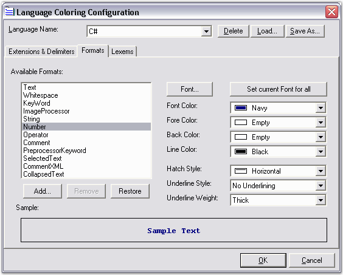

::: {style="DISPLAY: none"}
{#d2h_url_template}{#d2h_package_url style="WIDTH: 0px; DISPLAY: none; HEIGHT: 0px"}
:::

::::: {#nsbanner .d2h_main_nsbanner style="BORDER-BOTTOM: #999999 1px solid; POSITION: relative; PADDING-BOTTOM: 0px; BACKGROUND-COLOR: transparent; PADDING-LEFT: 0px; PADDING-RIGHT: 0px; DISPLAY: none; BORDER-TOP: #999999 1px solid; PADDING-TOP: 0px; LEFT: 0px"}
:::: {#TitleRow .d2h_main_titlerow style="PADDING-BOTTOM: 4px; BACKGROUND-COLOR: transparent; PADDING-LEFT: 22px; WIDTH: 100%; PADDING-RIGHT: 10px; DISPLAY: none; PADDING-TOP: 4px"}
::: {#ienav .d2h_main_ienav style="DISPLAY: none"}
{#D2HPrevious .D2HPreviousEnabled}  {#D2HNext .D2HNextEnabled}
:::
::::
:::::

:::: {#nstext .d2h_main_nstext style="PADDING-BOTTOM: 10px; BACKGROUND-COLOR: transparent; PADDING-LEFT: 22px; PADDING-RIGHT: 10px; HEIGHT: 100%; OVERFLOW: auto; PADDING-TOP: 5px" hasuserbackground="true" valign="bottom"}
::: {#d2h_breadcrumbs .d2h_breadcrumbs}
[Essential Studio User Guide Documentation](ms-xhelp:///?Id=12457748-09e3-4d74-a240-8e049cedf030){.d2h_breadcrumbsNormal}[ \> ]{.d2h_breadcrumbsLinkSeparator}[User Interface Edition](ms-xhelp:///?Id=c29296b7-531c-413b-a0ec-488ca1f7f669){.d2h_breadcrumbsNormal}[ \> ]{.d2h_breadcrumbsLinkSeparator}[Essential Windows](ms-xhelp:///?Id=e60759d8-47a4-4570-9d7a-16a68d63f2ea){.d2h_breadcrumbsNormal}[ \> ]{.d2h_breadcrumbsLinkSeparator}[Essential Edit]{.d2h_breadcrumbsContentsOnly}[ \> ]{.d2h_breadcrumbsLinkSeparator}[Concepts And Features](ms-xhelp:///?Id=7c39cee6-8434-4711-a18e-efaba8ac85c0){.d2h_breadcrumbsNormal}
:::

## Syntax Highlighting and Code Coloring {#syntax-highlighting-and-code-coloring style="tab-stops: 0pt"}

 

Essential Edit supports Syntax Highlighting and Code Coloring of some of the commonly used languages with the help of configuration files. It provides pre-defined configuration files for languages like SQL, Delphi or Pascal, HTML, VB.NET, XML, Java, VBScript, JScript and C#.

 

These configuration settings are made available in the **EditControl.Configurator.KnownLanguages** collection. The order of the languages in this collection is as follows: C#, Delphi, HTML, Java, JScript, Default Text, SQL, VB.NET, VBScript and XML.

 

**Pre-defined Configuration Files**

 

You can set the Edit Control to use any of the pre-defined configuration settings by using the **ApplyConfiguration** method, as shown below.

 

+-------------------------------------------------------------------------------------------------------------------------------------------------------------------------------------------------------------------------------------------------------------------------------+
| **[\[C#\]]{style="FONT-FAMILY: 'Courier New'; COLOR: black"}**                                                                                                                                                                                                                |
|                                                                                                                                                                                                                                                                               |
| []{style="FONT-FAMILY: 'Courier New'; COLOR: black"}                                                                                                                                                                                                                          |
|                                                                                                                                                                                                                                                                               |
| [// Considering configuration settings for SQL as an example.]{style="FONT-FAMILY: 'Courier New'; COLOR: green"}                                                                                                                                                              |
|                                                                                                                                                                                                                                                                               |
| [// Using the KnownLanguages enumerator.]{style="FONT-FAMILY: 'Courier New'; COLOR: green"}                                                                                                                                                                                   |
|                                                                                                                                                                                                                                                                               |
| [this]{style="FONT-FAMILY: 'Courier New'; COLOR: blue"}[.editControl1.ApplyConfiguration(KnownLanguages.SQL);]{style="FONT-FAMILY: 'Courier New'"}                                                                                                                            |
|                                                                                                                                                                                                                                                                               |
| []{style="FONT-FAMILY: 'Courier New'"}                                                                                                                                                                                                                                        |
|                                                                                                                                                                                                                                                                               |
| [// Using the file extension of the associated language.]{style="FONT-FAMILY: 'Courier New'; COLOR: green"}                                                                                                                                                                   |
|                                                                                                                                                                                                                                                                               |
| [this]{style="FONT-FAMILY: 'Courier New'; COLOR: blue"}[.editControl1.ApplyConfiguration([this]{style="COLOR: blue"}.editControl1.Configurator.GetLanguage([\"sql\"]{style="COLOR: maroon"}) [as]{style="COLOR: blue"} IConfigLanguage);]{style="FONT-FAMILY: 'Courier New'"} |
|                                                                                                                                                                                                                                                                               |
| []{style="FONT-FAMILY: 'Courier New'"}                                                                                                                                                                                                                                        |
|                                                                                                                                                                                                                                                                               |
| [// Using the associated index in the KnownLanguages collection.]{style="FONT-FAMILY: 'Courier New'; COLOR: green"}                                                                                                                                                           |
|                                                                                                                                                                                                                                                                               |
| [this]{style="FONT-FAMILY: 'Courier New'; COLOR: blue"}[.editControl1.ApplyConfiguration([this]{style="COLOR: blue"}.editControl1.Configurator.KnownLanguageNames\[1\] [as]{style="COLOR: blue"} IConfigLanguage);]{style="FONT-FAMILY: 'Courier New'"}                       |
|                                                                                                                                                                                                                                                                               |
| []{style="FONT-FAMILY: 'Courier New'"}                                                                                                                                                                                                                                        |
|                                                                                                                                                                                                                                                                               |
| [// Using the name of the language in the associated configuration file.]{style="FONT-FAMILY: 'Courier New'; COLOR: green"}                                                                                                                                                   |
|                                                                                                                                                                                                                                                                               |
| [IConfigLanguage config = [this]{style="COLOR: blue"}.editControl1.Configurator.GetLanguage([\"sql\"]{style="COLOR: maroon"}) [as]{style="COLOR: blue"} IConfigLanguage;]{style="FONT-FAMILY: 'Courier New'"}                                                                 |
|                                                                                                                                                                                                                                                                               |
| [this]{style="FONT-FAMILY: 'Courier New'; COLOR: blue"}[.editControl1.ApplyConfiguration(config.Language);]{style="FONT-FAMILY: 'Courier New'"}                                                                                                                               |
+-------------------------------------------------------------------------------------------------------------------------------------------------------------------------------------------------------------------------------------------------------------------------------+

[]{style="FONT-FAMILY: 'Trebuchet MS','sans-serif'; COLOR: #15428b; FONT-SIZE: 9pt"} 

+---------------------------------------------------------------------------------------------------------------------------------------------------------------------------------------------------------------------------------------------------+
| **[\[VB.NET\]]{style="FONT-FAMILY: 'Courier New'; COLOR: black"}**                                                                                                                                                                                |
|                                                                                                                                                                                                                                                   |
| []{style="FONT-FAMILY: 'Courier New'; COLOR: black"}                                                                                                                                                                                              |
|                                                                                                                                                                                                                                                   |
| [\' Considering configuration settings for SQL as an example.]{style="FONT-FAMILY: 'Courier New'; COLOR: green"}                                                                                                                                  |
|                                                                                                                                                                                                                                                   |
| [\' Using the KnownLanguages enumerator.]{style="FONT-FAMILY: 'Courier New'; COLOR: green"}                                                                                                                                                       |
|                                                                                                                                                                                                                                                   |
| [Me]{style="FONT-FAMILY: 'Courier New'; COLOR: blue"}[.editControl1.ApplyConfiguration(KnownLanguages.SQL)]{style="FONT-FAMILY: 'Courier New'"}                                                                                                   |
|                                                                                                                                                                                                                                                   |
| []{style="FONT-FAMILY: 'Courier New'"}                                                                                                                                                                                                            |
|                                                                                                                                                                                                                                                   |
| [\' Using the file extension of the associated language.]{style="FONT-FAMILY: 'Courier New'; COLOR: green"}                                                                                                                                       |
|                                                                                                                                                                                                                                                   |
| [Me]{style="FONT-FAMILY: 'Courier New'; COLOR: blue"}[.editControl1.ApplyConfiguration([Me]{style="COLOR: blue"}.editControl1.Configurator.GetLanguage([\"sql\"]{style="COLOR: maroon"}))]{style="FONT-FAMILY: 'Courier New'"}                    |
|                                                                                                                                                                                                                                                   |
| []{style="FONT-FAMILY: 'Courier New'"}                                                                                                                                                                                                            |
|                                                                                                                                                                                                                                                   |
| [\' Using the associated index in the KnownLanguages collection.]{style="FONT-FAMILY: 'Courier New'; COLOR: green"}                                                                                                                               |
|                                                                                                                                                                                                                                                   |
| [Me]{style="FONT-FAMILY: 'Courier New'; COLOR: blue"}[.editControl1.ApplyConfiguration([Me]{style="COLOR: blue"}.editControl1.Configurator.KnownLanguageNames(1))]{style="FONT-FAMILY: 'Courier New'"}                                            |
|                                                                                                                                                                                                                                                   |
| []{style="FONT-FAMILY: 'Courier New'"}                                                                                                                                                                                                            |
|                                                                                                                                                                                                                                                   |
| [\' Using the name of the language in the associated configuration file.]{style="FONT-FAMILY: 'Courier New'; COLOR: green"}                                                                                                                       |
|                                                                                                                                                                                                                                                   |
| [Dim]{style="FONT-FAMILY: 'Courier New'; COLOR: blue"}[ config [As]{style="COLOR: blue"} IConfigLanguage = [Me]{style="COLOR: blue"}.EditControl1.Configurator.GetLanguage([\"sql\"]{style="COLOR: maroon"})]{style="FONT-FAMILY: 'Courier New'"} |
|                                                                                                                                                                                                                                                   |
| [Me]{style="FONT-FAMILY: 'Courier New'; COLOR: blue"}[.editControl1.ApplyConfiguration(config.Language)]{style="FONT-FAMILY: 'Courier New'"}                                                                                                      |
+---------------------------------------------------------------------------------------------------------------------------------------------------------------------------------------------------------------------------------------------------+

 

You can also load any of the configuration settings by using the **ResetColoring** method, as shown in the code below.

 

+-----------------------------------------------------------------------------------------------------------------------------------------------------------------------------------------------------------------------------------------------------------------------------+
| **[\[C#\]]{style="FONT-FAMILY: 'Courier New'; COLOR: black"}**                                                                                                                                                                                                              |
|                                                                                                                                                                                                                                                                             |
| []{style="FONT-FAMILY: 'Courier New'; COLOR: black"}                                                                                                                                                                                                                        |
|                                                                                                                                                                                                                                                                             |
| [// Set the Edit Control to use the configuration settings for the default language.]{style="FONT-FAMILY: 'Courier New'; COLOR: green"}                                                                                                                                     |
|                                                                                                                                                                                                                                                                             |
| [this]{style="FONT-FAMILY: 'Courier New'; COLOR: blue"}[.editControl1.ResetColoring([this]{style="COLOR: blue"}.editControl1.Configurator.KnownLanguages\[0\] [as]{style="COLOR: blue"} IConfigLanguage);]{style="FONT-FAMILY: 'Courier New'"}                              |
|                                                                                                                                                                                                                                                                             |
| []{style="FONT-FAMILY: 'Courier New'"}                                                                                                                                                                                                                                      |
|                                                                                                                                                                                                                                                                             |
| [// Set the Edit Control to use the configuration settings for SQL.]{style="FONT-FAMILY: 'Courier New'; COLOR: green"}                                                                                                                                                      |
|                                                                                                                                                                                                                                                                             |
| [this]{style="FONT-FAMILY: 'Courier New'; COLOR: blue"}[.editControl1.ResetColoring([this]{style="COLOR: blue"}.editControl1.Configurator.KnownLanguages\[1\] [as]{style="COLOR: blue"} IConfigLanguage);]{style="FONT-FAMILY: 'Courier New'"}                              |
|                                                                                                                                                                                                                                                                             |
| []{style="FONT-FAMILY: 'Courier New'"}                                                                                                                                                                                                                                      |
|                                                                                                                                                                                                                                                                             |
| [// Set the Edit Control to use the configuration settings for SQL using the file extension.]{style="FONT-FAMILY: 'Courier New'; COLOR: green"}                                                                                                                             |
|                                                                                                                                                                                                                                                                             |
| [this]{style="FONT-FAMILY: 'Courier New'; COLOR: blue"}[.editControl1.ResetColoring([this]{style="COLOR: blue"}.editControl1.Configurator.GetLanguage([\"sql\"]{style="COLOR: maroon"}) [as]{style="COLOR: blue"} IConfigLanguage);]{style="FONT-FAMILY: 'Courier New'"}    |
|                                                                                                                                                                                                                                                                             |
| []{style="FONT-FAMILY: 'Courier New'"}                                                                                                                                                                                                                                      |
|                                                                                                                                                                                                                                                                             |
| [// Set the Edit Control to use the configuration settings for Pascal.]{style="FONT-FAMILY: 'Courier New'; COLOR: green"}                                                                                                                                                   |
|                                                                                                                                                                                                                                                                             |
| [this]{style="FONT-FAMILY: 'Courier New'; COLOR: blue"}[.editControl1.ResetColoring([this]{style="COLOR: blue"}.editControl1.Configurator.KnownLanguages\[2\] [as]{style="COLOR: blue"} IConfigLanguage);]{style="FONT-FAMILY: 'Courier New'"}                              |
|                                                                                                                                                                                                                                                                             |
| []{style="FONT-FAMILY: 'Courier New'; COLOR: green"}                                                                                                                                                                                                                        |
|                                                                                                                                                                                                                                                                             |
| [// Set the Edit Control to use the configuration settings for Pascal using the file extension.]{style="FONT-FAMILY: 'Courier New'; COLOR: green"}                                                                                                                          |
|                                                                                                                                                                                                                                                                             |
| [this]{style="FONT-FAMILY: 'Courier New'; COLOR: blue"}[.editControl1.ResetColoring([this]{style="COLOR: blue"}.editControl1.Configurator.GetLanguage([\"pas\"]{style="COLOR: maroon"}) [as]{style="COLOR: blue"} IConfigLanguage);]{style="FONT-FAMILY: 'Courier New'"}    |
|                                                                                                                                                                                                                                                                             |
| []{style="FONT-FAMILY: 'Courier New'"}                                                                                                                                                                                                                                      |
|                                                                                                                                                                                                                                                                             |
| [// Set the Edit Control to use the configuration settings for HTML (light).]{style="FONT-FAMILY: 'Courier New'; COLOR: green"}                                                                                                                                             |
|                                                                                                                                                                                                                                                                             |
| [this]{style="FONT-FAMILY: 'Courier New'; COLOR: blue"}[.editControl1.ResetColoring([this]{style="COLOR: blue"}.editControl1.Configurator.KnownLanguages\[3\] [as]{style="COLOR: blue"} IConfigLanguage);]{style="FONT-FAMILY: 'Courier New'"}                              |
|                                                                                                                                                                                                                                                                             |
| []{style="FONT-FAMILY: 'Courier New'; COLOR: green"}                                                                                                                                                                                                                        |
|                                                                                                                                                                                                                                                                             |
| [// Set the Edit Control to use the configuration settings for HTML (light) using the file extension.]{style="FONT-FAMILY: 'Courier New'; COLOR: green"}                                                                                                                    |
|                                                                                                                                                                                                                                                                             |
| [this]{style="FONT-FAMILY: 'Courier New'; COLOR: blue"}[.editControl1.ResetColoring([this]{style="COLOR: blue"}.editControl1.Configurator.GetLanguage([\"html\"]{style="COLOR: maroon"}) [as]{style="COLOR: blue"} IConfigLanguage);]{style="FONT-FAMILY: 'Courier New'"}   |
|                                                                                                                                                                                                                                                                             |
| []{style="FONT-FAMILY: 'Courier New'"}                                                                                                                                                                                                                                      |
|                                                                                                                                                                                                                                                                             |
| [// Set the Edit Control to use the configuration settings for VB.NET.]{style="FONT-FAMILY: 'Courier New'; COLOR: green"}                                                                                                                                                   |
|                                                                                                                                                                                                                                                                             |
| [this]{style="FONT-FAMILY: 'Courier New'; COLOR: blue"}[.editControl1.ResetColoring([this]{style="COLOR: blue"}.editControl1.Configurator.KnownLanguages\[4\] [as]{style="COLOR: blue"} IConfigLanguage);]{style="FONT-FAMILY: 'Courier New'"}                              |
|                                                                                                                                                                                                                                                                             |
| []{style="FONT-FAMILY: 'Courier New'; COLOR: green"}                                                                                                                                                                                                                        |
|                                                                                                                                                                                                                                                                             |
| [// Set the Edit Control to use the configuration settings for VB.NET using the file extension.]{style="FONT-FAMILY: 'Courier New'; COLOR: green"}                                                                                                                          |
|                                                                                                                                                                                                                                                                             |
| [this]{style="FONT-FAMILY: 'Courier New'; COLOR: blue"}[.editControl1.ResetColoring([this]{style="COLOR: blue"}.editControl1.Configurator.GetLanguage([\"vb\"]{style="COLOR: maroon"}) [as]{style="COLOR: blue"} IConfigLanguage);]{style="FONT-FAMILY: 'Courier New'"}     |
|                                                                                                                                                                                                                                                                             |
| []{style="FONT-FAMILY: 'Courier New'"}                                                                                                                                                                                                                                      |
|                                                                                                                                                                                                                                                                             |
| [// Set the Edit Control to use the configuration settings for XML.]{style="FONT-FAMILY: 'Courier New'; COLOR: green"}                                                                                                                                                      |
|                                                                                                                                                                                                                                                                             |
| [this]{style="FONT-FAMILY: 'Courier New'; COLOR: blue"}[.editControl1.ResetColoring([this]{style="COLOR: blue"}.editControl1.Configurator.KnownLanguages\[5\] [as]{style="COLOR: blue"} IConfigLanguage);]{style="FONT-FAMILY: 'Courier New'"}                              |
|                                                                                                                                                                                                                                                                             |
| []{style="FONT-FAMILY: 'Courier New'; COLOR: green"}                                                                                                                                                                                                                        |
|                                                                                                                                                                                                                                                                             |
| [// Set the Edit Control to use the configuration settings for XML using the file extension.]{style="FONT-FAMILY: 'Courier New'; COLOR: green"}                                                                                                                             |
|                                                                                                                                                                                                                                                                             |
| [this]{style="FONT-FAMILY: 'Courier New'; COLOR: blue"}[.editControl1.ResetColoring([this]{style="COLOR: blue"}.editControl1.Configurator.GetLanguage([\"xml\"]{style="COLOR: maroon"}) [as]{style="COLOR: blue"} IConfigLanguage);]{style="FONT-FAMILY: 'Courier New'"}    |
|                                                                                                                                                                                                                                                                             |
| []{style="FONT-FAMILY: 'Courier New'"}                                                                                                                                                                                                                                      |
|                                                                                                                                                                                                                                                                             |
| [// Set the Edit Control to use the configuration settings for C#.]{style="FONT-FAMILY: 'Courier New'; COLOR: green"}                                                                                                                                                       |
|                                                                                                                                                                                                                                                                             |
| [this]{style="FONT-FAMILY: 'Courier New'; COLOR: blue"}[.editControl1.ResetColoring([this]{style="COLOR: blue"}.editControl1.Configurator.KnownLanguages\[6\] [as]{style="COLOR: blue"} IConfigLanguage);]{style="FONT-FAMILY: 'Courier New'"}                              |
|                                                                                                                                                                                                                                                                             |
| []{style="FONT-FAMILY: 'Courier New'; COLOR: green"}                                                                                                                                                                                                                        |
|                                                                                                                                                                                                                                                                             |
| [// Set the Edit Control to use the configuration settings for C# using the file extension.]{style="FONT-FAMILY: 'Courier New'; COLOR: green"}                                                                                                                              |
|                                                                                                                                                                                                                                                                             |
| [this]{style="FONT-FAMILY: 'Courier New'; COLOR: blue"}[.editControl1.ResetColoring([this]{style="COLOR: blue"}.editControl1.Configurator.GetLanguage([\"cs\"]{style="COLOR: maroon"}) [as]{style="COLOR: blue"} IConfigLanguage);    ]{style="FONT-FAMILY: 'Courier New'"} |
+-----------------------------------------------------------------------------------------------------------------------------------------------------------------------------------------------------------------------------------------------------------------------------+

[]{style="FONT-FAMILY: 'Trebuchet MS','sans-serif'; COLOR: #15428b; FONT-SIZE: 9pt"} 

+----------------------------------------------------------------------------------------------------------------------------------------------------------------------------------------------------------------------------+
| **[\[VB.NET\]]{style="FONT-FAMILY: 'Courier New'; COLOR: black"}**                                                                                                                                                         |
|                                                                                                                                                                                                                            |
| []{style="FONT-FAMILY: 'Courier New'; COLOR: black"}                                                                                                                                                                       |
|                                                                                                                                                                                                                            |
| [\' Set the Edit Control to use the configuration settings for the default language.]{style="FONT-FAMILY: 'Courier New'; COLOR: green"}                                                                                    |
|                                                                                                                                                                                                                            |
| [Me]{style="FONT-FAMILY: 'Courier New'; COLOR: blue"}[.editControl1.ResetColoring([Me]{style="COLOR: blue"}.editControl1.Configurator.KnownLanguages(0))]{style="FONT-FAMILY: 'Courier New'"}                              |
|                                                                                                                                                                                                                            |
| []{style="FONT-FAMILY: 'Courier New'"}                                                                                                                                                                                     |
|                                                                                                                                                                                                                            |
| [\' Set the Edit Control to use the configuration settings for SQL.]{style="FONT-FAMILY: 'Courier New'; COLOR: green"}                                                                                                     |
|                                                                                                                                                                                                                            |
| [Me]{style="FONT-FAMILY: 'Courier New'; COLOR: blue"}[.editControl1.ResetColoring([Me]{style="COLOR: blue"}.editControl1.Configurator.KnownLanguages(1))]{style="FONT-FAMILY: 'Courier New'"}                              |
|                                                                                                                                                                                                                            |
| []{style="FONT-FAMILY: 'Courier New'; COLOR: green"}                                                                                                                                                                       |
|                                                                                                                                                                                                                            |
| [\' Set the Edit Control to use the configuration settings for SQL using the file extension.]{style="FONT-FAMILY: 'Courier New'; COLOR: green"}                                                                            |
|                                                                                                                                                                                                                            |
| [Me]{style="FONT-FAMILY: 'Courier New'; COLOR: blue"}[.editControl1.ResetColoring([Me]{style="COLOR: blue"}.editControl1.Configurator.GetLanguage([\"sql\"]{style="COLOR: maroon"}))]{style="FONT-FAMILY: 'Courier New'"}  |
|                                                                                                                                                                                                                            |
| []{style="FONT-FAMILY: 'Courier New'"}                                                                                                                                                                                     |
|                                                                                                                                                                                                                            |
| [\' Set the Edit Control to use the configuration settings for Pascal.]{style="FONT-FAMILY: 'Courier New'; COLOR: green"}                                                                                                  |
|                                                                                                                                                                                                                            |
| [Me]{style="FONT-FAMILY: 'Courier New'; COLOR: blue"}[.editControl1.ResetColoring([Me]{style="COLOR: blue"}.editControl1.Configurator.KnownLanguages(2))]{style="FONT-FAMILY: 'Courier New'"}                              |
|                                                                                                                                                                                                                            |
| []{style="FONT-FAMILY: 'Courier New'; COLOR: green"}                                                                                                                                                                       |
|                                                                                                                                                                                                                            |
| [\' Set the Edit Control to use the configuration settings for Pascal using the file extension.]{style="FONT-FAMILY: 'Courier New'; COLOR: green"}                                                                         |
|                                                                                                                                                                                                                            |
| [Me]{style="FONT-FAMILY: 'Courier New'; COLOR: blue"}[.editControl1.ResetColoring([Me]{style="COLOR: blue"}.editControl1.Configurator.GetLanguage([\"pas\"]{style="COLOR: maroon"}))]{style="FONT-FAMILY: 'Courier New'"}  |
|                                                                                                                                                                                                                            |
| []{style="FONT-FAMILY: 'Courier New'"}                                                                                                                                                                                     |
|                                                                                                                                                                                                                            |
| [\' Set the Edit Control to use the configuration settings for HTML (light).]{style="FONT-FAMILY: 'Courier New'; COLOR: green"}                                                                                            |
|                                                                                                                                                                                                                            |
| [Me]{style="FONT-FAMILY: 'Courier New'; COLOR: blue"}[.editControl1.ResetColoring([Me]{style="COLOR: blue"}.editControl1.Configurator.KnownLanguages(3))]{style="FONT-FAMILY: 'Courier New'"}                              |
|                                                                                                                                                                                                                            |
| []{style="FONT-FAMILY: 'Courier New'; COLOR: green"}                                                                                                                                                                       |
|                                                                                                                                                                                                                            |
| [\' Set the Edit Control to use the configuration settings for HTML using the file extension.]{style="FONT-FAMILY: 'Courier New'; COLOR: green"}                                                                           |
|                                                                                                                                                                                                                            |
| [Me]{style="FONT-FAMILY: 'Courier New'; COLOR: blue"}[.editControl1.ResetColoring([Me]{style="COLOR: blue"}.editControl1.Configurator.GetLanguage([\"html\"]{style="COLOR: maroon"}))]{style="FONT-FAMILY: 'Courier New'"} |
|                                                                                                                                                                                                                            |
| []{style="FONT-FAMILY: 'Courier New'"}                                                                                                                                                                                     |
|                                                                                                                                                                                                                            |
| [\' Set the Edit Control to use the configuration settings for VB.NET.]{style="FONT-FAMILY: 'Courier New'; COLOR: green"}                                                                                                  |
|                                                                                                                                                                                                                            |
| [Me]{style="FONT-FAMILY: 'Courier New'; COLOR: blue"}[.editControl1.ResetColoring([Me]{style="COLOR: blue"}.editControl1.Configurator.KnownLanguages(4))]{style="FONT-FAMILY: 'Courier New'"}                              |
|                                                                                                                                                                                                                            |
| []{style="FONT-FAMILY: 'Courier New'; COLOR: green"}                                                                                                                                                                       |
|                                                                                                                                                                                                                            |
| [\' Set the Edit Control to use the configuration settings for VB.NET using the file extension.]{style="FONT-FAMILY: 'Courier New'; COLOR: green"}                                                                         |
|                                                                                                                                                                                                                            |
| [Me]{style="FONT-FAMILY: 'Courier New'; COLOR: blue"}[.editControl1.ResetColoring([Me]{style="COLOR: blue"}.editControl1.Configurator.GetLanguage([\"vb\"]{style="COLOR: maroon"}))]{style="FONT-FAMILY: 'Courier New'"}   |
|                                                                                                                                                                                                                            |
| []{style="FONT-FAMILY: 'Courier New'"}                                                                                                                                                                                     |
|                                                                                                                                                                                                                            |
| [\' Set the Edit Control to use the configuration settings for XML.]{style="FONT-FAMILY: 'Courier New'; COLOR: green"}                                                                                                     |
|                                                                                                                                                                                                                            |
| [Me]{style="FONT-FAMILY: 'Courier New'; COLOR: blue"}[.editControl1.ResetColoring([Me]{style="COLOR: blue"}.editControl1.Configurator.KnownLanguages(5))]{style="FONT-FAMILY: 'Courier New'"}                              |
|                                                                                                                                                                                                                            |
| []{style="FONT-FAMILY: 'Courier New'; COLOR: green"}                                                                                                                                                                       |
|                                                                                                                                                                                                                            |
| [\' Set the Edit Control to use the configuration settings for XML using the file extension.]{style="FONT-FAMILY: 'Courier New'; COLOR: green"}                                                                            |
|                                                                                                                                                                                                                            |
| [Me]{style="FONT-FAMILY: 'Courier New'; COLOR: blue"}[.editControl1.ResetColoring([Me]{style="COLOR: blue"}.editControl1.Configurator.GetLanguage([\"xml\"]{style="COLOR: maroon"}))]{style="FONT-FAMILY: 'Courier New'"}  |
|                                                                                                                                                                                                                            |
| []{style="FONT-FAMILY: 'Courier New'"}                                                                                                                                                                                     |
|                                                                                                                                                                                                                            |
| [\' Set the Edit Control to use the configuration settings for C#.]{style="FONT-FAMILY: 'Courier New'; COLOR: green"}                                                                                                      |
|                                                                                                                                                                                                                            |
| [Me]{style="FONT-FAMILY: 'Courier New'; COLOR: blue"}[.editControl1.ResetColoring([Me]{style="COLOR: blue"}.editControl1.Configurator.KnownLanguages(6))]{style="FONT-FAMILY: 'Courier New'"}                              |
|                                                                                                                                                                                                                            |
| []{style="FONT-FAMILY: 'Courier New'; COLOR: green"}                                                                                                                                                                       |
|                                                                                                                                                                                                                            |
| [\' Set the Edit Control to use the configuration settings for C# using the file extension.]{style="FONT-FAMILY: 'Courier New'; COLOR: green"}                                                                             |
|                                                                                                                                                                                                                            |
| [Me]{style="FONT-FAMILY: 'Courier New'; COLOR: blue"}[.editControl1.ResetColoring([Me]{style="COLOR: blue"}.editControl1.Configurator.GetLanguage([\"cs\"]{style="COLOR: maroon"}))]{style="FONT-FAMILY: 'Courier New'"}   |
+----------------------------------------------------------------------------------------------------------------------------------------------------------------------------------------------------------------------------+

[]{style="COLOR: #4a5c8c; FONT-SIZE: 8pt"} 

External Configuration File

[]{style="FONT-FAMILY: 'Trebuchet MS','sans-serif'; COLOR: #15428b; FONT-SIZE: 9pt"} 

You can plug-in an external configuration file that defines a custom language to the Edit Control by using the **Configurator.Open** and **ApplyConfiguration** methods in conjunction, as shown in the below code snippet.

[]{style="FONT-FAMILY: 'Trebuchet MS','sans-serif'; COLOR: #15428b; FONT-SIZE: 9pt"} 

+-----------------------------------------------------------------------------------------------------------------------------------------------------------------------------+
| **[\[C#\]]{style="FONT-FAMILY: 'Courier New'; COLOR: black"}**                                                                                                              |
|                                                                                                                                                                             |
| []{style="FONT-FAMILY: 'Courier New'; COLOR: black"}                                                                                                                        |
|                                                                                                                                                                             |
| [// Plug-in an external configuration file.]{style="FONT-FAMILY: 'Courier New'; COLOR: green"}                                                                              |
|                                                                                                                                                                             |
| [this]{style="FONT-FAMILY: 'Courier New'; COLOR: blue"}[.editControl1.Configurator.Open(configFile);]{style="FONT-FAMILY: 'Courier New'"}                                   |
|                                                                                                                                                                             |
| []{style="FONT-FAMILY: 'Courier New'"}                                                                                                                                      |
|                                                                                                                                                                             |
| [// Apply the configuration defined in the configuration file.]{style="FONT-FAMILY: 'Courier New'; COLOR: green"}                                                           |
|                                                                                                                                                                             |
| [this]{style="FONT-FAMILY: 'Courier New'; COLOR: blue"}[.editControl1.ApplyConfiguration([\"CustomLanguage\"]{style="COLOR: maroon"});]{style="FONT-FAMILY: 'Courier New'"} |
+-----------------------------------------------------------------------------------------------------------------------------------------------------------------------------+

[]{style="FONT-FAMILY: 'Trebuchet MS','sans-serif'; COLOR: #15428b; FONT-SIZE: 9pt"} 

+--------------------------------------------------------------------------------------------------------------------------------------------------------------------------+
| **[\[VB.NET\]]{style="FONT-FAMILY: 'Courier New'; COLOR: black"}**                                                                                                       |
|                                                                                                                                                                          |
| []{style="FONT-FAMILY: 'Courier New'; COLOR: black"}                                                                                                                     |
|                                                                                                                                                                          |
| [\' Plug-in an external configuration file.]{style="FONT-FAMILY: 'Courier New'; COLOR: green"}                                                                           |
|                                                                                                                                                                          |
| [Me]{style="FONT-FAMILY: 'Courier New'; COLOR: blue"}[.editControl1.Configurator.Open(configFile)]{style="FONT-FAMILY: 'Courier New'"}                                   |
|                                                                                                                                                                          |
| []{style="FONT-FAMILY: 'Courier New'"}                                                                                                                                   |
|                                                                                                                                                                          |
| [\' Apply the configuration defined in the configuration file.]{style="FONT-FAMILY: 'Courier New'; COLOR: green"}                                                        |
|                                                                                                                                                                          |
| [Me]{style="FONT-FAMILY: 'Courier New'; COLOR: blue"}[.editControl1.ApplyConfiguration([\"CustomLanguage\"]{style="COLOR: maroon"})]{style="FONT-FAMILY: 'Courier New'"} |
+--------------------------------------------------------------------------------------------------------------------------------------------------------------------------+

[]{style="FONT-FAMILY: 'Trebuchet MS','sans-serif'; COLOR: #15428b; FONT-SIZE: 9pt"} 

Run Time Configuration Settings

[]{style="FONT-FAMILY: 'Trebuchet MS','sans-serif'; COLOR: #15428b; FONT-SIZE: 9pt"} 

Syntax Highlighting and Code Coloring can be implemented at run time by using the **Language Coloring Configuration Editor**.

[]{style="FONT-FAMILY: 'Trebuchet MS','sans-serif'; COLOR: #15428b; FONT-SIZE: 9pt"} 

[]{style="FONT-FAMILY: 'Trebuchet MS','sans-serif'; COLOR: #15428b; FONT-SIZE: 9pt"} 

{border="0"}

Figure 43: Configuration Customization Dialog Box

 

The Language Coloring Configuration Editor can be invoked programmatically as follows.

 

+-----------------------------------------------------------------------------------------------------------------------------------------------------------------------------------------------------------------------------------------------------------------------------------------+
| **[\[C#\]]{style="FONT-FAMILY: 'Courier New'; COLOR: black"}**                                                                                                                                                                                                                          |
|                                                                                                                                                                                                                                                                                         |
| []{style="FONT-FAMILY: 'Courier New'; COLOR: black"}                                                                                                                                                                                                                                    |
|                                                                                                                                                                                                                                                                                         |
| [IConfigLanguage]{style="FONT-FAMILY: 'Courier New'; COLOR: teal"}[ activeLang = [this]{style="COLOR: blue"}.editControl1.Parser.Formats [as]{style="COLOR: blue"} [IConfigLanguage]{style="COLOR: teal"};]{style="FONT-FAMILY: 'Courier New'"}                                         |
|                                                                                                                                                                                                                                                                                         |
| []{style="FONT-FAMILY: 'Courier New'"}                                                                                                                                                                                                                                                  |
|                                                                                                                                                                                                                                                                                         |
| [// Create an instance of ConfigurationDialog.]{style="FONT-FAMILY: 'Courier New'; COLOR: green"}                                                                                                                                                                                       |
|                                                                                                                                                                                                                                                                                         |
| [ConfigurationDialog]{style="FONT-FAMILY: 'Courier New'; COLOR: teal"}[ editConfig = [new]{style="COLOR: blue"} [ConfigurationDialog]{style="COLOR: teal"}([this]{style="COLOR: blue"}.editControl1.Configurator, activeLang);]{style="FONT-FAMILY: 'Courier New'"}                     |
|                                                                                                                                                                                                                                                                                         |
| [if]{style="FONT-FAMILY: 'Courier New'; COLOR: blue"}[(editConfig.ShowDialog([this]{style="COLOR: blue"}) == [DialogResult]{style="COLOR: teal"}.OK && activeLang != [null]{style="COLOR: blue"})]{style="FONT-FAMILY: 'Courier New'"}                                                  |
|                                                                                                                                                                                                                                                                                         |
| [{]{style="FONT-FAMILY: 'Courier New'"}                                                                                                                                                                                                                                                 |
|                                                                                                                                                                                                                                                                                         |
| [IConfigLanguage]{style="FONT-FAMILY: 'Courier New'; COLOR: teal"}[ newLang = editConfig.Configurator.KnownLanguageNames.Contains(activeLang.Language) ? editConfig.Configurator\[activeLang.Language\] : editConfig.Configurator.DefaultLanguage;]{style="FONT-FAMILY: 'Courier New'"} |
|                                                                                                                                                                                                                                                                                         |
| [    [if]{style="COLOR: blue"}(newLang != [null]{style="COLOR: blue"})]{style="FONT-FAMILY: 'Courier New'"}                                                                                                                                                                             |
|                                                                                                                                                                                                                                                                                         |
| [    {]{style="FONT-FAMILY: 'Courier New'"}                                                                                                                                                                                                                                             |
|                                                                                                                                                                                                                                                                                         |
| [        [// Set language configuration instance object.         ]{style="COLOR: green"}]{style="FONT-FAMILY: 'Courier New'"}                                                                                                                                                           |
|                                                                                                                                                                                                                                                                                         |
| [        [this]{style="COLOR: blue"}.editControl1.Configurator = editConfig.Configurator;]{style="FONT-FAMILY: 'Courier New'"}                                                                                                                                                          |
|                                                                                                                                                                                                                                                                                         |
| []{style="FONT-FAMILY: 'Courier New'"}                                                                                                                                                                                                                                                  |
|                                                                                                                                                                                                                                                                                         |
| [        [// Applies coloring of the specified language to the text.]{style="COLOR: green"}]{style="FONT-FAMILY: 'Courier New'"}                                                                                                                                                        |
|                                                                                                                                                                                                                                                                                         |
| [        [this]{style="COLOR: blue"}.editControl1.ApplyConfiguration(newLang);]{style="FONT-FAMILY: 'Courier New'"}                                                                                                                                                                     |
|                                                                                                                                                                                                                                                                                         |
| [    }]{style="FONT-FAMILY: 'Courier New'"}                                                                                                                                                                                                                                             |
|                                                                                                                                                                                                                                                                                         |
| [}]{style="FONT-FAMILY: 'Courier New'"}                                                                                                                                                                                                                                                 |
+-----------------------------------------------------------------------------------------------------------------------------------------------------------------------------------------------------------------------------------------------------------------------------------------+

[]{style="FONT-FAMILY: 'Trebuchet MS','sans-serif'; COLOR: #15428b; FONT-SIZE: 9pt"} 

+----------------------------------------------------------------------------------------------------------------------------------------------------------------------------------------------------------------------------------------------------------------------------------------------------------------------------+
| **[\[VB.NET\]]{style="FONT-FAMILY: 'Courier New'; COLOR: black"}**                                                                                                                                                                                                                                                         |
|                                                                                                                                                                                                                                                                                                                            |
| []{style="FONT-FAMILY: 'Courier New'; COLOR: black"}                                                                                                                                                                                                                                                                       |
|                                                                                                                                                                                                                                                                                                                            |
| [Dim]{style="FONT-FAMILY: 'Courier New'; COLOR: blue"}[ activeLang [As]{style="COLOR: blue"} IConfigLanguage = [Me]{style="COLOR: blue"}.EditControl1.Parser.Formats]{style="FONT-FAMILY: 'Courier New'"}                                                                                                                  |
|                                                                                                                                                                                                                                                                                                                            |
| []{style="FONT-FAMILY: 'Courier New'"}                                                                                                                                                                                                                                                                                     |
|                                                                                                                                                                                                                                                                                                                            |
| [\' Create an instance of ConfigurationDialog.]{style="FONT-FAMILY: 'Courier New'; COLOR: green"}                                                                                                                                                                                                                          |
|                                                                                                                                                                                                                                                                                                                            |
| [Dim]{style="FONT-FAMILY: 'Courier New'; COLOR: blue"}[ editConfig [As]{style="COLOR: blue"} [New]{style="COLOR: blue"} frmConfigDialog([Me]{style="COLOR: blue"}.editControl1.Configurator, activeLang)]{style="FONT-FAMILY: 'Courier New'"}                                                                              |
|                                                                                                                                                                                                                                                                                                                            |
| []{style="FONT-FAMILY: 'Courier New'"}                                                                                                                                                                                                                                                                                     |
|                                                                                                                                                                                                                                                                                                                            |
| [If]{style="FONT-FAMILY: 'Courier New'; COLOR: blue"}[ editConfig.ShowDialog([Me]{style="COLOR: blue"}) = DialogResult.OK [AndAlso]{style="COLOR: blue"} [Not]{style="COLOR: blue"} (activeLang [Is]{style="COLOR: blue"} [Nothing]{style="COLOR: blue"}) [Then]{style="COLOR: blue"}]{style="FONT-FAMILY: 'Courier New'"} |
|                                                                                                                                                                                                                                                                                                                            |
| [    [Dim]{style="COLOR: blue"} newLang [As]{style="COLOR: blue"} IConfigLanguage = [If]{style="COLOR: blue"}(editConfig.Configurator.KnownLanguageNames.Contains(activeLang.Language), editConfig.Configurator(activeLang.Language), editConfig.Configurator.DefaultLanguage) ]{style="FONT-FAMILY: 'Courier New'"}       |
|                                                                                                                                                                                                                                                                                                                            |
| [     [If]{style="COLOR: blue"} [Not]{style="COLOR: blue"} (newLang [Is]{style="COLOR: blue"} [Nothing]{style="COLOR: blue"}) [Then]{style="COLOR: blue"}]{style="FONT-FAMILY: 'Courier New'"}                                                                                                                             |
|                                                                                                                                                                                                                                                                                                                            |
| [    [\' Set language configuration instance object.]{style="COLOR: green"}]{style="FONT-FAMILY: 'Courier New'"}                                                                                                                                                                                                           |
|                                                                                                                                                                                                                                                                                                                            |
| [         [Me]{style="COLOR: blue"}.editControl1.Configurator = editConfig.Configurator]{style="FONT-FAMILY: 'Courier New'"}                                                                                                                                                                                               |
|                                                                                                                                                                                                                                                                                                                            |
| []{style="FONT-FAMILY: 'Courier New'"}                                                                                                                                                                                                                                                                                     |
|                                                                                                                                                                                                                                                                                                                            |
| [    [\' Applies coloring of the specified language to the text.]{style="COLOR: green"}]{style="FONT-FAMILY: 'Courier New'"}                                                                                                                                                                                               |
|                                                                                                                                                                                                                                                                                                                            |
| [         [Me]{style="COLOR: blue"}.editControl1.ApplyConfiguration(newLang)]{style="FONT-FAMILY: 'Courier New'"}                                                                                                                                                                                                          |
|                                                                                                                                                                                                                                                                                                                            |
| [     [End]{style="COLOR: blue"} [If]{style="COLOR: blue"}]{style="FONT-FAMILY: 'Courier New'"}                                                                                                                                                                                                                            |
|                                                                                                                                                                                                                                                                                                                            |
| [End]{style="FONT-FAMILY: 'Courier New'; COLOR: blue"}[ [If]{style="COLOR: blue"}]{style="FONT-FAMILY: 'Courier New'"}                                                                                                                                                                                                     |
+----------------------------------------------------------------------------------------------------------------------------------------------------------------------------------------------------------------------------------------------------------------------------------------------------------------------------+

 

A sample which demonstrates the above features is available in the below sample installation path.

 

***..\\My Documents\\Syncfusion\\EssentialStudio\\Version Number\\Windows\\Edit.Windows\\Samples\\2.0\\Syntax Highlighting\\CustomConfigFileDemo***

[]{style="COLOR: #4a5c8c"} 

**See Also**

 

[Creating a Custom Language Configuration File]{.UGHyperlink}[, ]{style="FONT-FAMILY: 'Trebuchet MS','sans-serif'; COLOR: #15428b; FONT-SIZE: 9pt"}[]{style="FONT-SIZE: 3pt"}

[]{style="FONT-SIZE: 3pt"} 

[]{style="FONT-SIZE: 3pt"} 

More:

[ ]{#related-topics}

[{border="0" align="absMiddle"}XML Based Configuration Files](ms-xhelp:///?Id=824a8aae-70d7-4c6a-bfec-d3a0ff60517d){style="TEXT-DECORATION: none"}

[{border="0" align="absMiddle"}Multiple Language Syntax Highlighting](ms-xhelp:///?Id=26665e9a-a2c3-46ae-9516-8a5baf5247b8){style="TEXT-DECORATION: none"}
::::
