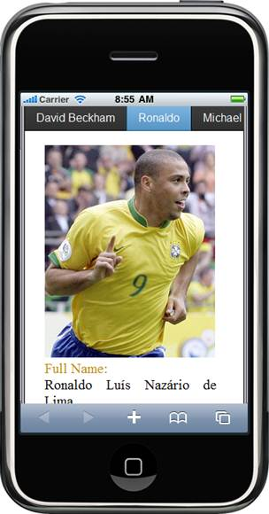
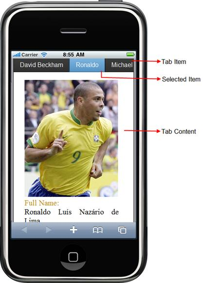

::: {style="DISPLAY: none"}
{#d2h_url_template} {#d2h_package_url style="WIDTH: 0px; DISPLAY: none; HEIGHT: 0px"}
:::

::::: {#nsbanner .d2h_main_nsbanner style="BORDER-BOTTOM: #999999 1px solid; POSITION: relative; PADDING-BOTTOM: 0px; BACKGROUND-COLOR: transparent; PADDING-LEFT: 0px; PADDING-RIGHT: 0px; DISPLAY: none; BORDER-TOP: #999999 1px solid; PADDING-TOP: 0px; LEFT: 0px"}
:::: {#TitleRow .d2h_main_titlerow style="PADDING-BOTTOM: 4px; BACKGROUND-COLOR: transparent; PADDING-LEFT: 22px; WIDTH: 100%; PADDING-RIGHT: 10px; DISPLAY: none; PADDING-TOP: 4px"}
::: {#ienav .d2h_main_ienav style="DISPLAY: none"}
{#D2HPrevious .D2HPreviousEnabled}  {#D2HNext .D2HNextEnabled}
:::
::::
:::::

:::: {#nstext .d2h_main_nstext style="PADDING-BOTTOM: 10px; BACKGROUND-COLOR: transparent; PADDING-LEFT: 22px; PADDING-RIGHT: 10px; HEIGHT: 100%; OVERFLOW: auto; PADDING-TOP: 5px" hasuserbackground="true" valign="bottom"}
::: {#d2h_breadcrumbs .d2h_breadcrumbs}
[Essential Studio User Guide Documentation](ms-xhelp:///?Id=12457748-09e3-4d74-a240-8e049cedf030){.d2h_breadcrumbsNormal} [ \> ]{.d2h_breadcrumbsLinkSeparator} [User Interface Edition](ms-xhelp:///?Id=c29296b7-531c-413b-a0ec-488ca1f7f669){.d2h_breadcrumbsNormal} [ \> ]{.d2h_breadcrumbsLinkSeparator} [Essential Mobile MVC](ms-xhelp:///?Id=74df42e3-5434-4590-9be6-3ae2f911cbbc){.d2h_breadcrumbsNormal} [ \> ]{.d2h_breadcrumbsLinkSeparator} [Essential Tools]{.d2h_breadcrumbsContentsOnly} [ \> ]{.d2h_breadcrumbsLinkSeparator} [Controls and Components](ms-xhelp:///?Id=143afae1-3f83-4d32-9bfa-92ed7022a696){.d2h_breadcrumbsNormal}
:::

## Tab {#tab style="tab-stops: 0pt"}

Essential Tools Mobile Tab for MVC builds a dynamic interactive menu-driven tabbed interface from existing content.\
The content can be text, image, graphics, or HTML. Add as many items as you wish; if you add more items than can be displayed by the tab bar, a More item automatically appears at the end of the tab bar. Items that don\'t fit on the screen appear when the end-user swipes the screen from right to left, or vice-versa.

 

{border="0"}

Figure 143: Tab Control

Key Features

The Mobile Tab control for Essential Tools MVC supports the following features:

[·      ]{style="FONT-FAMILY: Symbol"}Data-binding

[·      ]{style="FONT-FAMILY: Symbol"}Open and closed style tabs

[·      ]{style="FONT-FAMILY: Symbol"}4 built-in skins

[·      ]{style="FONT-FAMILY: Symbol"}Provides load-on-demand support

 

Elaborate Structure of the Tab

This following image marks the important sections of the dialog.

[]{style="LINE-HEIGHT: 115%; FONT-FAMILY: 'Calibri','sans-serif'; FONT-SIZE: 11pt"} 

{border="0"}

 

Figure 144: Elaborate structure of the Tab control

More:

[ ]{#related-topics}

[{border="0" align="absMiddle"}Adding Mobile Tab to the MVC application](ms-xhelp:///?Id=02310b96-0f94-4f7f-9225-f3e9b3695fe1){style="TEXT-DECORATION: none"}

[{border="0" align="absMiddle"}Concepts and Features](ms-xhelp:///?Id=b6a0d6e9-ce91-468f-80bd-f189d5962d1c){style="TEXT-DECORATION: none"}
::::
