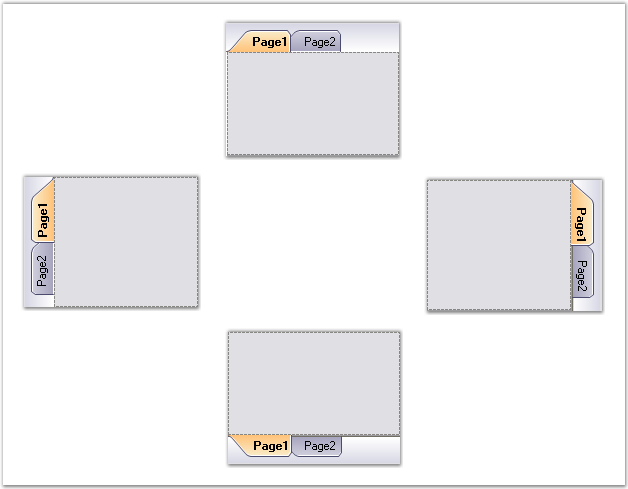

::: {style="DISPLAY: none"}
{#d2h_url_template}{#d2h_package_url style="WIDTH: 0px; DISPLAY: none; HEIGHT: 0px"}
:::

:::: {.d2h_secondary_topic style="PADDING-BOTTOM: 10pt; MARGIN: 0pt; PADDING-LEFT: 0pt; PADDING-RIGHT: 0pt; PADDING-TOP: 0pt"}
##### TabAlignment {#tabalignment style="MARGIN-LEFT: 18pt; tab-stops: 18.0pt"}

[]{style="FONT-SIZE: 8pt"} 

Alignment of the Tabs can be set through the below properties.

 

::: {align="center"}
+-----------------------------------+-------------------------------------------------------------------------------------------------------------------------------+
| TabControlAdv Property            | Description                                                                                                                   |
+-----------------------------------+-------------------------------------------------------------------------------------------------------------------------------+
| Alignment                         | Specifies the alignment of tabitems with respect to the tab pages. The options include:                                       |
|                                   |                                                                                                                               |
|                                   |                                                                                                                               |
|                                   |                                                                                                                               |
|                                   | [·      ]{style="FONT-FAMILY: Symbol"}Top                                                                                     |
|                                   |                                                                                                                               |
|                                   | [·      ]{style="FONT-FAMILY: Symbol"}Bottom                                                                                  |
|                                   |                                                                                                                               |
|                                   | [·      ]{style="FONT-FAMILY: Symbol"}Left                                                                                    |
|                                   |                                                                                                                               |
|                                   | [·      ]{style="FONT-FAMILY: Symbol"}Right                                                                                   |
+-----------------------------------+-------------------------------------------------------------------------------------------------------------------------------+
| VerticalAlignment                 | Specifies whether the tabs are aligned to the Top, Bottom or based on the RightToLeft property when aligned vertically.       |
+-----------------------------------+-------------------------------------------------------------------------------------------------------------------------------+
| TabGap                            | Specifies the space between the tabitems.                                                                                     |
+-----------------------------------+-------------------------------------------------------------------------------------------------------------------------------+
| Top                               | Gets / sets the distance, in pixels, between the top edge of the control and the top edge of the container\'s client area.    |
+-----------------------------------+-------------------------------------------------------------------------------------------------------------------------------+
| Right                             | Gets / sets the distance, in pixels, between the right edge of the control and the left edge of the container\'s client area. |
+-----------------------------------+-------------------------------------------------------------------------------------------------------------------------------+
:::

 

 

{border="0"}                                                                     

Figure 1055: TabControlAdv with Alignment set to Left, Top, Right and Bottom**[]{style="FONT-STYLE: normal"}**

 

+---------------------------------------------------------------------------------------------------------------------------------------------------------------------------------------------------------------------------------------------------------------+
| **[\[C#\]]{style="LINE-HEIGHT: 115%; FONT-FAMILY: 'Courier New'; COLOR: black; FONT-SIZE: 9pt"}**                                                                                                                                                             |
|                                                                                                                                                                                                                                                               |
| **[]{style="LINE-HEIGHT: 115%; FONT-FAMILY: 'Courier New'; COLOR: black; FONT-SIZE: 9pt"}**                                                                                                                                                                   |
|                                                                                                                                                                                                                                                               |
| [this]{style="LINE-HEIGHT: 115%; FONT-FAMILY: 'Courier New'; COLOR: blue; FONT-SIZE: 9pt"}[.tabControlAdv1.Alignment = System.Windows.Forms.[TabAlignment]{style="COLOR: teal"}.Left;]{style="LINE-HEIGHT: 115%; FONT-FAMILY: 'Courier New'; FONT-SIZE: 9pt"} |
|                                                                                                                                                                                                                                                               |
| [this]{style="LINE-HEIGHT: 115%; FONT-FAMILY: 'Courier New'; COLOR: blue; FONT-SIZE: 9pt"}[.tabControlAdv1.TabGap = 2;]{style="LINE-HEIGHT: 115%; FONT-FAMILY: 'Courier New'; FONT-SIZE: 9pt"}                                                                |
+---------------------------------------------------------------------------------------------------------------------------------------------------------------------------------------------------------------------------------------------------------------+

 

+-------------------------------------------------------------------------------------------------------------------------------------------------------------------------------------------------------------------------------------+
| **[\[VB.NET\]]{style="LINE-HEIGHT: 115%; FONT-FAMILY: 'Courier New'; COLOR: black; FONT-SIZE: 9pt"}**                                                                                                                               |
|                                                                                                                                                                                                                                     |
| **[]{style="LINE-HEIGHT: 115%; FONT-FAMILY: 'Courier New'; COLOR: black; FONT-SIZE: 9pt"}**                                                                                                                                         |
|                                                                                                                                                                                                                                     |
| [Me]{style="LINE-HEIGHT: 115%; FONT-FAMILY: 'Courier New'; COLOR: blue; FONT-SIZE: 9pt"}[.tabControlAdv1.Alignment = System.Windows.Forms.TabAlignment.Left]{style="LINE-HEIGHT: 115%; FONT-FAMILY: 'Courier New'; FONT-SIZE: 9pt"} |
|                                                                                                                                                                                                                                     |
| [Me]{style="LINE-HEIGHT: 115%; FONT-FAMILY: 'Courier New'; COLOR: blue; FONT-SIZE: 9pt"}[.tabControlAdv1.TabGap = 2]{style="LINE-HEIGHT: 115%; FONT-FAMILY: 'Courier New'; FONT-SIZE: 9pt"}                                         |
+-------------------------------------------------------------------------------------------------------------------------------------------------------------------------------------------------------------------------------------+

 

See Also

 

[[TabStyles]{.UGHyperlink}](../../../../../../../../Documents%20and%20Settings/sylviap/Desktop/Tools%20-%20Part%202.docx#_TabStyles)[]{.UGHyperlink}

[]{style="FONT-FAMILY: 'Calibri','sans-serif'; FONT-SIZE: 11pt"} 

[[[]{style="TEXT-DECORATION: none"}]{style="COLOR: navy; FONT-SIZE: 20pt"}]{.underline} 

 

 

[]{#related-topics}
::::
