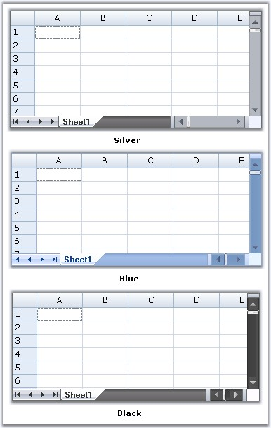
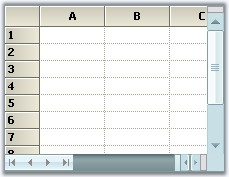

::: {style="DISPLAY: none"}
{#d2h_url_template}{#d2h_package_url style="WIDTH: 0px; DISPLAY: none; HEIGHT: 0px"}
:::

::: {.d2h_secondary_topic style="PADDING-BOTTOM: 10pt; MARGIN: 0pt; PADDING-LEFT: 0pt; PADDING-RIGHT: 0pt; PADDING-TOP: 0pt"}
#### TabBarSplitterControl {#tabbarsplittercontrol style="tab-stops: 0pt"}

[]{style="FONT-FAMILY: 'Trebuchet MS','sans-serif'; COLOR: #15428b; FONT-SIZE: 9pt"} 

TabBarSplitterControl enables users to create Tab Pages with dynamic splitters; when used with a grid control, it gives a workbook like appearance. It comes with Office 2007 Style, by default, and supports all the three color schemes.

[]{style="FONT-FAMILY: 'Trebuchet MS','sans-serif'; COLOR: #15428b; FONT-SIZE: 9pt"} 

+------------------------------------------------------------------------------------------------------------------------------------------------------------------------------------------------------------------------+
| **[\[C#\]]{style="FONT-FAMILY: 'Courier New'; COLOR: black"}**                                                                                                                                                         |
|                                                                                                                                                                                                                        |
| []{style="FONT-FAMILY: 'Courier New'; COLOR: black"}                                                                                                                                                                   |
|                                                                                                                                                                                                                        |
| [this]{style="FONT-FAMILY: 'Courier New'; COLOR: blue"}[.tabBarSplitterControl.Style = Syncfusion.Windows.Forms.[TabBarSplitterStyle]{style="COLOR: #2b91af"}.Office2007;]{style="FONT-FAMILY: 'Courier New'"}         |
|                                                                                                                                                                                                                        |
| [this]{style="FONT-FAMILY: 'Courier New'; COLOR: blue"}[.tabBarSplitterControl.Office2007ColorScheme = Syncfusion.Windows.Forms.[Office2007Theme]{style="COLOR: #2b91af"}.Silver;]{style="FONT-FAMILY: 'Courier New'"} |
+------------------------------------------------------------------------------------------------------------------------------------------------------------------------------------------------------------------------+

[]{style="FONT-FAMILY: 'Trebuchet MS','sans-serif'; COLOR: #15428b; FONT-SIZE: 9pt"} 

+-------------------------------------------------------------------------------------------------------------------------------------------------------------------------------------------------------------------+
| **[\[VB.NET\]]{style="FONT-FAMILY: 'Courier New'; COLOR: black"}**                                                                                                                                                |
|                                                                                                                                                                                                                   |
| []{style="FONT-FAMILY: 'Courier New'; COLOR: black"}                                                                                                                                                              |
|                                                                                                                                                                                                                   |
| [Me]{style="FONT-FAMILY: 'Courier New'; COLOR: blue"}[.tabBarSplitterControl.Style = Syncfusion.Windows.Forms.[TabBarSplitterStyle.Office2007]{style="COLOR: black"}]{style="FONT-FAMILY: 'Courier New'"}         |
|                                                                                                                                                                                                                   |
| [Me]{style="FONT-FAMILY: 'Courier New'; COLOR: blue"}[.tabBarSplitterControl.Office2007ColorScheme = Syncfusion.Windows.[Forms.Office2007Theme.Silver]{style="COLOR: black"}]{style="FONT-FAMILY: 'Courier New'"} |
+-------------------------------------------------------------------------------------------------------------------------------------------------------------------------------------------------------------------+

[]{style="FONT-FAMILY: 'Trebuchet MS','sans-serif'; COLOR: #15428b; FONT-SIZE: 9pt"} 

{border="0"}

[]{style="FONT-FAMILY: 'Trebuchet MS','sans-serif'; COLOR: #15428b; FONT-SIZE: 9pt"} 

*[Figure ]{style="FONT-SIZE: 9pt"}[180]{style="FONT-SIZE: 9pt"}[: Office 2007 Color Schemes]{style="FONT-SIZE: 9pt"}*

**[]{style="FONT-FAMILY: 'Trebuchet MS','sans-serif'; COLOR: #15428b; FONT-SIZE: 9pt"}** 

Custom Colors

**[]{style="FONT-FAMILY: 'Trebuchet MS','sans-serif'; COLOR: #15428b; FONT-SIZE: 9pt"}** 

We can apply custom colors to the TabBarSplitterControl by setting Office2007ColorScheme property to \"Managed\" and by giving the color through ApplyManagedColor method as follows.

[]{style="FONT-FAMILY: 'Trebuchet MS','sans-serif'; COLOR: #15428b; FONT-SIZE: 9pt"} 

+-------------------------------------------------------------------------------------------------------------------------------------------------------------------------------------------------------------------------+
| **[\[C#\]]{style="FONT-FAMILY: 'Courier New'; COLOR: black"}**                                                                                                                                                          |
|                                                                                                                                                                                                                         |
| []{style="FONT-FAMILY: 'Courier New'; COLOR: black"}                                                                                                                                                                    |
|                                                                                                                                                                                                                         |
| [this]{style="FONT-FAMILY: 'Courier New'; COLOR: blue"}[.tabBarSplitterControl.Office2007ColorScheme = Syncfusion.Windows.Forms.[Office2007Theme]{style="COLOR: #2b91af"}.Managed;]{style="FONT-FAMILY: 'Courier New'"} |
|                                                                                                                                                                                                                         |
| [Office2007Colors]{style="FONT-FAMILY: 'Courier New'; COLOR: #2b91af"}[.ApplyManagedColors([this]{style="COLOR: blue"}, [Color]{style="COLOR: #2b91af"}.PowderBlue);]{style="FONT-FAMILY: 'Courier New'"}               |
+-------------------------------------------------------------------------------------------------------------------------------------------------------------------------------------------------------------------------+

[]{style="FONT-FAMILY: 'Trebuchet MS','sans-serif'; COLOR: #15428b; FONT-SIZE: 9pt"} 

+--------------------------------------------------------------------------------------------------------------------------------------------------------------------------------------------------------------------+
| **[\[VB.NET\]]{style="FONT-FAMILY: 'Courier New'; COLOR: black"}**                                                                                                                                                 |
|                                                                                                                                                                                                                    |
| []{style="FONT-FAMILY: 'Courier New'; COLOR: black"}                                                                                                                                                               |
|                                                                                                                                                                                                                    |
| [Me]{style="FONT-FAMILY: 'Courier New'; COLOR: blue"}[.tabBarSplitterControl.Office2007ColorScheme = Syncfusion.Windows.[Forms.Office2007Theme.]{style="COLOR: black"}Managed]{style="FONT-FAMILY: 'Courier New'"} |
|                                                                                                                                                                                                                    |
| [Office2007Colors]{style="FONT-FAMILY: 'Courier New'; COLOR: black"}[.ApplyManagedColors([Me]{style="COLOR: blue"}, [Color]{style="COLOR: black"}.PowderBlue)]{style="FONT-FAMILY: 'Courier New'"}                 |
+--------------------------------------------------------------------------------------------------------------------------------------------------------------------------------------------------------------------+

[]{style="FONT-FAMILY: 'Trebuchet MS','sans-serif'; COLOR: #15428b; FONT-SIZE: 9pt"} 

{border="0"}

[]{style="FONT-FAMILY: 'Trebuchet MS','sans-serif'; COLOR: #15428b; FONT-SIZE: 9pt"} 

*[Figure ]{style="FONT-SIZE: 9pt"}[181]{style="FONT-SIZE: 9pt"}[: Custom Color of Tab Bar Splitter Control set to \"PowderBlue\"]{style="FONT-SIZE: 9pt"}*

 

[]{#p338} 

 

[]{#related-topics}
:::
