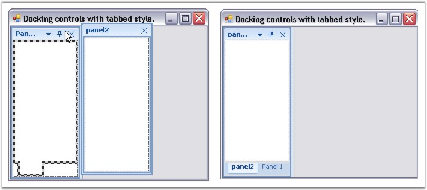
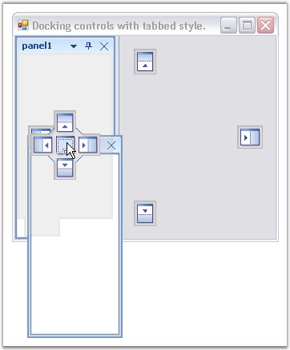
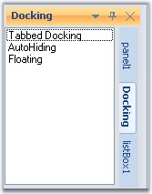

::: {style="DISPLAY: none"}
{#d2h_url_template}{#d2h_package_url style="WIDTH: 0px; DISPLAY: none; HEIGHT: 0px"}
:::

::::::: {.d2h_secondary_topic style="PADDING-BOTTOM: 10pt; MARGIN: 0pt; PADDING-LEFT: 0pt; PADDING-RIGHT: 0pt; PADDING-TOP: 0pt"}
##### Tabbed Docking {#tabbed-docking style="tab-stops: 0pt"}

[]{style="COLOR: #15428b"} 

This section will discuss how the docked controls inside a container can be tabbed.

[]{style="COLOR: #15428b"} 

At Design Time

[]{style="COLOR: #15428b"} 

The docked controls can be tabbed in the designer, by just dragging and dropping into one another. DockingManager helps you in doing this using different DragProviderStyle.

[]{style="COLOR: #15428b"} 

{border="0"}

[]{style="COLOR: #15428b"} 

Figure 47: Docked controls tabbed in the Designer

[]{style="COLOR: #15428b"} 

At RunTime

[]{style="COLOR: #15428b"} 

DockingManager helps you in dragging and dropping the docked controls at run time, using different DragProviderStyle. This styles display prediction Bands, which lets you decide whether you can drop the control in that location.

[]{style="COLOR: #15428b"} 

{border="0"}

[]{style="COLOR: #15428b"} 

Figure 48: Docking a control with tabbed style into another Control

[]{style="COLOR: #15428b"} 

Runtime Example

[]{style="COLOR: #15428b"} 

The below code lets you tab two docked controls (Panel1 and Panel2).

[]{style="COLOR: #15428b"} 

+----------------------------------------------------------------------------------------------------------------------------------------------------------------------------------------------------------------------------------------------------------------------------------------------------------------------------------------------------------------+
| **[\[C#\]]{style="FONT-FAMILY: 'Courier New'; COLOR: black"}**                                                                                                                                                                                                                                                                                                 |
|                                                                                                                                                                                                                                                                                                                                                                |
| []{style="FONT-FAMILY: 'Courier New'; COLOR: green"}                                                                                                                                                                                                                                                                                                           |
|                                                                                                                                                                                                                                                                                                                                                                |
| [this]{style="FONT-FAMILY: 'Courier New'; COLOR: blue"}[.dockingManager.DockControl([this]{style="COLOR: blue"}.[Panel1]{style="COLOR: black"}, [this]{style="COLOR: blue"}.[Panel2]{style="COLOR: black"}, Syncfusion.Windows.Forms.Tools.[DockingStyle]{style="COLOR: teal"}.Tabbed, 200, [true]{style="COLOR: blue"});]{style="FONT-FAMILY: 'Courier New'"} |
+----------------------------------------------------------------------------------------------------------------------------------------------------------------------------------------------------------------------------------------------------------------------------------------------------------------------------------------------------------------+

[]{style="COLOR: #15428b"} 

+----------------------------------------------------------------------------------------------------------------------------------------------------------------------------------------------------------------------------------------------------------------------------------+
| **[\[VB.NET\]]{style="FONT-FAMILY: 'Courier New'; COLOR: black"}**                                                                                                                                                                                                               |
|                                                                                                                                                                                                                                                                                  |
| []{style="FONT-FAMILY: 'Courier New'; COLOR: green"}                                                                                                                                                                                                                             |
|                                                                                                                                                                                                                                                                                  |
| [Me]{style="FONT-FAMILY: 'Courier New'; COLOR: blue"}[.dockingManager.DockControl([Me]{style="COLOR: blue"}.Panel1, [Me]{style="COLOR: blue"}.Panel2, Syncfusion.Windows.Forms.Tools.DockingStyle.Tabbed, 200, [True]{style="COLOR: blue"})]{style="FONT-FAMILY: 'Courier New'"} |
+----------------------------------------------------------------------------------------------------------------------------------------------------------------------------------------------------------------------------------------------------------------------------------+

[]{style="COLOR: #15428b"} 

::: {style="BORDER-BOTTOM: windowtext 1pt solid; BORDER-LEFT: medium none; PADDING-BOTTOM: 1pt; MARGIN-TOP: 9pt; PADDING-LEFT: 0pt; PADDING-RIGHT: 0pt; MARGIN-BOTTOM: 9pt; BORDER-TOP: windowtext 1pt solid; BORDER-RIGHT: medium none; PADDING-TOP: 1pt"}
{border="0"} Note: In the Tabbed style, the control is docked as a tabbed window along with the dock target. This style is not applicable when the dock target is the host form / user control.
:::

[]{style="COLOR: #15428b"} 

Context Menu for Tabbed Controls

[]{style="COLOR: #15428b"} 

The tabbed control can display context menu when the user right clicks on the tabs. See Context Menu.

[]{style="COLOR: #15428b"} 

Aligning the Tabs

[]{style="COLOR: #15428b"} 

The alignment of the tabs can be specified using DockTabAlignment property.

[]{style="COLOR: #15428b"} 

[]{style="COLOR: #15428b"} 

::: {align="center"}
+-----------------------------------+---------------------------------------------------------------------------------------------------------------+
| DockingManager Property           | Description                                                                                                   |
+-----------------------------------+---------------------------------------------------------------------------------------------------------------+
| DockTabAlignment                  | Property which sets the value indicating the alignment of the dock tabs. The different alignment options are, |
|                                   |                                                                                                               |
|                                   |                                                                                                               |
|                                   |                                                                                                               |
|                                   | *Top,*                                                                                                        |
|                                   |                                                                                                               |
|                                   | *Bottom,*                                                                                                     |
|                                   |                                                                                                               |
|                                   | *Left and*                                                                                                    |
|                                   |                                                                                                               |
|                                   | *Right.*                                                                                                      |
+-----------------------------------+---------------------------------------------------------------------------------------------------------------+
:::

[]{style="COLOR: #15428b"} 

::: {style="BORDER-BOTTOM: windowtext 1pt solid; BORDER-LEFT: medium none; PADDING-BOTTOM: 1pt; MARGIN-TOP: 9pt; PADDING-LEFT: 0pt; PADDING-RIGHT: 0pt; MARGIN-BOTTOM: 9pt; BORDER-TOP: windowtext 1pt solid; BORDER-RIGHT: medium none; PADDING-TOP: 1pt"}
{border="0"} Note: This property can also be set easily using Task Window.
:::

[]{style="COLOR: #15428b"} 

+---------------------------------------------------------------------------------------------------------------------------------------------------------------------------------------------+
| **[\[C#\]]{style="FONT-FAMILY: 'Courier New'; COLOR: black"}**                                                                                                                              |
|                                                                                                                                                                                             |
| **[]{style="FONT-FAMILY: 'Courier New'; COLOR: black"}**                                                                                                                                    |
|                                                                                                                                                                                             |
| [this]{style="FONT-FAMILY: 'Courier New'; COLOR: blue"}[.dockingManager.DockTabAlignment = Syncfusion.Windows.Forms.Tools.DockTabAlignmentStyle.Right;]{style="FONT-FAMILY: 'Courier New'"} |
+---------------------------------------------------------------------------------------------------------------------------------------------------------------------------------------------+

[]{style="COLOR: #15428b"} 

+------------------------------------------------------------------------------------------------------------------------------------------------------------------------------------------+
| **[\[VB.NET\]]{style="FONT-FAMILY: 'Courier New'; COLOR: black"}**                                                                                                                       |
|                                                                                                                                                                                          |
| **[]{style="FONT-FAMILY: 'Courier New'; COLOR: black"}**                                                                                                                                 |
|                                                                                                                                                                                          |
| [Me]{style="FONT-FAMILY: 'Courier New'; COLOR: blue"}[.dockingManager.DockTabAlignment = Syncfusion.Windows.Forms.Tools.DockTabAlignmentStyle.Right]{style="FONT-FAMILY: 'Courier New'"} |
+------------------------------------------------------------------------------------------------------------------------------------------------------------------------------------------+

[]{style="COLOR: #15428b"} 

{border="0"}

[]{style="COLOR: #15428b"} 

Figure 49: Tabs aligned to \"Right\"

**[]{style="COLOR: #15428b"}** 

Methods related to Tabbed Docking

[]{style="COLOR: #15428b"} 

::: {align="center"}
+-----------------------------------+----------------------------------------------------------------------------------------------------------------------------------------------------------------------+
| DockingManager Property           | Description                                                                                                                                                          |
+-----------------------------------+----------------------------------------------------------------------------------------------------------------------------------------------------------------------+
| IsSameTabbedGroup                 | Determines whether the second control is under the same group of the first control.                                                                                  |
|                                   |                                                                                                                                                                      |
|                                   |                                                                                                                                                                      |
|                                   |                                                                                                                                                                      |
|                                   | *Ctrl1* - Indicates the first control.                                                                                                                               |
|                                   |                                                                                                                                                                      |
|                                   | *Ctrl2* - Indicates the second control.                                                                                                                              |
+-----------------------------------+----------------------------------------------------------------------------------------------------------------------------------------------------------------------+
| GetTabPosition                    | Returns the tab position of the specified control among a tab group. An integer value will be returned indicating the tab position. The parameter is,                |
|                                   |                                                                                                                                                                      |
|                                   |                                                                                                                                                                      |
|                                   |                                                                                                                                                                      |
|                                   | *Ctrl[ ]{style="COLOR: black; FONT-SIZE: 8pt"}*- Indicates the docking window.                                                                                       |
+-----------------------------------+----------------------------------------------------------------------------------------------------------------------------------------------------------------------+
| GetTabbedSiblings                 | Returns all the siblings of the specified control in a tabbed group or it returns the array of controls which are tabbed with the given control. The parameters are, |
|                                   |                                                                                                                                                                      |
|                                   |                                                                                                                                                                      |
|                                   |                                                                                                                                                                      |
|                                   | *Ctrl[ ]{style="COLOR: black; FONT-SIZE: 8pt"}*- Instance of control whose tabbed siblings are to be returned.                                                       |
+-----------------------------------+----------------------------------------------------------------------------------------------------------------------------------------------------------------------+
| IsTabbed                          | Returns whether the specified control is tabbed or not. The parameter is,                                                                                            |
|                                   |                                                                                                                                                                      |
|                                   |                                                                                                                                                                      |
|                                   |                                                                                                                                                                      |
|                                   | *Ctrl[ ]{style="COLOR: black; FONT-SIZE: 8pt"}*- Indicates the docking window.                                                                                       |
+-----------------------------------+----------------------------------------------------------------------------------------------------------------------------------------------------------------------+
:::

[]{style="COLOR: #15428b"} 

+-------------------------------------------------------------------------------------------------------------------------------------------------------------------------------------------------------------------+
| **[\[C#\]]{style="FONT-FAMILY: 'Courier New'; COLOR: black"}**                                                                                                                                                    |
|                                                                                                                                                                                                                   |
| []{style="FONT-FAMILY: 'Courier New'; COLOR: green"}                                                                                                                                                              |
|                                                                                                                                                                                                                   |
| [this]{style="FONT-FAMILY: 'Courier New'; COLOR: blue"}[.dockingManager.IsSameTabbedGroup([this]{style="COLOR: blue"}.listBox1,[this]{style="COLOR: blue"}.checkedListBox1);]{style="FONT-FAMILY: 'Courier New'"} |
|                                                                                                                                                                                                                   |
| [this]{style="FONT-FAMILY: 'Courier New'; COLOR: blue"}[.dockingManager1.GetTabPosition([this]{style="COLOR: blue"}.listBox1);]{style="FONT-FAMILY: 'Courier New'"}                                               |
|                                                                                                                                                                                                                   |
| [this]{style="FONT-FAMILY: 'Courier New'; COLOR: blue"}[.dockingManager1.GetTabbedSiblings([this]{style="COLOR: blue"}.listView1);]{style="FONT-FAMILY: 'Courier New'"}                                           |
|                                                                                                                                                                                                                   |
| [this]{style="FONT-FAMILY: 'Courier New'; COLOR: blue"}[.dockingManager1.IsTabbed([this]{style="COLOR: blue"}.listBox1);]{style="FONT-FAMILY: 'Courier New'"}                                                     |
+-------------------------------------------------------------------------------------------------------------------------------------------------------------------------------------------------------------------+

[]{style="COLOR: #15428b"} 

+----------------------------------------------------------------------------------------------------------------------------------------------------------------------------------------------------------------+
| **[\[VB.NET\]]{style="FONT-FAMILY: 'Courier New'; COLOR: black"}**                                                                                                                                             |
|                                                                                                                                                                                                                |
| []{style="FONT-FAMILY: 'Courier New'; COLOR: green"}                                                                                                                                                           |
|                                                                                                                                                                                                                |
| [Me]{style="FONT-FAMILY: 'Courier New'; COLOR: blue"}[.dockingManager.IsSameTabbedGroup([this]{style="COLOR: blue"}.listBox1,[this]{style="COLOR: blue"}.checkedListBox1)]{style="FONT-FAMILY: 'Courier New'"} |
|                                                                                                                                                                                                                |
| [Me]{style="FONT-FAMILY: 'Courier New'; COLOR: blue"}[.dockingManager1.GetTabPosition([Me]{style="COLOR: blue"}.listBox1)]{style="FONT-FAMILY: 'Courier New'"}                                                 |
|                                                                                                                                                                                                                |
| [Me]{style="FONT-FAMILY: 'Courier New'; COLOR: blue"}[.dockingManager1.GetTabbedSiblings([Me]{style="COLOR: blue"}.listView1)]{style="FONT-FAMILY: 'Courier New'"}                                             |
|                                                                                                                                                                                                                |
| [Me]{style="FONT-FAMILY: 'Courier New'; COLOR: blue"}[.dockingManager1.IsTabbed([this]{style="COLOR: blue"}[.]{style="COLOR: black"}listBox1)]{style="FONT-FAMILY: 'Courier New'"}                             |
+----------------------------------------------------------------------------------------------------------------------------------------------------------------------------------------------------------------+

**[]{style="COLOR: #15428b"}** 

See Also

[]{style="COLOR: #15428b"} 

[Getting Started]{.UGHyperlink}[, ]{.UGHyperlink}[DockAllow Event]{.UGHyperlink}[, ]{.UGHyperlink}[Dock Arrow Settings]{.UGHyperlink}[]{.UGHyperlink}

[]{#related-topics}
:::::::
