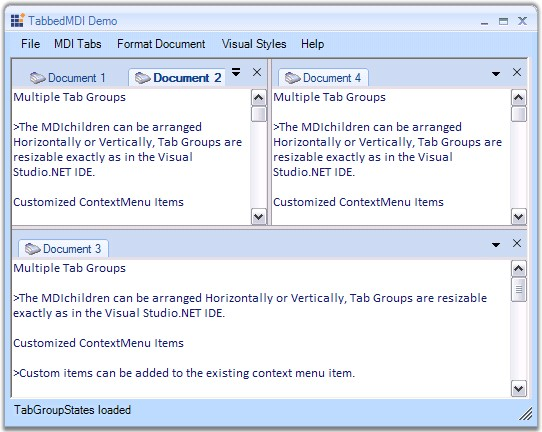

::: {style="DISPLAY: none"}
{#d2h_url_template}{#d2h_package_url style="WIDTH: 0px; DISPLAY: none; HEIGHT: 0px"}
:::

::::: {#nsbanner .d2h_main_nsbanner style="BORDER-BOTTOM: #999999 1px solid; POSITION: relative; PADDING-BOTTOM: 0px; BACKGROUND-COLOR: transparent; PADDING-LEFT: 0px; PADDING-RIGHT: 0px; DISPLAY: none; BORDER-TOP: #999999 1px solid; PADDING-TOP: 0px; LEFT: 0px"}
:::: {#TitleRow .d2h_main_titlerow style="PADDING-BOTTOM: 4px; BACKGROUND-COLOR: transparent; PADDING-LEFT: 22px; WIDTH: 100%; PADDING-RIGHT: 10px; DISPLAY: none; PADDING-TOP: 4px"}
::: {#ienav .d2h_main_ienav style="DISPLAY: none"}
{#D2HPrevious .D2HPreviousEnabled}  {#D2HNext .D2HNextEnabled}
:::
::::
:::::

:::: {#nstext .d2h_main_nstext style="PADDING-BOTTOM: 10px; BACKGROUND-COLOR: transparent; PADDING-LEFT: 22px; PADDING-RIGHT: 10px; HEIGHT: 100%; OVERFLOW: auto; PADDING-TOP: 5px" hasuserbackground="true" valign="bottom"}
::: {#d2h_breadcrumbs .d2h_breadcrumbs}
[Essential Studio User Guide Documentation](ms-xhelp:///?Id=12457748-09e3-4d74-a240-8e049cedf030){.d2h_breadcrumbsNormal}[ \> ]{.d2h_breadcrumbsLinkSeparator}[User Interface Edition](ms-xhelp:///?Id=c29296b7-531c-413b-a0ec-488ca1f7f669){.d2h_breadcrumbsNormal}[ \> ]{.d2h_breadcrumbsLinkSeparator}[Essential Windows](ms-xhelp:///?Id=e60759d8-47a4-4570-9d7a-16a68d63f2ea){.d2h_breadcrumbsNormal}[ \> ]{.d2h_breadcrumbsLinkSeparator}[Essential Tools]{.d2h_breadcrumbsContentsOnly}[ \> ]{.d2h_breadcrumbsLinkSeparator}[Tools Controls](ms-xhelp:///?Id=13c3c4f4-9d16-4b69-93f2-7e98eec67452){.d2h_breadcrumbsNormal}
:::

## TabbedMDI Package {#tabbedmdi-package style="MARGIN-LEFT: 18pt; tab-stops: 18.0pt"}

[]{style="COLOR: #15428b"} 

The TabbedMDI package provides a new TabbedMDI layout mode (as an alternative to the default Cascade and Tiled modes), popularized by Visual Studio .NET. This framework was built with great consideration for ease of use, to avoid having to modify an existing MDI application in any way to enable the TabbedMDI mode. With a single method call, you can switch between TabbedMDI and RegularMDI layout modes.

[]{style="COLOR: #15428b"} 

{border="0"}

[]{style="COLOR: #15428b"} 

Figure 1082: TabbedMDI Framework

[]{style="COLOR: #15428b"} 

TabbedMDI framework will retain the MDI scheme in Tabbed mode. The Child forms will still be MDIChildren of the Parent (they will not be moved into a TabControl; this results in loss of MDI functionality like Merged Menus, switching using CTRL+TAB, etc.), thereby enhancing your application without interfering with the general MDI scheme.

 

The TabbedMDI framework provides users the exact functionality and look and feel of Visual Studio .NET Tabbed Child windows.

 

 

 

More:

[ ]{#related-topics}

[{border="0" align="absMiddle"}Features Overview](ms-xhelp:///?Id=8e495b45-e473-4af2-8cfc-eca8024a4970){style="TEXT-DECORATION: none"}

[{border="0" align="absMiddle"}Creating TabbedMDIManager](ms-xhelp:///?Id=4952d183-2fa0-4ecd-87df-2a09757384a9){style="TEXT-DECORATION: none"}

[{border="0" align="absMiddle"}TabbedMDIManager Events](ms-xhelp:///?Id=8ce35d90-0365-407d-b10b-dc5d3449c497){style="TEXT-DECORATION: none"}

[{border="0" align="absMiddle"}Frequently Asked Questions](ms-xhelp:///?Id=03c21ce5-b83f-4de1-8841-1b4306430a5d){style="TEXT-DECORATION: none"}
::::
