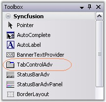
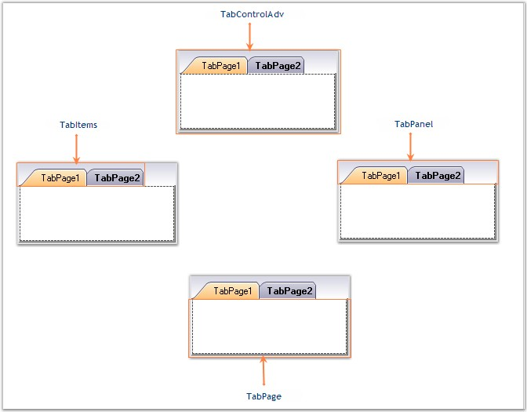

::: {style="DISPLAY: none"}
{#d2h_url_template}{#d2h_package_url style="WIDTH: 0px; DISPLAY: none; HEIGHT: 0px"}
:::

::::: {#nsbanner .d2h_main_nsbanner style="BORDER-BOTTOM: #999999 1px solid; POSITION: relative; PADDING-BOTTOM: 0px; BACKGROUND-COLOR: transparent; PADDING-LEFT: 0px; PADDING-RIGHT: 0px; DISPLAY: none; BORDER-TOP: #999999 1px solid; PADDING-TOP: 0px; LEFT: 0px"}
:::: {#TitleRow .d2h_main_titlerow style="PADDING-BOTTOM: 4px; BACKGROUND-COLOR: transparent; PADDING-LEFT: 22px; WIDTH: 100%; PADDING-RIGHT: 10px; DISPLAY: none; PADDING-TOP: 4px"}
::: {#ienav .d2h_main_ienav style="DISPLAY: none"}
{#D2HPrevious .D2HPreviousEnabled}  {#D2HNext .D2HNextEnabled}
:::
::::
:::::

:::: {#nstext .d2h_main_nstext style="PADDING-BOTTOM: 10px; BACKGROUND-COLOR: transparent; PADDING-LEFT: 22px; PADDING-RIGHT: 10px; HEIGHT: 100%; OVERFLOW: auto; PADDING-TOP: 5px" hasuserbackground="true" valign="bottom"}
::: {#d2h_breadcrumbs .d2h_breadcrumbs}
[Essential Studio User Guide Documentation](ms-xhelp:///?Id=12457748-09e3-4d74-a240-8e049cedf030){.d2h_breadcrumbsNormal}[ \> ]{.d2h_breadcrumbsLinkSeparator}[User Interface Edition](ms-xhelp:///?Id=c29296b7-531c-413b-a0ec-488ca1f7f669){.d2h_breadcrumbsNormal}[ \> ]{.d2h_breadcrumbsLinkSeparator}[Essential Windows](ms-xhelp:///?Id=e60759d8-47a4-4570-9d7a-16a68d63f2ea){.d2h_breadcrumbsNormal}[ \> ]{.d2h_breadcrumbsLinkSeparator}[Essential Tools]{.d2h_breadcrumbsContentsOnly}[ \> ]{.d2h_breadcrumbsLinkSeparator}[Tools Controls](ms-xhelp:///?Id=13c3c4f4-9d16-4b69-93f2-7e98eec67452){.d2h_breadcrumbsNormal}[ \> ]{.d2h_breadcrumbsLinkSeparator}[Tabs Package](ms-xhelp:///?Id=204c37ee-142c-46ef-a1a3-7fdf214b25f9){.d2h_breadcrumbsNormal}
:::

### TabControlAdv {#tabcontroladv style="MARGIN-LEFT: 18pt; tab-stops: 18.0pt"}

[]{style="COLOR: #15428b"} 

TabControlAdv in Toolbox

**[]{style="COLOR: black; FONT-SIZE: 8pt"}** 

TabControlAdv is a control in the Tabs Package that manages a set of TabPages and provides options to customize the TabPages according to the needs of the user.

     

{border="0"}

[]{style="COLOR: #15428b"} 

Figure 1032: TabControlAdv in Toolbox

[]{style="COLOR: #15428b"} 

The TabControlAdv automatically adds pages to every tabitem being added to the application with uniform dimensions for all the pages.

[]{style="COLOR: #15428b"} 

{border="0"}

**[]{style="COLOR: #15428b"}** 

Figure 1033: Different Sections of TabControlAdv

**[]{style="COLOR: #15428b"}** 

**TabPanels**

 

TabPanels are used to switch between the various tab pages / tab items in the TabControlAdv.

 

**TabItems**

 

TabItems are items added to the TabControlAdv by default when a tabpage is added. Unlike the usual items, the tabitems when clicked, provide access to the respective tabpages and does not contain any event to hold the user written code.

 

**TabPages**

[]{style="FONT-FAMILY: 'Verdana','sans-serif'; COLOR: #4a5a8c; FONT-SIZE: 8pt"} 

TabPages are the pages included in the TabControl. The TabPages are laid one above the other and only a single tabpage can be viewed at a time. Each page acts as a ContainerControl and can host ChildControls within it using the TabPageAdv panel-derived class.

 

The TabPageAdv can be added to the TabControlAdv through designer as well as through code.

[]{style="COLOR: #15428b"} 

See Also

[]{style="COLOR: black"} 

[[Creating a TabControlAdv Through Designer]{.UGHyperlink}](../../../../../../../../Documents%20and%20Settings/sylviap/Desktop/Tools%20-%20Part%202.docx#_Through_Designer_5)[, ]{style="COLOR: #15428b"}[[Creating a TabControlAdv Programmatically]{.UGHyperlink}](../../../../../../../../Documents%20and%20Settings/sylviap/Desktop/Tools%20-%20Part%202.docx#_Through_Code_5)[]{style="COLOR: black"}

 

 

 

 

[]{#related-topics}
::::
