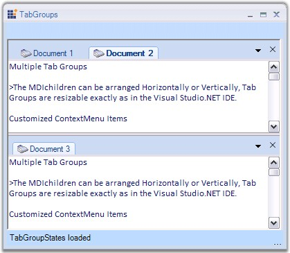

::: {style="DISPLAY: none"}
{#d2h_url_template}{#d2h_package_url style="WIDTH: 0px; DISPLAY: none; HEIGHT: 0px"}
:::

::: {.d2h_secondary_topic style="PADDING-BOTTOM: 10pt; MARGIN: 0pt; PADDING-LEFT: 0pt; PADDING-RIGHT: 0pt; PADDING-TOP: 0pt"}
#### Tab Groups {#tab-groups style="MARGIN-LEFT: 18pt; tab-stops: 18.0pt"}

[]{style="COLOR: #15428b"} 

TabbedMDIManager supports multiple TabGroups which can be resizable. It allows users to programmatically control and restrict the number and layout of the tab groups and also lets users to associate a form with a specific tab group. This way users can provide a custom tabbed layout for the end users of the TabbedMDI application. The MDI Children can arranged horizontally or vertically.

[]{style="COLOR: #15428b"} 

{border="0"}

[]{style="COLOR: #15428b"} 

Figure 1091: TabGroups with MDI Children in a Single Form

[]{style="COLOR: #15428b"} 

The below topics will guide you on how to create tab groups and set borders for the tab groups.

[]{style="COLOR: #15428b"} 

[]{style="COLOR: black"} 

 

 

 

[]{#p912} 

More:

[ ]{#related-topics}

[{border="0" align="absMiddle"}Creating Tab Groups](ms-xhelp:///?Id=584e2752-ef5f-46a9-a43a-bb641802581c){style="TEXT-DECORATION: none"}

[{border="0" align="absMiddle"}Border Settings](ms-xhelp:///?Id=d02e6ee5-b5b1-4d48-a84d-e16182e2ffd4){style="TEXT-DECORATION: none"}
:::
