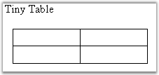

::: {style="DISPLAY: none"}
{#d2h_url_template}{#d2h_package_url style="WIDTH: 0px; DISPLAY: none; HEIGHT: 0px"}
:::

::::: {#nsbanner .d2h_main_nsbanner style="BORDER-BOTTOM: #999999 1px solid; POSITION: relative; PADDING-BOTTOM: 0px; BACKGROUND-COLOR: transparent; PADDING-LEFT: 0px; PADDING-RIGHT: 0px; DISPLAY: none; BORDER-TOP: #999999 1px solid; PADDING-TOP: 0px; LEFT: 0px"}
:::: {#TitleRow .d2h_main_titlerow style="PADDING-BOTTOM: 4px; BACKGROUND-COLOR: transparent; PADDING-LEFT: 22px; WIDTH: 100%; PADDING-RIGHT: 10px; DISPLAY: none; PADDING-TOP: 4px"}
::: {#ienav .d2h_main_ienav style="DISPLAY: none"}
{#D2HPrevious .D2HPreviousEnabled}  {#D2HNext .D2HNextEnabled}
:::
::::
:::::

::::::: {#nstext .d2h_main_nstext style="PADDING-BOTTOM: 10px; BACKGROUND-COLOR: transparent; PADDING-LEFT: 22px; PADDING-RIGHT: 10px; HEIGHT: 100%; OVERFLOW: auto; PADDING-TOP: 5px" hasuserbackground="true" valign="bottom"}
::: {#d2h_breadcrumbs .d2h_breadcrumbs}
[Essential Studio User Guide Documentation](ms-xhelp:///?Id=12457748-09e3-4d74-a240-8e049cedf030){.d2h_breadcrumbsNormal}[ \> ]{.d2h_breadcrumbsLinkSeparator}[Reporting Edition](ms-xhelp:///?Id=027aa5b6-6676-4f93-ad23-c20e8c45792e){.d2h_breadcrumbsNormal}[ \> ]{.d2h_breadcrumbsLinkSeparator}[Essential DocIO](ms-xhelp:///?Id=b88d77b3-4c51-460f-a761-d2ef6d5b0ca6){.d2h_breadcrumbsNormal}[ \> ]{.d2h_breadcrumbsLinkSeparator}[Concepts and Features](ms-xhelp:///?Id=c1881696-52ce-4414-9f3d-97433d8e9775){.d2h_breadcrumbsNormal}[ \> ]{.d2h_breadcrumbsLinkSeparator}[Section](ms-xhelp:///?Id=e7b4f267-a55a-4dff-9f7f-45ea32df6ecb){.d2h_breadcrumbsNormal}
:::

### Table {#table style="tab-stops: 0pt"}

 

**WTable** class represents a table in a Word document. Every table in the Word document consists of table rows (one or more). Every table row consists of table cells (one or more).

 

WTable class has similar architecture. It contains a collection of table rows. This collection is accessible through the **Rows** property, which returns the object of the WRowCollection type. Collection of rows consists of **WTableRow** objects. For more details about WTableRow, refer the WTableRow documentation. This class also contains the **TableFormat** property which defines formatting for the whole table. This property returns the object of the RowFormat type. For more details about RowFormat, see [[RowFormat.]{.UGHyperlink}](ms-xhelp:///?Id=16732d89-fef2-4657-8fe5-947274d8122e)

 

[·      ]{style="FONT-FAMILY: Symbol"}**ResetCells**: enables you to create tables with the specified number of rows and specified number of cells in each row.

[·      ]{style="FONT-FAMILY: Symbol"}**WTableRow AddRow(bool isCopyFormat)**: enables you to add a new row to the existing table. The **isCopyFormat** parameter defines whether to copy the row format from the previous row.

[·      ]{style="FONT-FAMILY: Symbol"}**WTableRow AddRow(bool isCopyFormat, bool autoPopulateCells)**: enables the user to add a new row to the existing table, but the second parameter,  autoPopulateCells, defines whether to create the same number of cells as in the previous row of the table and copy its formatting.

 

**Class Hierarchy**

 

TextBodyItem

                 \|   

            WTable

 

Public Constructors

 

::: {align="center"}
  ------------------------------------- ---------------------------------------------------
  Name                                  Description
  WTable.WTable (IWordDocument)         Initializes a new instance of the WTable class.  
  WTable.WTable (IWordDocument, bool)   Initializes a new instance of the WTable class.  
  ------------------------------------- ---------------------------------------------------
:::

 

Public Properties

 

::: {align="center"}
  --------------- ----------------------------------------------------------------------------
  Name            Description
  ChildEntities   Gets the child entities.  
  EntityType      Gets the type of the entity.
  FirstRow        Get first row of the table.
  LastCell        Get last cell of the table.
  LastRow         Get last row of the table.
  Rows            Get the table rows.
  TableFormat     Sets table formatting after ResetCells call.
  Width           Gets the width of the table (in points).
  StyleName       Gets the table style name.
  Title           Gets or sets the table title (Microsoft Word 2010 specific property)
  Description     Gets or sets the table description (Microsoft Word 2010 specific property)
  --------------- ----------------------------------------------------------------------------
:::

 

Public Methods

 

::: {align="center"}
  ------------ --------------------------------------------
  Name         Description
  AddRow       Adds new row to the table.
  Clone        Clones this instance.  
  Find         Finds text by specified pattern.  
  Replace      Replaces the text by specified pattern.
  ResetCells   Resets rows / columns number.
  ApplyStyle   Applies built-in table style to the table.
  ------------ --------------------------------------------
:::

 

The following example illustrates how to create an empty table with two rows. Each row has two cells (two columns).

 

+--------------------------------------------------------------------------------------------------------------------------------------------------------------------------------+
| **[\[C#\]]{style="FONT-FAMILY: 'Courier New'; COLOR: black"}**                                                                                                                 |
|                                                                                                                                                                                |
| []{style="COLOR: black"}                                                                                                                                                       |
|                                                                                                                                                                                |
| [IWordDocument]{style="FONT-FAMILY: 'Courier New'; COLOR: teal"}[ doc = [new]{style="COLOR: blue"} [WordDocument]{style="COLOR: teal"}();]{style="FONT-FAMILY: 'Courier New'"} |
|                                                                                                                                                                                |
| [IWSection]{style="FONT-FAMILY: 'Courier New'; COLOR: teal"}[ section = doc.AddSection();]{style="FONT-FAMILY: 'Courier New'"}                                                 |
|                                                                                                                                                                                |
| [IWParagraph]{style="FONT-FAMILY: 'Courier New'; COLOR: teal"}[ paragraph = section.AddParagraph();]{style="FONT-FAMILY: 'Courier New'"}                                       |
|                                                                                                                                                                                |
| []{style="FONT-FAMILY: 'Courier New'"}                                                                                                                                         |
|                                                                                                                                                                                |
| [paragraph.AppendText([\"Tiny table\"]{style="COLOR: maroon"});]{style="FONT-FAMILY: 'Courier New'"}                                                                           |
|                                                                                                                                                                                |
| [paragraph = section.AddParagraph();]{style="FONT-FAMILY: 'Courier New'"}                                                                                                      |
|                                                                                                                                                                                |
| [IWTable]{style="FONT-FAMILY: 'Courier New'; COLOR: teal"}[ table = section.AddTable();]{style="FONT-FAMILY: 'Courier New'"}                                                   |
|                                                                                                                                                                                |
| [table.ResetCells(2, 2);]{style="FONT-FAMILY: 'Courier New'"}                                                                                                                  |
|                                                                                                                                                                                |
| []{style="FONT-FAMILY: 'Courier New'"}                                                                                                                                         |
|                                                                                                                                                                                |
| [doc.Save([\"Table.doc\"]{style="COLOR: maroon"});]{style="FONT-FAMILY: 'Courier New'"}                                                                                        |
+--------------------------------------------------------------------------------------------------------------------------------------------------------------------------------+

 

+--------------------------------------------------------------------------------------------------------------------------------------------------------------------------------------------------------------------------------------------------------------------------------------------------------------------------------------------------------------------+
| **[\[VB.NET\]]{style="FONT-FAMILY: 'Courier New'; COLOR: black"}**                                                                                                                                                                                                                                                                                                 |
|                                                                                                                                                                                                                                                                                                                                                                    |
| []{style="COLOR: black"}                                                                                                                                                                                                                                                                                                                                           |
|                                                                                                                                                                                                                                                                                                                                                                    |
| [Dim]{style="FONT-FAMILY: 'Courier New'; COLOR: blue"}[ doc As ]{style="FONT-FAMILY: 'Courier New'; COLOR: black"}[IWordDocument]{style="FONT-FAMILY: 'Courier New'; COLOR: teal"}[ = ]{style="FONT-FAMILY: 'Courier New'; COLOR: black"}[New]{style="FONT-FAMILY: 'Courier New'; COLOR: blue"}[ WordDocument()]{style="FONT-FAMILY: 'Courier New'; COLOR: black"} |
|                                                                                                                                                                                                                                                                                                                                                                    |
| [Dim]{style="FONT-FAMILY: 'Courier New'; COLOR: blue"}[ section As ]{style="FONT-FAMILY: 'Courier New'; COLOR: black"}[IWSection]{style="FONT-FAMILY: 'Courier New'; COLOR: teal"}[ = doc.AddSection()]{style="FONT-FAMILY: 'Courier New'; COLOR: black"}                                                                                                          |
|                                                                                                                                                                                                                                                                                                                                                                    |
| [Dim]{style="FONT-FAMILY: 'Courier New'; COLOR: blue"}[ paragraph As ]{style="FONT-FAMILY: 'Courier New'; COLOR: black"}[IWParagraph]{style="FONT-FAMILY: 'Courier New'; COLOR: teal"}[ = section.AddParagraph()]{style="FONT-FAMILY: 'Courier New'; COLOR: black"}                                                                                                |
|                                                                                                                                                                                                                                                                                                                                                                    |
| []{style="FONT-FAMILY: 'Courier New'; COLOR: black"}                                                                                                                                                                                                                                                                                                               |
|                                                                                                                                                                                                                                                                                                                                                                    |
| [paragraph.AppendText(\"Tiny table\")]{style="FONT-FAMILY: 'Courier New'; COLOR: black"}                                                                                                                                                                                                                                                                           |
|                                                                                                                                                                                                                                                                                                                                                                    |
| [paragraph = section.AddParagraph()]{style="FONT-FAMILY: 'Courier New'; COLOR: black"}                                                                                                                                                                                                                                                                             |
|                                                                                                                                                                                                                                                                                                                                                                    |
| [Dim]{style="FONT-FAMILY: 'Courier New'; COLOR: blue"}[ table As ]{style="FONT-FAMILY: 'Courier New'; COLOR: black"}[IWTable]{style="FONT-FAMILY: 'Courier New'; COLOR: teal"}[ = section.AddTable()]{style="FONT-FAMILY: 'Courier New'; COLOR: black"}                                                                                                            |
|                                                                                                                                                                                                                                                                                                                                                                    |
| [table.ResetCells(2, 2)]{style="FONT-FAMILY: 'Courier New'; COLOR: black"}                                                                                                                                                                                                                                                                                         |
|                                                                                                                                                                                                                                                                                                                                                                    |
| []{style="FONT-FAMILY: 'Courier New'; COLOR: black"}                                                                                                                                                                                                                                                                                                               |
|                                                                                                                                                                                                                                                                                                                                                                    |
| [doc.Save(\"Table.doc\")]{style="FONT-FAMILY: 'Courier New'; COLOR: black"}                                                                                                                                                                                                                                                                                        |
+--------------------------------------------------------------------------------------------------------------------------------------------------------------------------------------------------------------------------------------------------------------------------------------------------------------------------------------------------------------------+

 

{border="0"}

Figure 37: Table with Two Rows and two Columns

 

Nested Table

 

You can create nested tables by creating a table in the cell of the parent table by using DocIO. The following code illustrates this.

 

+--------------------------------------------------------------------------------------------------------------------+
| **[\[C#\]]{style="FONT-FAMILY: 'Courier New'"}**                                                                   |
|                                                                                                                    |
| **[]{style="FONT-FAMILY: 'Courier New'"}**                                                                         |
|                                                                                                                    |
| [// Adding a nested Table to the cell (2,2)of the parent table.]{style="FONT-FAMILY: 'Courier New'; COLOR: green"} |
|                                                                                                                    |
| [IWTable nestTable = table\[2, 2\].AddTable();]{style="FONT-FAMILY: 'Courier New'"}                                |
|                                                                                                                    |
| [nestTable.ResetCells(3, 3);]{style="FONT-FAMILY: 'Courier New'"}                                                  |
+--------------------------------------------------------------------------------------------------------------------+

 

+------------------------------------------------------------------------------------------------------------------+
| **[\[VB.NET\]]{style="FONT-FAMILY: 'Courier New'"}**                                                             |
|                                                                                                                  |
| **[]{style="FONT-FAMILY: 'Courier New'"}**                                                                       |
|                                                                                                                  |
| [\' Adding a new Table to the cell (2,2) of the parent table.]{style="FONT-FAMILY: 'Courier New'; COLOR: green"} |
|                                                                                                                  |
| [Dim nestTable as IWTable = table\[2, 2\].AddTable()]{style="FONT-FAMILY: 'Courier New'"}                        |
|                                                                                                                  |
| [nestTable.ResetCells(3, 3)]{style="FONT-FAMILY: 'Courier New'"}                                                 |
+------------------------------------------------------------------------------------------------------------------+

 

Cell Image

 

You can also insert images in the table cells by appending a picture to the cell paragraph. The following code illustrates how to insert a picture in the first cell.

 

+-----------------------------------------------------------------------------------------------------------------------------------+
| **[\[C#\]]{style="FONT-FAMILY: 'Courier New'"}**                                                                                  |
|                                                                                                                                   |
| []{style="FONT-FAMILY: 'Courier New'; COLOR: green"}                                                                              |
|                                                                                                                                   |
| [IWTable]{style="FONT-FAMILY: 'Courier New'; COLOR: teal"}[ table = section.Body.AddTable();]{style="FONT-FAMILY: 'Courier New'"} |
|                                                                                                                                   |
| [table.ResetCells(1, 1);          ]{style="FONT-FAMILY: 'Courier New'"}                                                           |
|                                                                                                                                   |
| []{style="FONT-FAMILY: 'Courier New'"}                                                                                            |
|                                                                                                                                   |
| [WTableRow]{style="FONT-FAMILY: 'Courier New'; COLOR: teal"}[ row = table.Rows\[0\];]{style="FONT-FAMILY: 'Courier New'"}         |
|                                                                                                                                   |
| [paragraph = (IWParagraph)row.Cells\[0\].AddParagraph();]{style="FONT-FAMILY: 'Courier New'"}                                     |
|                                                                                                                                   |
| [paragraph.AppendPicture(new Bitmap([\"image.png\"]{style="COLOR: maroon"}));]{style="FONT-FAMILY: 'Courier New'"}                |
+-----------------------------------------------------------------------------------------------------------------------------------+

 

+----------------------------------------------------------------------------------------------------------------------------------------------------------------+
| **[\[VB.NET\]]{style="FONT-FAMILY: 'Courier New'"}**                                                                                                           |
|                                                                                                                                                                |
| **[]{style="FONT-FAMILY: 'Courier New'"}**                                                                                                                     |
|                                                                                                                                                                |
| [Dim]{style="FONT-FAMILY: 'Courier New'; COLOR: blue"}[ table [As]{style="COLOR: blue"} IWTable = section.Body.AddTable()]{style="FONT-FAMILY: 'Courier New'"} |
|                                                                                                                                                                |
| [table.ResetCells(1, 1)]{style="FONT-FAMILY: 'Courier New'"}                                                                                                   |
|                                                                                                                                                                |
| []{style="FONT-FAMILY: 'Courier New'"}                                                                                                                         |
|                                                                                                                                                                |
| [Dim]{style="FONT-FAMILY: 'Courier New'; COLOR: blue"}[ row [As]{style="COLOR: blue"} WTableRow = table.Rows(0)]{style="FONT-FAMILY: 'Courier New'"}           |
|                                                                                                                                                                |
| [paragraph = DirectCast(row.Cells(0).AddParagraph(), IWParagraph)]{style="FONT-FAMILY: 'Courier New'"}                                                         |
|                                                                                                                                                                |
| [paragraph.AppendPicture(New Bitmap([\"image.png\"]{style="COLOR: maroon"}))]{style="FONT-FAMILY: 'Courier New'"}                                              |
+----------------------------------------------------------------------------------------------------------------------------------------------------------------+

More:

[ ]{#related-topics}

[{border="0" align="absMiddle"}Table Row](ms-xhelp:///?Id=b5907496-1e57-437c-9f44-f53e51784a25){style="TEXT-DECORATION: none"}

[{border="0" align="absMiddle"}Table Cell](ms-xhelp:///?Id=e6c44dca-8152-4619-8fd9-5f4353b1c276){style="TEXT-DECORATION: none"}

[{border="0" align="absMiddle"}Row Format](ms-xhelp:///?Id=16732d89-fef2-4657-8fe5-947274d8122e){style="TEXT-DECORATION: none"}

[{border="0" align="absMiddle"}Table Styles](ms-xhelp:///?Id=ffd6de5f-6568-4f44-b00c-3e42ad2d1ac3){style="TEXT-DECORATION: none"}
:::::::
