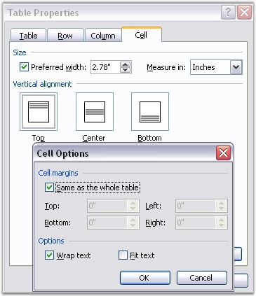

::: {style="DISPLAY: none"}
{#d2h_url_template}{#d2h_package_url style="WIDTH: 0px; DISPLAY: none; HEIGHT: 0px"}
:::

::::::: {.d2h_secondary_topic style="PADDING-BOTTOM: 10pt; MARGIN: 0pt; PADDING-LEFT: 0pt; PADDING-RIGHT: 0pt; PADDING-TOP: 0pt"}
#### Table Cell {#table-cell style="tab-stops: 0pt"}

 

**WTableCell** class represents a table cell in the Word document. **WTextBody** is the base class of WTableCell, which means that WTableCell object can hold paragraphs. You can format the table cell by using the **CellFormat** property. This property returns the value of the CellFormat type.

 

The following screen shot illustrates how to set the Cell Format in MS Word.

 

{border="0"}

Figure 39: Cell Format Options in Table Properties Dialog Box

 

**Cell Format Public Properties**

 

::: {align="center"}
  ------------------- ---------------------------------------------------------
  Name                Description
  BackColor           Gets or sets background color.   
  Borders             Gets borders.  
  FitText             Gets or sets fit text option.  
  HorizontalMerge     Gets or sets the way of horizontal merging of the cell.
  Paddings            Gets paddings.  
  TextDirection       Gets or sets cell text direction.  
  TextWrap            Gets or sets a value indicating whether \[text wrap\]. 
  VerticalAlignment   Gets or sets vertical alignment.
  VerticalMerge       Gets or sets the way of vertical merging of the cell.
  ------------------- ---------------------------------------------------------
:::

 

Public Constructor

 

::: {align="center"}
  --------------------------------------- -------------------------------------------------------
  Name                                    Description
  WTableCell.WTableCell (IWordDocument)   Initializes a new instance of the WTableCell class.  
  --------------------------------------- -------------------------------------------------------
:::

 

Public Properties

 

::: {align="center"}
  ----------------- --------------------------------------------
  Name              Description
  CellFormat        Gets cell format.  
  EntityType        Gets the type of the entity. 
  OwnerRow          Gets owner row of the cell.  
  Width             Gets or sets the cell width (in points).  
  ----------------- --------------------------------------------
:::

 

**Public Methods**

 

::: {align="center"}
  -------------- ------------------------------------
  Name           Description
  Clone          Clones this instance.  
  GetCellIndex   Get cell index in the table row.  
  -------------- ------------------------------------
:::

 

The following example illustrates how to create a table with non-default formatting.

 

+----------------------------------------------------------------------------------------------------------------------------+
| **[\[C#\]]{style="FONT-FAMILY: 'Courier New'; COLOR: black"}**                                                             |
|                                                                                                                            |
| []{style="COLOR: black"}                                                                                                   |
|                                                                                                                            |
| [paragraph = section.AddParagraph();]{style="FONT-FAMILY: 'Courier New'"}                                                  |
|                                                                                                                            |
| [paragraph.AppendText([\"Table with different formatting\"]{style="COLOR: maroon"});]{style="FONT-FAMILY: 'Courier New'"}  |
|                                                                                                                            |
| [paragraph = section.AddParagraph();]{style="FONT-FAMILY: 'Courier New'"}                                                  |
|                                                                                                                            |
| []{style="FONT-FAMILY: 'Courier New'"}                                                                                     |
|                                                                                                                            |
| [//Add a table]{style="FONT-FAMILY: 'Courier New'; COLOR: green"}                                                          |
|                                                                                                                            |
| [table = section.AddTable();]{style="FONT-FAMILY: 'Courier New'"}                                                          |
|                                                                                                                            |
| []{style="FONT-FAMILY: 'Courier New'"}                                                                                     |
|                                                                                                                            |
| [//Set number of rows and columns]{style="FONT-FAMILY: 'Courier New'; COLOR: green"}                                       |
|                                                                                                                            |
| [table.ResetCells(3, 3);]{style="FONT-FAMILY: 'Courier New'"}                                                              |
|                                                                                                                            |
| [table.TableFormat.Borders.LineWidth = 2f;]{style="FONT-FAMILY: 'Courier New'"}                                            |
|                                                                                                                            |
| [table.TableFormat.Borders.Color = [Color]{style="COLOR: teal"}.Green;]{style="FONT-FAMILY: 'Courier New'"}                |
|                                                                                                                            |
| []{style="FONT-FAMILY: 'Courier New'"}                                                                                     |
|                                                                                                                            |
| [//Select the first row and append text in each cell]{style="FONT-FAMILY: 'Courier New'; COLOR: green"}                    |
|                                                                                                                            |
| [WTableRow]{style="FONT-FAMILY: 'Courier New'; COLOR: teal"}[ row0 = table.Rows\[0\];]{style="FONT-FAMILY: 'Courier New'"} |
|                                                                                                                            |
| [row0.Cells\[0\].AddParagraph().AppendText([\"1\"]{style="COLOR: maroon"});]{style="FONT-FAMILY: 'Courier New'"}           |
|                                                                                                                            |
| [row0.Cells\[0\].CellFormat.Borders.LineWidth = 2f;]{style="FONT-FAMILY: 'Courier New'"}                                   |
|                                                                                                                            |
| [row0.Cells\[0\].CellFormat.Borders.Color = [Color]{style="COLOR: teal"}.Magenta;]{style="FONT-FAMILY: 'Courier New'"}     |
|                                                                                                                            |
| []{style="FONT-FAMILY: 'Courier New'"}                                                                                     |
|                                                                                                                            |
| [WTableRow]{style="FONT-FAMILY: 'Courier New'; COLOR: teal"}[ row = table.Rows\[0\];]{style="FONT-FAMILY: 'Courier New'"}  |
|                                                                                                                            |
| [row0.Cells\[1\].AddParagraph().AppendText([\"2\"]{style="COLOR: maroon"});]{style="FONT-FAMILY: 'Courier New'"}           |
|                                                                                                                            |
| [row0.Cells\[2\].AddParagraph().AppendText([\"3\"]{style="COLOR: maroon"});]{style="FONT-FAMILY: 'Courier New'"}           |
|                                                                                                                            |
| []{style="FONT-FAMILY: 'Courier New'"}                                                                                     |
|                                                                                                                            |
| [WTableRow]{style="FONT-FAMILY: 'Courier New'; COLOR: teal"}[ row1 = table.Rows\[1\];]{style="FONT-FAMILY: 'Courier New'"} |
|                                                                                                                            |
| [row = table.Rows\[1\];]{style="FONT-FAMILY: 'Courier New'"}                                                               |
|                                                                                                                            |
| [row1.Cells\[0\].AddParagraph().AppendText([\"4\"]{style="COLOR: maroon"});]{style="FONT-FAMILY: 'Courier New'"}           |
|                                                                                                                            |
| [row1.Cells\[1\].AddParagraph().AppendText([\"5\"]{style="COLOR: maroon"});]{style="FONT-FAMILY: 'Courier New'"}           |
|                                                                                                                            |
| [row1.Cells\[1\].CellFormat.Borders.LineWidth = 2f;]{style="FONT-FAMILY: 'Courier New'"}                                   |
|                                                                                                                            |
| [row1.Cells\[1\].CellFormat.Borders.Color = [Color]{style="COLOR: teal"}.Brown;]{style="FONT-FAMILY: 'Courier New'"}       |
|                                                                                                                            |
| []{style="FONT-FAMILY: 'Courier New'"}                                                                                     |
|                                                                                                                            |
| [row1.Cells\[2\].AddParagraph().AppendText([\"6\"]{style="COLOR: maroon"});]{style="FONT-FAMILY: 'Courier New'"}           |
|                                                                                                                            |
| [WTableRow]{style="FONT-FAMILY: 'Courier New'; COLOR: teal"}[ row2 = table.Rows\[2\];]{style="FONT-FAMILY: 'Courier New'"} |
|                                                                                                                            |
| [row2.Cells\[0\].AddParagraph().AppendText([\"7\"]{style="COLOR: maroon"});]{style="FONT-FAMILY: 'Courier New'"}           |
|                                                                                                                            |
| [row2.Cells\[1\].AddParagraph().AppendText([\"8\"]{style="COLOR: maroon"});]{style="FONT-FAMILY: 'Courier New'"}           |
|                                                                                                                            |
| [row2.Cells\[2\].AddParagraph().AppendText([\"9\"]{style="COLOR: maroon"});]{style="FONT-FAMILY: 'Courier New'"}           |
|                                                                                                                            |
| [row2.Cells\[2\].CellFormat.Borders.LineWidth = 2f;]{style="FONT-FAMILY: 'Courier New'"}                                   |
|                                                                                                                            |
| [row2.Cells\[2\].CellFormat.Borders.Color = [Color]{style="COLOR: teal"}.Cyan;]{style="FONT-FAMILY: 'Courier New'"}        |
|                                                                                                                            |
| [row2.Cells\[2\].CellFormat.Borders.Shadow = [true]{style="COLOR: blue"};]{style="FONT-FAMILY: 'Courier New'"}             |
+----------------------------------------------------------------------------------------------------------------------------+

 

+-------------------------------------------------------------------------------------------------------------------------------------------------------+
| **[\[VB.NET\]]{style="FONT-FAMILY: 'Courier New'; COLOR: black"}**                                                                                    |
|                                                                                                                                                       |
|                                                                                                                                                       |
|                                                                                                                                                       |
| [paragraph = section.AddParagraph()]{style="FONT-FAMILY: 'Courier New'"}                                                                              |
|                                                                                                                                                       |
| [paragraph.AppendText([\"Table with different formatting\"]{style="COLOR: maroon"})]{style="FONT-FAMILY: 'Courier New'"}                              |
|                                                                                                                                                       |
| [paragraph = section.AddParagraph()]{style="FONT-FAMILY: 'Courier New'"}                                                                              |
|                                                                                                                                                       |
| []{style="FONT-FAMILY: 'Courier New'"}                                                                                                                |
|                                                                                                                                                       |
| [\'Add a table]{style="FONT-FAMILY: 'Courier New'; COLOR: green"}                                                                                     |
|                                                                                                                                                       |
| [table = section.AddTable()]{style="FONT-FAMILY: 'Courier New'"}                                                                                      |
|                                                                                                                                                       |
| []{style="FONT-FAMILY: 'Courier New'"}                                                                                                                |
|                                                                                                                                                       |
| [\'Set number of rows and columns]{style="FONT-FAMILY: 'Courier New'; COLOR: green"}                                                                  |
|                                                                                                                                                       |
| [table.ResetCells(3, 3)]{style="FONT-FAMILY: 'Courier New'"}                                                                                          |
|                                                                                                                                                       |
| [table.TableFormat.Borders.LineWidth = 2f]{style="FONT-FAMILY: 'Courier New'"}                                                                        |
|                                                                                                                                                       |
| [table.TableFormat.Borders.Color = Color.Green]{style="FONT-FAMILY: 'Courier New'"}                                                                   |
|                                                                                                                                                       |
| []{style="FONT-FAMILY: 'Courier New'"}                                                                                                                |
|                                                                                                                                                       |
| [\'Select the first row and append text in each cell]{style="FONT-FAMILY: 'Courier New'; COLOR: green"}                                               |
|                                                                                                                                                       |
| [Dim]{style="FONT-FAMILY: 'Courier New'; COLOR: blue"}[ row0 [As]{style="COLOR: blue"} WTableRow = table.Rows(0)]{style="FONT-FAMILY: 'Courier New'"} |
|                                                                                                                                                       |
| [row0.Cells(0).AddParagraph().AppendText([\"1\"]{style="COLOR: maroon"})]{style="FONT-FAMILY: 'Courier New'"}                                         |
|                                                                                                                                                       |
| [row0.Cells(0).CellFormat.Borders.LineWidth = 2f]{style="FONT-FAMILY: 'Courier New'"}                                                                 |
|                                                                                                                                                       |
| [row0.Cells(0).CellFormat.Borders.Color = Color.Magenta]{style="FONT-FAMILY: 'Courier New'"}                                                          |
|                                                                                                                                                       |
| []{style="FONT-FAMILY: 'Courier New'"}                                                                                                                |
|                                                                                                                                                       |
| [Dim]{style="FONT-FAMILY: 'Courier New'; COLOR: blue"}[ row [As]{style="COLOR: blue"} WTableRow = table.Rows(0)]{style="FONT-FAMILY: 'Courier New'"}  |
|                                                                                                                                                       |
| [row0.Cells(1).AddParagraph().AppendText([\"2\"]{style="COLOR: maroon"})]{style="FONT-FAMILY: 'Courier New'"}                                         |
|                                                                                                                                                       |
| [row0.Cells(2).AddParagraph().AppendText([\"3\"]{style="COLOR: maroon"})]{style="FONT-FAMILY: 'Courier New'"}                                         |
|                                                                                                                                                       |
| []{style="FONT-FAMILY: 'Courier New'"}                                                                                                                |
|                                                                                                                                                       |
| [Dim]{style="FONT-FAMILY: 'Courier New'; COLOR: blue"}[ row1 [As]{style="COLOR: blue"} WTableRow = table.Rows(1)]{style="FONT-FAMILY: 'Courier New'"} |
|                                                                                                                                                       |
| [row = table.Rows(1)]{style="FONT-FAMILY: 'Courier New'"}                                                                                             |
|                                                                                                                                                       |
| [row1.Cells(0).AddParagraph().AppendText([\"4\"]{style="COLOR: maroon"})]{style="FONT-FAMILY: 'Courier New'"}                                         |
|                                                                                                                                                       |
| [row1.Cells(1).AddParagraph().AppendText([\"5\"]{style="COLOR: maroon"})]{style="FONT-FAMILY: 'Courier New'"}                                         |
|                                                                                                                                                       |
| [row1.Cells(1).CellFormat.Borders.LineWidth = 2f]{style="FONT-FAMILY: 'Courier New'"}                                                                 |
|                                                                                                                                                       |
| [row1.Cells(1).CellFormat.Borders.Color = Color.Brown]{style="FONT-FAMILY: 'Courier New'"}                                                            |
|                                                                                                                                                       |
| []{style="FONT-FAMILY: 'Courier New'"}                                                                                                                |
|                                                                                                                                                       |
| [row1.Cells(2).AddParagraph().AppendText([\"6\"]{style="COLOR: maroon"})]{style="FONT-FAMILY: 'Courier New'"}                                         |
|                                                                                                                                                       |
| [Dim]{style="FONT-FAMILY: 'Courier New'; COLOR: blue"}[ row2 [As]{style="COLOR: blue"} WTableRow = table.Rows(2)]{style="FONT-FAMILY: 'Courier New'"} |
|                                                                                                                                                       |
| [row2.Cells(0).AddParagraph().AppendText([\"7\"]{style="COLOR: maroon"})]{style="FONT-FAMILY: 'Courier New'"}                                         |
|                                                                                                                                                       |
| [row2.Cells(1).AddParagraph().AppendText([\"8\"]{style="COLOR: maroon"})]{style="FONT-FAMILY: 'Courier New'"}                                         |
|                                                                                                                                                       |
| [row2.Cells(2).AddParagraph().AppendText([\"9\"]{style="COLOR: maroon"})]{style="FONT-FAMILY: 'Courier New'"}                                         |
|                                                                                                                                                       |
| [row2.Cells(2).CellFormat.Borders.LineWidth = 2f]{style="FONT-FAMILY: 'Courier New'"}                                                                 |
|                                                                                                                                                       |
| [row2.Cells(2).CellFormat.Borders.Color = Color.Cyan]{style="FONT-FAMILY: 'Courier New'"}                                                             |
|                                                                                                                                                       |
| [row2.Cells(2).CellFormat.Borders.Shadow = [True]{style="COLOR: blue"}]{style="FONT-FAMILY: 'Courier New'"}                                           |
+-------------------------------------------------------------------------------------------------------------------------------------------------------+

 

**Cell Content Formatting**

 

The **AddParagraph** method of the WTableCell class is used to add paragraphs to the table cell. The **TextRange** property of this method is used to format the contents of the cell. For details, see [[Text Range.]{.UGHyperlink}](ms-xhelp:///?Id=4762306d-608b-41d4-a64b-cb86121b60d8)

*[]{style="COLOR: red"}* 

+-------------------------------------------------------------------------------------------------------------------------------------------------------------------------------------------------------------------------------------------------------------+
| **[\[C#\]]{style="FONT-FAMILY: 'Courier New'; COLOR: black"}**                                                                                                                                                                                              |
|                                                                                                                                                                                                                                                             |
| []{style="COLOR: black"}                                                                                                                                                                                                                                    |
|                                                                                                                                                                                                                                                             |
| [// Adding a new Table to the text body.]{style="FONT-FAMILY: 'Courier New'; COLOR: green"}                                                                                                                                                                 |
|                                                                                                                                                                                                                                                             |
| [IWTable table = sec.body.AddTable();]{style="FONT-FAMILY: 'Courier New'"}                                                                                                                                                                                  |
|                                                                                                                                                                                                                                                             |
| []{style="FONT-FAMILY: 'Courier New'"}                                                                                                                                                                                                                      |
|                                                                                                                                                                                                                                                             |
| [// Inserting rows to the table. This will apply the format to whole table.]{style="FONT-FAMILY: 'Courier New'; COLOR: green"}                                                                                                                              |
|                                                                                                                                                                                                                                                             |
| [table.ResetCells(6, 6, format, 80);]{style="FONT-FAMILY: 'Courier New'"}                                                                                                                                                                                   |
|                                                                                                                                                                                                                                                             |
| [WTableCell]{style="FONT-FAMILY: 'Courier New'; COLOR: teal"}[ cell = table.Rows\[0\].Cells\[0\] [as]{style="COLOR: blue"} [WTableCell]{style="COLOR: teal"};]{style="FONT-FAMILY: 'Courier New'"}                                                          |
|                                                                                                                                                                                                                                                             |
| [WTextRange]{style="FONT-FAMILY: 'Courier New'; COLOR: teal"}[ range = cell.AddParagraph().AppendText([\"aaaaaaaaaaaaaaaaaaaa\"]{style="COLOR: maroon"}) [as]{style="COLOR: blue"} [WTextRange]{style="COLOR: teal"} ;]{style="FONT-FAMILY: 'Courier New'"} |
|                                                                                                                                                                                                                                                             |
| []{style="FONT-FAMILY: 'Courier New'; COLOR: green"}                                                                                                                                                                                                        |
|                                                                                                                                                                                                                                                             |
| [//Format first cell first paragraph.]{style="FONT-FAMILY: 'Courier New'; COLOR: green"}                                                                                                                                                                    |
|                                                                                                                                                                                                                                                             |
| [range.CharacterFormat.FontName = [\"Arial\"]{style="COLOR: maroon"};]{style="FONT-FAMILY: 'Courier New'"}                                                                                                                                                  |
|                                                                                                                                                                                                                                                             |
| [range.CharacterFormat.FontSize = 10;]{style="FONT-FAMILY: 'Courier New'"}                                                                                                                                                                                  |
|                                                                                                                                                                                                                                                             |
| []{style="FONT-FAMILY: 'Courier New'"}                                                                                                                                                                                                                      |
|                                                                                                                                                                                                                                                             |
| [// Format first cell second paragraph.]{style="FONT-FAMILY: 'Courier New'; COLOR: green"}                                                                                                                                                                  |
|                                                                                                                                                                                                                                                             |
| [range = cell.AddParagraph().AppendText([\"bbbbbbbbbbbbbbbbbbb\"]{style="COLOR: maroon"}) [as]{style="COLOR: blue"} [WTextRange]{style="COLOR: teal"};]{style="FONT-FAMILY: 'Courier New'"}                                                                 |
|                                                                                                                                                                                                                                                             |
| [range.CharacterFormat.Italic = [true]{style="COLOR: blue"};                    ]{style="FONT-FAMILY: 'Courier New'"}                                                                                                                                       |
|                                                                                                                                                                                                                                                             |
| [range.CharacterFormat.FontSize = 12;]{style="FONT-FAMILY: 'Courier New'"}                                                                                                                                                                                  |
+-------------------------------------------------------------------------------------------------------------------------------------------------------------------------------------------------------------------------------------------------------------+

 

+-------------------------------------------------------------------------------------------------------------------------------------------------------------------------------------------------------------------------------------------------------------------------+
| **[\[C#\]]{style="FONT-FAMILY: 'Courier New'; COLOR: black"}**                                                                                                                                                                                                          |
|                                                                                                                                                                                                                                                                         |
| []{style="COLOR: black"}                                                                                                                                                                                                                                                |
|                                                                                                                                                                                                                                                                         |
| [\' Adding a new Table to the text body.]{style="FONT-FAMILY: 'Courier New'; COLOR: green"}                                                                                                                                                                             |
|                                                                                                                                                                                                                                                                         |
| [Dim]{style="FONT-FAMILY: 'Courier New'; COLOR: blue"}[ table [As]{style="COLOR: blue"} IWTable = sec.body.AddTable()]{style="FONT-FAMILY: 'Courier New'"}                                                                                                              |
|                                                                                                                                                                                                                                                                         |
| []{style="FONT-FAMILY: 'Courier New'"}                                                                                                                                                                                                                                  |
|                                                                                                                                                                                                                                                                         |
| [\' Inserting rows to the table. This will apply the format to whole table.]{style="FONT-FAMILY: 'Courier New'; COLOR: green"}                                                                                                                                          |
|                                                                                                                                                                                                                                                                         |
| [table.ResetCells(6, 6, Format, 80)]{style="FONT-FAMILY: 'Courier New'"}                                                                                                                                                                                                |
|                                                                                                                                                                                                                                                                         |
| [Dim]{style="FONT-FAMILY: 'Courier New'; COLOR: blue"}[ cell [As]{style="COLOR: blue"} WTableCell = [TryCast]{style="COLOR: blue"}(table.Rows(0).Cells(0), WTableCell)]{style="FONT-FAMILY: 'Courier New'"}                                                             |
|                                                                                                                                                                                                                                                                         |
| [Dim]{style="FONT-FAMILY: 'Courier New'; COLOR: blue"}[ range [As]{style="COLOR: blue"} WTextRange = [TryCast]{style="COLOR: blue"}(cell.AddParagraph().AppendText([\"aaaaaaaaaaaaaaaaaaaa\"]{style="COLOR: maroon"}), WTextRange)]{style="FONT-FAMILY: 'Courier New'"} |
|                                                                                                                                                                                                                                                                         |
| []{style="FONT-FAMILY: 'Courier New'"}                                                                                                                                                                                                                                  |
|                                                                                                                                                                                                                                                                         |
| [\'Format first cell first paragraph.]{style="FONT-FAMILY: 'Courier New'; COLOR: green"}                                                                                                                                                                                |
|                                                                                                                                                                                                                                                                         |
| [range.CharacterFormat.FontName = [\"Arial\"]{style="COLOR: maroon"}]{style="FONT-FAMILY: 'Courier New'"}                                                                                                                                                               |
|                                                                                                                                                                                                                                                                         |
| [range.CharacterFormat.FontSize = 10]{style="FONT-FAMILY: 'Courier New'"}                                                                                                                                                                                               |
|                                                                                                                                                                                                                                                                         |
| []{style="FONT-FAMILY: 'Courier New'"}                                                                                                                                                                                                                                  |
|                                                                                                                                                                                                                                                                         |
| [\' Format first cell second paragraph.]{style="FONT-FAMILY: 'Courier New'; COLOR: green"}                                                                                                                                                                              |
|                                                                                                                                                                                                                                                                         |
| [range = [TryCast]{style="COLOR: blue"}(cell.AddParagraph().AppendText([\"bbbbbbbbbbbbbbbbbbb\"]{style="COLOR: maroon"}), WTextRange)]{style="FONT-FAMILY: 'Courier New'"}                                                                                              |
|                                                                                                                                                                                                                                                                         |
| [range.CharacterFormat.Italic = [True]{style="COLOR: blue"}]{style="FONT-FAMILY: 'Courier New'"}                                                                                                                                                                        |
|                                                                                                                                                                                                                                                                         |
| [range.CharacterFormat.FontSize = 12]{style="FONT-FAMILY: 'Courier New'"}                                                                                                                                                                                               |
+-------------------------------------------------------------------------------------------------------------------------------------------------------------------------------------------------------------------------------------------------------------------------+

[]{#related-topics}
:::::::
