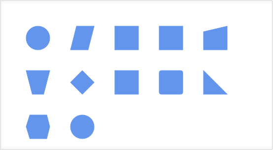

::: {style="DISPLAY: none"}
{#d2h_url_template}{#d2h_package_url style="WIDTH: 0px; DISPLAY: none; HEIGHT: 0px"}
:::

::::: {#nsbanner .d2h_main_nsbanner style="BORDER-BOTTOM: #999999 1px solid; POSITION: relative; PADDING-BOTTOM: 0px; BACKGROUND-COLOR: transparent; PADDING-LEFT: 0px; PADDING-RIGHT: 0px; DISPLAY: none; BORDER-TOP: #999999 1px solid; PADDING-TOP: 0px; LEFT: 0px"}
:::: {#TitleRow .d2h_main_titlerow style="PADDING-BOTTOM: 4px; BACKGROUND-COLOR: transparent; PADDING-LEFT: 22px; WIDTH: 100%; PADDING-RIGHT: 10px; DISPLAY: none; PADDING-TOP: 4px"}
::: {#ienav .d2h_main_ienav style="DISPLAY: none"}
{#D2HPrevious .D2HPreviousEnabled}  {#D2HNext .D2HNextEnabled}
:::
::::
:::::

:::::: {#nstext .d2h_main_nstext style="PADDING-BOTTOM: 10px; BACKGROUND-COLOR: transparent; PADDING-LEFT: 22px; PADDING-RIGHT: 10px; HEIGHT: 100%; OVERFLOW: auto; PADDING-TOP: 5px" hasuserbackground="true" valign="bottom"}
::: {#d2h_breadcrumbs .d2h_breadcrumbs}
[Essential Studio User Guide Documentation](ms-xhelp:///?Id=12457748-09e3-4d74-a240-8e049cedf030){.d2h_breadcrumbsNormal}[ \> ]{.d2h_breadcrumbsLinkSeparator}[User Interface Edition](ms-xhelp:///?Id=c29296b7-531c-413b-a0ec-488ca1f7f669){.d2h_breadcrumbsNormal}[ \> ]{.d2h_breadcrumbsLinkSeparator}[Essential ASP.NET MVC](ms-xhelp:///?Id=4b14e7d1-65c4-4f67-b1aa-2c37709905a5){.d2h_breadcrumbsNormal}[ \> ]{.d2h_breadcrumbsLinkSeparator}[Essential Diagram]{.d2h_breadcrumbsContentsOnly}[ \> ]{.d2h_breadcrumbsLinkSeparator}[Concepts and Features](ms-xhelp:///?Id=04839cdf-94fc-4d24-9f6b-119fdbd7bbfb){.d2h_breadcrumbsNormal}[ \> ]{.d2h_breadcrumbsLinkSeparator}[Automatic Layout](ms-xhelp:///?Id=26208920-fb25-4f4d-926a-bd747f7329d7){.d2h_breadcrumbsNormal}
:::

### Table Layout {#table-layout style="MARGIN-BOTTOM: 12pt; tab-stops: 0pt"}

Table layout arranges the nodes in a tabular structure based on specified intervals between them. The number of nodes in each row and column can be specified and the layout will take place accordingly. The nodes are assigned rows and columns based on the order in which they are added to the model and based on the maximum nodes allowed in that row and column.

 

  Property                                                                                  Description                                                                                                                                                                                                                                                              Type                                  Data Type                                       Reference Links
  ----------------------------------------------------------------------------------------- ------------------------------------------------------------------------------------------------------------------------------------------------------------------------------------------------------------------------------------------------------------------------ ------------------------------------- ----------------------------------------------- ------------------------------------------------------------------------------------------------------------------------------------------------------------------------------------------------------------------------------------------------------------------------------------------
  [VerticalSpacing]{style="COLOR: black"}[]{style="FONT-FAMILY: 'Segoe UI','sans-serif'"}   [Gets or sets the vertical spacing between nodes.]{style="COLOR: black"}[]{style="FONT-FAMILY: 'Segoe UI','sans-serif'"}                                                                                                                                                 [Server side]{style="COLOR: black"}   [Double]{style="COLOR: black"}                  [[http://help.syncfusion.com/ug_92/User%20Interface/ASP.NET%20MVC/Diagram/default.htm?turl=Documents%2F4313layoutspacing.htm]{.UGHyperlink}](http://help.syncfusion.com/ug_92/User%20Interface/ASP.NET%20MVC/Diagram/default.htm?turl=Documents%2F4313layoutspacing.htm)[]{.UGHyperlink}
  [HorizontalSpacing]{style="COLOR: black"}                                                 [Gets or sets the horizontal spacing between nodes.]{style="COLOR: black"}                                                                                                                                                                                               [Server side]{style="COLOR: black"}   [Double]{style="COLOR: black"}                  [[http://help.syncfusion.com/ug_92/User%20Interface/ASP.NET%20MVC/Diagram/default.htm?turl=Documents%2F4313layoutspacing.htm]{.UGHyperlink}](http://help.syncfusion.com/ug_92/User%20Interface/ASP.NET%20MVC/Diagram/default.htm?turl=Documents%2F4313layoutspacing.htm)[]{.UGHyperlink}
  [TableExpandMode]{style="COLOR: black"}                                                   [Gets or sets the table expand mode.]{style="COLOR: black"}                                                                                                                                                                                                              [Server side]{style="COLOR: black"}   [ExpandMode]{style="COLOR: black"}              [Table Expand Mode]{style="FONT-FAMILY: 'Arial','sans-serif'"}[]{style="COLOR: black"}
  [RowCount]{style="COLOR: black"}                                                          [Gets or sets the row count for the table layout.]{style="COLOR: black"}                                                                                                                                                                                                 [Server side]{style="COLOR: black"}   [Int]{style="COLOR: black"}                     [Row Count and Column Count]{style="FONT-FAMILY: 'Arial','sans-serif'"}[]{style="COLOR: black"}
  [ColumnCount]{style="COLOR: black"}                                                       [Gets or sets the column count for the table layout.]{style="COLOR: black"}                                                                                                                                                                                              [Server side]{style="COLOR: black"}   [int]{style="COLOR: black"}                     [Row Count and Column Count]{style="FONT-FAMILY: 'Arial','sans-serif'"}[]{style="COLOR: black"}
  [EnableLayoutWithVariedSizes]{style="COLOR: black"}                                       [Gets or sets a value indicating whether to enable the varied size algorithm. In case the model consists of nodes of different sizes, this property can be set to true. This will align the differently sized nodes with respect to the center.]{style="COLOR: black"}   [Server side]{style="COLOR: black"}   [Binary, true or false]{style="COLOR: black"}   [Enabling Table Layout with Varies Node Sizes]{style="FONT-FAMILY: 'Arial','sans-serif'"}[]{style="COLOR: black"}

 

The layout manager lets you orient the table in two directions, horizontal and vertical. The **TableExpandMode** property of the **Diagram** model is used to specify the orientation.

**Horizontal**: When set to horizontal, the row count is automatically calculated based on the number of nodes. The column count must be specified and the nodes will be arranged in the specified number of columns.

**Vertical**: When set to vertical, the column count is automatically calculated based on the number of nodes. The row count must be specified and the nodes will be arranged in the specified number of rows.

 

The following code shows how the automatic layout can be generated. 

1.   In the **controller**, create an object for the **DiagramPropertiesModel** class and set the **LayoutType** to **TableLayout**.

2.   Set the **TableExpandMode** property to **Horizontal** or **Vertical**.

3.   Set the row count and column count.

4.   Pass this model class to the **view data**.

::: {align="center"}
+-----------------------------------------------------------------------------------------------------------------------------------------------------------------------------------------------------------------------------------------------------------------------------------------------------------+
| **[Controller]{style="FONT-FAMILY: 'Courier New'; FONT-SIZE: 11pt"}[]{style="FONT-FAMILY: 'Courier New'; FONT-SIZE: 11pt"}**                                                                                                                                                                              |
|                                                                                                                                                                                                                                                                                                           |
| [DiagramPropertiesModel]{style="FONT-FAMILY: 'Courier New'; COLOR: #2b91af; FONT-SIZE: 11pt"}[ model = [new]{style="COLOR: blue"} [DiagramPropertiesModel]{style="COLOR: #2b91af"}()]{style="FONT-FAMILY: 'Courier New'; FONT-SIZE: 11pt"}                                                                |
|                                                                                                                                                                                                                                                                                                           |
| [{]{style="FONT-FAMILY: 'Courier New'; FONT-SIZE: 11pt"}                                                                                                                                                                                                                                                  |
|                                                                                                                                                                                                                                                                                                           |
| [    LayoutType = [LayoutType]{style="COLOR: #2b91af"}.TableLayout,]{style="FONT-FAMILY: 'Courier New'; FONT-SIZE: 11pt"}                                                                                                                                                                                 |
|                                                                                                                                                                                                                                                                                                           |
| [    TableExpandMode = [ExpandMode]{style="COLOR: #2b91af"}.Horizontal,]{style="FONT-FAMILY: 'Courier New'; FONT-SIZE: 11pt"}                                                                                                                                                                             |
|                                                                                                                                                                                                                                                                                                           |
| [    HorizontalSpacing = 60,]{style="FONT-FAMILY: 'Courier New'; FONT-SIZE: 11pt"}                                                                                                                                                                                                                        |
|                                                                                                                                                                                                                                                                                                           |
| [    VerticalSpacing = 60,]{style="FONT-FAMILY: 'Courier New'; FONT-SIZE: 11pt"}                                                                                                                                                                                                                          |
|                                                                                                                                                                                                                                                                                                           |
| [    RowCount = 5,]{style="FONT-FAMILY: 'Courier New'; FONT-SIZE: 11pt"}                                                                                                                                                                                                                                  |
|                                                                                                                                                                                                                                                                                                           |
| [    ColumnCount = 4,]{style="FONT-FAMILY: 'Courier New'; FONT-SIZE: 11pt"}                                                                                                                                                                                                                               |
|                                                                                                                                                                                                                                                                                                           |
| [    RootOffsetX = 100,]{style="FONT-FAMILY: 'Courier New'; FONT-SIZE: 11pt"}                                                                                                                                                                                                                             |
|                                                                                                                                                                                                                                                                                                           |
| [    RootOffsetY = 50,]{style="FONT-FAMILY: 'Courier New'; FONT-SIZE: 11pt"}                                                                                                                                                                                                                              |
|                                                                                                                                                                                                                                                                                                           |
| [    DiagramMode = ]{style="FONT-FAMILY: 'Courier New'; COLOR: black; FONT-SIZE: 11pt"}[DiagramMode]{style="FONT-FAMILY: 'Courier New'; COLOR: #2b91af; FONT-SIZE: 11pt"}[.SVG]{style="FONT-FAMILY: 'Courier New'; COLOR: black; FONT-SIZE: 11pt"}[]{style="FONT-FAMILY: 'Courier New'; FONT-SIZE: 11pt"} |
|                                                                                                                                                                                                                                                                                                           |
| [};]{style="FONT-FAMILY: 'Courier New'; FONT-SIZE: 11pt"}                                                                                                                                                                                                                                                 |
|                                                                                                                                                                                                                                                                                                           |
| [ViewData\[[\"TableLayout\"]{style="COLOR: #a31515"}\] = model;]{style="FONT-FAMILY: 'Courier New'; FONT-SIZE: 11pt"}[]{style="FONT-FAMILY: 'Courier New'; FONT-SIZE: 11pt"}                                                                                                                              |
+-----------------------------------------------------------------------------------------------------------------------------------------------------------------------------------------------------------------------------------------------------------------------------------------------------------+
:::

**Note:** If you want to create the diagram in the Canvas mode, change the **DiagramMode** to **Canvas**. By default the diagram is rendered in the SVG mode.**[]{style="FONT-FAMILY: 'Calibri','sans-serif'"}**

 

5.   Create a **view**. In the **view**, invoke the **Diagram** helper with the control which is the same as the **view data** name.

 

::: {align="center"}
+------------------------------------------------------------------------------------------------------------------------------------------------------------------------+
| **[View]{style="FONT-FAMILY: 'Courier New'; FONT-SIZE: 11pt"}[]{style="FONT-FAMILY: 'Courier New'"}**                                                                  |
|                                                                                                                                                                        |
| [  [\<%]{style="BACKGROUND: yellow"}{]{style="FONT-FAMILY: 'Courier New'; FONT-SIZE: 11pt"}                                                                            |
|                                                                                                                                                                        |
| [              Html.Syncfusion().Diagram([\"TableLayout\"]{style="COLOR: #a31515"})]{style="FONT-FAMILY: 'Courier New'; FONT-SIZE: 11pt"}                              |
|                                                                                                                                                                        |
| [                  .Render();]{style="FONT-FAMILY: 'Courier New'; FONT-SIZE: 11pt"}                                                                                    |
|                                                                                                                                                                        |
| [    }]{style="FONT-FAMILY: 'Courier New'; FONT-SIZE: 11pt"}                                                                                                           |
|                                                                                                                                                                        |
| [  [%\>]{style="BACKGROUND: yellow"}]{style="FONT-FAMILY: 'Courier New'; FONT-SIZE: 11pt"}[ ]{style="FONT-FAMILY: 'Courier New'; BACKGROUND: yellow; FONT-SIZE: 11pt"} |
+------------------------------------------------------------------------------------------------------------------------------------------------------------------------+
:::

[]{style="FONT-FAMILY: Consolas; BACKGROUND: yellow; FONT-SIZE: 9.5pt"} 

6.   Build and run the application.

 

{border="0"}

Figure 120: Table Layout

 

See Also

 

[·      ]{style="FONT-FAMILY: Symbol"}**Layout Spacing**---Refer to Concepts and Features \> Diagram Model \> Layout Spacing.

 

[·      ]{style="FONT-FAMILY: Symbol"}**TableExpandMode**---Refer to Concepts and Features \> Diagram Model \> Table Expand Mode.

 

[·      ]{style="FONT-FAMILY: Symbol"}**RowCount and ColumnCount**---Refer to Concepts and Features \> Diagram Model \> RowCount and ColumnCount.

 

[·      ]{style="FONT-FAMILY: Symbol"}**Enable TableLayout with varied Node sizes**---Refer to Concepts and Features \> Diagram Model \> Enable TableLayout with Varied Node Size.

 

[]{#related-topics}
::::::
