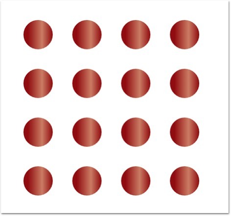

::: {style="DISPLAY: none"}
{#d2h_url_template}{#d2h_package_url style="WIDTH: 0px; DISPLAY: none; HEIGHT: 0px"}
:::

::: {.d2h_secondary_topic style="PADDING-BOTTOM: 10pt; MARGIN: 0pt; PADDING-LEFT: 0pt; PADDING-RIGHT: 0pt; PADDING-TOP: 0pt"}
#### Table Layout {#table-layout style="tab-stops: 0pt"}

Table layout arranges the nodes in a tabular structure based on specified intervals between them. The number of nodes in each row and column can be specified and the layout will take place accordingly. The nodes are assigned rows and columns based on the order in which they are added to the model and based on the maximum nodes allowed in that row and column. This layout enables to layout nodes automatically without the need to specify offset positions for each node.

[]{style="FONT-FAMILY: 'Calibri','sans-serif'"} 

Table 11: Property Table[]{style="FONT-FAMILY: 'Calibri','sans-serif'"}

+-----------------------------+----------------------------------------------------------------------------------------------------------------------------------------------------------------------------------------------------------------------------------------------------+----------------------------------------+---------------------------+
| Property                    | Description                                                                                                                                                                                                                                        | Type of the property                   | Value it accepts          |
+-----------------------------+----------------------------------------------------------------------------------------------------------------------------------------------------------------------------------------------------------------------------------------------------+----------------------------------------+---------------------------+
| VerticalSpacing             | Gets or sets the Vertical spacing between nodes.                                                                                                                                                                                                   | CLR property                           | Double                    |
+-----------------------------+----------------------------------------------------------------------------------------------------------------------------------------------------------------------------------------------------------------------------------------------------+----------------------------------------+---------------------------+
| HorizontalSpacing           | Gets or sets the Horizontal spacing between nodes.                                                                                                                                                                                                 | CLR property                           | Double                    |
+-----------------------------+----------------------------------------------------------------------------------------------------------------------------------------------------------------------------------------------------------------------------------------------------+----------------------------------------+---------------------------+
| Orientation                 | Gets or sets the orientation.                                                                                                                                                                                                                      | CLR property                           | TreeOrientation.LeftRight |
|                             |                                                                                                                                                                                                                                                    |                                        |                           |
|                             |                                                                                                                                                                                                                                                    |                                        | TreeOrientation.RightLeft |
|                             |                                                                                                                                                                                                                                                    |                                        |                           |
|                             |                                                                                                                                                                                                                                                    |                                        | TreeOrientation.TopBottom |
|                             |                                                                                                                                                                                                                                                    |                                        |                           |
|                             |                                                                                                                                                                                                                                                    |                                        | TreeOrientation.BottomTop |
+-----------------------------+----------------------------------------------------------------------------------------------------------------------------------------------------------------------------------------------------------------------------------------------------+----------------------------------------+---------------------------+
| TableExpandMode             | Gets or sets the table expand mode.                                                                                                                                                                                                                | DependencyProperty                     | ExpandMode.Horizontal     |
|                             |                                                                                                                                                                                                                                                    |                                        |                           |
|                             |                                                                                                                                                                                                                                                    |                                        | ExpandMode.Vertical       |
+-----------------------------+----------------------------------------------------------------------------------------------------------------------------------------------------------------------------------------------------------------------------------------------------+----------------------------------------+---------------------------+
| RowCount                    | Gets or sets the Row Count for the table layout.                                                                                                                                                                                                   | DependencyProperty                     | int                       |
+-----------------------------+----------------------------------------------------------------------------------------------------------------------------------------------------------------------------------------------------------------------------------------------------+----------------------------------------+---------------------------+
| ColumnCount                 | Gets or sets the Column Count for the table layout.                                                                                                                                                                                                | DependencyProperty                     | int                       |
+-----------------------------+----------------------------------------------------------------------------------------------------------------------------------------------------------------------------------------------------------------------------------------------------+----------------------------------------+---------------------------+
| EnableLayoutWithVariedSizes | Gets or sets a value indicating whether to enable the varied size algorithm. In case the Model consists of the nodes of different sizes, this property can be set to true. This will align the differently sized nodes with respect to the centre. | DependencyProperty                     | Boolean (true/ false)     |
+-----------------------------+----------------------------------------------------------------------------------------------------------------------------------------------------------------------------------------------------------------------------------------------------+----------------------------------------+---------------------------+
| Bounds                      | Gets or sets the bounds value which specifies the position of the root node in case of tree layout.                                                                                                                                                | CLR [property]{style="COLOR: #1f497d"} | Thickness                 |
+-----------------------------+----------------------------------------------------------------------------------------------------------------------------------------------------------------------------------------------------------------------------------------------------+----------------------------------------+---------------------------+

 

Table 12: Methods[]{style="COLOR: black"}

  ----------------- ------------ ------------- -------------------- -----------------
  Name              Parameters   Return Type   Description          Reference Links
  RefreshLayout()   Null         void          Refresh the layout   N/A
  ----------------- ------------ ------------- -------------------- -----------------

[]{style="FONT-FAMILY: 'Calibri','sans-serif'"} 

The Layout Manager lets you orient the table in two directions, Horizontal and Vertical. The **TableExpandMode** property of Diagram Model is used to specify the orientation.

 

**Horizontal:** When set to[ ]{style="COLOR: black"}**Horizontal**, the Rowcount is automatically calculated based on the number of nodes. The ColumnCount must be specified and the nodes will be arranged in the specified number of columns. When the maximum column count is reached, it starts placing the nodes in a new row.

 

**Vertical:** When set to[ ]{style="COLOR: black"}**Vertical**, the Columncount is automatically calculated based on the number of nodes. The RowCount must be specified and the nodes will be arranged in the specified number of rows. When the maximum row count is reached, it starts placing the nodes in a new column.

[]{style="COLOR: black"} 

The **Bounds** property of the **DiagramView** class can be used to specify the position of the first node.

[]{style="FONT-FAMILY: 'Courier New'"} 

+----------------------------------------------------------------------------------------------------------------------------------------------------------------------------------------------------------------------------------------------------------------------------------------------------------------------------------------------------------------------------------------------------------------------------------------------------------------------------------------------------------------------------------------------------------------+
| **[\[XAML\]]{style="FONT-FAMILY: 'Courier New'; COLOR: black"}**                                                                                                                                                                                                                                                                                                                                                                                                                                                                                               |
|                                                                                                                                                                                                                                                                                                                                                                                                                                                                                                                                                                |
| **[]{style="FONT-FAMILY: 'Courier New'; COLOR: black"}**                                                                                                                                                                                                                                                                                                                                                                                                                                                                                                       |
|                                                                                                                                                                                                                                                                                                                                                                                                                                                                                                                                                                |
| [\<]{style="FONT-FAMILY: 'Courier New'; COLOR: blue"}[Window]{style="FONT-FAMILY: 'Courier New'; COLOR: #a31515"}[ x]{style="FONT-FAMILY: 'Courier New'; COLOR: red"}[:]{style="FONT-FAMILY: 'Courier New'; COLOR: blue"}[Class]{style="FONT-FAMILY: 'Courier New'; COLOR: red"}[=\"RadialTreeLayout_2008.Window1\"]{style="FONT-FAMILY: 'Courier New'; COLOR: blue"}[]{style="FONT-FAMILY: 'Courier New'"}                                                                                                                                                    |
|                                                                                                                                                                                                                                                                                                                                                                                                                                                                                                                                                                |
| [   [ xmlns]{style="COLOR: red"}[=\"http://schemas.microsoft.com/winfx/2006/xaml/presentation\"]{style="COLOR: blue"}]{style="FONT-FAMILY: 'Courier New'"}                                                                                                                                                                                                                                                                                                                                                                                                     |
|                                                                                                                                                                                                                                                                                                                                                                                                                                                                                                                                                                |
| [   [ xmlns]{style="COLOR: red"}[:]{style="COLOR: blue"}[x]{style="COLOR: red"}[=\"http://schemas.microsoft.com/winfx/2006/xaml\"]{style="COLOR: blue"}]{style="FONT-FAMILY: 'Courier New'"}                                                                                                                                                                                                                                                                                                                                                                   |
|                                                                                                                                                                                                                                                                                                                                                                                                                                                                                                                                                                |
| [   [ Title]{style="COLOR: red"}[=\"Radial Tree Layout Demo\"]{style="COLOR: blue"}[ WindowState]{style="COLOR: red"}[=\"Normal\"]{style="COLOR: blue"}]{style="FONT-FAMILY: 'Courier New'"}                                                                                                                                                                                                                                                                                                                                                                   |
|                                                                                                                                                                                                                                                                                                                                                                                                                                                                                                                                                                |
| [   [ WindowStartupLocation]{style="COLOR: red"}[=\"CenterScreen\"]{style="COLOR: blue"}[ Name]{style="COLOR: red"}[=\"mainwindow\"]{style="COLOR: blue"}]{style="FONT-FAMILY: 'Courier New'"}                                                                                                                                                                                                                                                                                                                                                                 |
|                                                                                                                                                                                                                                                                                                                                                                                                                                                                                                                                                                |
| [   [ xmlns]{style="COLOR: red"}[:]{style="COLOR: blue"}[syncfusion]{style="COLOR: red"}[=\"http://schemas.syncfusion.com/wpf\"]{style="COLOR: blue"}[ Icon]{style="COLOR: red"}[=\"App.ico\"]{style="COLOR: blue"}]{style="FONT-FAMILY: 'Courier New'"}                                                                                                                                                                                                                                                                                                       |
|                                                                                                                                                                                                                                                                                                                                                                                                                                                                                                                                                                |
| [   [ FontWeight]{style="COLOR: red"}[=\"Bold\"]{style="COLOR: blue"}[ xmlns]{style="COLOR: red"}[:]{style="COLOR: blue"}[local]{style="COLOR: red"}[=\"clr-namespace:RadialTreeLayout_2008\"]{style="COLOR: blue"}[ Height]{style="COLOR: red"}[=\"1000\"]{style="COLOR: blue"}[ Width]{style="COLOR: red"}[=\"900\"\>]{style="COLOR: blue"}]{style="FONT-FAMILY: 'Courier New'"}                                                                                                                                                                             |
|                                                                                                                                                                                                                                                                                                                                                                                                                                                                                                                                                                |
| []{style="FONT-FAMILY: 'Courier New'; COLOR: black; FONT-SIZE: 9pt"}                                                                                                                                                                                                                                                                                                                                                                                                                                                                                           |
|                                                                                                                                                                                                                                                                                                                                                                                                                                                                                                                                                                |
| [\<]{style="FONT-FAMILY: 'Courier New'; COLOR: blue"}[syncfusion]{style="FONT-FAMILY: 'Courier New'; COLOR: #a31515"}[:]{style="FONT-FAMILY: 'Courier New'; COLOR: blue"}[DiagramControl]{style="FONT-FAMILY: 'Courier New'; COLOR: #a31515"}[ IsSymbolPaletteEnabled]{style="FONT-FAMILY: 'Courier New'; COLOR: red"}[=\"False\"]{style="FONT-FAMILY: 'Courier New'; COLOR: blue"}[ Name]{style="FONT-FAMILY: 'Courier New'; COLOR: red"}[=\"diagramControl\"\>]{style="FONT-FAMILY: 'Courier New'; COLOR: blue"}                                             |
|                                                                                                                                                                                                                                                                                                                                                                                                                                                                                                                                                                |
| []{style="FONT-FAMILY: 'Courier New'; COLOR: blue"}                                                                                                                                                                                                                                                                                                                                                                                                                                                                                                            |
|                                                                                                                                                                                                                                                                                                                                                                                                                                                                                                                                                                |
| [  ]{style="FONT-FAMILY: 'Courier New'; COLOR: #a31515"}[\<!\-- Model to add nodes and connections\--\>]{style="FONT-FAMILY: 'Courier New'; COLOR: green"}                                                                                                                                                                                                                                                                                                                                                                                                     |
|                                                                                                                                                                                                                                                                                                                                                                                                                                                                                                                                                                |
| [\<]{style="FONT-FAMILY: 'Courier New'; COLOR: blue"}[syncfusion]{style="FONT-FAMILY: 'Courier New'; COLOR: #a31515"}[:]{style="FONT-FAMILY: 'Courier New'; COLOR: blue"}[DiagramControl.Model]{style="FONT-FAMILY: 'Courier New'; COLOR: #a31515"}[\>]{style="FONT-FAMILY: 'Courier New'; COLOR: blue"}                                                                                                                                                                                                                                                       |
|                                                                                                                                                                                                                                                                                                                                                                                                                                                                                                                                                                |
| [\<]{style="FONT-FAMILY: 'Courier New'; COLOR: blue"}[syncfusion]{style="FONT-FAMILY: 'Courier New'; COLOR: #a31515"}[:]{style="FONT-FAMILY: 'Courier New'; COLOR: blue"}[DiagramModel]{style="FONT-FAMILY: 'Courier New'; COLOR: #a31515"}                                                                                                                                                                                                                                                                                                                    |
|                                                                                                                                                                                                                                                                                                                                                                                                                                                                                                                                                                |
| [LayoutType]{style="FONT-FAMILY: 'Courier New'; COLOR: red"}[=\"TableLayout\"]{style="FONT-FAMILY: 'Courier New'; COLOR: blue"}[ ]{style="FONT-FAMILY: 'Courier New'; COLOR: red"}                                                                                                                                                                                                                                                                                                                                                                             |
|                                                                                                                                                                                                                                                                                                                                                                                                                                                                                                                                                                |
| [EnableLayoutWithVariedSizes]{style="FONT-FAMILY: 'Courier New'; COLOR: red"}[=\"False\"]{style="FONT-FAMILY: 'Courier New'; COLOR: blue"}[ ]{style="FONT-FAMILY: 'Courier New'; COLOR: red"}                                                                                                                                                                                                                                                                                                                                                                  |
|                                                                                                                                                                                                                                                                                                                                                                                                                                                                                                                                                                |
| [TableExpandMode]{style="FONT-FAMILY: 'Courier New'; COLOR: red"}[=\"Horizontal\"]{style="FONT-FAMILY: 'Courier New'; COLOR: blue"}[ ]{style="FONT-FAMILY: 'Courier New'; COLOR: red"}                                                                                                                                                                                                                                                                                                                                                                         |
|                                                                                                                                                                                                                                                                                                                                                                                                                                                                                                                                                                |
| [HorizontalSpacing]{style="FONT-FAMILY: 'Courier New'; COLOR: red"}[=\"50\"]{style="FONT-FAMILY: 'Courier New'; COLOR: blue"}[ ]{style="FONT-FAMILY: 'Courier New'; COLOR: red"}                                                                                                                                                                                                                                                                                                                                                                               |
|                                                                                                                                                                                                                                                                                                                                                                                                                                                                                                                                                                |
| [VerticalSpacing]{style="FONT-FAMILY: 'Courier New'; COLOR: red"}[=\"50\"]{style="FONT-FAMILY: 'Courier New'; COLOR: blue"}[ ]{style="FONT-FAMILY: 'Courier New'; COLOR: red"}                                                                                                                                                                                                                                                                                                                                                                                 |
|                                                                                                                                                                                                                                                                                                                                                                                                                                                                                                                                                                |
| [RowCount]{style="FONT-FAMILY: 'Courier New'; COLOR: red"}[=\"4\"]{style="FONT-FAMILY: 'Courier New'; COLOR: blue"}[ ]{style="FONT-FAMILY: 'Courier New'; COLOR: red"}                                                                                                                                                                                                                                                                                                                                                                                         |
|                                                                                                                                                                                                                                                                                                                                                                                                                                                                                                                                                                |
| [ColumnCount]{style="FONT-FAMILY: 'Courier New'; COLOR: red"}[=\"4\"]{style="FONT-FAMILY: 'Courier New'; COLOR: blue"}[ [ ]{style="COLOR: red"}]{style="FONT-FAMILY: 'Courier New'"}                                                                                                                                                                                                                                                                                                                                                                           |
|                                                                                                                                                                                                                                                                                                                                                                                                                                                                                                                                                                |
| [x]{style="FONT-FAMILY: 'Courier New'; COLOR: red"}[:]{style="FONT-FAMILY: 'Courier New'; COLOR: blue"}[Name]{style="FONT-FAMILY: 'Courier New'; COLOR: red"}[=\"diagramModel\"\>]{style="FONT-FAMILY: 'Courier New'; COLOR: blue"}                                                                                                                                                                                                                                                                                                                            |
|                                                                                                                                                                                                                                                                                                                                                                                                                                                                                                                                                                |
| [\</]{style="FONT-FAMILY: 'Courier New'; COLOR: blue"}[syncfusion]{style="FONT-FAMILY: 'Courier New'; COLOR: #a31515"}[:]{style="FONT-FAMILY: 'Courier New'; COLOR: blue"}[DiagramModel]{style="FONT-FAMILY: 'Courier New'; COLOR: #a31515"}[\>]{style="FONT-FAMILY: 'Courier New'; COLOR: blue"}                                                                                                                                                                                                                                                              |
|                                                                                                                                                                                                                                                                                                                                                                                                                                                                                                                                                                |
| [ ]{style="FONT-FAMILY: 'Courier New'; COLOR: #a31515"}[\</]{style="FONT-FAMILY: 'Courier New'; COLOR: blue"}[syncfusion]{style="FONT-FAMILY: 'Courier New'; COLOR: #a31515"}[:]{style="FONT-FAMILY: 'Courier New'; COLOR: blue"}[DiagramControl.Model]{style="FONT-FAMILY: 'Courier New'; COLOR: #a31515"}[\>]{style="FONT-FAMILY: 'Courier New'; COLOR: blue"}                                                                                                                                                                                               |
|                                                                                                                                                                                                                                                                                                                                                                                                                                                                                                                                                                |
| []{style="FONT-FAMILY: 'Courier New'; COLOR: blue"}                                                                                                                                                                                                                                                                                                                                                                                                                                                                                                            |
|                                                                                                                                                                                                                                                                                                                                                                                                                                                                                                                                                                |
| [ ]{style="FONT-FAMILY: 'Courier New'; COLOR: #a31515"}[\<!\--View to display nodes and connections added through model.\--\>]{style="FONT-FAMILY: 'Courier New'; COLOR: green"}                                                                                                                                                                                                                                                                                                                                                                               |
|                                                                                                                                                                                                                                                                                                                                                                                                                                                                                                                                                                |
| [ ]{style="FONT-FAMILY: 'Courier New'; COLOR: #a31515"}[\<]{style="FONT-FAMILY: 'Courier New'; COLOR: blue"}[syncfusion]{style="FONT-FAMILY: 'Courier New'; COLOR: #a31515"}[:]{style="FONT-FAMILY: 'Courier New'; COLOR: blue"}[DiagramControl.View]{style="FONT-FAMILY: 'Courier New'; COLOR: #a31515"}[\>]{style="FONT-FAMILY: 'Courier New'; COLOR: blue"}                                                                                                                                                                                                 |
|                                                                                                                                                                                                                                                                                                                                                                                                                                                                                                                                                                |
| [     ]{style="FONT-FAMILY: 'Courier New'; COLOR: #a31515"}[\<]{style="FONT-FAMILY: 'Courier New'; COLOR: blue"}[syncfusion]{style="FONT-FAMILY: 'Courier New'; COLOR: #a31515"}[:]{style="FONT-FAMILY: 'Courier New'; COLOR: blue"}[DiagramView]{style="FONT-FAMILY: 'Courier New'; COLOR: #a31515"}[ Bounds]{style="FONT-FAMILY: 'Courier New'; COLOR: red"}[=\"0,0,200,200\"]{style="FONT-FAMILY: 'Courier New'; COLOR: blue"}[ Name]{style="FONT-FAMILY: 'Courier New'; COLOR: red"}[=\"diagramView\"/\>]{style="FONT-FAMILY: 'Courier New'; COLOR: blue"} |
|                                                                                                                                                                                                                                                                                                                                                                                                                                                                                                                                                                |
| [     ]{style="FONT-FAMILY: 'Courier New'; COLOR: #a31515"}[\</]{style="FONT-FAMILY: 'Courier New'; COLOR: blue"}[syncfusion]{style="FONT-FAMILY: 'Courier New'; COLOR: #a31515"}[:]{style="FONT-FAMILY: 'Courier New'; COLOR: blue"}[DiagramControl.View]{style="FONT-FAMILY: 'Courier New'; COLOR: #a31515"}[\>]{style="FONT-FAMILY: 'Courier New'; COLOR: blue"}                                                                                                                                                                                            |
|                                                                                                                                                                                                                                                                                                                                                                                                                                                                                                                                                                |
| []{style="FONT-FAMILY: 'Courier New'; COLOR: blue"}                                                                                                                                                                                                                                                                                                                                                                                                                                                                                                            |
|                                                                                                                                                                                                                                                                                                                                                                                                                                                                                                                                                                |
| [\</]{style="FONT-FAMILY: 'Courier New'; COLOR: blue"}[syncfusion]{style="FONT-FAMILY: 'Courier New'; COLOR: #a31515"}[:]{style="FONT-FAMILY: 'Courier New'; COLOR: blue"}[DiagramControl]{style="FONT-FAMILY: 'Courier New'; COLOR: #a31515"}[\>\                                                                                                                                                                                                                                                                                                             |
| \</]{style="FONT-FAMILY: 'Courier New'; COLOR: blue"}[Window]{style="FONT-FAMILY: 'Courier New'; COLOR: #a31515"}[\>]{style="FONT-FAMILY: 'Courier New'; COLOR: blue"}                                                                                                                                                                                                                                                                                                                                                                                         |
+----------------------------------------------------------------------------------------------------------------------------------------------------------------------------------------------------------------------------------------------------------------------------------------------------------------------------------------------------------------------------------------------------------------------------------------------------------------------------------------------------------------------------------------------------------------+

[]{style="FONT-FAMILY: 'Times New Roman','serif'"} 

+----------------------------------------------------------------------------------------------------------------------------------------------------------------------------------------------------------------------------------------------------------------------------------------------------------------------------------------------------------------------------+
| **[\[C#\]]{style="FONT-FAMILY: 'Courier New'; COLOR: black"}**                                                                                                                                                                                                                                                                                                             |
|                                                                                                                                                                                                                                                                                                                                                                            |
| **[]{style="FONT-FAMILY: 'Courier New'; COLOR: black"}**                                                                                                                                                                                                                                                                                                                   |
|                                                                                                                                                                                                                                                                                                                                                                            |
| [DiagramControl]{style="FONT-FAMILY: 'Courier New'; COLOR: #2b91af"}[ dc = ]{style="FONT-FAMILY: 'Courier New'; COLOR: black"}[new]{style="FONT-FAMILY: 'Courier New'; COLOR: blue"}[ ]{style="FONT-FAMILY: 'Courier New'; COLOR: black"}[DiagramControl]{style="FONT-FAMILY: 'Courier New'; COLOR: #2b91af"}[();]{style="FONT-FAMILY: 'Courier New'; COLOR: black"}       |
|                                                                                                                                                                                                                                                                                                                                                                            |
| [DiagramModel]{style="FONT-FAMILY: 'Courier New'; COLOR: #2b91af"}[ diagramModel = ]{style="FONT-FAMILY: 'Courier New'; COLOR: black"}[new]{style="FONT-FAMILY: 'Courier New'; COLOR: blue"}[ ]{style="FONT-FAMILY: 'Courier New'; COLOR: black"}[DiagramModel]{style="FONT-FAMILY: 'Courier New'; COLOR: #2b91af"}[();]{style="FONT-FAMILY: 'Courier New'; COLOR: black"} |
|                                                                                                                                                                                                                                                                                                                                                                            |
| [dc.Model = diagramModel;]{style="FONT-FAMILY: 'Courier New'; COLOR: black"}                                                                                                                                                                                                                                                                                               |
|                                                                                                                                                                                                                                                                                                                                                                            |
| [diagramModel.LayoutType = [LayoutType]{style="COLOR: #2b91af"}.TableLayout;]{style="FONT-FAMILY: 'Courier New'"}                                                                                                                                                                                                                                                          |
|                                                                                                                                                                                                                                                                                                                                                                            |
| [diagramModel.TableExpandMode = [ExpandMode]{style="COLOR: #2b91af"}.Horizontal;]{style="FONT-FAMILY: 'Courier New'"}                                                                                                                                                                                                                                                      |
|                                                                                                                                                                                                                                                                                                                                                                            |
| [diagramModel.EnableLayoutWithVariedSizes = [false]{style="COLOR: blue"};]{style="FONT-FAMILY: 'Courier New'"}                                                                                                                                                                                                                                                             |
|                                                                                                                                                                                                                                                                                                                                                                            |
| [diagramModel.HorizontalSpacing = 50;]{style="FONT-FAMILY: 'Courier New'"}                                                                                                                                                                                                                                                                                                 |
|                                                                                                                                                                                                                                                                                                                                                                            |
| [diagramModel.VerticalSpacing = 50;]{style="FONT-FAMILY: 'Courier New'"}                                                                                                                                                                                                                                                                                                   |
|                                                                                                                                                                                                                                                                                                                                                                            |
| [diagramModel.RowCount = 10;]{style="FONT-FAMILY: 'Courier New'"}                                                                                                                                                                                                                                                                                                          |
|                                                                                                                                                                                                                                                                                                                                                                            |
| [diagramModel.ColumnCount = 3;]{style="FONT-FAMILY: 'Courier New'"}                                                                                                                                                                                                                                                                                                        |
+----------------------------------------------------------------------------------------------------------------------------------------------------------------------------------------------------------------------------------------------------------------------------------------------------------------------------------------------------------------------------+

[]{style="FONT-FAMILY: 'Courier New'; COLOR: blue"} 

+---------------------------------------------------------------------------------------------------------------------------------------------------------------------------------------------------------+
| **[\[VB\]]{style="FONT-FAMILY: 'Courier New'; COLOR: black"}**                                                                                                                                          |
|                                                                                                                                                                                                         |
| **[]{style="FONT-FAMILY: 'Courier New'; COLOR: black"}**                                                                                                                                                |
|                                                                                                                                                                                                         |
| [Dim]{style="FONT-FAMILY: 'Courier New'; COLOR: blue"}[ dc [As]{style="COLOR: blue"} [New]{style="COLOR: blue"} [DiagramControl]{style="COLOR: #2b91af"}()]{style="FONT-FAMILY: 'Courier New'"}         |
|                                                                                                                                                                                                         |
| [Dim]{style="FONT-FAMILY: 'Courier New'; COLOR: blue"}[ diagramModel [As]{style="COLOR: blue"} [New]{style="COLOR: blue"} [DiagramModel]{style="COLOR: #2b91af"}()]{style="FONT-FAMILY: 'Courier New'"} |
|                                                                                                                                                                                                         |
| [dc.Model = diagramModel]{style="FONT-FAMILY: 'Courier New'"}                                                                                                                                           |
|                                                                                                                                                                                                         |
| [diagramModel.LayoutType = LayoutType.TableLayout]{style="FONT-FAMILY: 'Courier New'"}                                                                                                                  |
|                                                                                                                                                                                                         |
| [diagramModel.TableExpandMode = ExpandMode.Horizontal]{style="FONT-FAMILY: 'Courier New'"}                                                                                                              |
|                                                                                                                                                                                                         |
| [diagramModel.EnableLayoutWithVariedSizes = [False]{style="COLOR: blue"}]{style="FONT-FAMILY: 'Courier New'"}                                                                                           |
|                                                                                                                                                                                                         |
| [diagramModel.HorizontalSpacing = 50]{style="FONT-FAMILY: 'Courier New'"}                                                                                                                               |
|                                                                                                                                                                                                         |
| [diagramModel.VerticalSpacing = 50]{style="FONT-FAMILY: 'Courier New'"}                                                                                                                                 |
|                                                                                                                                                                                                         |
| [diagramModel.RowCount = 10]{style="FONT-FAMILY: 'Courier New'"}                                                                                                                                        |
|                                                                                                                                                                                                         |
| [diagramModel.ColumnCount = 3]{style="FONT-FAMILY: 'Courier New'"}[]{style="FONT-FAMILY: 'Courier New'"}                                                                                                |
+---------------------------------------------------------------------------------------------------------------------------------------------------------------------------------------------------------+

[]{style="FONT-FAMILY: 'Courier New'; COLOR: blue"} 

{border="0"}

Figure 23: Table Layout with 4 Columns and 4 Rows[]{style="FONT-FAMILY: 'Courier New'; COLOR: blue"}

***[]{style="FONT-FAMILY: 'Trebuchet MS','sans-serif'; COLOR: #15428b; FONT-SIZE: 9pt"}*** 

Layout Spacing

[]{style="FONT-FAMILY: 'Trebuchet MS','sans-serif'; COLOR: #15428b; FONT-SIZE: 9pt"} 

Spacing between the nodes with respect different levels and siblings are adjustable; this will be helpful to adjust the distance between nodes, so that it will meet many business needs. As this is a general topic between all layouts, detailed explanation about this can be found in [[Layout Spacing]{style="COLOR: windowtext"}](ms-xhelp:///?Id=0b556dc5-d85e-48dc-b08b-0d8f5a85661a) under DiagramModel.[\
\
]{style="COLOR: black"}

Refresh Layout

**[]{style="FONT-FAMILY: 'Trebuchet MS','sans-serif'; COLOR: #15428b; FONT-SIZE: 9pt"}** 

When there are changes in content of the page like  new nodes or connectors added, the layout has to be refreshed to get the page's content aligned again to give space for new contents. To refresh the layout please follow the following code snippet.

[]{style="FONT-FAMILY: 'Trebuchet MS','sans-serif'; COLOR: #15428b; FONT-SIZE: 9pt"} 

+-------------------------------------------------------------------------------------------------------------------------------------------------------------------------------------------------------------+
| **[\[C#\]]{style="FONT-FAMILY: 'Courier New'; COLOR: black"}**                                                                                                                                              |
|                                                                                                                                                                                                             |
| **[]{style="FONT-FAMILY: 'Courier New'; COLOR: black"}**                                                                                                                                                    |
|                                                                                                                                                                                                             |
| [TableLayout]{style="FONT-FAMILY: 'Courier New'; COLOR: #2b91af"}[ tree = [new]{style="COLOR: blue"} [TableLayout]{style="COLOR: #2b91af"}(diagramModel, diagramView);]{style="FONT-FAMILY: 'Courier New'"} |
|                                                                                                                                                                                                             |
| [tree.RefreshLayout();]{style="FONT-FAMILY: 'Courier New'"}                                                                                                                                                 |
+-------------------------------------------------------------------------------------------------------------------------------------------------------------------------------------------------------------+

**[]{style="FONT-FAMILY: 'Trebuchet MS','sans-serif'; COLOR: #15428b; FONT-SIZE: 9pt"}** 

+-------------------------------------------------------------------------------------------------------------------------------------------------------------------------------------------------------------------------+
| **[\[VB\]]{style="FONT-FAMILY: 'Courier New'; COLOR: black"}**                                                                                                                                                          |
|                                                                                                                                                                                                                         |
| **[]{style="FONT-FAMILY: 'Courier New'; COLOR: black"}**                                                                                                                                                                |
|                                                                                                                                                                                                                         |
| [Dim]{style="FONT-FAMILY: 'Courier New'; COLOR: blue"}[ tree [As]{style="COLOR: blue"} [New]{style="COLOR: blue"} [TableLayout]{style="COLOR: #2b91af"}(diagramModel, diagramView)]{style="FONT-FAMILY: 'Courier New'"} |
|                                                                                                                                                                                                                         |
| [tree.RefreshLayout()]{style="FONT-FAMILY: 'Courier New'"}[]{style="FONT-FAMILY: 'Courier New'"}                                                                                                                        |
+-------------------------------------------------------------------------------------------------------------------------------------------------------------------------------------------------------------------------+

**[]{style="FONT-FAMILY: 'Trebuchet MS','sans-serif'; COLOR: #15428b; FONT-SIZE: 9pt"}** 

Here **diagramModel** and **diagramView** is an instance of DiagramModel and DiagramView respectively.\
[\
]{style="COLOR: black"}There are some more customization supported for Table Layout, please refer the links following 'see also' topic.

\
See Also

[]{style="FONT-FAMILY: 'Trebuchet MS','sans-serif'; COLOR: #15428b; FONT-SIZE: 9pt"} 

[[Layout Spacing]{style="COLOR: windowtext"}](ms-xhelp:///?Id=51b9277d-a660-4a79-8206-03cd1d569b74) Refer Concepts and Features -\> Diagram Model -\> Layout Spacing[]{style="COLOR: black"}

[[TableExpandMode]{style="COLOR: windowtext"}](ms-xhelp:///?Id=51b9277d-a660-4a79-8206-03cd1d569b74) Refer Concepts and Features -\> Diagram Model -\> TableExpandMode[]{style="COLOR: black"}

[[RowCount and ColumnCount]{style="COLOR: windowtext"}](ms-xhelp:///?Id=51b9277d-a660-4a79-8206-03cd1d569b74) Refer Concepts and Features -\> Diagram Model -\> RowCount and ColumnCount[]{style="COLOR: black"}

[[Enable TableLayout with varied Node sizes]{style="COLOR: windowtext"}](ms-xhelp:///?Id=57a45a0c-c4ac-43bb-81dc-7b60e8e34c76) Refer Concepts and Features -\> Diagram Model -\> Enable TableLayout with varied Node size[]{style="COLOR: black"}

[]{#related-topics}
:::
