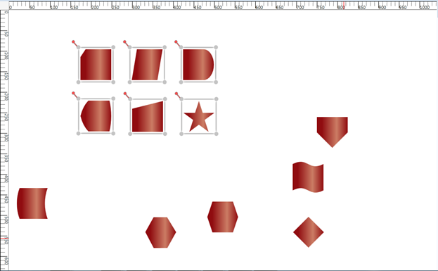

::: {style="DISPLAY: none"}
{#d2h_url_template}{#d2h_package_url style="WIDTH: 0px; DISPLAY: none; HEIGHT: 0px"}
:::

::::: {#nsbanner .d2h_main_nsbanner style="BORDER-BOTTOM: #999999 1px solid; POSITION: relative; PADDING-BOTTOM: 0px; BACKGROUND-COLOR: transparent; PADDING-LEFT: 0px; PADDING-RIGHT: 0px; DISPLAY: none; BORDER-TOP: #999999 1px solid; PADDING-TOP: 0px; LEFT: 0px"}
:::: {#TitleRow .d2h_main_titlerow style="PADDING-BOTTOM: 4px; BACKGROUND-COLOR: transparent; PADDING-LEFT: 22px; WIDTH: 100%; PADDING-RIGHT: 10px; DISPLAY: none; PADDING-TOP: 4px"}
::: {#ienav .d2h_main_ienav style="DISPLAY: none"}
{#D2HPrevious .D2HPreviousEnabled}  {#D2HNext .D2HNextEnabled}
:::
::::
:::::

:::::: {#nstext .d2h_main_nstext style="PADDING-BOTTOM: 10px; BACKGROUND-COLOR: transparent; PADDING-LEFT: 22px; PADDING-RIGHT: 10px; HEIGHT: 100%; OVERFLOW: auto; PADDING-TOP: 5px" hasuserbackground="true" valign="bottom"}
::: {#d2h_breadcrumbs .d2h_breadcrumbs}
[Essential Studio User Guide Documentation](ms-xhelp:///?Id=12457748-09e3-4d74-a240-8e049cedf030){.d2h_breadcrumbsNormal}[ \> ]{.d2h_breadcrumbsLinkSeparator}[User Interface Edition](ms-xhelp:///?Id=c29296b7-531c-413b-a0ec-488ca1f7f669){.d2h_breadcrumbsNormal}[ \> ]{.d2h_breadcrumbsLinkSeparator}[Essential WPF](ms-xhelp:///?Id=7f4f82c5-151c-4262-94d0-75c4626c77bc){.d2h_breadcrumbsNormal}[ \> ]{.d2h_breadcrumbsLinkSeparator}[Essential Diagram]{.d2h_breadcrumbsContentsOnly}[ \> ]{.d2h_breadcrumbsLinkSeparator}[Concepts and Features](ms-xhelp:///?Id=8625d466-6e21-495a-b811-4ecee754da81){.d2h_breadcrumbsNormal}[ \> ]{.d2h_breadcrumbsLinkSeparator}[Diagram View](ms-xhelp:///?Id=5fbfa644-6dd8-4969-8866-3f1b867be204){.d2h_breadcrumbsNormal}
:::

### Table Layout for Selected Nodes {#table-layout-for-selected-nodes style="tab-stops: 0pt"}

[From version 10.1.0.44, Essential Diagram for WPF enables you to apply the table layout on selected nodes instead of applying it to the entire diagram. ]{style="BACKGROUND: white; COLOR: black"}This arranges selected nodes or a given node collection in a tabular structure based on specified intervals between them. The number of nodes in each row and column can be specified and the layout will be applied accordingly. []{style="BACKGROUND: white; COLOR: black"}

 

Use Case Scenarios

[·      ]{style="FONT-FAMILY: Symbol"}Users can easily make the layout with a specific collection of nodes called ordered nodes.

[·      ]{style="FONT-FAMILY: Symbol"}Users can easily position the layout.

[·      ]{style="FONT-FAMILY: Symbol"}Users can easily align the layout by using the layout alignment properties.

[·      ]{style="FONT-FAMILY: Symbol"}Users can set a rectangle boundary around nodes by using the **Layout Bounds** property.

 

Properties

::: {align="center"}
+-----------------------------------------------------------------------+---------------------------------------------------------------------------------------------------------+-----------------------------+------------------------------------------+
| **Property**                                                          | **Description**                                                                                         | **Type**                    | **Data Type**                            |
+-----------------------------------------------------------------------+---------------------------------------------------------------------------------------------------------+-----------------------------+------------------------------------------+
| OrderedNodes                                                          | This property is used to get or set the Collection of Nodes for table layout.[]{style="COLOR: #c00000"} | Dependency property         | List\<IShape\>[]{style="COLOR: #c00000"} |
|                                                                       |                                                                                                         |                             |                                          |
|                                                                       |                                                                                                         |                             |                                          |
|                                                                       |                                                                                                         |                             |                                          |
|                                                                       |                                                                                                         | []{style="COLOR: #c00000"}  |                                          |
+-----------------------------------------------------------------------+---------------------------------------------------------------------------------------------------------+-----------------------------+------------------------------------------+
:::

[]{style="FONT-FAMILY: 'Calibri','sans-serif'; COLOR: black"} 

Sample Link

To view a sample of this feature:

1.   Open **Dashboard**.

2.   Click **User Interface \> WFP**.

3.   Click **Run Samples**.

4.   Navigate to **Diagram \> Automatic Layout \> Table Layout**.

 

Adding Table Layout for selected Nodes

[To apply a table layout to the selected nodes, assign the selected nodes to the *OrderNodes* property of the *DiagramModel*. You can also assign your own collection of IShape to the *OrderNodes* property. Then create an instance of the *TableLayout* and call the *RefreshLayout* method for this instance.]{style="BACKGROUND: white"}

[The following code illustrates this: ]{style="BACKGROUND: white; COLOR: black"}

+---------------------------------------------------------------------------------------------------------------------------------------------------------------------------------------------------------+
| **[\[C#\]]{style="FONT-FAMILY: 'Courier New'; COLOR: black"}**                                                                                                                                          |
|                                                                                                                                                                                                         |
|                                                                                                                                                                                                         |
|                                                                                                                                                                                                         |
| [       // Assigning selected node to the OrderedNodes property.]{style="FONT-FAMILY: Consolas; COLOR: green; FONT-SIZE: 9.5pt"}[]{style="FONT-FAMILY: Consolas; FONT-SIZE: 9.5pt"}                     |
|                                                                                                                                                                                                         |
| [          diagramModel.OrderedNodes= diagramView.SelectionList.OfType\<[IShape]{style="COLOR: #2b91af"}\>().ToList(); ]{style="FONT-FAMILY: Consolas; FONT-SIZE: 9.5pt"}                               |
|                                                                                                                                                                                                         |
| [       // Create an instance of TableLayout and refresh it.]{style="FONT-FAMILY: Consolas; COLOR: green; FONT-SIZE: 9.5pt"}[]{style="FONT-FAMILY: Consolas; FONT-SIZE: 9.5pt"}                         |
|                                                                                                                                                                                                         |
| [          [TableLayout]{style="COLOR: #2b91af"} table = [new]{style="COLOR: blue"} [TableLayout]{style="COLOR: #2b91af"}(diagramModel, diagramView);]{style="FONT-FAMILY: Consolas; FONT-SIZE: 9.5pt"} |
|                                                                                                                                                                                                         |
| [          table.RefreshLayout();]{style="FONT-FAMILY: Consolas; FONT-SIZE: 9.5pt"}                                                                                                                     |
|                                                                                                                                                                                                         |
|                                                                                                                                                                                                         |
+---------------------------------------------------------------------------------------------------------------------------------------------------------------------------------------------------------+

[]{style="BACKGROUND: white; COLOR: black"} 

+----------------------------------------------------------------------------------------------------------------------------------------------------------------------------------+
| **[\[VB\]]{style="FONT-FAMILY: 'Courier New'; COLOR: black"}**                                                                                                                   |
|                                                                                                                                                                                  |
|                                                                                                                                                                                  |
|                                                                                                                                                                                  |
| [         [\'Assigning selected node to the OrderedNodes property.]{style="COLOR: green"}]{style="FONT-FAMILY: 'Courier New'"}                                                   |
|                                                                                                                                                                                  |
| [              diagramModel.OrderedNodes= diagramView.SelectionList.OfType([Of]{style="COLOR: blue"} IShape)().ToList()]{style="FONT-FAMILY: 'Courier New'"}                     |
|                                                                                                                                                                                  |
| [         [\'Create an instance of TableLayout and refresh it.]{style="COLOR: green"}]{style="FONT-FAMILY: 'Courier New'"}                                                       |
|                                                                                                                                                                                  |
| [              [Dim]{style="COLOR: blue"} table [As]{style="COLOR: blue"} [New]{style="COLOR: blue"} TableLayout(diagramModel, diagramView)]{style="FONT-FAMILY: 'Courier New'"} |
|                                                                                                                                                                                  |
| [              table.RefreshLayout()]{style="FONT-FAMILY: 'Courier New'"}                                                                                                        |
|                                                                                                                                                                                  |
|                                                                                                                                                                                  |
+----------------------------------------------------------------------------------------------------------------------------------------------------------------------------------+

[]{style="BACKGROUND: white; COLOR: black"} 

[When the code runs, the table layout will be applied to the specified node collection.  ]{style="BACKGROUND: white"}

::: {style="BORDER-BOTTOM: windowtext 1pt solid; BORDER-LEFT: medium none; PADDING-BOTTOM: 1pt; MARGIN-TOP: 9pt; PADDING-LEFT: 0pt; PADDING-RIGHT: 0pt; MARGIN-BOTTOM: 9pt; BORDER-TOP: windowtext 1pt solid; BORDER-RIGHT: medium none; PADDING-TOP: 1pt"}
[Note: If ]{style="BACKGROUND: white"}[the OrderNodes property]{style="BACKGROUND: white; COLOR: black"}[ is set to null, then the table layout will be applied to the entire diagram.]{style="BACKGROUND: white"}
:::

 

{border="0"}

Figure 140: Table Layout Applied for Specified Nodes

[]{style="COLOR: black"} 

Aligning the Layout on a Specified Location

[To align the ordered nodes in a particular position, call the *TableLayout's* *RefreshLayout* (Point PivotPoint) method and specify the particular point as a parameter. The layout will be positioned in the specified pivot point. ]{style="COLOR: black"}

[The following code illustrates this:]{style="COLOR: black"}****

**** 

+---------------------------------------------------------------------------------------------------------------------------------------------------------------------------------------------------------+
| **[\[C#\]]{style="FONT-FAMILY: 'Courier New'; COLOR: black"}**                                                                                                                                          |
|                                                                                                                                                                                                         |
|                                                                                                                                                                                                         |
|                                                                                                                                                                                                         |
| [       // Assigning selected node to the OrderedNodes.]{style="FONT-FAMILY: Consolas; COLOR: green; FONT-SIZE: 9.5pt"}[]{style="FONT-FAMILY: Consolas; FONT-SIZE: 9.5pt"}                              |
|                                                                                                                                                                                                         |
| [          diagramModel.OrderedNodes= diagramView.SelectionList.OfType\<[IShape]{style="COLOR: #2b91af"}\>().ToList(); ]{style="FONT-FAMILY: Consolas; FONT-SIZE: 9.5pt"}                               |
|                                                                                                                                                                                                         |
| [          [TableLayout]{style="COLOR: #2b91af"} table = [new]{style="COLOR: blue"} [TableLayout]{style="COLOR: #2b91af"}(diagramModel, diagramView);]{style="FONT-FAMILY: Consolas; FONT-SIZE: 9.5pt"} |
|                                                                                                                                                                                                         |
| [          table.RefreshLayout(300,400);]{style="FONT-FAMILY: Consolas; FONT-SIZE: 9.5pt"}                                                                                                              |
|                                                                                                                                                                                                         |
|                                                                                                                                                                                                         |
+---------------------------------------------------------------------------------------------------------------------------------------------------------------------------------------------------------+

**** 

+----------------------------------------------------------------------------------------------------------------------------------------------------------------------------------+
| **[\[VB\]]{style="FONT-FAMILY: 'Courier New'; COLOR: black"}**                                                                                                                   |
|                                                                                                                                                                                  |
| [         [\' Assigning selected node to the OrderedNodes.]{style="COLOR: green"}]{style="FONT-FAMILY: 'Courier New'"}                                                           |
|                                                                                                                                                                                  |
| [diagramModel.OrderedNodes= diagramView.SelectionList.OfType([Of]{style="COLOR: blue"} IShape)().ToList()]{style="FONT-FAMILY: 'Courier New'"}                                   |
|                                                                                                                                                                                  |
| [              [Dim]{style="COLOR: blue"} table [As]{style="COLOR: blue"} [New]{style="COLOR: blue"} TableLayout(diagramModel, diagramView)]{style="FONT-FAMILY: 'Courier New'"} |
|                                                                                                                                                                                  |
| [              table.RefreshLayout(300,400)]{style="FONT-FAMILY: 'Courier New'"}                                                                                                 |
|                                                                                                                                                                                  |
|                                                                                                                                                                                  |
+----------------------------------------------------------------------------------------------------------------------------------------------------------------------------------+

 

Removing Table Layout from the Specific Nodes

You can remove the table layout applied to specific nodes. To achieve this set the *[OrderedNodes]{style="COLOR: black"}*[ property of the *DiagramMode* to ]{style="COLOR: black"}*null*, and call the *RefreshLayout* method of the *TableLayout*. The layout will be applied to the entire diagram. By default the *OrderedNodes* property is set to *null*.

[]{style="COLOR: black"} 

The following code illustrates how to remove the layout from the specific nodes:

+---------------------------------------------------------------------------------------------------------------------------------------------------------------------------------------------------------+
| **[\[C#\]]{style="FONT-FAMILY: 'Courier New'; COLOR: black"}**                                                                                                                                          |
|                                                                                                                                                                                                         |
|                                                                                                                                                                                                         |
|                                                                                                                                                                                                         |
| [       // Set null value to the OrderedNodes property.]{style="FONT-FAMILY: Consolas; COLOR: green; FONT-SIZE: 9.5pt"}[]{style="FONT-FAMILY: Consolas; FONT-SIZE: 9.5pt"}                              |
|                                                                                                                                                                                                         |
| [          diagramModel.OrderedNodes = [null]{style="COLOR: blue"};]{style="FONT-FAMILY: Consolas; FONT-SIZE: 9.5pt"}                                                                                   |
|                                                                                                                                                                                                         |
| [          [TableLayout]{style="COLOR: #2b91af"} table = [new]{style="COLOR: blue"} [TableLayout]{style="COLOR: #2b91af"}(diagramModel, diagramView);]{style="FONT-FAMILY: Consolas; FONT-SIZE: 9.5pt"} |
|                                                                                                                                                                                                         |
| [          table.RefreshLayout(300,400);]{style="FONT-FAMILY: Consolas; FONT-SIZE: 9.5pt"}                                                                                                              |
|                                                                                                                                                                                                         |
|                                                                                                                                                                                                         |
+---------------------------------------------------------------------------------------------------------------------------------------------------------------------------------------------------------+

 

 

 

+----------------------------------------------------------------------------------------------------------------------------------------------------------------------------------+
| **[\[VB\]]{style="FONT-FAMILY: 'Courier New'; COLOR: black"}**                                                                                                                   |
|                                                                                                                                                                                  |
|  [\' Set null value to the OrderedNodes property.]{style="FONT-FAMILY: 'Courier New'; COLOR: green"}[]{style="FONT-FAMILY: 'Courier New'"}                                       |
|                                                                                                                                                                                  |
| [              diagramModel.OrderedNodes = [Nothing]{style="COLOR: blue"}]{style="FONT-FAMILY: 'Courier New'"}                                                                   |
|                                                                                                                                                                                  |
| [              [Dim]{style="COLOR: blue"} table [As]{style="COLOR: blue"} [New]{style="COLOR: blue"} TableLayout(diagramModel, diagramView)]{style="FONT-FAMILY: 'Courier New'"} |
|                                                                                                                                                                                  |
| [              table.RefreshLayout(300,400)]{style="FONT-FAMILY: 'Courier New'"}                                                                                                 |
|                                                                                                                                                                                  |
|                                                                                                                                                                                  |
|                                                                                                                                                                                  |
|                                                                                                                                                                                  |
+----------------------------------------------------------------------------------------------------------------------------------------------------------------------------------+

 

[]{#related-topics}
::::::
