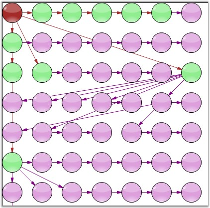
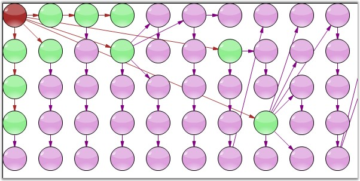

::: {style="DISPLAY: none"}
{#d2h_url_template}{#d2h_package_url style="WIDTH: 0px; DISPLAY: none; HEIGHT: 0px"}
:::

:::: {.d2h_secondary_topic style="PADDING-BOTTOM: 10pt; MARGIN: 0pt; PADDING-LEFT: 0pt; PADDING-RIGHT: 0pt; PADDING-TOP: 0pt"}
#### Table Layout Manager {#table-layout-manager style="tab-stops: 0pt"}

[]{style="FONT-FAMILY: 'Trebuchet MS','sans-serif'; COLOR: #15428b; FONT-SIZE: 9pt"} 

The **TableLayoutManager** class can be used to arrange various objects in columns and rows in a table format. The **TableTreeLayoutManager** arranges nodes in a Table layout, positioning the nodes in a rectangular grid of cells, with each node spanning over a single table cell. The TableTreeLayoutManager is used when tabular relationships need to be depicted. The various properties of the TableTreeLayoutManager are listed below.

           

The model and the number of rows and column values are passed as parameters to the TableLayoutManager class. The parameters and properties involved with the TableLayoutManager are listed in the below table.

[]{style="FONT-FAMILY: 'Trebuchet MS','sans-serif'; COLOR: #15428b; FONT-SIZE: 9pt"} 

::: {align="center"}
+-----------------------------------+-----------------------------------------------------------------------------------------+
| Property                          | Description                                                                             |
+-----------------------------------+-----------------------------------------------------------------------------------------+
| Model                             | The Model to be attached to the Layout Manager.                                         |
+-----------------------------------+-----------------------------------------------------------------------------------------+
| CellSizeMode                      | Gets / sets the cell size mode with one of the following options:                       |
|                                   |                                                                                         |
|                                   | [·      ]{style="FONT-FAMILY: Symbol"}EqualToMaxNode                                    |
|                                   |                                                                                         |
|                                   | [·      ]{style="FONT-FAMILY: Symbol"}MinimalTable                                      |
|                                   |                                                                                         |
|                                   | [·      ]{style="FONT-FAMILY: Symbol"}Minimal                                           |
+-----------------------------------+-----------------------------------------------------------------------------------------+
| MaxSize                           | Gets / sets the size of each table cell. It is an integer type value.                   |
+-----------------------------------+-----------------------------------------------------------------------------------------+
| MaxColumnCount                    | Represents the maximum horizontal cell count in the table. It is an integer type value. |
+-----------------------------------+-----------------------------------------------------------------------------------------+
| MaxRowsCount                      | Represents the maximum vertical cell count in the table. It is an integer type value.   |
+-----------------------------------+-----------------------------------------------------------------------------------------+
| HorizontalSpacing                 | Defines the horizontal offset between adjacent nodes.                                   |
+-----------------------------------+-----------------------------------------------------------------------------------------+
| VerticalSpacing                   | Defines the vertical offset between adjacent nodes.                                     |
+-----------------------------------+-----------------------------------------------------------------------------------------+
:::

[]{style="FONT-FAMILY: 'Trebuchet MS','sans-serif'; COLOR: #15428b; FONT-SIZE: 9pt"} 

[]{#Table1}Programmatically, the table layout manager instance should be created with the respective arguments, assigned to the Layout Manager and updated as follows.

[]{style="FONT-FAMILY: 'Trebuchet MS','sans-serif'; COLOR: #15428b; FONT-SIZE: 9pt"} 

+--------------------------------------------------------------------------------------------------------------------------------------------------------------------------------------+
| **[\[C#\]]{style="FONT-FAMILY: 'Courier New'; COLOR: black"}**                                                                                                                       |
|                                                                                                                                                                                      |
| []{style="FONT-FAMILY: 'Courier New'"}                                                                                                                                               |
|                                                                                                                                                                                      |
| [TableLayoutManagermt lLayout=[new]{style="COLOR: blue"} TableLayoutManager([this]{style="COLOR: blue"}.diagram1.Model, 7, 7);]{style="FONT-FAMILY: 'Courier New'"}                  |
|                                                                                                                                                                                      |
| [tlLayout.VerticalSpacing = 20;]{style="FONT-FAMILY: 'Courier New'"}                                                                                                                 |
|                                                                                                                                                                                      |
| [tlLayout.HorizontalSpacing = 20;]{style="FONT-FAMILY: 'Courier New'"}                                                                                                               |
|                                                                                                                                                                                      |
| [tlLayout.CellSizeMode = CellSizeMode.EqualToMaxNode;]{style="FONT-FAMILY: 'Courier New'"}                                                                                           |
|                                                                                                                                                                                      |
| [tlLayout.Orientation = [Orientation]{style="COLOR: teal"}.Horizontal;]{style="FONT-FAMILY: 'Courier New'"}                                                                          |
|                                                                                                                                                                                      |
| [tlLayout.MaxSize = [new]{style="COLOR: blue"} SizeF(500, 600);]{style="FONT-FAMILY: 'Courier New'"}                                                                                 |
|                                                                                                                                                                                      |
| []{style="FONT-FAMILY: 'Courier New'"}                                                                                                                                               |
|                                                                                                                                                                                      |
| [this]{style="FONT-FAMILY: 'Courier New'; COLOR: blue"}[.diagram1.LayoutManager = tlLayout;]{style="FONT-FAMILY: 'Courier New'"}                                                     |
|                                                                                                                                                                                      |
| [this]{style="FONT-FAMILY: 'Courier New'; COLOR: blue"}[.diagram1.LayoutManager.UpdateLayout([null]{style="COLOR: blue"});.AttachModel(model1);]{style="FONT-FAMILY: 'Courier New'"} |
|                                                                                                                                                                                      |
| [documentExplorer1.Dock = [DockStyle]{style="COLOR: teal"}.Right;]{style="FONT-FAMILY: 'Courier New'"}                                                                               |
|                                                                                                                                                                                      |
| [documentExplorer1.BackColor = System.Drawing.[SystemColors]{style="COLOR: teal"}.Window;]{style="FONT-FAMILY: 'Courier New'"}                                                       |
|                                                                                                                                                                                      |
| [documentExplorer1.Location = [new]{style="COLOR: blue"} System.Drawing.[Point]{style="COLOR: teal"}(0, 377);]{style="FONT-FAMILY: 'Courier New'"}                                   |
|                                                                                                                                                                                      |
| [documentExplorer1.Size = [new]{style="COLOR: blue"} System.Drawing.[Size]{style="COLOR: teal"}(200, 100);]{style="FONT-FAMILY: 'Courier New'"}                                      |
|                                                                                                                                                                                      |
| [documentExplorer1.BorderStyle = System.Windows.Forms.[BorderStyle]{style="COLOR: teal"}.Fixed3D;]{style="FONT-FAMILY: 'Courier New'"}                                               |
|                                                                                                                                                                                      |
| [documentExplorer1.ShowNodeToolTips = [true]{style="COLOR: blue"};]{style="FONT-FAMILY: 'Courier New'"}                                                                              |
+--------------------------------------------------------------------------------------------------------------------------------------------------------------------------------------+

[]{style="FONT-FAMILY: 'Courier New'"} 

+-----------------------------------------------------------------------------------------------------------------------------------------------------------------------------------------------------------------------------------------------------+
| **[\[VB\]]{style="FONT-FAMILY: 'Courier New'; COLOR: black"}**                                                                                                                                                                                      |
|                                                                                                                                                                                                                                                     |
| []{style="FONT-FAMILY: 'Courier New'; COLOR: blue"}                                                                                                                                                                                                 |
|                                                                                                                                                                                                                                                     |
| [Dim]{style="FONT-FAMILY: 'Courier New'; COLOR: blue"}[ lLayout [As]{style="COLOR: blue"} TableLayoutManagermt = [New]{style="COLOR: blue"} TableLayoutManager([Me]{style="COLOR: blue"}.diagram1.Model, 7, 7)]{style="FONT-FAMILY: 'Courier New'"} |
|                                                                                                                                                                                                                                                     |
| [tlLayout.VerticalSpacing = 20]{style="FONT-FAMILY: 'Courier New'"}                                                                                                                                                                                 |
|                                                                                                                                                                                                                                                     |
| [tlLayout.HorizontalSpacing = 20]{style="FONT-FAMILY: 'Courier New'"}                                                                                                                                                                               |
|                                                                                                                                                                                                                                                     |
| [tlLayout.CellSizeMode = CellSizeMode.EqualToMaxNode]{style="FONT-FAMILY: 'Courier New'"}                                                                                                                                                           |
|                                                                                                                                                                                                                                                     |
| [tlLayout.Orientation = Orientation.Horizontal]{style="FONT-FAMILY: 'Courier New'"}                                                                                                                                                                 |
|                                                                                                                                                                                                                                                     |
| [tlLayout.MaxSize = [New]{style="COLOR: blue"} SizeF(500, 600)]{style="FONT-FAMILY: 'Courier New'"}                                                                                                                                                 |
|                                                                                                                                                                                                                                                     |
| []{style="FONT-FAMILY: 'Courier New'"}                                                                                                                                                                                                              |
|                                                                                                                                                                                                                                                     |
| [Me]{style="FONT-FAMILY: 'Courier New'; COLOR: blue"}[.diagram1.LayoutManager = tlLayout]{style="FONT-FAMILY: 'Courier New'"}                                                                                                                       |
|                                                                                                                                                                                                                                                     |
| [Me]{style="FONT-FAMILY: 'Courier New'; COLOR: blue"}[.diagram1.LayoutManager.UpdateLayout([Nothing]{style="COLOR: blue"}).AttachModel(model1)]{style="FONT-FAMILY: 'Courier New'"}                                                                 |
|                                                                                                                                                                                                                                                     |
| [documentExplorer1.Dock = DockStyle.Right]{style="FONT-FAMILY: 'Courier New'"}                                                                                                                                                                      |
|                                                                                                                                                                                                                                                     |
| [documentExplorer1.BackColor = System.Drawing.SystemColors.Window]{style="FONT-FAMILY: 'Courier New'"}                                                                                                                                              |
|                                                                                                                                                                                                                                                     |
| [documentExplorer1.Location = [New]{style="COLOR: blue"} System.Drawing.Point(0, 377)]{style="FONT-FAMILY: 'Courier New'"}                                                                                                                          |
|                                                                                                                                                                                                                                                     |
| [documentExplorer1.Size = [New]{style="COLOR: blue"} System.Drawing.Size(200, 100)]{style="FONT-FAMILY: 'Courier New'"}                                                                                                                             |
|                                                                                                                                                                                                                                                     |
| [documentExplorer1.BorderStyle = System.Windows.Forms.BorderStyle.Fixed3D]{style="FONT-FAMILY: 'Courier New'"}                                                                                                                                      |
|                                                                                                                                                                                                                                                     |
| [documentExplorer1.ShowNodeToolTips = [True]{style="COLOR: blue"}]{style="FONT-FAMILY: 'Courier New'"}                                                                                                                                              |
+-----------------------------------------------------------------------------------------------------------------------------------------------------------------------------------------------------------------------------------------------------+

**[]{style="FONT-FAMILY: 'Trebuchet MS','sans-serif'; COLOR: #15428b; FONT-SIZE: 9pt"}** 

{border="0"}

**[]{style="FONT-FAMILY: 'Trebuchet MS','sans-serif'; COLOR: #15428b; FONT-SIZE: 9pt"}** 

Figure 48: Horizontal Orientation

**[]{style="FONT-FAMILY: 'Trebuchet MS','sans-serif'; COLOR: #15428b; FONT-SIZE: 9pt"}** 

{border="0"}

**[]{style="FONT-FAMILY: 'Trebuchet MS','sans-serif'; COLOR: #15428b; FONT-SIZE: 9pt"}** 

Figure 49: Vertical Orientation

 

[]{#p33} 

 

[]{#related-topics}
::::
