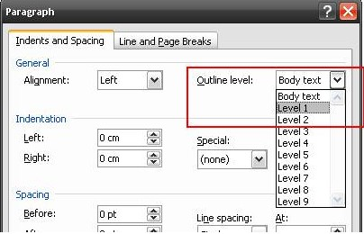

::: {style="DISPLAY: none"}
{#d2h_url_template}{#d2h_package_url style="WIDTH: 0px; DISPLAY: none; HEIGHT: 0px"}
:::

:::::::: {.d2h_secondary_topic style="PADDING-BOTTOM: 10pt; MARGIN: 0pt; PADDING-LEFT: 0pt; PADDING-RIGHT: 0pt; PADDING-TOP: 0pt"}
#### Table Of Contents {#table-of-contents style="tab-stops: 0pt"}

 

The **TableOfContent** class represents the Table Of Contents (TOC) in the Word document.

To add the Table of Contents to the contents in the Word document, follow the steps listed below:

 

1.   Open the Insert menu and click Field.

2.   Then select the TOC field type.

 

You can use the **AppendTOC** method of the WParagraph class, to add a TOC to the DocIO document.

 

**UpperHeadingLevel** and **LowerHeadingLevel** define the number of heading levels to be displayed for the TOC. For example, if UpperHeadingLevel is set to 4 and LowerHeadingLevel is set to 3, then TOC will display heading levels from third to fourth.

 

**SetTOCLevelStyle** method sets the style for each TOC level. For example, **SetTOCLevelStyle**(1, \"Normal\") will set the **Normal** style for the first level of TOC.

 

**UpdatingTableOfContents** method of WordDocument class updates table of contents field in the word document. Internally Essential DocIO updates page number in table of contents using the Doc to PDF layout engine. Hence the limitations are similar to the limitation in Doc to PDF lay outing.

 

::: {style="BORDER-BOTTOM: windowtext 1pt solid; BORDER-LEFT: medium none; PADDING-BOTTOM: 1pt; MARGIN-TOP: 9pt; PADDING-LEFT: 0pt; PADDING-RIGHT: 0pt; MARGIN-BOTTOM: 9pt; BORDER-TOP: windowtext 1pt solid; BORDER-RIGHT: medium none; PADDING-TOP: 1pt"}
Note: Updating Table of Contents is not supported in Silverlight platform.
:::

 

Known Limitations:

The following are the known limitations:

 

[·      ]{style="FONT-FAMILY: Symbol"}Currently Auto shapes, foot note and end note, drawing canvas are not preserved in Doc to PDF lay outing, which may leads to updating of incorrect page number.

[·      ]{style="FONT-FAMILY: Symbol"}Text wrapping support is partially handled in Doc to PDF lay outing, which may leads to updating of incorrect page number.

 

Class Hierarchy

 

ParagraphItem

            \|

            TableOfContent

 

Public Constructors

 

::: {align="center"}
  ------------------------------------------------------- -----------------------------------------------------------
  Name                                                    Description
  TableOfContent.TableOfContent (IWordDocument)           Initializes a new instance of the TableOfContent class. 
  TableOfContent.TableOfContent (IWordDocument, string)   Initializes a new instance of the TableOfContent class.  
  ------------------------------------------------------- -----------------------------------------------------------
:::

 

 

Public Properties

 

::: {align="center"}
+-----------------------------------+--------------------------------------------------------------------------------------------------------------------------------------------------------------------------------------+
| Name                              | Description                                                                                                                                                                          |
+-----------------------------------+--------------------------------------------------------------------------------------------------------------------------------------------------------------------------------------+
| EntityType                        | Gets the type of the entity.                                                                                                                                                         |
+-----------------------------------+--------------------------------------------------------------------------------------------------------------------------------------------------------------------------------------+
| IncludePageNumbers                | Gets or sets a value indicating whether to include page numbers in TOC. Default value is true.                                                                                       |
+-----------------------------------+--------------------------------------------------------------------------------------------------------------------------------------------------------------------------------------+
| LowerHeadingLevel                 | Gets or sets lower heading level (in interger).                                                                                                                                      |
+-----------------------------------+--------------------------------------------------------------------------------------------------------------------------------------------------------------------------------------+
| RightAlignPageNumbers             | Gets or sets a value indicating whether to align page numbers on the right side. Default value is *true*.                                                                            |
+-----------------------------------+--------------------------------------------------------------------------------------------------------------------------------------------------------------------------------------+
| TableID                           | Gets or sets the table ID (for TC fields).                                                                                                                                           |
+-----------------------------------+--------------------------------------------------------------------------------------------------------------------------------------------------------------------------------------+
| UpperHeadingLevel                 | Gets or sets upper heading level (in interger).                                                                                                                                      |
+-----------------------------------+--------------------------------------------------------------------------------------------------------------------------------------------------------------------------------------+
| UseHeadingStyles                  | Gets or sets a value indicating whether to use base heading style (Heading 1...Heading 9).                                                                                           |
+-----------------------------------+--------------------------------------------------------------------------------------------------------------------------------------------------------------------------------------+
| UseHyperlinks                     | Gets or sets a value indicating whether to insert TOC entries as hyperlinks.                                                                                                         |
+-----------------------------------+--------------------------------------------------------------------------------------------------------------------------------------------------------------------------------------+
| UseOutlineLevels                  | Gets or sets a value indicating whether to use outline levels.                                                                                                                       |
|                                   |                                                                                                                                                                                      |
|                                   |                                                                                                                                                                                      |
|                                   |                                                                                                                                                                                      |
|                                   |                                                                                                                                                                                      |
+-----------------------------------+--------------------------------------------------------------------------------------------------------------------------------------------------------------------------------------+
| UseTableEntryFields               | Gets or sets a value indicating whether the table will be built from TC fields. If the TableID property is defined, the table is built only from TC fields with the same identifier. |
+-----------------------------------+--------------------------------------------------------------------------------------------------------------------------------------------------------------------------------------+
:::

 

::: {style="BORDER-BOTTOM: windowtext 1pt solid; BORDER-LEFT: medium none; PADDING-BOTTOM: 1pt; MARGIN-TOP: 9pt; PADDING-LEFT: 0pt; PADDING-RIGHT: 0pt; MARGIN-BOTTOM: 9pt; BORDER-TOP: windowtext 1pt solid; BORDER-RIGHT: medium none; PADDING-TOP: 1pt"}
Note: DocIO can\'t create Outline levels. However, enabling UseOutlineLevels property allow TOC creation from existing outline levels.
:::

 

{border="0"}

Figure 69:Outline Levels

 

Public Methods

 

::: {align="center"}
  ---------------------- --------------------------------------
  Name                   Description
  GetTOCLevelStyleName   Gets the style name for TOC level.  
  SetTOCLevelStyle       Sets the style for TOC level.
  ---------------------- --------------------------------------
:::

 

The following code illustrates how to insert TOC, based on custom styles.

*[]{style="COLOR: red"}* 

+-------------------------------------------------------------------------------------------------------------------------------------------------------------------------------------------------------------+
| **[\[C#\]]{style="FONT-FAMILY: 'Courier New'; COLOR: black"}**                                                                                                                                              |
|                                                                                                                                                                                                             |
|                                                                                                                                                                                                             |
|                                                                                                                                                                                                             |
| [WordDocument]{style="FONT-FAMILY: 'Courier New'; COLOR: teal"}[ doc = [new]{style="COLOR: blue"} WordDocument();]{style="FONT-FAMILY: 'Courier New'"}                                                      |
|                                                                                                                                                                                                             |
| [doc.EnsureMinimal();]{style="FONT-FAMILY: 'Courier New'"}                                                                                                                                                  |
|                                                                                                                                                                                                             |
| []{style="FONT-FAMILY: 'Courier New'"}                                                                                                                                                                      |
|                                                                                                                                                                                                             |
| [WParagraph]{style="FONT-FAMILY: 'Courier New'; COLOR: teal"}[ para = doc.LastParagraph;]{style="FONT-FAMILY: 'Courier New'"}                                                                               |
|                                                                                                                                                                                                             |
| [TableOfContent toc = para.AppendTOC(1, 1);]{style="FONT-FAMILY: 'Courier New'"}                                                                                                                            |
|                                                                                                                                                                                                             |
| []{style="FONT-FAMILY: 'Courier New'"}                                                                                                                                                                      |
|                                                                                                                                                                                                             |
| [toc.UseHeadingStyles = [false;]{style="COLOR: blue"}]{style="FONT-FAMILY: 'Courier New'"}                                                                                                                  |
|                                                                                                                                                                                                             |
| **[]{style="FONT-FAMILY: 'Courier New'; COLOR: blue"}**                                                                                                                                                     |
|                                                                                                                                                                                                             |
| [// Set the TOC level style based on which the TOC should be created.]{style="FONT-FAMILY: 'Courier New'; COLOR: green"}                                                                                    |
|                                                                                                                                                                                                             |
| [toc. SetTOCLevelStyle(1, [\"MyStyle1\"]{style="COLOR: maroon"});]{style="FONT-FAMILY: 'Courier New'"}                                                                                                      |
|                                                                                                                                                                                                             |
| []{style="FONT-FAMILY: 'Courier New'"}                                                                                                                                                                      |
|                                                                                                                                                                                                             |
| [WSection]{style="FONT-FAMILY: 'Courier New'; COLOR: teal"}[ section = doc.LastSection;]{style="FONT-FAMILY: 'Courier New'"}                                                                                |
|                                                                                                                                                                                                             |
| [WParagraph]{style="FONT-FAMILY: 'Courier New'; COLOR: teal"}[ newPara = section.AddParagraph() [as]{style="COLOR: blue"} WParagraph;]{style="FONT-FAMILY: 'Courier New'"}                                  |
|                                                                                                                                                                                                             |
| [WTextRange]{style="FONT-FAMILY: 'Courier New'; COLOR: teal"}[ text = newPara.AppendText([\"My Style1\"]{style="COLOR: maroon"}) [as]{style="COLOR: blue"} WTextRange;]{style="FONT-FAMILY: 'Courier New'"} |
|                                                                                                                                                                                                             |
| [newPara.ApplyStyle(\"MyStyle1\");]{style="FONT-FAMILY: 'Courier New'"}                                                                                                                                     |
|                                                                                                                                                                                                             |
| []{style="FONT-FAMILY: 'Courier New'; COLOR: green"}                                                                                                                                                        |
|                                                                                                                                                                                                             |
| [//]{style="FONT-FAMILY: 'Courier New'; COLOR: green"}[ ]{style="FONT-FAMILY: 'Courier New'; COLOR: green"}[Updates the table of contents.]{style="FONT-FAMILY: 'Courier New'; COLOR: green"}               |
|                                                                                                                                                                                                             |
| [doc.UpdateTableOfContents();]{style="FONT-FAMILY: 'Courier New'"}[]{style="FONT-FAMILY: 'Courier New'"}                                                                                                    |
+-------------------------------------------------------------------------------------------------------------------------------------------------------------------------------------------------------------+

 

+-------------------------------------------------------------------------------------------------------------------------------------------------------------------------------------------------------------------------------------------------+
| **[\[VB.NET\]]{style="FONT-FAMILY: 'Courier New'; COLOR: black"}**                                                                                                                                                                              |
|                                                                                                                                                                                                                                                 |
| []{style="COLOR: black"}                                                                                                                                                                                                                        |
|                                                                                                                                                                                                                                                 |
| [Dim]{style="FONT-FAMILY: 'Courier New'; COLOR: blue"}[ doc [As]{style="COLOR: blue"} [New]{style="COLOR: blue"} WordDocument()]{style="FONT-FAMILY: 'Courier New'"}                                                                            |
|                                                                                                                                                                                                                                                 |
| [doc.EnsureMinimal() ]{style="FONT-FAMILY: 'Courier New'"}                                                                                                                                                                                      |
|                                                                                                                                                                                                                                                 |
| []{style="FONT-FAMILY: 'Courier New'"}                                                                                                                                                                                                          |
|                                                                                                                                                                                                                                                 |
| [Dim]{style="FONT-FAMILY: 'Courier New'; COLOR: blue"}[ para [As]{style="COLOR: blue"} WParagraph = doc.LastParagraph]{style="FONT-FAMILY: 'Courier New'"}                                                                                      |
|                                                                                                                                                                                                                                                 |
| [Dim]{style="FONT-FAMILY: 'Courier New'; COLOR: blue"}[ toc [As]{style="COLOR: blue"} TableOfContent = para.AppendTOC(1, 1)]{style="FONT-FAMILY: 'Courier New'"}                                                                                |
|                                                                                                                                                                                                                                                 |
| []{style="FONT-FAMILY: 'Courier New'"}                                                                                                                                                                                                          |
|                                                                                                                                                                                                                                                 |
| [toc.UseHeadingStyles = [false]{style="COLOR: blue"}]{style="FONT-FAMILY: 'Courier New'"}                                                                                                                                                       |
|                                                                                                                                                                                                                                                 |
| **[]{style="FONT-FAMILY: 'Courier New'; COLOR: blue"}**                                                                                                                                                                                         |
|                                                                                                                                                                                                                                                 |
| [\' Set the TOC level style based on which the TOC should be created.]{style="FONT-FAMILY: 'Courier New'; COLOR: green"}                                                                                                                        |
|                                                                                                                                                                                                                                                 |
| [toc.SetTOCLevelStyle(1, [\"MyStyle1\"]{style="COLOR: maroon"}) ]{style="FONT-FAMILY: 'Courier New'"}                                                                                                                                           |
|                                                                                                                                                                                                                                                 |
| []{style="FONT-FAMILY: 'Courier New'"}                                                                                                                                                                                                          |
|                                                                                                                                                                                                                                                 |
| [Dim]{style="FONT-FAMILY: 'Courier New'; COLOR: blue"}[ section [As]{style="COLOR: blue"} WSection = doc.LastSection]{style="FONT-FAMILY: 'Courier New'"}                                                                                       |
|                                                                                                                                                                                                                                                 |
| [Dim]{style="FONT-FAMILY: 'Courier New'; COLOR: blue"}[ newPara [As]{style="COLOR: blue"} WParagraph = [TryCast]{style="COLOR: blue"}(section.AddParagraph(), WParagraph)]{style="FONT-FAMILY: 'Courier New'"}                                  |
|                                                                                                                                                                                                                                                 |
| [Dim]{style="FONT-FAMILY: 'Courier New'; COLOR: blue"}[ text [As]{style="COLOR: blue"} WTextRange = [TryCast]{style="COLOR: blue"}(newPara.AppendText([\"My Style1\"]{style="COLOR: maroon"}), WTextRange)]{style="FONT-FAMILY: 'Courier New'"} |
|                                                                                                                                                                                                                                                 |
| [newPara.ApplyStyle(\"MyStyle1\")]{style="FONT-FAMILY: 'Courier New'"}                                                                                                                                                                          |
|                                                                                                                                                                                                                                                 |
| []{style="FONT-FAMILY: Consolas; COLOR: green; FONT-SIZE: 9.5pt"}                                                                                                                                                                               |
|                                                                                                                                                                                                                                                 |
| [\']{style="FONT-FAMILY: 'Courier New'; COLOR: green"}[ ]{style="FONT-FAMILY: 'Courier New'; COLOR: green"}[Updates the table of contents.]{style="FONT-FAMILY: 'Courier New'; COLOR: green"}[]{style="FONT-FAMILY: 'Courier New'"}             |
|                                                                                                                                                                                                                                                 |
| [doc.UpdateTableOfContents()]{style="FONT-FAMILY: 'Courier New'"}[]{style="FONT-FAMILY: 'Courier New'"}                                                                                                                                         |
+-------------------------------------------------------------------------------------------------------------------------------------------------------------------------------------------------------------------------------------------------+

 

 

 

 

[]{#related-topics}
::::::::
