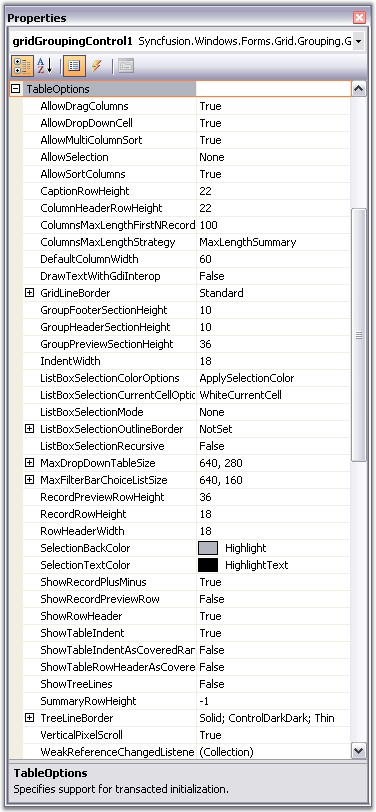
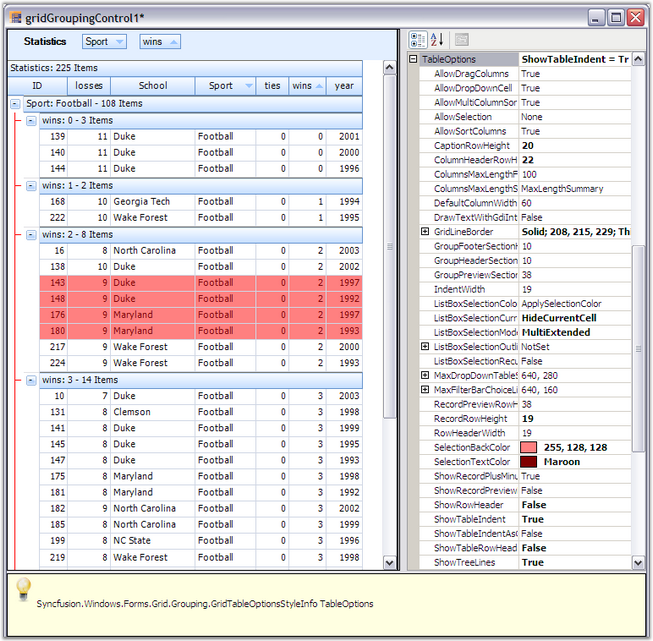

::: {style="DISPLAY: none"}
{#d2h_url_template}{#d2h_package_url style="WIDTH: 0px; DISPLAY: none; HEIGHT: 0px"}
:::

::::: {.d2h_secondary_topic style="PADDING-BOTTOM: 10pt; MARGIN: 0pt; PADDING-LEFT: 0pt; PADDING-RIGHT: 0pt; PADDING-TOP: 0pt"}
##### Table Options {#table-options style="tab-stops: 0pt"}

[]{style="FONT-FAMILY: 'Trebuchet MS','sans-serif'; COLOR: #15428b; FONT-SIZE: 9pt"} 

**TableOptions** lets you set various properties that will affect the look and behavior of a grouping grid across all groups and child groups. Properties such as the default height of a Caption Row, GroupHeader / Footer, PreviewRow or whether TreeLines are visible between the PlusMinus cells are controlled by this property. Here is a screen shot that shows the list of properties you can set under TableOptions.

[]{style="FONT-FAMILY: 'Trebuchet MS','sans-serif'; COLOR: #15428b; FONT-SIZE: 9pt"} 

{border="0"}

[]{style="FONT-FAMILY: 'Trebuchet MS','sans-serif'; COLOR: #15428b; FONT-SIZE: 9pt"} 

*[Figure ]{style="FONT-SIZE: 9pt"}[338]{style="FONT-SIZE: 9pt"}[: TableOptions Properties]{style="FONT-SIZE: 9pt"}*

[]{style="FONT-FAMILY: 'Trebuchet MS','sans-serif'; COLOR: #15428b; FONT-SIZE: 9pt"} 

[]{style="FONT-FAMILY: 'Trebuchet MS','sans-serif'; COLOR: #15428b; FONT-SIZE: 9pt"} 

Below table gives a brief description on the above properties.

 

::: {align="center"}
  ------------------------------------- -------------------------------------------------------------------------------------------------------------------------------------------------------------------
  TableOptions Property                 Description
  AllowDragColumns                      Allows the user to re-arrange columns by dragging the headers.
  AllowDropDownCell                     Decides whether combo boxes are displayed for foreign key reference columns.
  AllowSelection                        Defines the selection behavior. Set it to none to use record selections.
  AllowSortColumns                      Allows user to sort the columns by clicking the column header.
  AllowMultiColumnSort                  Allows user to sort the table by multiple columns.
  CaptionRowHeight                      Displays height of caption rows in pixels.
  ColumnHeaderRowHeight                 Displays height of column header rows in pixels.
  ColumnsMaxLengthFirstNRecords         Number of rows to be evaluated for GridColumnsMaxLengthStrategy.FirstNRecords.
  ColumnsMaxLengthStrategy              Defines strategy for re sizing columns to optimal width.
  DefaultColumnWidth                    Default width for columns.
  DrawTextWithGdiInterop                Specifies whether the text should be drawn using GDI interop routines.
  GridLineBorder                        Controls the style of the lines used to draw grid lines.
  GridVisualStyles                      Specifies the skin for the grid.
  GroupFooterSectionHeight              Displays height of group footers in pixels.
  GroupHeaderSectionHeight              Displays height of group headers in pixels.
  GroupPreviewSectionHeight             Displays height of group previews in pixels.
  IndentWidth                           Displays width of the indentation of each child group in pixels.
  ListBoxSelectionColor Option          Controls the appearance of selected cells.
  ListBoxSelectionCurrentCell Options   Controls the appearance and behavior of the current cell when the ListBoxSelectionMode is set.
  ListBoxSelectionMode                  Enables list box-type selection behavior when the user moves the current cell.
  MaxDropDownTableSize                  Maximum size for the dropdown table associated with foreign keys.
  RecordPreviewRowHeight                Displays height of the record previews in pixels.
  RecordRowHeight                       Displays height of the record rows in pixels.
  RowHeaderWidth                        Displays width of the row header cells in pixels.
  SelectionBackColor                    Sets background color for selected records.
  SelectionTextColor                    Sets text color for selected records.
  ShowRecordPlusMinus                   Indicates whether a PlusMinus cell should appear next to  the records; only applicable for nested tables.
  ShowRecordPreviewRow                  Indicates whether a nested table has a preview row; only applicable for nested tables.
  ShowRowHeader                         Indicates whether the row header column should be visible.
  ShowTableIndent                       Indicates whether children of the records in the parent table should be indented; only applicable for nested tables.
  ShowTableIndentAsCoveredRange         Indicates whether the cells in a particular indent level are treated as a single covered cell; only applicable for nested tables.
  ShowTableRowHeaderAsCoveredRange      Indicates whether the row header cells for a particular nested table are treated as a single covered cell; only applicable for nested tables.
  ShowTreeLines                         Indicates whether the PlusMinus cells are shown connected with lines.
  SummaryRowHeight                      Height in pixels of the summary rows. The value -1 is a special setting to indicate that the summary row height should always be the same as the RecordRowHeight.
  TreeLineBorder                        Controls the style of the line that is used to draw the tree lines.
  ------------------------------------- -------------------------------------------------------------------------------------------------------------------------------------------------------------------
:::

[]{style="FONT-FAMILY: 'Trebuchet MS','sans-serif'; COLOR: #15428b; FONT-SIZE: 9pt"} 

In the Preview, try various property settings to see their effect on the display. Below is a sample of what you might see. The properties changed here are CaptionRowHeight, ColumnHeaderRowHeight, GridLineBorder, GridVisualStyles, ListBoxSelectionMode, SelectionBackColor, SelectionTextColor and ShowTreeLines.

[]{style="FONT-FAMILY: 'Trebuchet MS','sans-serif'; COLOR: #15428b; FONT-SIZE: 9pt"} 

{border="0"}

[]{style="FONT-FAMILY: 'Trebuchet MS','sans-serif'; COLOR: #15428b; FONT-SIZE: 9pt"} 

*[Figure ]{style="FONT-SIZE: 9pt"}[339]{style="FONT-SIZE: 9pt"}[: Customized Groups and Child Groups of Grid Grouping Control]{style="FONT-SIZE: 9pt"}*

[]{style="FONT-FAMILY: 'Trebuchet MS','sans-serif'; COLOR: #15428b; FONT-SIZE: 9pt"} 

::: {style="BORDER-BOTTOM: windowtext 1pt solid; BORDER-LEFT: medium none; PADDING-BOTTOM: 1pt; MARGIN-TOP: 9pt; PADDING-LEFT: 0pt; PADDING-RIGHT: 0pt; MARGIN-BOTTOM: 9pt; BORDER-TOP: windowtext 1pt solid; BORDER-RIGHT: medium none; PADDING-TOP: 1pt"}
{border="0"}Note: For more details, refer the following browser sample:

 

\<Install Location\>\\Syncfusion\\EssentialStudio\\\[Version Number\]\\Windows\\Grid.Grouping.Windows\\Samples\\2.0\\Grouping Grid Options\\Table Options Demo
:::

 

[]{#p457} 

 

[]{#related-topics}
:::::
