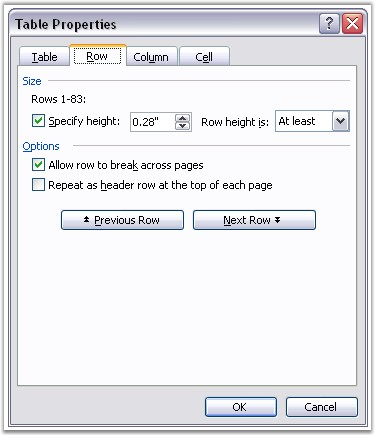

::: {style="DISPLAY: none"}
{#d2h_url_template}{#d2h_package_url style="WIDTH: 0px; DISPLAY: none; HEIGHT: 0px"}
:::

:::::: {.d2h_secondary_topic style="PADDING-BOTTOM: 10pt; MARGIN: 0pt; PADDING-LEFT: 0pt; PADDING-RIGHT: 0pt; PADDING-TOP: 0pt"}
#### Table Row {#table-row style="tab-stops: 0pt"}

 

**WTableRow** class represents a table row in the Word document. WTableRow class has a collection of table cells (WTableCell objects). Formatting for a table row is defined by the **RowFormat** property. This property returns the object of the RowFormat type.

 

**Table Row Height**

 

Table row height is of two types.

 

[·      ]{style="FONT-FAMILY: Symbol"}AtLeast

[·      ]{style="FONT-FAMILY: Symbol"}Exactly

 

The height type for the table row is defined by the **HeightType** property. When the height type is set to AtLeast, the height of the table row is just enough to fit the text. When the height type is set to Exactly, the row height is specified by the **Height** property, in terms of points.

 

The following screen shot illustrates how to set the above properties by using the Table Properties dialog box in MS Word.

 

{border="0"}

Figure 38: Table Properties Dialog Box

 

**Adding Cells**

 

You can use the **AddCell** and **AddCell(bool isCopyFormat)** functions to add new cells to the table row, where **isCopyFormat** parameter defines whether to apply the formatting of the upper cell to the added cell.

 

AddCell function without parameters is the same as **AddCell(true)**.

 

**Public Constructors**

 

::: {align="center"}
  ------------------------------------- ------------------------------------------------------
  Name                                  Description
  WTableRow.WTableRow (IWordDocument)   Initializes a new instance of the WTableRow class.  
  ------------------------------------- ------------------------------------------------------
:::

 

Public Properties

 

::: {align="center"}
  --------------- -------------------------------------------------
  Name            Description
  Cells           Gets or sets cell collection.  
  ChildEntities   Gets the child entities.  
  EntityType      Gets the type of the entity.  
  Height          Gets or sets the height of the row (in points)
  HeightType      Get or set table row height type.  
  IsHeader        Gets or sets whether the row is a table header.
  RowFormat       Gets table format.  
  --------------- -------------------------------------------------
:::

 

Public Methods

 

::: {align="center"}
  ------------- ----------------------------------------------------
  Name          Description
  AddCell       Adds a cell.
  Clone         Clones this instance.  
  GetRowIndex   Returns index of the row in owner table.    
  WTableRow     Initializes a new instance of the WTableRow class.
  ------------- ----------------------------------------------------
:::

[]{#related-topics}
::::::
