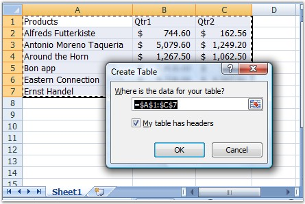

::: {style="DISPLAY: none"}
{#d2h_url_template}{#d2h_package_url style="WIDTH: 0px; DISPLAY: none; HEIGHT: 0px"}
:::

::::: {#nsbanner .d2h_main_nsbanner style="BORDER-BOTTOM: #999999 1px solid; POSITION: relative; PADDING-BOTTOM: 0px; BACKGROUND-COLOR: transparent; PADDING-LEFT: 0px; PADDING-RIGHT: 0px; DISPLAY: none; BORDER-TOP: #999999 1px solid; PADDING-TOP: 0px; LEFT: 0px"}
:::: {#TitleRow .d2h_main_titlerow style="PADDING-BOTTOM: 4px; BACKGROUND-COLOR: transparent; PADDING-LEFT: 22px; WIDTH: 100%; PADDING-RIGHT: 10px; DISPLAY: none; PADDING-TOP: 4px"}
::: {#ienav .d2h_main_ienav style="DISPLAY: none"}
{#D2HPrevious .D2HPreviousEnabled}  {#D2HNext .D2HNextEnabled}
:::
::::
:::::

:::: {#nstext .d2h_main_nstext style="PADDING-BOTTOM: 10px; BACKGROUND-COLOR: transparent; PADDING-LEFT: 22px; PADDING-RIGHT: 10px; HEIGHT: 100%; OVERFLOW: auto; PADDING-TOP: 5px" hasuserbackground="true" valign="bottom"}
::: {#d2h_breadcrumbs .d2h_breadcrumbs}
[Essential Studio User Guide Documentation](ms-xhelp:///?Id=12457748-09e3-4d74-a240-8e049cedf030){.d2h_breadcrumbsNormal}[ \> ]{.d2h_breadcrumbsLinkSeparator}[Reporting Edition](ms-xhelp:///?Id=027aa5b6-6676-4f93-ad23-c20e8c45792e){.d2h_breadcrumbsNormal}[ \> ]{.d2h_breadcrumbsLinkSeparator}[Essential XlsIO](ms-xhelp:///?Id=b01a1b50-1d7d-40c0-bc83-af67e57c9005){.d2h_breadcrumbsNormal}[ \> ]{.d2h_breadcrumbsLinkSeparator}[Concepts and Features](ms-xhelp:///?Id=21b26556-5905-4ad9-90b4-40320db25faf){.d2h_breadcrumbsNormal}[ \> ]{.d2h_breadcrumbsLinkSeparator}[Insert](ms-xhelp:///?Id=3b5c8a38-7946-47f2-a4af-0711da3daaa8){.d2h_breadcrumbsNormal}
:::

### Tables {#tables style="tab-stops: 0pt"}

 

In Excel, Tables can be inserted by selecting Table option from the Insert menu.

 

Table Creation By Using XlsIO

[]{style="FONT-FAMILY: 'Trebuchet MS','sans-serif'; COLOR: #15428b; FONT-SIZE: 9pt"} 

XlsIO provides support to read and write tables in a spreadsheet. The table is added as an **IListObject** to the worksheet. The input data to the table must be a range of data existing in the worksheet. IListObject returns the collection of tables in the worksheet.

[]{style="FONT-FAMILY: 'Trebuchet MS','sans-serif'; COLOR: #15428b; FONT-SIZE: 9pt"} 

+--------------------------------------------------------------------------------------------------------------------------------------------------------------------------+
| **[\[C#\]]{style="FONT-FAMILY: 'Courier New'"}**                                                                                                                         |
|                                                                                                                                                                          |
| **[]{style="FONT-FAMILY: 'Courier New'"}**                                                                                                                               |
|                                                                                                                                                                          |
| [// Create Table]{style="FONT-FAMILY: 'Courier New'; COLOR: green"}                                                                                                      |
|                                                                                                                                                                          |
| [IListObject table1 = sheet.ListObjects.Create([\"Table1\"]{style="COLOR: #a31515"}, sheet\[[\"A1:C8\"]{style="COLOR: #a31515"}\]);]{style="FONT-FAMILY: 'Courier New'"} |
+--------------------------------------------------------------------------------------------------------------------------------------------------------------------------+

[]{style="FONT-FAMILY: 'Trebuchet MS','sans-serif'; COLOR: #15428b; FONT-SIZE: 9pt"} 

+--------------------------------------------------------------------------------------------------------------------------------------------------------------------------------------------------------------------------------------------------------+
| **[\[VB.NET\]]{style="FONT-FAMILY: 'Courier New'"}**                                                                                                                                                                                                   |
|                                                                                                                                                                                                                                                        |
| **[]{style="FONT-FAMILY: 'Courier New'"}**                                                                                                                                                                                                             |
|                                                                                                                                                                                                                                                        |
| [\' Create Table]{style="FONT-FAMILY: 'Courier New'; COLOR: green"}                                                                                                                                                                                    |
|                                                                                                                                                                                                                                                        |
| [Dim]{style="FONT-FAMILY: 'Courier New'; COLOR: blue"}[ table1 [As]{style="COLOR: blue"} IListObject = sheet.ListObjects.Create([\"Table1\"]{style="COLOR: #a31515"}, sheet([\"A1:C8\"]{style="COLOR: #a31515"}))]{style="FONT-FAMILY: 'Courier New'"} |
+--------------------------------------------------------------------------------------------------------------------------------------------------------------------------------------------------------------------------------------------------------+

[]{style="FONT-FAMILY: 'Trebuchet MS','sans-serif'; COLOR: #15428b; FONT-SIZE: 9pt"} 

Total Row

[]{style="FONT-FAMILY: 'Trebuchet MS','sans-serif'; COLOR: #15428b; FONT-SIZE: 9pt"} 

You can add the \"Total Row\" to any table by accessing the **Table Columns**. Columns in the tables are accessed by using the index. It is possible to set \"Totals Calculation\" to the Total Row cells by using the **ExcelTotalsCalculation** enumerator. These cells will be updated once they are calculated.

[]{style="FONT-FAMILY: 'Trebuchet MS','sans-serif'; COLOR: #15428b; FONT-SIZE: 9pt"} 

+----------------------------------------------------------------------------------------------------------------------------------+
| **[\[C#\]]{style="FONT-FAMILY: 'Courier New'"}**                                                                                 |
|                                                                                                                                  |
| **[]{style="FONT-FAMILY: 'Courier New'"}**                                                                                       |
|                                                                                                                                  |
| [// Total Row]{style="FONT-FAMILY: 'Courier New'; COLOR: green"}                                                                 |
|                                                                                                                                  |
| [table1.Columns\[0\].TotalsRowLabel = [\"Total\"]{style="COLOR: #a31515"};]{style="FONT-FAMILY: 'Courier New'"}                  |
|                                                                                                                                  |
| [table1.Columns\[1\].TotalsCalculation = [ExcelTotalsCalculation]{style="COLOR: teal"}.Sum;]{style="FONT-FAMILY: 'Courier New'"} |
|                                                                                                                                  |
| [table1.Columns\[2\].TotalsCalculation = [ExcelTotalsCalculation]{style="COLOR: teal"}.Sum;]{style="FONT-FAMILY: 'Courier New'"} |
+----------------------------------------------------------------------------------------------------------------------------------+

[]{style="FONT-FAMILY: 'Trebuchet MS','sans-serif'; COLOR: #15428b; FONT-SIZE: 9pt"} 

+--------------------------------------------------------------------------------------------------------------+
| **[\[VB.NET\]]{style="FONT-FAMILY: 'Courier New'"}**                                                         |
|                                                                                                              |
| **[]{style="FONT-FAMILY: 'Courier New'"}**                                                                   |
|                                                                                                              |
| [\' Total Row]{style="FONT-FAMILY: 'Courier New'; COLOR: green"}                                             |
|                                                                                                              |
| [table1.Columns(0).TotalsRowLabel = [\"Total\"]{style="COLOR: #a31515"}]{style="FONT-FAMILY: 'Courier New'"} |
|                                                                                                              |
| [table1.Columns(1).TotalsCalculation = ExcelTotalsCalculation.Sum]{style="FONT-FAMILY: 'Courier New'"}       |
|                                                                                                              |
| [table1.Columns(2).TotalsCalculation = ExcelTotalsCalculation.Sum]{style="FONT-FAMILY: 'Courier New'"}       |
+--------------------------------------------------------------------------------------------------------------+

[]{style="FONT-FAMILY: 'Trebuchet MS','sans-serif'; COLOR: #15428b; FONT-SIZE: 9pt"} 

Formatting Table

[]{style="FONT-FAMILY: 'Trebuchet MS','sans-serif'; COLOR: #15428b; FONT-SIZE: 9pt"} 

You can apply built-in styles for the tables by using the **TableBuiltInStyles** enumerator of XlsIO.

[]{style="FONT-FAMILY: 'Trebuchet MS','sans-serif'; COLOR: #15428b; FONT-SIZE: 9pt"} 

+-------------------------------------------------------------------------------------------------------------------------------+
| **[\[C#\]]{style="FONT-FAMILY: 'Courier New'"}**                                                                              |
|                                                                                                                               |
| **[]{style="FONT-FAMILY: 'Courier New'"}**                                                                                    |
|                                                                                                                               |
| [// Apply built-in style.]{style="FONT-FAMILY: 'Courier New'; COLOR: green"}                                                  |
|                                                                                                                               |
| [table1.BuiltInTableStyle = [TableBuiltInStyles]{style="COLOR: teal"}.TableStyleMedium9;]{style="FONT-FAMILY: 'Courier New'"} |
+-------------------------------------------------------------------------------------------------------------------------------+

[]{style="FONT-FAMILY: 'Trebuchet MS','sans-serif'; COLOR: #15428b; FONT-SIZE: 9pt"} 

+-------------------------------------------------------------------------------------------------------+
| **[\[VB.NET\]]{style="FONT-FAMILY: 'Courier New'"}**                                                  |
|                                                                                                       |
| **[]{style="FONT-FAMILY: 'Courier New'"}**                                                            |
|                                                                                                       |
| [\' Apply built-in style.]{style="FONT-FAMILY: 'Courier New'; COLOR: green"}                          |
|                                                                                                       |
| [table1.BuiltInTableStyle = TableBuiltInStyles.TableStyleMedium9]{style="FONT-FAMILY: 'Courier New'"} |
+-------------------------------------------------------------------------------------------------------+

[]{style="FONT-FAMILY: 'Trebuchet MS','sans-serif'; COLOR: #15428b; FONT-SIZE: 9pt"} 

Reading Existing Table

[]{style="FONT-FAMILY: 'Trebuchet MS','sans-serif'; COLOR: #15428b; FONT-SIZE: 9pt"} 

XlsIO provides support to read an existing table from the spreadsheet. It can be accessed from the sheet by using the \"Table Index\".

[]{style="FONT-FAMILY: 'Trebuchet MS','sans-serif'; COLOR: #15428b; FONT-SIZE: 9pt"} 

+------------------------------------------------------------------------------------------------------------------------------+
| **[\[C#\]]{style="FONT-FAMILY: 'Courier New'"}**                                                                             |
|                                                                                                                              |
| **[]{style="FONT-FAMILY: 'Courier New'"}**                                                                                   |
|                                                                                                                              |
| [IListObject table = sheet.ListObjects\[0\];]{style="FONT-FAMILY: 'Courier New'"}                                            |
|                                                                                                                              |
| [table.BuiltInTableStyle = [TableBuiltInStyles]{style="COLOR: teal"}.TableStyleMedium1;]{style="FONT-FAMILY: 'Courier New'"} |
+------------------------------------------------------------------------------------------------------------------------------+

[]{style="FONT-FAMILY: 'Trebuchet MS','sans-serif'; COLOR: #15428b; FONT-SIZE: 9pt"} 

+-------------------------------------------------------------------------------------------------------------------------------------------------------------------+
| **[\[VB.NET\]]{style="FONT-FAMILY: 'Courier New'"}**                                                                                                              |
|                                                                                                                                                                   |
| **[]{style="FONT-FAMILY: 'Courier New'"}**                                                                                                                        |
|                                                                                                                                                                   |
| [Dim]{style="FONT-FAMILY: 'Courier New'; COLOR: blue"}[ table [As]{style="COLOR: blue"} IListObject = sheet.ListObjects\[0\]]{style="FONT-FAMILY: 'Courier New'"} |
|                                                                                                                                                                   |
| [table.BuiltInTableStyle = TableBuiltInStyles.TableStyleMedium1]{style="FONT-FAMILY: 'Courier New'"}                                                              |
+-------------------------------------------------------------------------------------------------------------------------------------------------------------------+

[]{style="FONT-FAMILY: 'Trebuchet MS','sans-serif'; COLOR: #15428b; FONT-SIZE: 9pt"} 

{border="0"}

Figure 86: Table inserted by using Excel[]{style="FONT-FAMILY: 'Trebuchet MS','sans-serif'; COLOR: #15428b"}

 

 

[]{#related-topics}
::::
