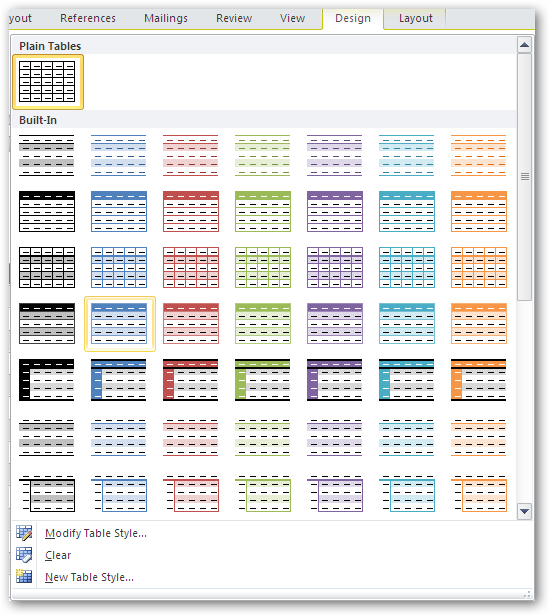

::: {style="DISPLAY: none"}
{#d2h_url_template}{#d2h_package_url style="WIDTH: 0px; DISPLAY: none; HEIGHT: 0px"}
:::

:::: {.d2h_secondary_topic style="PADDING-BOTTOM: 10pt; MARGIN: 0pt; PADDING-LEFT: 0pt; PADDING-RIGHT: 0pt; PADDING-TOP: 0pt"}
#### Table Styles {#table-styles style="tab-stops: 0pt"}

**WTableStyle** class represents table style in the Word document. Table style defines a set of formatting characteristics that can be applied to the table.

 

 

{border="0"}

Figure 41: Table Styles

 

You can apply the Word built-in table styles by using the **WTable.ApplyStyle** method with Built-inTableStyle enumeration parameter which specifies the built-in table style.

 

::: {style="BORDER-BOTTOM: windowtext 1pt solid; BORDER-LEFT: medium none; PADDING-BOTTOM: 1pt; MARGIN-TOP: 9pt; PADDING-LEFT: 0pt; PADDING-RIGHT: 0pt; MARGIN-BOTTOM: 9pt; BORDER-TOP: windowtext 1pt solid; BORDER-RIGHT: medium none; PADDING-TOP: 1pt"}
{border="0"}Note: Essential DocIO currently provides support for built-in table styles in Word2007 and Word2010 formats.
:::

 

[]{#related-topics}
::::
