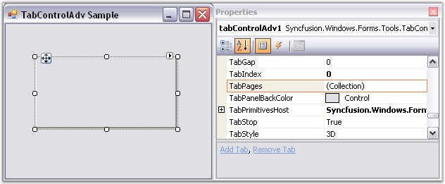
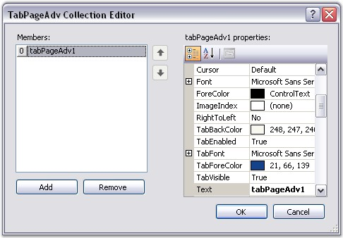
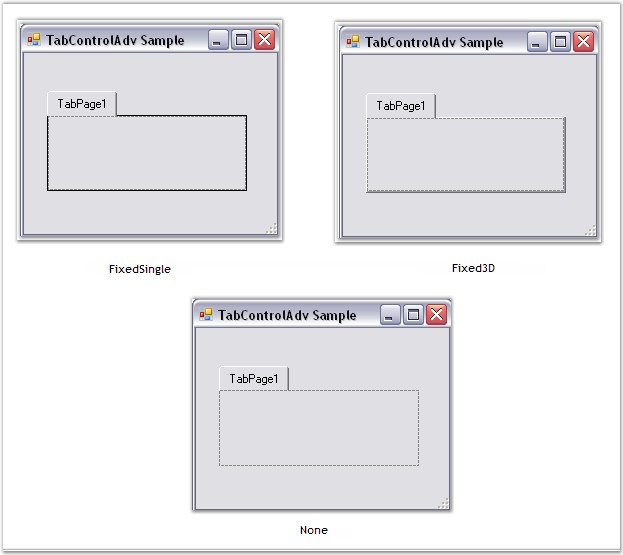
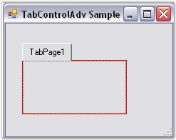

::: {style="DISPLAY: none"}
{#d2h_url_template}{#d2h_package_url style="WIDTH: 0px; DISPLAY: none; HEIGHT: 0px"}
:::

:::::: {.d2h_secondary_topic style="PADDING-BOTTOM: 10pt; MARGIN: 0pt; PADDING-LEFT: 0pt; PADDING-RIGHT: 0pt; PADDING-TOP: 0pt"}
##### TabPages {#tabpages style="MARGIN-LEFT: 18pt; tab-stops: 18.0pt"}

[]{style="COLOR: red; FONT-SIZE: 8pt"} 

TabPages

[]{style="COLOR: #15428b"} 

On Clicking the TabPages property in the Properties grid, the TabPageAdv Collection Editor will be opened.

[]{style="COLOR: #15428b"} 

{border="0"}

***[]{style="COLOR: #15428b"}*** 

Figure 1041: TabPages property in the Properties Grid

[]{style="FONT-SIZE: 8pt"} 

The TabPageAdv Collection Editor can be used to add TabPages to the TabControlAdv and customize the TabPages according to needs of the user.

[]{style="COLOR: #15428b"} 

{border="0"}

[]{style="COLOR: #15428b"} 

Figure 1042: TabPageAdv Collection Editor

 

 

 

 

###### []{#_Border_Settings_4}3.8.4.1.3.1      Border Settings {#border-settings style="MARGIN-LEFT: 18pt; tab-stops: 18.0pt"}

 

The **BorderStyle** property of TabControlAdv can be used to set the border styles for the TabPages.

 

The three types of border styles are given below.

[]{style="COLOR: #15428b"} 

[·      ]{style="FONT-FAMILY: Symbol"}FixedSingle

[·      ]{style="FONT-FAMILY: Symbol"}Fixed 3D

[·      ]{style="FONT-FAMILY: Symbol"}None

[             ]{style="COLOR: #15428b"}

::: {align="center"}
+-----------------------------------+-----------------------------------------------------------------------------------+
| TabControlAdv Property            | Description                                                                       |
+-----------------------------------+-----------------------------------------------------------------------------------+
| BorderStyle                       | Gets / sets the border styles for the tabpages. It includes the following styles: |
|                                   |                                                                                   |
|                                   |                                                                                   |
|                                   |                                                                                   |
|                                   | [·      ]{style="FONT-FAMILY: Symbol"}FixedSingle                                 |
|                                   |                                                                                   |
|                                   | [·      ]{style="FONT-FAMILY: Symbol"}Fixed3D                                     |
|                                   |                                                                                   |
|                                   | [·      ]{style="FONT-FAMILY: Symbol"}None                                        |
+-----------------------------------+-----------------------------------------------------------------------------------+
:::

[                       ]{style="COLOR: #15428b"}

{border="0"}

[]{style="COLOR: #15428b"} 

Figure 1043: Border Styles in TabControlAdv

**[]{style="COLOR: #15428b"}** 

FixedSingleBorderColor

**[]{style="COLOR: #15428b"}** 

The **FixedSingleBorderColor** property is used to set a color for the border of the TabPage in the TabControlAdv when the BorderStyle is set to FixedSingle.

[]{style="COLOR: #15428b"} 

::: {align="center"}
  ------------------------ --------------------------------------------------------------------------------------------------------------------
  TabControlAdv Property   Description
  FixedSingleBorderColor   Gets / sets a color for the border of the TabPage in the TabControlAdv when the BorderStyle is set to FixedSingle.
  ------------------------ --------------------------------------------------------------------------------------------------------------------
:::

[]{style="COLOR: #15428b"} 

 {border="0"}

[]{style="COLOR: #15428b"} 

Figure 1044: FixedSingleBorderColor set to Red

[]{style="COLOR: #15428b"} 

::: {style="BORDER-BOTTOM: windowtext 1pt solid; BORDER-LEFT: medium none; PADDING-BOTTOM: 1pt; MARGIN: 9pt 0pt 9pt 18pt; PADDING-LEFT: 0pt; PADDING-RIGHT: 0pt; BORDER-TOP: windowtext 1pt solid; BORDER-RIGHT: medium none; PADDING-TOP: 1pt"}
{border="0"} Note: The TabControlAdv.ResetFixedSingleBorderColor() method resets the border color of the TabPage to the default value.
:::

 

 

 

 

[]{#related-topics}
::::::
