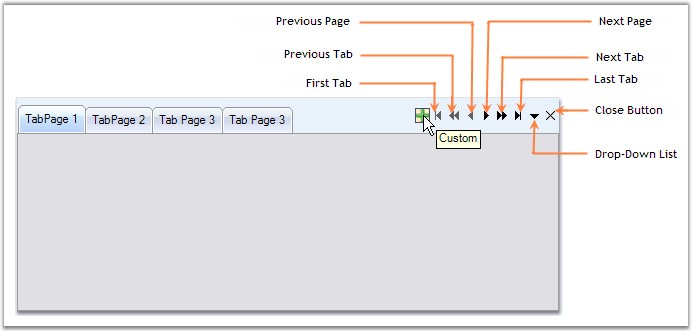
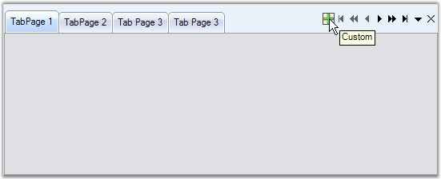

::: {style="DISPLAY: none"}
{#d2h_url_template}{#d2h_package_url style="WIDTH: 0px; DISPLAY: none; HEIGHT: 0px"}
:::

::::: {#nsbanner .d2h_main_nsbanner style="BORDER-BOTTOM: #999999 1px solid; POSITION: relative; PADDING-BOTTOM: 0px; BACKGROUND-COLOR: transparent; PADDING-LEFT: 0px; PADDING-RIGHT: 0px; DISPLAY: none; BORDER-TOP: #999999 1px solid; PADDING-TOP: 0px; LEFT: 0px"}
:::: {#TitleRow .d2h_main_titlerow style="PADDING-BOTTOM: 4px; BACKGROUND-COLOR: transparent; PADDING-LEFT: 22px; WIDTH: 100%; PADDING-RIGHT: 10px; DISPLAY: none; PADDING-TOP: 4px"}
::: {#ienav .d2h_main_ienav style="DISPLAY: none"}
{#D2HPrevious .D2HPreviousEnabled}  {#D2HNext .D2HNextEnabled}
:::
::::
:::::

:::::: {#nstext .d2h_main_nstext style="PADDING-BOTTOM: 10px; BACKGROUND-COLOR: transparent; PADDING-LEFT: 22px; PADDING-RIGHT: 10px; HEIGHT: 100%; OVERFLOW: auto; PADDING-TOP: 5px" hasuserbackground="true" valign="bottom"}
::: {#d2h_breadcrumbs .d2h_breadcrumbs}
[Essential Studio User Guide Documentation](ms-xhelp:///?Id=12457748-09e3-4d74-a240-8e049cedf030){.d2h_breadcrumbsNormal}[ \> ]{.d2h_breadcrumbsLinkSeparator}[User Interface Edition](ms-xhelp:///?Id=c29296b7-531c-413b-a0ec-488ca1f7f669){.d2h_breadcrumbsNormal}[ \> ]{.d2h_breadcrumbsLinkSeparator}[Essential Windows](ms-xhelp:///?Id=e60759d8-47a4-4570-9d7a-16a68d63f2ea){.d2h_breadcrumbsNormal}[ \> ]{.d2h_breadcrumbsLinkSeparator}[Essential Tools]{.d2h_breadcrumbsContentsOnly}[ \> ]{.d2h_breadcrumbsLinkSeparator}[Tools Controls](ms-xhelp:///?Id=13c3c4f4-9d16-4b69-93f2-7e98eec67452){.d2h_breadcrumbsNormal}[ \> ]{.d2h_breadcrumbsLinkSeparator}[Tabs Package](ms-xhelp:///?Id=204c37ee-142c-46ef-a1a3-7fdf214b25f9){.d2h_breadcrumbsNormal}
:::

### TabPrimitives {#tabprimitives style="MARGIN-LEFT: 18pt; tab-stops: 18.0pt"}

[]{style="COLOR: #15428b"} 

TabPrimitives is a collection of NavigationControls used to navigate through the TabPages of the TabControlAdv.

 

The various TabPrimitives are,

[]{style="COLOR: #15428b"} 

[·      ]{style="FONT-FAMILY: Symbol"}**FirstTab -** Goes to the first tab among the pages.

[·      ]{style="FONT-FAMILY: Symbol"}**LastTab -** Goes to the last tab among the pages.

[·      ]{style="FONT-FAMILY: Symbol"}**PreviousTab -** Goes to the previous tab of the active tab.

[·      ]{style="FONT-FAMILY: Symbol"}**NextTab -** Goes to the next tab of the active tab.

[·      ]{style="FONT-FAMILY: Symbol"}**PreviousPage -** Goes to the previous page of the active page.

[·      ]{style="FONT-FAMILY: Symbol"}**NextPage -** Goes to the next page of the active page.

[·      ]{style="FONT-FAMILY: Symbol"}**DropDown -** This pops-up a list of the available tabpages in the control from which the user can select the page to be traversed.

[·      ]{style="FONT-FAMILY: Symbol"}[[Close]{style="COLOR: windowtext; TEXT-DECORATION: none; text-underline: none"}](../../../../../../../../Documents%20and%20Settings/sylviap/Desktop/Tools%20-%20Part%202.docx#_CloseButton_Settings) **-** This button is used to close the TabControlAdv. It can be set to appear for the whole control or individual tabpages.

[·      ]{style="FONT-FAMILY: Symbol"}**Custom -** User can add more buttons through Custom TabPrimitive. This helps the user to create / add more buttons and handle their own click events.

[]{style="COLOR: #15428b"} 

{border="0"}

**[]{style="COLOR: #15428b"}** 

Figure 1046: TabPrimitives

**[]{style="COLOR: #15428b"}** 

::: {style="BORDER-BOTTOM: windowtext 1pt solid; BORDER-LEFT: medium none; PADDING-BOTTOM: 1pt; MARGIN: 9pt 0pt 9pt 18pt; PADDING-LEFT: 0pt; PADDING-RIGHT: 0pt; BORDER-TOP: windowtext 1pt solid; BORDER-RIGHT: medium none; PADDING-TOP: 1pt"}
{border="0"} Note:[ ]{style="COLOR: black; FONT-SIZE: 8pt"}The TabControlAdv.HitTestTabs() method can be used to return the tab at the specified location.
:::

**[]{style="COLOR: #15428b"}** 

TabPrimitives Features

[]{style="COLOR: #15428b"} 

Apart from doing the defined task of Navigation, TabPrimitivesHost comes with options for adding Images, ToolTips and enabling the **Visible** property for each TabPrimitive.

[]{style="COLOR: #15428b"} 

{border="0"}

**[]{style="COLOR: #15428b"}** 

Figure 1047: TabPrimitives Features

[]{style="COLOR: #15428b"} 

::: {style="BORDER-BOTTOM: windowtext 1pt solid; BORDER-LEFT: medium none; PADDING-BOTTOM: 1pt; MARGIN: 9pt 0pt 9pt 18pt; PADDING-LEFT: 0pt; PADDING-RIGHT: 0pt; BORDER-TOP: windowtext 1pt solid; BORDER-RIGHT: medium none; PADDING-TOP: 1pt"}
{border="0"} Note: You can set the other properties for adding Images and ToolTips for the TabPrimitives using the TabPrimitives Collection Editor.
:::

[]{style="COLOR: #15428b"} 

[[ToolTips]{.UGHyperlink}](../../../../../../../../Documents%20and%20Settings/sylviap/Desktop/Tools%20-%20Part%202.docx#_ToolTip_Support) feature is available for TabPrimitives.

 

 

 

 

More:

[ ]{#related-topics}

[{border="0" align="absMiddle"}Creating TabPrimitives](ms-xhelp:///?Id=1aaa93aa-f6ba-4e97-91b7-f653922f3b6c){style="TEXT-DECORATION: none"}
::::::
