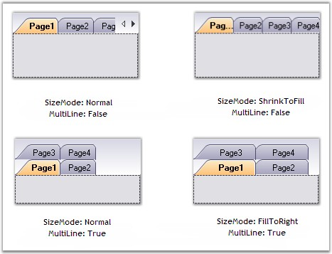

::: {style="DISPLAY: none"}
{#d2h_url_template}{#d2h_package_url style="WIDTH: 0px; DISPLAY: none; HEIGHT: 0px"}
:::

::::: {.d2h_secondary_topic style="PADDING-BOTTOM: 10pt; MARGIN: 0pt; PADDING-LEFT: 0pt; PADDING-RIGHT: 0pt; PADDING-TOP: 0pt"}
#### TabSize Settings {#tabsize-settings style="MARGIN-LEFT: 18pt; tab-stops: 18.0pt"}

[]{style="COLOR: #4a5c8c; FONT-SIZE: 8pt"} 

SizeMode

[]{style="COLOR: #15428b"} 

The SizeMode of the tabstrip allows to position the tabitems according to the selected options.

[]{style="COLOR: #15428b"} 

::: {align="center"}
+-----------------------------------+--------------------------------------------------------------------------+
| TabControlAdv property            | Description                                                              |
+-----------------------------------+--------------------------------------------------------------------------+
| SizeMode                          | Specifies how the tabs should be sized and aligned. The options include: |
|                                   |                                                                          |
|                                   |                                                                          |
|                                   |                                                                          |
|                                   | [·      ]{style="FONT-FAMILY: Symbol"}Normal,                            |
|                                   |                                                                          |
|                                   | [·      ]{style="FONT-FAMILY: Symbol"}Fixed,                             |
|                                   |                                                                          |
|                                   | [·      ]{style="FONT-FAMILY: Symbol"}FillToRight,                       |
|                                   |                                                                          |
|                                   | [·      ]{style="FONT-FAMILY: Symbol"}ShrinkToFit.                       |
+-----------------------------------+--------------------------------------------------------------------------+
:::

[]{style="COLOR: #15428b"} 

[·      ]{style="FONT-FAMILY: Symbol"}In **Normal** mode, the size of each tab depends on the text and image settings of the tab.

[·      ]{style="FONT-FAMILY: Symbol"}In **Fixed** mode, the size of each tab is the same and is the value specified in the **ItemSize** property.

[·      ]{style="FONT-FAMILY: Symbol"}In **ShrinkToFit** mode, the width of each tab is shrunk so that all the tabs are visible (this is only applicable to the tabcontrols in the single-line mode).

[·      ]{style="FONT-FAMILY: Symbol"}In **FillToRight** mode, the width of each tab is sized so that each row of tabs occupies the entire width of the ContainerControl (this is only applicable to tabcontrols with more than one row).

[]{style="COLOR: #15428b"} 

+---------------------------------------------------------------------------------------------------------------------------------------------------------------------------------+
| **[\[C#\]]{style="FONT-FAMILY: 'Courier New'; COLOR: black"}**                                                                                                                  |
|                                                                                                                                                                                 |
| **[]{style="FONT-FAMILY: 'Courier New'; COLOR: black"}**                                                                                                                        |
|                                                                                                                                                                                 |
| [this]{style="FONT-FAMILY: 'Courier New'; COLOR: blue"}[.tabControlAdv1.SizeMode = Syncfusion.Windows.Forms.Tools.TabSizeMode.Normal;]{style="FONT-FAMILY: 'Courier New'"}      |
|                                                                                                                                                                                 |
| [this]{style="FONT-FAMILY: 'Courier New'; COLOR: blue"}[.tabControlAdv1.SizeMode = Syncfusion.Windows.Forms.Tools.TabSizeMode.Fixed;]{style="FONT-FAMILY: 'Courier New'"}       |
|                                                                                                                                                                                 |
| [this]{style="FONT-FAMILY: 'Courier New'; COLOR: blue"}[.tabControlAdv1.SizeMode = Syncfusion.Windows.Forms.Tools.TabSizeMode.ShrinkToFit;]{style="FONT-FAMILY: 'Courier New'"} |
|                                                                                                                                                                                 |
| [this]{style="FONT-FAMILY: 'Courier New'; COLOR: blue"}[.tabControlAdv1.SizeMode = Syncfusion.Windows.Forms.Tools.TabSizeMode.FillToRight;]{style="FONT-FAMILY: 'Courier New'"} |
+---------------------------------------------------------------------------------------------------------------------------------------------------------------------------------+

[]{style="COLOR: #15428b"} 

+------------------------------------------------------------------------------------------------------------------------------------------------------------------------------+
| **[\[VB.NET\]]{style="FONT-FAMILY: 'Courier New'; COLOR: black"}**                                                                                                           |
|                                                                                                                                                                              |
| **[]{style="FONT-FAMILY: 'Courier New'; COLOR: black"}**                                                                                                                     |
|                                                                                                                                                                              |
| [Me]{style="FONT-FAMILY: 'Courier New'; COLOR: blue"}[.tabControlAdv1.SizeMode = Syncfusion.Windows.Forms.Tools.TabSizeMode.Normal]{style="FONT-FAMILY: 'Courier New'"}      |
|                                                                                                                                                                              |
| [Me]{style="FONT-FAMILY: 'Courier New'; COLOR: blue"}[.tabControlAdv1.SizeMode = Syncfusion.Windows.Forms.Tools.TabSizeMode.Fixed]{style="FONT-FAMILY: 'Courier New'"}       |
|                                                                                                                                                                              |
| [Me]{style="FONT-FAMILY: 'Courier New'; COLOR: blue"}[.tabControlAdv1.SizeMode = Syncfusion.Windows.Forms.Tools.TabSizeMode.ShrinkToFit]{style="FONT-FAMILY: 'Courier New'"} |
|                                                                                                                                                                              |
| [Me]{style="FONT-FAMILY: 'Courier New'; COLOR: blue"}[.tabControlAdv1.SizeMode = Syncfusion.Windows.Forms.Tools.TabSizeMode.FillToRight]{style="FONT-FAMILY: 'Courier New'"} |
+------------------------------------------------------------------------------------------------------------------------------------------------------------------------------+

[]{style="COLOR: #15428b"} 

[{border="0"}]{style="COLOR: #15428b"}[]{style="COLOR: #15428b"}

**[                      ]{style="COLOR: #15428b"}[       ]{style="FONT-FAMILY: 'Times New Roman','serif'; COLOR: black"}[]{style="FONT-FAMILY: 'Times New Roman','serif'; COLOR: black; FONT-SIZE: 11pt"}**

Figure 1056: TabControlAdv with Various Size Modes

**                 \**
 The below methods are raised when the tabcontroladv is resized.

[]{style="COLOR: #15428b"} 

::: {align="center"}
+-----------------------------------+--------------------------------------------------------------------------------------------------------------------------+
| Methods                           | Description                                                                                                              |
+-----------------------------------+--------------------------------------------------------------------------------------------------------------------------+
| AutoSize                          | Specifies whether a control should automatically resize itself to fit it\'s contents. The default value is set to False. |
|                                   |                                                                                                                          |
|                                   |                                                                                                                          |
+-----------------------------------+--------------------------------------------------------------------------------------------------------------------------+
| AutoSizeMode                      | Specifies the mode by which the user interface element automatically resizes itself. The options include:                |
|                                   |                                                                                                                          |
|                                   |                                                                                                                          |
|                                   |                                                                                                                          |
|                                   | [·      ]{style="FONT-FAMILY: Symbol"}GrowOnly - This is used only when the controls have to be expanded.                |
|                                   |                                                                                                                          |
|                                   | [·      ]{style="FONT-FAMILY: Symbol"}GrowAndShrink - This is used when the controls have to be expanded and shrunk.     |
+-----------------------------------+--------------------------------------------------------------------------------------------------------------------------+
:::

 

 

 

 

[]{#related-topics}
:::::
