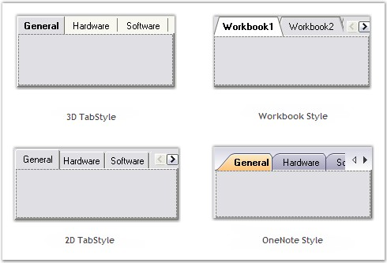

::: {style="DISPLAY: none"}
{#d2h_url_template}{#d2h_package_url style="WIDTH: 0px; DISPLAY: none; HEIGHT: 0px"}
:::

::::: {#nsbanner .d2h_main_nsbanner style="BORDER-BOTTOM: #999999 1px solid; POSITION: relative; PADDING-BOTTOM: 0px; BACKGROUND-COLOR: transparent; PADDING-LEFT: 0px; PADDING-RIGHT: 0px; DISPLAY: none; BORDER-TOP: #999999 1px solid; PADDING-TOP: 0px; LEFT: 0px"}
:::: {#TitleRow .d2h_main_titlerow style="PADDING-BOTTOM: 4px; BACKGROUND-COLOR: transparent; PADDING-LEFT: 22px; WIDTH: 100%; PADDING-RIGHT: 10px; DISPLAY: none; PADDING-TOP: 4px"}
::: {#ienav .d2h_main_ienav style="DISPLAY: none"}
{#D2HPrevious .D2HPreviousEnabled}  {#D2HNext .D2HNextEnabled}
:::
::::
:::::

:::: {#nstext .d2h_main_nstext style="PADDING-BOTTOM: 10px; BACKGROUND-COLOR: transparent; PADDING-LEFT: 22px; PADDING-RIGHT: 10px; HEIGHT: 100%; OVERFLOW: auto; PADDING-TOP: 5px" hasuserbackground="true" valign="bottom"}
::: {#d2h_breadcrumbs .d2h_breadcrumbs}
[Essential Studio User Guide Documentation](ms-xhelp:///?Id=12457748-09e3-4d74-a240-8e049cedf030){.d2h_breadcrumbsNormal}[ \> ]{.d2h_breadcrumbsLinkSeparator}[User Interface Edition](ms-xhelp:///?Id=c29296b7-531c-413b-a0ec-488ca1f7f669){.d2h_breadcrumbsNormal}[ \> ]{.d2h_breadcrumbsLinkSeparator}[Essential Windows](ms-xhelp:///?Id=e60759d8-47a4-4570-9d7a-16a68d63f2ea){.d2h_breadcrumbsNormal}[ \> ]{.d2h_breadcrumbsLinkSeparator}[Essential Tools]{.d2h_breadcrumbsContentsOnly}[ \> ]{.d2h_breadcrumbsLinkSeparator}[Tools Controls](ms-xhelp:///?Id=13c3c4f4-9d16-4b69-93f2-7e98eec67452){.d2h_breadcrumbsNormal}
:::

## Tabs Package {#tabs-package style="MARGIN-LEFT: 18pt; tab-stops: 18.0pt"}

[]{style="COLOR: #15428b"} 

**XP Tabs** is a 100% native .NET TabControl implementation that comes with a lot more configuration and customization capabilities than the Legacy Wrapper that the .NET framework comes with. It provides all the basic functionalities of a standard TabControl and much more.

[]{style="COLOR: #15428b"} 

{border="0"}

**[]{style="COLOR: #15428b"}** 

Figure 1029: Predefined TabStyles in Essential Tools

[]{style="COLOR: #15428b"} 

The XP Tabs (TabControlAdv) feature provided as part of this package is an advanced TabControl with plenty of appearance styles and configuration capabilities. It makes the creation of custom tabs with custom shapes and styles a snap.

 

Resembling the class names in the framework, the **TabControlAdv** and **TabPageAdv** classes represent the TabControl and the TabPages of the XP Tabs Package. Users can parent one or more tabpages to a tabcontrol which lets them switch between these tabpages via a TabStrip (which is also referred as a TabPanel). The TabPages in turn are panel-derived classes that let users host ChildControls within them.

 

The TabControlAdv and the TabPageAdv controls come with full design-time support.

 

 

 

 

More:

[ ]{#related-topics}

[{border="0" align="absMiddle"}Features Overview](ms-xhelp:///?Id=3be4a5be-8bd3-4609-95d7-001d7c4d2376){style="TEXT-DECORATION: none"}

[{border="0" align="absMiddle"}TabControlAdv](ms-xhelp:///?Id=7f972558-6cac-4526-85ca-346ea79d08c3){style="TEXT-DECORATION: none"}

[{border="0" align="absMiddle"}Creating TabControlAdv](ms-xhelp:///?Id=85e5f6e6-4ae1-49b9-8796-c7fa157017e0){style="TEXT-DECORATION: none"}

[{border="0" align="absMiddle"}Concepts and Features](ms-xhelp:///?Id=41b9bd1c-8939-4e2e-a107-e1d7969e770f){style="TEXT-DECORATION: none"}

[{border="0" align="absMiddle"}TabPrimitives](ms-xhelp:///?Id=52489da1-e95f-4fca-acb3-d8e6e0dfbed0){style="TEXT-DECORATION: none"}

[{border="0" align="absMiddle"}TabNavigation](ms-xhelp:///?Id=d4aeebfa-5441-4b2d-8a2f-e4820ee4c35d){style="TEXT-DECORATION: none"}

[{border="0" align="absMiddle"}Styles Settings](ms-xhelp:///?Id=03575b00-b48d-4a7d-b4d0-2597d63d5897){style="TEXT-DECORATION: none"}

[{border="0" align="absMiddle"}Appearance Settings](ms-xhelp:///?Id=76721ee1-dcc0-477d-bc75-e28e6dcef7fa){style="TEXT-DECORATION: none"}

[{border="0" align="absMiddle"}Applying Themes](ms-xhelp:///?Id=116e370d-dd09-49fa-8643-b73bd7cb9a41){style="TEXT-DECORATION: none"}

[{border="0" align="absMiddle"}TabControlAdv Events](ms-xhelp:///?Id=8e7ad754-aa4f-405b-beaa-05e73b695ea3){style="TEXT-DECORATION: none"}

[{border="0" align="absMiddle"}Frequently Asked Questions](ms-xhelp:///?Id=43f4223a-6f92-42ff-8a86-43c6c6097d29){style="TEXT-DECORATION: none"}
::::
