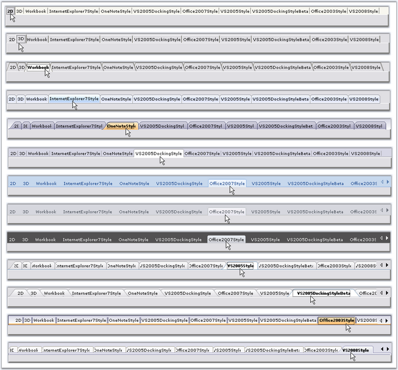
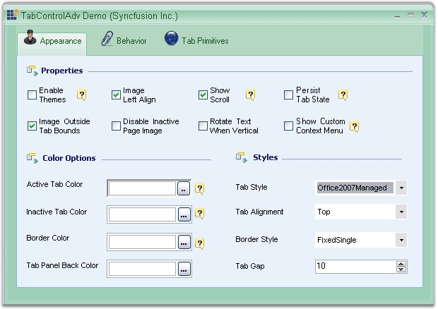
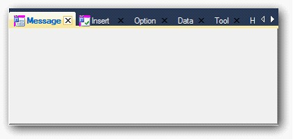

::: {style="DISPLAY: none"}
{#d2h_url_template}{#d2h_package_url style="WIDTH: 0px; DISPLAY: none; HEIGHT: 0px"}
:::

::::: {.d2h_secondary_topic style="PADDING-BOTTOM: 10pt; MARGIN: 0pt; PADDING-LEFT: 0pt; PADDING-RIGHT: 0pt; PADDING-TOP: 0pt"}
#### TabStyles {#tabstyles style="MARGIN-LEFT: 18pt; tab-stops: 18.0pt"}

[]{style="COLOR: #15428b"} 

TabControl provides options to customize the TabStyle settings. Styles can be set through **TabStyle** property.

[]{style="COLOR: #15428b"} 

::: {align="center"}
+-----------------------------------+---------------------------------------------------------------------+
| TabControlAdv Property            | Description                                                         |
+-----------------------------------+---------------------------------------------------------------------+
| TabStyle                          | Specifies the look and feel of the Tabcontrol. The options include, |
|                                   |                                                                     |
|                                   |                                                                     |
|                                   |                                                                     |
|                                   | [·      ]{style="FONT-FAMILY: Symbol"}2D,                           |
|                                   |                                                                     |
|                                   | [·      ]{style="FONT-FAMILY: Symbol"}3D,                           |
|                                   |                                                                     |
|                                   | [·      ]{style="FONT-FAMILY: Symbol"}Workbook,                     |
|                                   |                                                                     |
|                                   | [·      ]{style="FONT-FAMILY: Symbol"}InternetExplorer7Style,       |
|                                   |                                                                     |
|                                   | [·      ]{style="FONT-FAMILY: Symbol"}OneNoteStyle,                 |
|                                   |                                                                     |
|                                   | [·      ]{style="FONT-FAMILY: Symbol"}VS2005DockingStyle,           |
|                                   |                                                                     |
|                                   | [·      ]{style="FONT-FAMILY: Symbol"}Office2007Style,              |
|                                   |                                                                     |
|                                   | [·      ]{style="FONT-FAMILY: Symbol"}VS2005Style,                  |
|                                   |                                                                     |
|                                   | [·      ]{style="FONT-FAMILY: Symbol"}VS2005DockingStyleBeta,       |
|                                   |                                                                     |
|                                   | [·      ]{style="FONT-FAMILY: Symbol"}Office2003Style and           |
|                                   |                                                                     |
|                                   | [·      ]{style="FONT-FAMILY: Symbol"}VS2008Style.                  |
+-----------------------------------+---------------------------------------------------------------------+
:::

[]{style="COLOR: #15428b"} 

+----------------------------------------------------------------------------------------------------------------------------------------------------------------------------------------------------------------+
| **[\[C#\]]{style="FONT-FAMILY: 'Courier New'; COLOR: black"}**                                                                                                                                                 |
|                                                                                                                                                                                                                |
| **[]{style="FONT-FAMILY: 'Courier New'; COLOR: black"}**                                                                                                                                                       |
|                                                                                                                                                                                                                |
| [this]{style="FONT-FAMILY: 'Courier New'; COLOR: blue"}[.tabControlAdv1.TabStyle = [typeof]{style="COLOR: blue"}(Syncfusion.Windows.Forms.Tools.TabRendererWorkbookMode);]{style="FONT-FAMILY: 'Courier New'"} |
+----------------------------------------------------------------------------------------------------------------------------------------------------------------------------------------------------------------+

[]{style="COLOR: #15428b"} 

+--------------------------------------------------------------------------------------------------------------------------------------------------------------------------------------------------------------+
| **[\[VB.NET\]]{style="FONT-FAMILY: 'Courier New'; COLOR: black"}**                                                                                                                                           |
|                                                                                                                                                                                                              |
| **[]{style="FONT-FAMILY: 'Courier New'; COLOR: black"}**                                                                                                                                                     |
|                                                                                                                                                                                                              |
| [Me]{style="FONT-FAMILY: 'Courier New'; COLOR: blue"}[.tabControlAdv1.TabStyle = [GetType]{style="COLOR: blue"}(Syncfusion.Windows.Forms.Tools.TabRendererWorkbookMode)]{style="FONT-FAMILY: 'Courier New'"} |
+--------------------------------------------------------------------------------------------------------------------------------------------------------------------------------------------------------------+

[]{style="COLOR: #15428b"} 

Given below are the various TabStyles along with the Office 2007 Style supporting all the three color schemes (Blue, Silver and Black).

[]{style="COLOR: #15428b"} 

{border="0"}

[]{style="COLOR: #15428b"} 

Figure 1057: Tab Styles

[]{style="COLOR: #15428b"} 

::: {style="BORDER-BOTTOM: windowtext 1pt solid; BORDER-LEFT: medium none; PADDING-BOTTOM: 1pt; MARGIN: 9pt 0pt 9pt 18pt; PADDING-LEFT: 0pt; PADDING-RIGHT: 0pt; BORDER-TOP: windowtext 1pt solid; BORDER-RIGHT: medium none; PADDING-TOP: 1pt"}
{border="0"} Note: We can apply border styles when TabStyle is set to VS2008Style. Refer [[[Border for TabControlAdv]{style="COLOR: windowtext; FONT-SIZE: 9pt; TEXT-DECORATION: none; text-underline: none"}]{.UGHyperlink}](../../../../../../../../Documents%20and%20Settings/sylviap/Desktop/Tools%20-%20Part%202.docx#_Border_for_TabControlAdv)[[ ]{style="COLOR: windowtext; FONT-SIZE: 9pt; TEXT-DECORATION: none; text-underline: none"}]{.UGHyperlink}topic to know more.
:::

[]{style="COLOR: #15428b"} 

Custom Color Schemes

**[]{style="COLOR: #15428b"}** 

Custom colors can also be applied to the TabControlAdv. Use the below code snippet.

[]{style="COLOR: #15428b"} 

+------------------------------------------------------------------------------------------------------------------------------------------------------------------------------------------------------+
| **[\[C#\]]{style="FONT-FAMILY: 'Courier New'; COLOR: black"}**                                                                                                                                       |
|                                                                                                                                                                                                      |
| **[]{style="FONT-FAMILY: 'Courier New'; COLOR: black"}**                                                                                                                                             |
|                                                                                                                                                                                                      |
| [//Set the below code for applying the managed color scheme.]{style="FONT-FAMILY: 'Courier New'; COLOR: green"}                                                                                      |
|                                                                                                                                                                                                      |
| [this]{style="FONT-FAMILY: 'Courier New'; COLOR: blue"}[.FormTabControl.TabStyle = [typeof]{style="COLOR: blue"}([TabRendererOffice2007]{style="COLOR: teal"});]{style="FONT-FAMILY: 'Courier New'"} |
|                                                                                                                                                                                                      |
| [this]{style="FONT-FAMILY: 'Courier New'; COLOR: blue"}[.FormTabControl.Office2007ColorScheme = [Office2007Theme]{style="COLOR: teal"}.Managed;]{style="FONT-FAMILY: 'Courier New'"}                 |
|                                                                                                                                                                                                      |
| []{style="FONT-FAMILY: 'Courier New'"}                                                                                                                                                               |
|                                                                                                                                                                                                      |
| [Office2007Colors]{style="FONT-FAMILY: 'Courier New'; COLOR: teal"}[.ApplyManagedColors([this]{style="COLOR: blue"}, [Color]{style="COLOR: teal"}.Green);]{style="FONT-FAMILY: 'Courier New'"}       |
+------------------------------------------------------------------------------------------------------------------------------------------------------------------------------------------------------+

[]{style="COLOR: #15428b"} 

+-----------------------------------------------------------------------------------------------------------------------------------------------------------------------------+
| **[\[VB.NET\]]{style="FONT-FAMILY: 'Courier New'; COLOR: black"}**                                                                                                          |
|                                                                                                                                                                             |
| **[]{style="FONT-FAMILY: 'Courier New'; COLOR: black"}**                                                                                                                    |
|                                                                                                                                                                             |
| [\'Set the below code for applying the managed color scheme.]{style="FONT-FAMILY: 'Courier New'; COLOR: green"}                                                             |
|                                                                                                                                                                             |
| [Me]{style="FONT-FAMILY: 'Courier New'; COLOR: blue"}[.FormTabControl.TabStyle = [GetType]{style="COLOR: blue"}(TabRendererOffice2007)]{style="FONT-FAMILY: 'Courier New'"} |
|                                                                                                                                                                             |
| [Me]{style="FONT-FAMILY: 'Courier New'; COLOR: blue"}[.FormTabControl.Office2007ColorScheme = Office2007Theme.Managed]{style="FONT-FAMILY: 'Courier New'"}                  |
|                                                                                                                                                                             |
| []{style="FONT-FAMILY: 'Courier New'"}                                                                                                                                      |
|                                                                                                                                                                             |
| [Office2007Colors.ApplyManagedColors([Me]{style="COLOR: blue"}, Color.Green)]{style="FONT-FAMILY: 'Courier New'"}                                                           |
+-----------------------------------------------------------------------------------------------------------------------------------------------------------------------------+

**[]{style="COLOR: #15428b"}** 

{border="0"}

**[]{style="COLOR: #15428b"}** 

Figure 1058: Custom Color = \"Green\"

**[]{style="COLOR: #15428b"}** 

[]{style="COLOR: #15428b"} 

A sample which illustrates CustomTab control and Flat Tabs is available in the below sample location.

 

***..\\My Documents\\Syncfusion\\EssentialStudio\\Version Number\\Windows\\Tools.Windows\\Samples\\2.0\\Tabs Package\\Advanced***

[]{style="COLOR: #15428b"} 

**[]{style="COLOR: #15428b"}** 

[·      ]{style="FONT-FAMILY: Symbol"}VS 2010 Style for TabControlAdv

[·      ]{style="FONT-FAMILY: Symbol"}**TabControlAdv's** TabStyle can be changed to **VS2010 style**.

[·      ]{style="FONT-FAMILY: Symbol"}**VS2010Style** is added to the **TabStyle**'s collection. 

[]{style="COLOR: #15428b"} 

{border="0"}

[]{style="FONT-FAMILY: 'Calibri','sans-serif'; FONT-SIZE: 11pt"} 

Figure 1059: VS 2010 Style

[]{style="FONT-FAMILY: 'Calibri','sans-serif'"} 

 Add **VS 2010** Style for **TabControlAdv**, by using the following code[. ]{style="FONT-FAMILY: 'Calibri','sans-serif'"}

+----------------------------------------------------------------------------------------------------------------------------------------------------------------------------------------+
| **[\[C# .Net\]]{style="FONT-FAMILY: 'Courier New'"}**                                                                                                                                  |
|                                                                                                                                                                                        |
| [  this.tabControlAdv1.TabStyle = typeof(Syncfusion.Windows.Forms.Tools.TabRendererVS2010)]{style="FONT-FAMILY: 'Courier New'"}[]{style="FONT-FAMILY: 'Courier New'; FONT-SIZE: 11pt"} |
+----------------------------------------------------------------------------------------------------------------------------------------------------------------------------------------+

[]{style="FONT-FAMILY: 'Times New Roman','serif'; FONT-SIZE: 11pt"} 

+-------------------------------------------------------------------------------------------------------------------------------------------------------------------------------------+
| **[\[VB .Net\]]{style="FONT-FAMILY: 'Courier New'"}**                                                                                                                               |
|                                                                                                                                                                                     |
| [Me. tabControlAdv1.TabStyle= GetType(Syncfusion.Windows.Forms.Tools.TabRendererVS2010)]{style="FONT-FAMILY: 'Courier New'"}[]{style="FONT-FAMILY: 'Courier New'; FONT-SIZE: 11pt"} |
+-------------------------------------------------------------------------------------------------------------------------------------------------------------------------------------+

[]{style="FONT-FAMILY: 'Times New Roman','serif'; FONT-SIZE: 11pt"} 

[]{style="FONT-FAMILY: 'Times New Roman','serif'"} 

 

 

 

 

[]{#related-topics}
:::::
