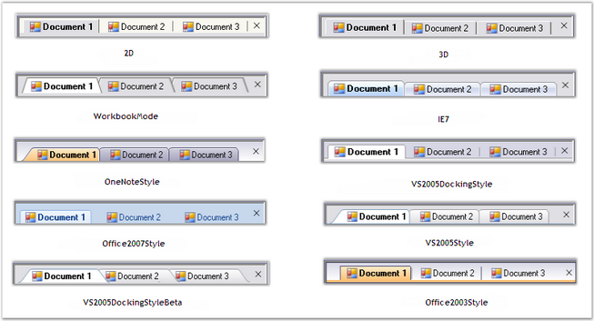

::: {style="DISPLAY: none"}
{#d2h_url_template}{#d2h_package_url style="WIDTH: 0px; DISPLAY: none; HEIGHT: 0px"}
:::

:::: {.d2h_secondary_topic style="PADDING-BOTTOM: 10pt; MARGIN: 0pt; PADDING-LEFT: 0pt; PADDING-RIGHT: 0pt; PADDING-TOP: 0pt"}
##### Tab styles {#tab-styles style="MARGIN-LEFT: 18pt; tab-stops: 18.0pt"}

[]{style="COLOR: #15428b"} 

TabbedMDI framework provides the ability to support a number of tab styles. The tabbedMDIManager\'s **TabStyle** property lets users specify the required style for the Tabs.

[]{style="COLOR: #15428b"} 

::: {align="center"}
+-----------------------------------+----------------------------------------------------------------------------------------+
| TabbedMDIManager Property         | Description                                                                            |
+-----------------------------------+----------------------------------------------------------------------------------------+
| TabStyle                          | Specifies the style for the tabs of the TabbedMDIManager Control. The options include: |
|                                   |                                                                                        |
|                                   |                                                                                        |
|                                   |                                                                                        |
|                                   | [·      ]{style="FONT-FAMILY: Symbol"}2D,                                              |
|                                   |                                                                                        |
|                                   | [·      ]{style="FONT-FAMILY: Symbol"}3D,                                              |
|                                   |                                                                                        |
|                                   | [·      ]{style="FONT-FAMILY: Symbol"}WorkbookMode,                                    |
|                                   |                                                                                        |
|                                   | [·      ]{style="FONT-FAMILY: Symbol"}WhidbeyStyle,                                    |
|                                   |                                                                                        |
|                                   | [·      ]{style="FONT-FAMILY: Symbol"}DockingWhidbeyStyle,                             |
|                                   |                                                                                        |
|                                   | [·      ]{style="FONT-FAMILY: Symbol"}DockingWhidbeyBetaStyle,                         |
|                                   |                                                                                        |
|                                   | [·      ]{style="FONT-FAMILY: Symbol"}Office2003Style,                                 |
|                                   |                                                                                        |
|                                   | [·      ]{style="FONT-FAMILY: Symbol"}Office2007Style,                                 |
|                                   |                                                                                        |
|                                   | [·      ]{style="FONT-FAMILY: Symbol"}OneNoteStyle,                                    |
|                                   |                                                                                        |
|                                   | [·      ]{style="FONT-FAMILY: Symbol"}OneNoteStyleFlatTabsStyle and                    |
|                                   |                                                                                        |
|                                   | [·      ]{style="FONT-FAMILY: Symbol"}InternetExplorer7Style.                          |
+-----------------------------------+----------------------------------------------------------------------------------------+
:::

[]{style="COLOR: #15428b"} 

+-----------------------------------------------------------------------------------------------------------------------------------------------------------------------------------------------------------------------------------------------+
| **[\[C#\]]{style="FONT-FAMILY: 'Courier New'; COLOR: black"}**                                                                                                                                                                                |
|                                                                                                                                                                                                                                               |
| []{style="FONT-FAMILY: 'Courier New'; COLOR: black"}                                                                                                                                                                                          |
|                                                                                                                                                                                                                                               |
| [this]{style="FONT-FAMILY: 'Courier New'; COLOR: blue"}[.tabbedMDIManager.TabStyle = [typeof]{style="COLOR: blue"}(Syncfusion.Windows.Forms.Tools.[TabRendererDockingWhidbeyBeta]{style="COLOR: teal"});]{style="FONT-FAMILY: 'Courier New'"} |
+-----------------------------------------------------------------------------------------------------------------------------------------------------------------------------------------------------------------------------------------------+

[]{style="COLOR: #15428b"} 

+----------------------------------------------------------------------------------------------------------------------------------------------------------------------------------------------------------------------+
| **[\[VB.NET\]]{style="FONT-FAMILY: 'Courier New'; COLOR: black"}**                                                                                                                                                   |
|                                                                                                                                                                                                                      |
| []{style="FONT-FAMILY: 'Courier New'; COLOR: black"}                                                                                                                                                                 |
|                                                                                                                                                                                                                      |
| [Me]{style="FONT-FAMILY: 'Courier New'; COLOR: blue"}[.tabbedMDIManager.TabStyle = [GetType]{style="COLOR: blue"}(Syncfusion.Windows.Forms.Tools.TabRendererDockingWhidbeyBeta)]{style="FONT-FAMILY: 'Courier New'"} |
+----------------------------------------------------------------------------------------------------------------------------------------------------------------------------------------------------------------------+

[]{style="COLOR: #15428b"} 

The various tab styles are listed in the below image.

[]{style="COLOR: #15428b"} 

{border="0"}

[]{style="COLOR: #15428b"} 

Figure 1085: TabbedMDIManager Tab Styles

[]{style="COLOR: #15428b"} 

See Also

[]{style="COLOR: black"} 

[[Window Styles]{.UGHyperlink}](../../../../../../../../Documents%20and%20Settings/sylviap/Desktop/Tools%20-%20Part%202.docx#_Window_Styles)[]{.UGHyperlink}

 

 

 

[]{#p906} 

[]{#related-topics}
::::
