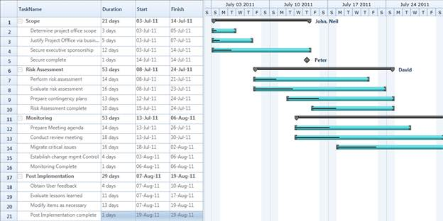

::: {style="DISPLAY: none"}
{#d2h_url_template}{#d2h_package_url style="WIDTH: 0px; DISPLAY: none; HEIGHT: 0px"}
:::

::::: {#nsbanner .d2h_main_nsbanner style="BORDER-BOTTOM: #999999 1px solid; POSITION: relative; PADDING-BOTTOM: 0px; BACKGROUND-COLOR: transparent; PADDING-LEFT: 0px; PADDING-RIGHT: 0px; DISPLAY: none; BORDER-TOP: #999999 1px solid; PADDING-TOP: 0px; LEFT: 0px"}
:::: {#TitleRow .d2h_main_titlerow style="PADDING-BOTTOM: 4px; BACKGROUND-COLOR: transparent; PADDING-LEFT: 22px; WIDTH: 100%; PADDING-RIGHT: 10px; DISPLAY: none; PADDING-TOP: 4px"}
::: {#ienav .d2h_main_ienav style="DISPLAY: none"}
{#D2HPrevious .D2HPreviousEnabled}  {#D2HNext .D2HNextEnabled}
:::
::::
:::::

:::: {#nstext .d2h_main_nstext style="PADDING-BOTTOM: 10px; BACKGROUND-COLOR: transparent; PADDING-LEFT: 22px; PADDING-RIGHT: 10px; HEIGHT: 100%; OVERFLOW: auto; PADDING-TOP: 5px" hasuserbackground="true" valign="bottom"}
::: {#d2h_breadcrumbs .d2h_breadcrumbs}
[Essential Studio User Guide Documentation](ms-xhelp:///?Id=12457748-09e3-4d74-a240-8e049cedf030){.d2h_breadcrumbsNormal}[ \> ]{.d2h_breadcrumbsLinkSeparator}[User Interface Edition](ms-xhelp:///?Id=c29296b7-531c-413b-a0ec-488ca1f7f669){.d2h_breadcrumbsNormal}[ \> ]{.d2h_breadcrumbsLinkSeparator}[Essential WPF](ms-xhelp:///?Id=7f4f82c5-151c-4262-94d0-75c4626c77bc){.d2h_breadcrumbsNormal}[ \> ]{.d2h_breadcrumbsLinkSeparator}[Essential Gantt]{.d2h_breadcrumbsContentsOnly}[ \> ]{.d2h_breadcrumbsLinkSeparator}[Concepts and Features](ms-xhelp:///?Id=b8172a4a-8718-4370-8781-8351a2959492){.d2h_breadcrumbsNormal}[ \> ]{.d2h_breadcrumbsLinkSeparator}[Data Binding](ms-xhelp:///?Id=5d9ab7f9-f427-42ad-8b5f-add9bcba2e86){.d2h_breadcrumbsNormal}
:::

### TaskDetails Binding {#taskdetails-binding style="tab-stops: 0pt"}

Essential Gantt for WPF includes an inbuilt classclled TaskDetails, which is inherited from the **IGanttTask** interface. A collection of the  TaskDetails can be bounded as an ItemsSource for the GanttControl.

 

Use Case Scenarios[[]{style="FONT-SIZE: 16pt; FONT-WEIGHT: normal"}]{.Heading3Char}

You can easily create the task details collection for your project using the TaskDetails class or by creating a new class by inheriting the *IGantt* interface.

 

Binding TaskDetials collection to Gantt Control

The following code illustrates how to bind the Task Detials to the Gantt Control:

 

+-------------------------------------------------------------------------------------------------------------------------------------------------------------------------------------------------------------------------------------------------------------------------------------------------------------------------------------------------------------------------------------------------------------------------------------------------------------------------------------------------------------------------------------------------------------------------------------------------------------------------------------------------------------------------+
| **[\[XAML\]]{style="FONT-FAMILY: 'Courier New'"}**                                                                                                                                                                                                                                                                                                                                                                                                                                                                                                                                                                                                                      |
|                                                                                                                                                                                                                                                                                                                                                                                                                                                                                                                                                                                                                                                                         |
| [ ]{style="FONT-FAMILY: 'Courier New'; COLOR: blue"}[\<]{style="FONT-FAMILY: 'Courier New'; COLOR: blue"}[Sync:GanttControl]{style="FONT-FAMILY: 'Courier New'; COLOR: #a31515"}[ ]{style="FONT-FAMILY: 'Courier New'; COLOR: black"}[ItemsSource]{style="FONT-FAMILY: 'Courier New'; COLOR: red"}[=\"{Binding GanttItemSource}\"]{style="FONT-FAMILY: 'Courier New'; COLOR: blue"}[ ]{style="FONT-FAMILY: 'Courier New'; COLOR: black"}[x:Name]{style="FONT-FAMILY: 'Courier New'; COLOR: red"}[=\"Gantt\"]{style="FONT-FAMILY: 'Courier New'; COLOR: blue"}[ ]{style="FONT-FAMILY: 'Courier New'; COLOR: black"}[\>]{style="FONT-FAMILY: 'Courier New'; COLOR: blue"} |
|                                                                                                                                                                                                                                                                                                                                                                                                                                                                                                                                                                                                                                                                         |
| []{style="FONT-FAMILY: 'Courier New'"}                                                                                                                                                                                                                                                                                                                                                                                                                                                                                                                                                                                                                                  |
+-------------------------------------------------------------------------------------------------------------------------------------------------------------------------------------------------------------------------------------------------------------------------------------------------------------------------------------------------------------------------------------------------------------------------------------------------------------------------------------------------------------------------------------------------------------------------------------------------------------------------------------------------------------------------+

 

+-----------------------------------------------------------------------------------------------------------------------------------------------------------+
| **[\[C#\]]{style="FONT-FAMILY: 'Courier New'"}**                                                                                                          |
|                                                                                                                                                           |
| [ //Initializing Gantt]{style="FONT-FAMILY: 'Courier New'; COLOR: green"}[\                                                                               |
| [ GanttControl]{style="COLOR: #2b91af"} Gantt = [new]{style="COLOR: blue"} [GanttControl]{style="COLOR: #2b91af"}();]{style="FONT-FAMILY: 'Courier New'"} |
|                                                                                                                                                           |
| [ [ViewModel]{style="COLOR: #2b91af"} model=  [new]{style="COLOR: blue"} [ViewModel]{style="COLOR: #2b91af"}();\                                          |
|  Gantt.ItemsSource = model.GanttItemSource;]{style="FONT-FAMILY: 'Courier New'"}                                                                          |
|                                                                                                                                                           |
| []{style="FONT-FAMILY: 'Courier New'"}                                                                                                                    |
+-----------------------------------------------------------------------------------------------------------------------------------------------------------+

 

+--------------------------------------------------------------------------------------------------------------------------------------------------------------------------------------------------------------------------------+
| **[\[C#\]]{style="FONT-FAMILY: 'Courier New'"}**                                                                                                                                                                               |
|                                                                                                                                                                                                                                |
| [GanttItemSource]{style="FONT-FAMILY: 'Courier New'"}[ = [new]{style="COLOR: blue"} [ObservableCollection]{style="COLOR: #2b91af"}\<[TaskDetails]{style="COLOR: #2b91af"}\>();]{style="FONT-FAMILY: 'Courier New'"}            |
|                                                                                                                                                                                                                                |
| [GanttItemSource = ]{style="FONT-FAMILY: 'Courier New'"}[GetDataSourceStartToStart();]{style="FONT-FAMILY: 'Courier New'"}                                                                                                     |
|                                                                                                                                                                                                                                |
| []{style="FONT-FAMILY: 'Courier New'; COLOR: blue"}                                                                                                                                                                            |
|                                                                                                                                                                                                                                |
| [ObservableCollection]{style="FONT-FAMILY: 'Courier New'; COLOR: #2b91af"}[\<[TaskDetails]{style="COLOR: #2b91af"}\> GetDataSourceStartToStart()\                                                                              |
| {\                                                                                                                                                                                                                             |
| [ObservableCollection]{style="COLOR: #2b91af"}\<[TaskDetails]{style="COLOR: #2b91af"}\> task = [ObservableCollection]{style="COLOR: #2b91af"}\<[TaskDetails]{style="COLOR: #2b91af"}\>();]{style="FONT-FAMILY: 'Courier New'"} |
|                                                                                                                                                                                                                                |
| [\                                                                                                                                                                                                                             |
| task.Add([new]{style="COLOR: blue"} [TaskDetails]{style="COLOR: #2b91af"} { TaskId = 1, ]{style="FONT-FAMILY: 'Courier New'"}                                                                                                  |
|                                                                                                                                                                                                                                |
| [                           TaskName = [\"Scope\"]{style="COLOR: #a31515"}, ]{style="FONT-FAMILY: 'Courier New'"}                                                                                                              |
|                                                                                                                                                                                                                                |
| [                           StartDate = [new]{style="COLOR: blue"} [DateTime]{style="COLOR: #2b91af"}(2011, 1, 3), ]{style="FONT-FAMILY: 'Courier New'"}                                                                       |
|                                                                                                                                                                                                                                |
| [                           FinishDate = [new]{style="COLOR: blue"} [DateTime]{style="COLOR: #2b91af"}(2011, 1, 14),  ]{style="FONT-FAMILY: 'Courier New'"}                                                                    |
|                                                                                                                                                                                                                                |
| [                           Progress = 40d });\                                                                                                                                                                                |
| task\[0\].Child.Add([new]{style="COLOR: blue"} [TaskDetails]{style="COLOR: #2b91af"} { TaskId = 2, ]{style="FONT-FAMILY: 'Courier New'"}                                                                                       |
|                                                                                                                                                                                                                                |
| [                    TaskName = [\"Determine project office scope\"]{style="COLOR: #a31515"}, ]{style="FONT-FAMILY: 'Courier New'"}                                                                                            |
|                                                                                                                                                                                                                                |
| [                    StartDate = [new]{style="COLOR: blue"} [DateTime]{style="COLOR: #2b91af"}(2011, 1, 3), ]{style="FONT-FAMILY: 'Courier New'"}                                                                              |
|                                                                                                                                                                                                                                |
| [                    FinishDate = [new]{style="COLOR: blue"} [DateTime]{style="COLOR: #2b91af"}(2011, 1, 5), ]{style="FONT-FAMILY: 'Courier New'"}                                                                             |
|                                                                                                                                                                                                                                |
| [                    Progress = 20d });\                                                                                                                                                                                       |
| task\[0\].Child.Add([new]{style="COLOR: blue"} [TaskDetails]{style="COLOR: #2b91af"} { TaskId = 3, ]{style="FONT-FAMILY: 'Courier New'"}                                                                                       |
|                                                                                                                                                                                                                                |
| [                    TaskName = [\"Justify Project Offfice via business model\"]{style="COLOR: #a31515"}, ]{style="FONT-FAMILY: 'Courier New'"}                                                                                |
|                                                                                                                                                                                                                                |
| [                    StartDate = [new]{style="COLOR: blue"} [DateTime]{style="COLOR: #2b91af"}(2011, 1, 6), ]{style="FONT-FAMILY: 'Courier New'"}                                                                              |
|                                                                                                                                                                                                                                |
| [                    FinishDate = [new]{style="COLOR: blue"} [DateTime]{style="COLOR: #2b91af"}(2011, 1, 7), ]{style="FONT-FAMILY: 'Courier New'"}                                                                             |
|                                                                                                                                                                                                                                |
| [                    Progress = 20d });\                                                                                                                                                                                       |
| task\[0\].Child.Add([new]{style="COLOR: blue"} [TaskDetails]{style="COLOR: #2b91af"} { TaskId = 4, ]{style="FONT-FAMILY: 'Courier New'"}                                                                                       |
|                                                                                                                                                                                                                                |
| [                    TaskName = [\"Secure executive sponsorship\"]{style="COLOR: #a31515"}, ]{style="FONT-FAMILY: 'Courier New'"}                                                                                              |
|                                                                                                                                                                                                                                |
| [                    StartDate = [new]{style="COLOR: blue"} [DateTime]{style="COLOR: #2b91af"}(2011, 1, 10), ]{style="FONT-FAMILY: 'Courier New'"}                                                                             |
|                                                                                                                                                                                                                                |
| [                    FinishDate = [new]{style="COLOR: blue"} [DateTime]{style="COLOR: #2b91af"}(2011, 1, 14), ]{style="FONT-FAMILY: 'Courier New'"}                                                                            |
|                                                                                                                                                                                                                                |
| [                    Progress = 20d });]{style="FONT-FAMILY: 'Courier New'"}                                                                                                                                                   |
|                                                                                                                                                                                                                                |
| [task\[0\].Child.Add([new]{style="COLOR: blue"} [TaskDetails]{style="COLOR: #2b91af"} { TaskId = 5, ]{style="FONT-FAMILY: 'Courier New'"}                                                                                      |
|                                                                                                                                                                                                                                |
| [                    TaskName = [\"Secure complete\"]{style="COLOR: #a31515"}, ]{style="FONT-FAMILY: 'Courier New'"}                                                                                                           |
|                                                                                                                                                                                                                                |
| [                    StartDate = [new]{style="COLOR: blue"} [DateTime]{style="COLOR: #2b91af"}(2011, 1, 14), ]{style="FONT-FAMILY: 'Courier New'"}                                                                             |
|                                                                                                                                                                                                                                |
| [                    FinishDate = [new]{style="COLOR: blue"} [DateTime]{style="COLOR: #2b91af"}(2011, 1, 14), ]{style="FONT-FAMILY: 'Courier New'"}                                                                            |
|                                                                                                                                                                                                                                |
| [                    Progress = 20d });]{style="FONT-FAMILY: 'Courier New'"}                                                                                                                                                   |
|                                                                                                                                                                                                                                |
| [return ]{style="FONT-FAMILY: 'Courier New'; COLOR: blue"}[task;]{style="FONT-FAMILY: 'Courier New'"}                                                                                                                          |
|                                                                                                                                                                                                                                |
| [}\                                                                                                                                                                                                                            |
| \                                                                                                                                                                                                                              |
| ]{style="FONT-FAMILY: 'Courier New'"}[]{style="FONT-FAMILY: 'Courier New'"}                                                                                                                                                    |
+--------------------------------------------------------------------------------------------------------------------------------------------------------------------------------------------------------------------------------+

 

{border="0"}

Figure 16: BindingTask Details[]{style="COLOR: #c00000"}

Samples Link

To view samples:

1.   Select Start -\> Programs -\> Syncfusion -\> Essential Studio x.x.xx -\> Dashboard.

2.   Click **Run Samples** for WPF under User Interface Edition panel .

3.   Select **Gantt**.

4.   Expand the DataBinding Features item in the Sample Browser.

5.   Choose the Binding Task Details samples to launch.

[]{#related-topics}
::::
