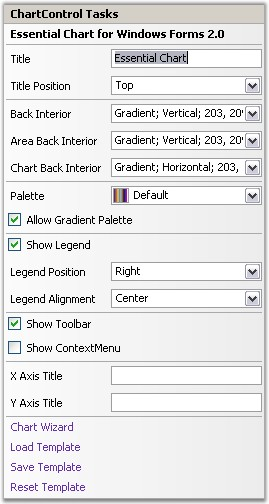

::: {style="DISPLAY: none"}
{#d2h_url_template}{#d2h_package_url style="WIDTH: 0px; DISPLAY: none; HEIGHT: 0px"}
:::

::::: {#nsbanner .d2h_main_nsbanner style="BORDER-BOTTOM: #999999 1px solid; POSITION: relative; PADDING-BOTTOM: 0px; BACKGROUND-COLOR: transparent; PADDING-LEFT: 0px; PADDING-RIGHT: 0px; DISPLAY: none; BORDER-TOP: #999999 1px solid; PADDING-TOP: 0px; LEFT: 0px"}
:::: {#TitleRow .d2h_main_titlerow style="PADDING-BOTTOM: 4px; BACKGROUND-COLOR: transparent; PADDING-LEFT: 22px; WIDTH: 100%; PADDING-RIGHT: 10px; DISPLAY: none; PADDING-TOP: 4px"}
::: {#ienav .d2h_main_ienav style="DISPLAY: none"}
{#D2HPrevious .D2HPreviousEnabled}  {#D2HNext .D2HNextEnabled}
:::
::::
:::::

::::::: {#nstext .d2h_main_nstext style="PADDING-BOTTOM: 10px; BACKGROUND-COLOR: transparent; PADDING-LEFT: 22px; PADDING-RIGHT: 10px; HEIGHT: 100%; OVERFLOW: auto; PADDING-TOP: 5px" hasuserbackground="true" valign="bottom"}
::: {#d2h_breadcrumbs .d2h_breadcrumbs}
[Essential Studio User Guide Documentation](ms-xhelp:///?Id=12457748-09e3-4d74-a240-8e049cedf030){.d2h_breadcrumbsNormal}[ \> ]{.d2h_breadcrumbsLinkSeparator}[User Interface Edition](ms-xhelp:///?Id=c29296b7-531c-413b-a0ec-488ca1f7f669){.d2h_breadcrumbsNormal}[ \> ]{.d2h_breadcrumbsLinkSeparator}[Essential Windows](ms-xhelp:///?Id=e60759d8-47a4-4570-9d7a-16a68d63f2ea){.d2h_breadcrumbsNormal}[ \> ]{.d2h_breadcrumbsLinkSeparator}[Essential Chart]{.d2h_breadcrumbsContentsOnly}[ \> ]{.d2h_breadcrumbsLinkSeparator}[Concepts and Features](ms-xhelp:///?Id=71321e9c-336c-4c1c-a127-be9f135ad4bb){.d2h_breadcrumbsNormal}[ \> ]{.d2h_breadcrumbsLinkSeparator}[Design time Features](ms-xhelp:///?Id=7e2f536b-e0fc-486e-ae67-859025441eca){.d2h_breadcrumbsNormal}
:::

### Tasks Window {#tasks-window style="tab-stops: 0pt"}

 

The tasks window has sufficient properties exposed in the right manner for users to be able to get started intuitively.

 

{border="0"}

 

Figure 356: ChartControl Tasks Window

 

Tasks

 

Title

 

Used to add title to the Chart directly from the Tasks Window.

 

Title Position

 

Specifies the position relative to the chart at which to render the chart title panel.

 

::: {align="center"}
  ------------------------------ --------------------------------------------------------------------------------------------------
  ChartTitle.Position Property   Description
  Top                            Above the chart; default setting.
  Left                           Left of the chart.
  Right                          Left of the chart.
  Bottom                         Left of the chart.
  Floating                       Will not be docked to any specific location. Can be docked manually by dragging the title panel.
  ------------------------------ --------------------------------------------------------------------------------------------------
:::

 

Back Interior

 

Specifies background brush of the control.

 

Area Back Interior

 

Specifies background brush of Chart Area of the control.

 

Chart Back Interior

 

Specifies background brush of ChartInterior.

 

Palette

 

The Palette that is to be used to provide default colors for the chart series and other chart elements. **Allow Gradient Palette** property is used to enable or disable the gradient values of the palettes.

 

ShowLegend

 

Specifies if the legend is to be displayed or not.

 

Legend Position

 

Configuration information of the Legend object.

 

::: {align="center"}
  ------------------------------- ---------------------------------------------------------------------------------------------------
  ChartLegend.Position Property   Description
  **Top**                         Positions the legend panel to the Top of Chart.
  **Left**                        Positions the legend panel to the Left of Chart.
  **Right**                       Positions the legend panel to the Right of Chart.
  **Bottom**                      Positions the legend panel to the Bottom of Chart.
  **Floating**                    Will not be docked to any specific location. Can be docked manually by dragging the Legend panel.
  ------------------------------- ---------------------------------------------------------------------------------------------------
:::

 

Legend Alignment

 

Gets or sets the legend alignment.

 

::: {align="center"}
  -------------------------------- ----------------------------
  ChartLegend.Alignment Property   Description
  **Center**                       Aligns to center of chart.
  **Far**                          Aligns to Far of chart.
  **Near**                         Aligns to Near of chart.
  -------------------------------- ----------------------------
:::

         

Show ToolBar

 

Specifies if the ToolBar is to be displayed or not.

 

Show ContextMenu

 

Specifies if the ToolBar context menu is to be displayed or not.

 

X Axis Title

 

Specifies the Title of Primary x axis.

 

Y Axis Title

 

Specifies the Title of Primary y axis.

 

Spacing Between Points

 

Specifies the [spacing]{.UGHyperlink}[ ]{.UGHyperlink}between the series points.

 

[]{#p260} 

 

[]{#related-topics}
:::::::
