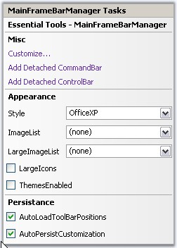
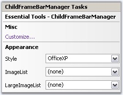

::: {style="DISPLAY: none"}
{#d2h_url_template}{#d2h_package_url style="WIDTH: 0px; DISPLAY: none; HEIGHT: 0px"}
:::

::: {.d2h_secondary_topic style="PADDING-BOTTOM: 10pt; MARGIN: 0pt; PADDING-LEFT: 0pt; PADDING-RIGHT: 0pt; PADDING-TOP: 0pt"}
##### Tasks Window {#tasks-window style="tab-stops: 0pt"}

 

MainFrameBarManager

[]{style="COLOR: #15428b"} 

The tasks window lets you open [Customize dialog]{.UGHyperlink} using Customize\... option. To add [CommandBar]{.UGHyperlink}[ ]{.UGHyperlink}and [ControlBar]{.UGHyperlink}, use Add Detached CommandBar and Add Detached ControlBar options.

[]{style="COLOR: #15428b"} 

In the Appearance section, you can select the required [Visual Styles]{.UGHyperlink}, imageList and LargeImageList. Themes for the Menus can be enabled by selecting the [ThemesEnabled]{.UGHyperlink} option and LargeIcons mode can be activated using LargeIcons option.

[]{style="COLOR: #15428b"} 

[Toolbar Persistence]{.UGHyperlink} can be enabled using AutoLoadToolBarPositions and AutoPersistCustomization options.

[]{style="COLOR: #15428b"} 

{border="0"}

[]{style="COLOR: #15428b"} 

Figure 825: MainFrameBarManager Tasks Window

[]{style="COLOR: #15428b"} 

ChildFrameBarManager

[]{style="COLOR: #15428b"} 

The ChildFrameBarManager\'s Tasks Window gives the below Misc and Appearance options.

[]{style="COLOR: #15428b"} 

{border="0"}

***[]{style="COLOR: #15428b"}*** 

Figure 826: ChildFrameBarManager Tasks Window

[]{style="COLOR: #15428b"} 

See Also

[]{style="COLOR: #15428b"} 

[Context Menu]{.UGHyperlink}[]{.UGHyperlink}

[]{#related-topics}
:::
