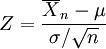

::: {style="DISPLAY: none"}
{#d2h_url_template}{#d2h_package_url style="WIDTH: 0px; DISPLAY: none; HEIGHT: 0px"}
:::

:::: {.d2h_secondary_topic style="PADDING-BOTTOM: 10pt; MARGIN: 0pt; PADDING-LEFT: 0pt; PADDING-RIGHT: 0pt; PADDING-TOP: 0pt"}
#### TCumulative Distribution {#tcumulative-distribution style="tab-stops: 0pt"}

[]{style="FONT-FAMILY: 'Trebuchet MS','sans-serif'; FONT-SIZE: 9pt"} 

This formula will return the T cumulative distribution (student\'s t-distribution) for a degree of freedom \> 0. When there is a need to estimate the mean of a normally distributed population for a given sample, the t-distribution comes into action. It is the basis of the popular t-tests to find out the difference between two sample means.

 

For a sample with size n drawn from a normal population with mean [μ]{style="FONT-SIZE: 8pt"} and standard deviation [σ]{style="FONT-SIZE: 8pt"}. Let {border="0"} and *[s]{style="FONT-FAMILY: 'Verdana','sans-serif'; FONT-SIZE: 8pt"}* denote the sample mean and sample standard deviation respectively. Then the quantity

[{border="0"}]{style="FONT-FAMILY: 'Trebuchet MS','sans-serif'; FONT-SIZE: 9pt"}[]{style="FONT-FAMILY: 'Trebuchet MS','sans-serif'; FONT-SIZE: 9pt"}

gives the t-distribution for n-1 degrees of freedom.

[]{style="FONT-FAMILY: 'Trebuchet MS','sans-serif'; FONT-SIZE: 9pt"} 

Using the Formula

[]{style="FONT-FAMILY: 'Trebuchet MS','sans-serif'; FONT-SIZE: 9pt"} 

TCumulativeDistribution is calculated using the **Statistics.UtilityFunctions** class. The following table describes this function\'s parameters and its values.

[]{style="FONT-FAMILY: 'Trebuchet MS','sans-serif'; FONT-SIZE: 9pt"} 

::: {align="center"}
+-------------------------+--------------------------------------------------------------------------------------------------------+------------------------------------------------------------------------------+
|                         |                                                                                                        |                                                                              |
|                         |                                                                                                        |                                                                              |
| Method Name             | Parameters                                                                                             | Return Value                                                                 |
+-------------------------+--------------------------------------------------------------------------------------------------------+------------------------------------------------------------------------------+
| TCumulativeDistribution | 1.   **tValue**: the T value for which you want the distribution.                                      | A double that represents the T cumulative distribution function probability. |
|                         |                                                                                                        |                                                                              |
|                         | 2.   **degreeOfFreedom**: an integer value that represents the degree of freedom.                      |                                                                              |
|                         |                                                                                                        |                                                                              |
|                         | 3.   **oneTail**: If true, one-tailed distribution is used; otherwise two-tailed distribution is used. |                                                                              |
+-------------------------+--------------------------------------------------------------------------------------------------------+------------------------------------------------------------------------------+
:::

[]{style="FONT-FAMILY: 'Trebuchet MS','sans-serif'; FONT-SIZE: 9pt"} 

Example

[]{style="FONT-FAMILY: 'Trebuchet MS','sans-serif'; FONT-SIZE: 9pt"} 

Here is a code snippet that shows a sample usage.

[]{style="FONT-FAMILY: 'Trebuchet MS','sans-serif'; FONT-SIZE: 9pt"} 

+----------------------------------------------------------------------------------------------------------------------------------------------------------------------------------------------------------+
| **[\[C#\]]{style="FONT-FAMILY: 'Courier New'; COLOR: black"}**                                                                                                                                           |
|                                                                                                                                                                                                          |
| **[]{style="FONT-FAMILY: 'Courier New'; COLOR: black"}**                                                                                                                                                 |
|                                                                                                                                                                                                          |
| [using]{style="FONT-FAMILY: 'Courier New'; COLOR: blue"}[ Syncfusion.Windows.Forms.Chart.Statistics;]{style="FONT-FAMILY: 'Courier New'; COLOR: black"}                                                  |
|                                                                                                                                                                                                          |
| [double]{style="FONT-FAMILY: 'Courier New'; COLOR: blue"}[ x= Statistics.UtilityFunctions.TCumulativelDistribution(tvalue, degreeOfFreedom,OneTail );]{style="FONT-FAMILY: 'Courier New'; COLOR: black"} |
+----------------------------------------------------------------------------------------------------------------------------------------------------------------------------------------------------------+

[]{style="FONT-FAMILY: 'Trebuchet MS','sans-serif'; FONT-SIZE: 9pt"} 

+---------------------------------------------------------------------------------------------------------------------------------------------------------------------------------------------------------+
| **[\[VB.NET\]]{style="FONT-FAMILY: 'Courier New'; COLOR: black"}**                                                                                                                                      |
|                                                                                                                                                                                                         |
| **[]{style="FONT-FAMILY: 'Courier New'; COLOR: black"}**                                                                                                                                                |
|                                                                                                                                                                                                         |
| [Imports]{style="FONT-FAMILY: 'Courier New'; COLOR: blue"}[ Syncfusion.Windows.Forms.Chart.Statistics]{style="FONT-FAMILY: 'Courier New'; COLOR: black"}                                                |
|                                                                                                                                                                                                         |
| [double]{style="FONT-FAMILY: 'Courier New'; COLOR: blue"}[ x= Statistics.UtilityFunctions.TCumulativelDistribution(tvalue, degreeOfFreedom,OneTail )]{style="FONT-FAMILY: 'Courier New'; COLOR: black"} |
+---------------------------------------------------------------------------------------------------------------------------------------------------------------------------------------------------------+

[]{#p247} 

[]{#related-topics}
::::
