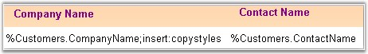
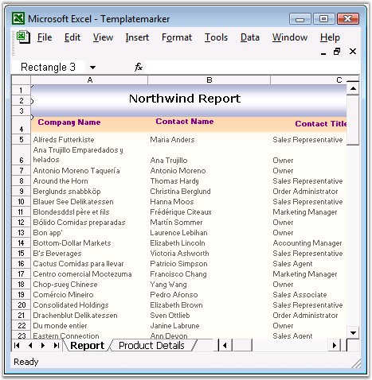
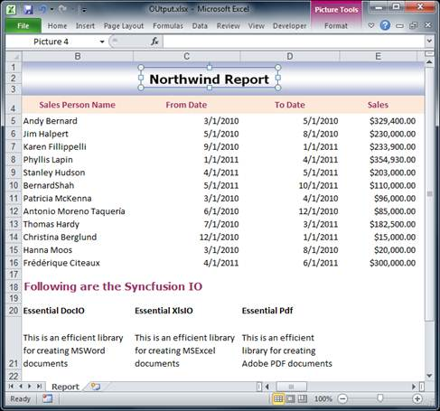
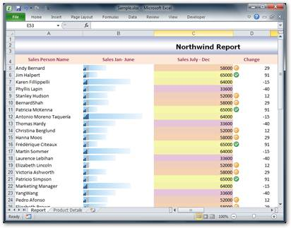

::: {style="DISPLAY: none"}
{#d2h_url_template}{#d2h_package_url style="WIDTH: 0px; DISPLAY: none; HEIGHT: 0px"}
:::

::::: {#nsbanner .d2h_main_nsbanner style="BORDER-BOTTOM: #999999 1px solid; POSITION: relative; PADDING-BOTTOM: 0px; BACKGROUND-COLOR: transparent; PADDING-LEFT: 0px; PADDING-RIGHT: 0px; DISPLAY: none; BORDER-TOP: #999999 1px solid; PADDING-TOP: 0px; LEFT: 0px"}
:::: {#TitleRow .d2h_main_titlerow style="PADDING-BOTTOM: 4px; BACKGROUND-COLOR: transparent; PADDING-LEFT: 22px; WIDTH: 100%; PADDING-RIGHT: 10px; DISPLAY: none; PADDING-TOP: 4px"}
::: {#ienav .d2h_main_ienav style="DISPLAY: none"}
{#D2HPrevious .D2HPreviousEnabled}  {#D2HNext .D2HNextEnabled}
:::
::::
:::::

:::::: {#nstext .d2h_main_nstext style="PADDING-BOTTOM: 10px; BACKGROUND-COLOR: transparent; PADDING-LEFT: 22px; PADDING-RIGHT: 10px; HEIGHT: 100%; OVERFLOW: auto; PADDING-TOP: 5px" hasuserbackground="true" valign="bottom"}
::: {#d2h_breadcrumbs .d2h_breadcrumbs}
[Essential Studio User Guide Documentation](ms-xhelp:///?Id=12457748-09e3-4d74-a240-8e049cedf030){.d2h_breadcrumbsNormal}[ \> ]{.d2h_breadcrumbsLinkSeparator}[Reporting Edition](ms-xhelp:///?Id=027aa5b6-6676-4f93-ad23-c20e8c45792e){.d2h_breadcrumbsNormal}[ \> ]{.d2h_breadcrumbsLinkSeparator}[Essential XlsIO](ms-xhelp:///?Id=b01a1b50-1d7d-40c0-bc83-af67e57c9005){.d2h_breadcrumbsNormal}[ \> ]{.d2h_breadcrumbsLinkSeparator}[Concepts and Features](ms-xhelp:///?Id=21b26556-5905-4ad9-90b4-40320db25faf){.d2h_breadcrumbsNormal}[ \> ]{.d2h_breadcrumbsLinkSeparator}[Data](ms-xhelp:///?Id=09eb021a-c01a-47a5-bf60-fb7c3ed89c78){.d2h_breadcrumbsNormal}
:::

### Template Markers {#template-markers style="tab-stops: 0pt"}

**[]{style="FONT-FAMILY: 'Segoe UI','sans-serif'; COLOR: black"}** 

This is another variant of the Template based approach, but the difference is that the end-user places special markers in the template spreadsheet, which gets replaced along with the data during runtime. The main advantage of this approach is that the end-user gets the flexibility of designing the Excel report.

 

Cells in the worksheet can be filled with single data or with multiple records. Format of these data can be changed by using the arguments of the markers.

 

**Marker Syntax**

 

Each marker starts with some prefix, by default it is \"%\" character, and followed by the variable name and properties. There could be several arguments after the variable, which are delimited by some character, by default it is semicolon (;).

 

{border="0"}

Figure 135: Template Marker[]{style="FONT-FAMILY: 'Trebuchet MS','sans-serif'; COLOR: #15428b"}

 

Source

[]{style="FONT-SIZE: 9pt"} 

XlsIO can be used to bind various data sources to these markers. This includes data sources such as **Data Table**, **Data Set**, **Data Reader**, **Data View**, **Array**, **Variable** and **Formulas**.

[]{style="FONT-FAMILY: 'Trebuchet MS','sans-serif'; COLOR: #15428b; FONT-SIZE: 9pt"} 

Arguments

 

You can specify the following arguments in the marker to customize the worksheet.

 

[·      ]{style="FONT-FAMILY: Symbol"}**Horizontal**-This argument specifies the horizontal direction of the data import for complex variables.

[·      ]{style="FONT-FAMILY: Symbol"}**Vertical**-This argument specifies the vertical direction of the data import for complex variables.

[·      ]{style="FONT-FAMILY: Symbol"}**Insert**-This argument inserts new rows or columns, depending on the direction argument for each new cell. Note that by default, the rows cannot be added.

[·      ]{style="FONT-FAMILY: Symbol"}**insert:copystyles**-This argument copies styles from the above row or left column.

[·      ]{style="FONT-FAMILY: Symbol"}**jump:\[cell reference in R1C1 notation\]**-This argument binds the data to the cell at the specified reference. Cell reference addresses can be relative or absolute.

[·      ]{style="FONT-FAMILY: Symbol"}**copyrange:\[top-left cell reference in R1C1\]:\[bottom-right cell reference in R1C1\]**-Copies the specified cells after each cell import.

 

Here is the sample after dynamically filling the data during runtime.

 

{border="0"}

Figure 136: Template showing Markers replaced by Data using XlsIO[]{style="FONT-FAMILY: 'Trebuchet MS','sans-serif'; COLOR: #15428b"}

 

The unique advantage of this approach is that the end-user can have customized reports without modifying the source code of the report generating application.

 

Following code example illustrates how to bind the data from a data table, array and formula, to a marker.

 

+--------------------------------------------------------------------------------------------------------------------------------------------------------------------------------------------------------------------------------------------------------------------------------------------------------------------------------------------------------------------+
| **[\[C#\]]{style="FONT-FAMILY: 'Courier New'; FONT-SIZE: 11pt"}**                                                                                                                                                                                                                                                                                                  |
|                                                                                                                                                                                                                                                                                                                                                                    |
| []{style="FONT-FAMILY: 'Courier New'; COLOR: green; FONT-SIZE: 11pt"}                                                                                                                                                                                                                                                                                              |
|                                                                                                                                                                                                                                                                                                                                                                    |
| [// Create Template Marker Processor.]{style="FONT-FAMILY: 'Courier New'; COLOR: green; FONT-SIZE: 11pt"}                                                                                                                                                                                                                                                          |
|                                                                                                                                                                                                                                                                                                                                                                    |
| [// Northwind Customers Table]{style="FONT-FAMILY: 'Courier New'; COLOR: green; FONT-SIZE: 11pt"}                                                                                                                                                                                                                                                                  |
|                                                                                                                                                                                                                                                                                                                                                                    |
| [ITemplateMarkersProcessor marker = workbook.CreateTemplateMarkersProcessor();]{style="FONT-FAMILY: 'Courier New'; FONT-SIZE: 11pt"}                                                                                                                                                                                                                               |
|                                                                                                                                                                                                                                                                                                                                                                    |
| [marker.AddVariable([\"Customers\"]{style="COLOR: maroon"}, northwindDt);]{style="FONT-FAMILY: 'Courier New'; FONT-SIZE: 11pt"}                                                                                                                                                                                                                                    |
|                                                                                                                                                                                                                                                                                                                                                                    |
| []{style="FONT-FAMILY: 'Courier New'; FONT-SIZE: 11pt"}                                                                                                                                                                                                                                                                                                            |
|                                                                                                                                                                                                                                                                                                                                                                    |
| [// Insert Array Horizontally.]{style="FONT-FAMILY: 'Courier New'; COLOR: green; FONT-SIZE: 11pt"}                                                                                                                                                                                                                                                                 |
|                                                                                                                                                                                                                                                                                                                                                                    |
| [string]{style="FONT-FAMILY: 'Courier New'; COLOR: blue; FONT-SIZE: 11pt"}[\[\] names = [new]{style="COLOR: blue"} [string]{style="COLOR: blue"}\[\] { [\"Mickey\"]{style="COLOR: maroon"}, [\"Donald\"]{style="COLOR: maroon"}, [\"Tom\"]{style="COLOR: maroon"}, [\"Jerry\"]{style="COLOR: maroon"} };]{style="FONT-FAMILY: 'Courier New'; FONT-SIZE: 11pt"}     |
|                                                                                                                                                                                                                                                                                                                                                                    |
| [string]{style="FONT-FAMILY: 'Courier New'; COLOR: blue; FONT-SIZE: 11pt"}[\[\] descriptions = [new]{style="COLOR: blue"} [string]{style="COLOR: blue"}\[\] { [\"Mouse\"]{style="COLOR: maroon"}, [\"Duck\"]{style="COLOR: maroon"}, [\"Cat\"]{style="COLOR: maroon"}, [\"Mouse\"]{style="COLOR: maroon"} };]{style="FONT-FAMILY: 'Courier New'; FONT-SIZE: 11pt"} |
|                                                                                                                                                                                                                                                                                                                                                                    |
| [marker.AddVariable([\"Names\"]{style="COLOR: maroon"}, names);]{style="FONT-FAMILY: 'Courier New'; FONT-SIZE: 11pt"}                                                                                                                                                                                                                                              |
|                                                                                                                                                                                                                                                                                                                                                                    |
| [marker.AddVariable([\"Descriptions\"]{style="COLOR: maroon"}, descriptions);]{style="FONT-FAMILY: 'Courier New'; FONT-SIZE: 11pt"}                                                                                                                                                                                                                                |
|                                                                                                                                                                                                                                                                                                                                                                    |
| []{style="FONT-FAMILY: 'Courier New'; FONT-SIZE: 11pt"}                                                                                                                                                                                                                                                                                                            |
|                                                                                                                                                                                                                                                                                                                                                                    |
| [// Stretch Formula]{style="FONT-FAMILY: 'Courier New'; COLOR: green; FONT-SIZE: 11pt"}                                                                                                                                                                                                                                                                            |
|                                                                                                                                                                                                                                                                                                                                                                    |
| [marker.AddVariable([\"NumbersTable\"]{style="COLOR: maroon"}, numbersDt);]{style="FONT-FAMILY: 'Courier New'; FONT-SIZE: 11pt"}                                                                                                                                                                                                                                   |
|                                                                                                                                                                                                                                                                                                                                                                    |
| []{style="FONT-FAMILY: 'Courier New'; FONT-SIZE: 11pt"}                                                                                                                                                                                                                                                                                                            |
|                                                                                                                                                                                                                                                                                                                                                                    |
| [// Process the markers in the template.]{style="FONT-FAMILY: 'Courier New'; COLOR: green; FONT-SIZE: 11pt"}                                                                                                                                                                                                                                                       |
|                                                                                                                                                                                                                                                                                                                                                                    |
| [marker.ApplyMarkers();]{style="FONT-FAMILY: 'Courier New'; FONT-SIZE: 11pt"}                                                                                                                                                                                                                                                                                      |
+--------------------------------------------------------------------------------------------------------------------------------------------------------------------------------------------------------------------------------------------------------------------------------------------------------------------------------------------------------------------+

[]{style="FONT-FAMILY: 'Trebuchet MS','sans-serif'; COLOR: #15428b; FONT-SIZE: 9pt"} 

+------------------------------------------------------------------------------------------------------------------------------------------------------------------------------------------------------------------------------------------------------------------------------------------------------------------------------------------------------------------------------------------------------------------+
| **[\[VB.NET\]]{style="FONT-FAMILY: 'Courier New'; FONT-SIZE: 11pt"}**                                                                                                                                                                                                                                                                                                                                            |
|                                                                                                                                                                                                                                                                                                                                                                                                                  |
| **[]{style="FONT-FAMILY: 'Courier New'; FONT-SIZE: 11pt"}**                                                                                                                                                                                                                                                                                                                                                      |
|                                                                                                                                                                                                                                                                                                                                                                                                                  |
| [\' Create Template Marker Processor.]{style="FONT-FAMILY: 'Courier New'; COLOR: green; FONT-SIZE: 11pt"}                                                                                                                                                                                                                                                                                                        |
|                                                                                                                                                                                                                                                                                                                                                                                                                  |
| [\' Northwind Customers Table]{style="FONT-FAMILY: 'Courier New'; COLOR: green; FONT-SIZE: 11pt"}                                                                                                                                                                                                                                                                                                                |
|                                                                                                                                                                                                                                                                                                                                                                                                                  |
| [Dim]{style="FONT-FAMILY: 'Courier New'; COLOR: blue; FONT-SIZE: 11pt"}[ marker [As]{style="COLOR: blue"} ITemplateMarkersProcessor = workbook.CreateTemplateMarkersProcessor()]{style="FONT-FAMILY: 'Courier New'; FONT-SIZE: 11pt"}                                                                                                                                                                            |
|                                                                                                                                                                                                                                                                                                                                                                                                                  |
| [marker.AddVariable([\"Customers\"]{style="COLOR: maroon"},northwindDt)]{style="FONT-FAMILY: 'Courier New'; FONT-SIZE: 11pt"}                                                                                                                                                                                                                                                                                    |
|                                                                                                                                                                                                                                                                                                                                                                                                                  |
| []{style="FONT-FAMILY: 'Courier New'; FONT-SIZE: 11pt"}                                                                                                                                                                                                                                                                                                                                                          |
|                                                                                                                                                                                                                                                                                                                                                                                                                  |
| [\' Insert Array Horizontally.]{style="FONT-FAMILY: 'Courier New'; COLOR: green; FONT-SIZE: 11pt"}                                                                                                                                                                                                                                                                                                               |
|                                                                                                                                                                                                                                                                                                                                                                                                                  |
| [Dim]{style="FONT-FAMILY: 'Courier New'; COLOR: blue; FONT-SIZE: 11pt"}[ names [As]{style="COLOR: blue"} [String]{style="COLOR: blue"}() = [New]{style="COLOR: blue"} [String]{style="COLOR: blue"}() {[\"Mickey\"]{style="COLOR: maroon"}, [\"Donald\"]{style="COLOR: maroon"}, [\"Tom\"]{style="COLOR: maroon"}, [\"Jerry\"]{style="COLOR: maroon"}}]{style="FONT-FAMILY: 'Courier New'; FONT-SIZE: 11pt"}     |
|                                                                                                                                                                                                                                                                                                                                                                                                                  |
| [Dim]{style="FONT-FAMILY: 'Courier New'; COLOR: blue; FONT-SIZE: 11pt"}[ descriptions [As]{style="COLOR: blue"} [String]{style="COLOR: blue"}() = [New]{style="COLOR: blue"} [String]{style="COLOR: blue"}() {[\"Mouse\"]{style="COLOR: maroon"}, [\"Duck\"]{style="COLOR: maroon"}, [\"Cat\"]{style="COLOR: maroon"}, [\"Mouse\"]{style="COLOR: maroon"}}]{style="FONT-FAMILY: 'Courier New'; FONT-SIZE: 11pt"} |
|                                                                                                                                                                                                                                                                                                                                                                                                                  |
| [marker.AddVariable([\"Names\"]{style="COLOR: maroon"},names)]{style="FONT-FAMILY: 'Courier New'; FONT-SIZE: 11pt"}                                                                                                                                                                                                                                                                                              |
|                                                                                                                                                                                                                                                                                                                                                                                                                  |
| [marker.AddVariable([\"Descriptions\"]{style="COLOR: maroon"},descriptions)]{style="FONT-FAMILY: 'Courier New'; FONT-SIZE: 11pt"}                                                                                                                                                                                                                                                                                |
|                                                                                                                                                                                                                                                                                                                                                                                                                  |
| []{style="FONT-FAMILY: 'Courier New'; FONT-SIZE: 11pt"}                                                                                                                                                                                                                                                                                                                                                          |
|                                                                                                                                                                                                                                                                                                                                                                                                                  |
| [\' Stretch Formula]{style="FONT-FAMILY: 'Courier New'; COLOR: green; FONT-SIZE: 11pt"}                                                                                                                                                                                                                                                                                                                          |
|                                                                                                                                                                                                                                                                                                                                                                                                                  |
| [marker.AddVariable([\"NumbersTable\"]{style="COLOR: maroon"},numbersDt)]{style="FONT-FAMILY: 'Courier New'; FONT-SIZE: 11pt"}                                                                                                                                                                                                                                                                                   |
|                                                                                                                                                                                                                                                                                                                                                                                                                  |
| []{style="FONT-FAMILY: 'Courier New'; FONT-SIZE: 11pt"}                                                                                                                                                                                                                                                                                                                                                          |
|                                                                                                                                                                                                                                                                                                                                                                                                                  |
| [\' Process the markers in the template.]{style="FONT-FAMILY: 'Courier New'; COLOR: green; FONT-SIZE: 11pt"}                                                                                                                                                                                                                                                                                                     |
|                                                                                                                                                                                                                                                                                                                                                                                                                  |
| [marker.ApplyMarkers()]{style="FONT-FAMILY: 'Courier New'; FONT-SIZE: 11pt"}                                                                                                                                                                                                                                                                                                                                     |
+------------------------------------------------------------------------------------------------------------------------------------------------------------------------------------------------------------------------------------------------------------------------------------------------------------------------------------------------------------------------------------------------------------------+

 

Here, CreateTemplateMarkerProcessor returns the ITemplateMarkersProcessor interface, which creates and manipulates the marker data. ApplyMarkers method of ITemplateMarkersProcessor is the special method that processes the markers in the template.

 

You can also specify the marker by using the following code.

 

+-------------------------------------------------------------------------------------------------------------------------------------------------------------------------------------------------------------+
| **[\[C#\]]{style="FONT-FAMILY: 'Courier New'; FONT-SIZE: 11pt"}**                                                                                                                                           |
|                                                                                                                                                                                                             |
| **[]{style="FONT-FAMILY: 'Courier New'; FONT-SIZE: 11pt"}**                                                                                                                                                 |
|                                                                                                                                                                                                             |
| [// Insert Simple marker.]{style="FONT-FAMILY: 'Courier New'; COLOR: green; FONT-SIZE: 11pt"}                                                                                                               |
|                                                                                                                                                                                                             |
| [sheet.Range\[[\"B2\"]{style="COLOR: #a31515"}\].Text = [\"%Marker\"]{style="COLOR: #a31515"};]{style="FONT-FAMILY: 'Courier New'; FONT-SIZE: 11pt"}                                                        |
|                                                                                                                                                                                                             |
| []{style="FONT-FAMILY: 'Courier New'; FONT-SIZE: 11pt"}                                                                                                                                                     |
|                                                                                                                                                                                                             |
| [// Insert marker which gets value of Author name.]{style="FONT-FAMILY: 'Courier New'; COLOR: green; FONT-SIZE: 11pt"}                                                                                      |
|                                                                                                                                                                                                             |
| [sheet.Range\[[\"C2\"]{style="COLOR: #a31515"}\].Text = [\"%Marker2.Worksheet.Workbook.Author\"]{style="COLOR: #a31515"};]{style="FONT-FAMILY: 'Courier New'; FONT-SIZE: 11pt"}                             |
|                                                                                                                                                                                                             |
| []{style="FONT-FAMILY: 'Courier New'; FONT-SIZE: 11pt"}                                                                                                                                                     |
|                                                                                                                                                                                                             |
| [// Insert marker which gets cell address.]{style="FONT-FAMILY: 'Courier New'; COLOR: green; FONT-SIZE: 11pt"}                                                                                              |
|                                                                                                                                                                                                             |
| [sheet.Range\[[\"H2\"]{style="COLOR: #a31515"}\].Text = [\"%ArrayProperty.Cells.Address\"]{style="COLOR: #a31515"};]{style="FONT-FAMILY: 'Courier New'; FONT-SIZE: 11pt"}                                   |
|                                                                                                                                                                                                             |
| []{style="FONT-FAMILY: 'Courier New'; FONT-SIZE: 11pt"}                                                                                                                                                     |
|                                                                                                                                                                                                             |
| [ITemplateMarkersProcessor]{style="FONT-FAMILY: 'Courier New'; COLOR: #2b91af; FONT-SIZE: 11pt"}[ marker = workbook.CreateTemplateMarkersProcessor();]{style="FONT-FAMILY: 'Courier New'; FONT-SIZE: 11pt"} |
|                                                                                                                                                                                                             |
| [marker.AddVariable([\"Marker\"]{style="COLOR: #a31515"}, [\"First test of markers\"]{style="COLOR: #a31515"});]{style="FONT-FAMILY: 'Courier New'; FONT-SIZE: 11pt"}                                       |
|                                                                                                                                                                                                             |
| [marker.AddVariable([\"Marker2\"]{style="COLOR: #a31515"}, sheet.Range\[[\"B2\"]{style="COLOR: #a31515"}\]);]{style="FONT-FAMILY: 'Courier New'; FONT-SIZE: 11pt"}                                          |
|                                                                                                                                                                                                             |
| [marker.AddVariable([\"ArrayProperty\"]{style="COLOR: #a31515"}, sheet.Range\[[\"B2:G2\"]{style="COLOR: #a31515"}\]);]{style="FONT-FAMILY: 'Courier New'; FONT-SIZE: 11pt"}                                 |
|                                                                                                                                                                                                             |
| []{style="FONT-FAMILY: 'Courier New'; FONT-SIZE: 11pt"}                                                                                                                                                     |
|                                                                                                                                                                                                             |
| [// Process the markers in the template.]{style="FONT-FAMILY: 'Courier New'; COLOR: green; FONT-SIZE: 11pt"}                                                                                                |
|                                                                                                                                                                                                             |
| [marker.ApplyMarkers();               ]{style="FONT-FAMILY: 'Courier New'; FONT-SIZE: 11pt"}                                                                                                                |
+-------------------------------------------------------------------------------------------------------------------------------------------------------------------------------------------------------------+

[]{style="FONT-FAMILY: 'Trebuchet MS','sans-serif'; COLOR: #15428b; FONT-SIZE: 9pt"} 

+---------------------------------------------------------------------------------------------------------------------------------------------------------------------------------------------------------------------------------------+
| **[\[VB.NET\]]{style="FONT-FAMILY: 'Courier New'; FONT-SIZE: 11pt"}**                                                                                                                                                                 |
|                                                                                                                                                                                                                                       |
| **[]{style="FONT-FAMILY: 'Courier New'; COLOR: black; FONT-SIZE: 11pt"}**                                                                                                                                                             |
|                                                                                                                                                                                                                                       |
| [\' Insert Simple marker.]{style="FONT-FAMILY: 'Courier New'; COLOR: green; FONT-SIZE: 11pt"}                                                                                                                                         |
|                                                                                                                                                                                                                                       |
| [sheet.Range([\"B2\"]{style="COLOR: maroon"}).Text = [\"%Marker\"]{style="COLOR: maroon"}]{style="FONT-FAMILY: 'Courier New'; FONT-SIZE: 11pt"}                                                                                       |
|                                                                                                                                                                                                                                       |
| []{style="FONT-FAMILY: 'Courier New'; COLOR: maroon; FONT-SIZE: 11pt"}                                                                                                                                                                |
|                                                                                                                                                                                                                                       |
| [\' Insert marker which gets value of Author name.]{style="FONT-FAMILY: 'Courier New'; COLOR: green; FONT-SIZE: 11pt"}                                                                                                                |
|                                                                                                                                                                                                                                       |
| [sheet.Range([\"C2\"]{style="COLOR: maroon"}).Text = [\"%Marker2.Worksheet.Workbook.Author\"]{style="COLOR: maroon"}]{style="FONT-FAMILY: 'Courier New'; FONT-SIZE: 11pt"}                                                            |
|                                                                                                                                                                                                                                       |
| []{style="FONT-FAMILY: 'Courier New'; COLOR: maroon; FONT-SIZE: 11pt"}                                                                                                                                                                |
|                                                                                                                                                                                                                                       |
| [\' Insert marker which gets cell address.]{style="FONT-FAMILY: 'Courier New'; COLOR: green; FONT-SIZE: 11pt"}                                                                                                                        |
|                                                                                                                                                                                                                                       |
| [sheet.Range([\"H2\"]{style="COLOR: maroon"}).Text = [\"%ArrayProperty.Cells.Address\"]{style="COLOR: maroon"}]{style="FONT-FAMILY: 'Courier New'; FONT-SIZE: 11pt"}                                                                  |
|                                                                                                                                                                                                                                       |
| []{style="FONT-FAMILY: 'Courier New'; COLOR: maroon; FONT-SIZE: 11pt"}                                                                                                                                                                |
|                                                                                                                                                                                                                                       |
| [Dim]{style="FONT-FAMILY: 'Courier New'; COLOR: blue; FONT-SIZE: 11pt"}[ marker [As]{style="COLOR: blue"} ITemplateMarkersProcessor = workbook.CreateTemplateMarkersProcessor()]{style="FONT-FAMILY: 'Courier New'; FONT-SIZE: 11pt"} |
|                                                                                                                                                                                                                                       |
| [marker.AddVariable([\"Marker\"]{style="COLOR: maroon"}, [\"First test of markers\"]{style="COLOR: maroon"})]{style="FONT-FAMILY: 'Courier New'; FONT-SIZE: 11pt"}                                                                    |
|                                                                                                                                                                                                                                       |
| [marker.AddVariable([\"Marker2\"]{style="COLOR: maroon"}, sheet.Range([\"B2\"]{style="COLOR: maroon"}))]{style="FONT-FAMILY: 'Courier New'; FONT-SIZE: 11pt"}                                                                         |
|                                                                                                                                                                                                                                       |
| [marker.AddVariable([\"ArrayProperty\"]{style="COLOR: maroon"}, sheet.Range([\"B2:G2\"]{style="COLOR: maroon"}))]{style="FONT-FAMILY: 'Courier New'; FONT-SIZE: 11pt"}                                                                |
|                                                                                                                                                                                                                                       |
| []{style="FONT-FAMILY: 'Courier New'; FONT-SIZE: 11pt"}                                                                                                                                                                               |
|                                                                                                                                                                                                                                       |
| [\' Process the markers in the template.]{style="FONT-FAMILY: 'Courier New'; COLOR: green; FONT-SIZE: 11pt"}                                                                                                                          |
|                                                                                                                                                                                                                                       |
| [marker.ApplyMarkers()]{style="FONT-FAMILY: 'Courier New'; FONT-SIZE: 11pt"}                                                                                                                                                          |
+---------------------------------------------------------------------------------------------------------------------------------------------------------------------------------------------------------------------------------------+

 

You can also create charts from the data that is bound at runtime by using the marker.

\
{border="0"} Refer [[How to Create Template Markers using XlsIO]{.UGHyperlink}](ms-xhelp:///?Id=b3c1fed0-82cd-40a6-934e-99766bcef5b9) for more details:

 

Detect Data Type and Number Formats

 

XlsIO now supports detecting the data type and applying the number format to the Template marker.

The following is the sample after dynamically detecting and applying data type and number format.

 

{border="0"}

 

 

+-----------------------------------------------------------------------------------------------------------------------------------------------------------------------------------------------------+
| **[\[C#\]]{style="FONT-FAMILY: 'Courier New'; FONT-SIZE: 9pt"}**                                                                                                                                    |
|                                                                                                                                                                                                     |
| **[]{style="FONT-FAMILY: 'Courier New'; FONT-SIZE: 9pt"}**                                                                                                                                          |
|                                                                                                                                                                                                     |
| [//Create Template Marker Processor]{style="FONT-FAMILY: Consolas; COLOR: green; FONT-SIZE: 9.5pt"}                                                                                                 |
|                                                                                                                                                                                                     |
| [ITemplateMarkersProcessor]{style="FONT-FAMILY: Consolas; COLOR: #2b91af; FONT-SIZE: 9.5pt"}[ marker = workbook.CreateTemplateMarkersProcessor();]{style="FONT-FAMILY: Consolas; FONT-SIZE: 9.5pt"} |
|                                                                                                                                                                                                     |
| [//Northwind customers table]{style="FONT-FAMILY: Consolas; COLOR: green; FONT-SIZE: 9.5pt"}                                                                                                        |
|                                                                                                                                                                                                     |
| [marker.AddVariable([\"Customers\"]{style="COLOR: #a31515"}, northwindDt, [VariableTypeAction]{style="COLOR: #2b91af"}.DetectNumberFormat);]{style="FONT-FAMILY: Consolas; FONT-SIZE: 9.5pt"}       |
|                                                                                                                                                                                                     |
| [//Process the markers and detect the number format along with the data type in the template.]{style="FONT-FAMILY: Consolas; COLOR: green; FONT-SIZE: 9.5pt"}                                       |
|                                                                                                                                                                                                     |
| [marker.ApplyMarkers();]{style="FONT-FAMILY: Consolas; FONT-SIZE: 9.5pt"}                                                                                                                           |
+-----------------------------------------------------------------------------------------------------------------------------------------------------------------------------------------------------+

 

+-------------------------------------------------------------------------------------------------------------------------------------------------------------------------------------------------------------------+
| **[\[VB.NET\]]{style="FONT-FAMILY: 'Courier New'; FONT-SIZE: 9pt"}**                                                                                                                                              |
|                                                                                                                                                                                                                   |
|                                                                                                                                                                                                                   |
|                                                                                                                                                                                                                   |
| [\'Create Template Marker Processor]{style="FONT-FAMILY: Consolas; COLOR: green; FONT-SIZE: 9.5pt"}[]{style="FONT-FAMILY: Consolas; FONT-SIZE: 9.5pt"}                                                            |
|                                                                                                                                                                                                                   |
| [ [Dim]{style="COLOR: blue"} marker [As]{style="COLOR: blue"} [ITemplateMarkersProcessor]{style="COLOR: #2b91af"} = workbook.CreateTemplateMarkersProcessor()]{style="FONT-FAMILY: Consolas; FONT-SIZE: 9.5pt"}   |
|                                                                                                                                                                                                                   |
| [\'Northwind customers table               ]{style="FONT-FAMILY: Consolas; COLOR: green; FONT-SIZE: 9.5pt"}[]{style="FONT-FAMILY: Consolas; FONT-SIZE: 9.5pt"}                                                    |
|                                                                                                                                                                                                                   |
| [ marker.AddVariable([\"Customers\"]{style="COLOR: #a31515"}, northwindDt, [VariableTypeAction]{style="COLOR: #2b91af"}.DetectNumberFormat)]{style="FONT-FAMILY: Consolas; FONT-SIZE: 9.5pt"}                     |
|                                                                                                                                                                                                                   |
| [\'Process the markers and detect the number format along with the data type in the template.]{style="FONT-FAMILY: Consolas; COLOR: green; FONT-SIZE: 9.5pt"}[ ]{style="FONT-FAMILY: Consolas; FONT-SIZE: 9.5pt"} |
|                                                                                                                                                                                                                   |
| [ marker.ApplyMarkers()]{style="FONT-FAMILY: Consolas; FONT-SIZE: 9.5pt"}                                                                                                                                         |
+-------------------------------------------------------------------------------------------------------------------------------------------------------------------------------------------------------------------+

[]{style="COLOR: black"} 

The following table gives the list of enumerations available:

  -------------------- -------------------------------------------------------------------
  Enum                 Description
  DetectDataType       Detects the DataType of the marker variable
  DetectNumberFormat   Detects both the NumberFormat and DataType of the marker variable
  None                 Represents the 'None' action
  -------------------- -------------------------------------------------------------------

[]{style="COLOR: black"} 

 

 

Template Marker with Conditional Formatting

 

XlsIO allows the CreateConditionalFormat method in the ITemplateMarkerProcessor to dynamically apply the conditional format. It then creates or applies the conditional format to the template marker range dynamically. 

Here is the sample for dynamically applied conditional format to data, during runtime.

 

{border="0"}

Figure 102: Dynamically applied conditional format to data (during runtime)

 

 

The following code snippet illustrates how to create or apply conditional format to the Marker.

 

::: {align="center"}
+----------------------------------------------------------------------------------------------------------------------------------------------------------------------------------------------------------+
| **[\[C#\]]{style="FONT-FAMILY: 'Courier New'"}**[]{style="FONT-FAMILY: 'Courier New'"}                                                                                                                   |
|                                                                                                                                                                                                          |
| []{style="FONT-FAMILY: 'Courier New'"}                                                                                                                                                                   |
|                                                                                                                                                                                                          |
| [ITemplateMarkersProcessor]{style="FONT-FAMILY: 'Courier New'; COLOR: #2b91af"}[ marker = workbook.CreateTemplateMarkersProcessor();]{style="FONT-FAMILY: 'Courier New'"}                                |
|                                                                                                                                                                                                          |
| [IConditionalFormats]{style="FONT-FAMILY: 'Courier New'; COLOR: #2b91af"}[ conditions = marker.CreateConditionalFormats(sheet\[[\"D3\"]{style="COLOR: #a31515"}\]);]{style="FONT-FAMILY: 'Courier New'"} |
|                                                                                                                                                                                                          |
| [IConditionalFormat]{style="FONT-FAMILY: 'Courier New'; COLOR: #2b91af"}[ condition = conditions.AddCondition();]{style="FONT-FAMILY: 'Courier New'"}                                                    |
|                                                                                                                                                                                                          |
| [condition.FormatType = [ExcelCFType]{style="COLOR: #2b91af"}.IconSet;]{style="FONT-FAMILY: 'Courier New'"}                                                                                              |
|                                                                                                                                                                                                          |
| [condition.IconSet.IconSet = [ExcelIconSetType]{style="COLOR: #2b91af"}.ThreeFlags;]{style="FONT-FAMILY: 'Courier New'"}                                                                                 |
+----------------------------------------------------------------------------------------------------------------------------------------------------------------------------------------------------------+
:::

 

 

::: {align="center"}
+-----------------------------------------------------------------------------------------------------------------------------------------------------------------------------------------------------------------------------------------------------------+
| **[\[VB\]]{style="FONT-FAMILY: 'Courier New'"}**[]{style="FONT-FAMILY: 'Courier New'"}                                                                                                                                                                    |
|                                                                                                                                                                                                                                                           |
| []{style="FONT-FAMILY: 'Courier New'"}                                                                                                                                                                                                                    |
|                                                                                                                                                                                                                                                           |
| [marker = workbook.CreateTemplateMarkersProcessor()]{style="FONT-FAMILY: 'Courier New'"}                                                                                                                                                                  |
|                                                                                                                                                                                                                                                           |
| [Dim]{style="FONT-FAMILY: 'Courier New'; COLOR: blue"}[ conditions [As]{style="COLOR: blue"}[IConditionalFormats]{style="COLOR: #2b91af"} = marker.CreateConditionalFormats(sheet([\"D3\"]{style="COLOR: #a31515"}))]{style="FONT-FAMILY: 'Courier New'"} |
|                                                                                                                                                                                                                                                           |
| [Dim]{style="FONT-FAMILY: 'Courier New'; COLOR: blue"}[ condition [As]{style="COLOR: blue"}[IConditionalFormat]{style="COLOR: #2b91af"} = conditions.AddCondition()]{style="FONT-FAMILY: 'Courier New'"}                                                  |
|                                                                                                                                                                                                                                                           |
| [condition.FormatType = [ExcelCFType]{style="COLOR: #2b91af"}.IconSet]{style="FONT-FAMILY: 'Courier New'"}                                                                                                                                                |
|                                                                                                                                                                                                                                                           |
| [condition.IconSet.IconSet = [ExcelIconSetType]{style="COLOR: #2b91af"}.ThreeFlags]{style="FONT-FAMILY: 'Courier New'"}                                                                                                                                   |
+-----------------------------------------------------------------------------------------------------------------------------------------------------------------------------------------------------------------------------------------------------------+
:::

 

**For More Information Refer:**

 

[[AutoFilters]{.UGHyperlink}](ms-xhelp:///?Id=6831e662-45f8-4d4f-9fd6-fca02f6cfe2a)[, ]{style="FONT-FAMILY: 'Trebuchet MS','sans-serif'; COLOR: #15428b; FONT-SIZE: 9pt"}[[Validating Data]{.UGHyperlink}](ms-xhelp:///?Id=79a8ea83-f02e-466c-93a2-9733dac5cea0)[, ]{style="FONT-FAMILY: 'Trebuchet MS','sans-serif'; COLOR: #15428b; FONT-SIZE: 9pt"}[[Template Markers]{.UGHyperlink}]()[, ]{style="FONT-FAMILY: 'Trebuchet MS','sans-serif'; COLOR: #15428b; FONT-SIZE: 9pt"}[[Grouping and Ungrouping]{.UGHyperlink}](ms-xhelp:///?Id=48ff5e92-b207-4c14-8803-7eccc41aad22)[]{style="FONT-FAMILY: 'Trebuchet MS','sans-serif'; COLOR: black; FONT-SIZE: 9pt"}

**[]{style="FONT-FAMILY: 'Trebuchet MS','sans-serif'; COLOR: #15428b"}** 

 

[]{#related-topics}
::::::
