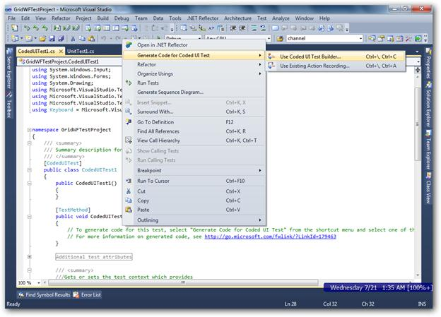
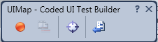
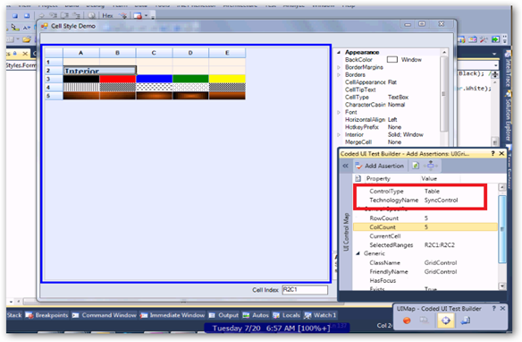
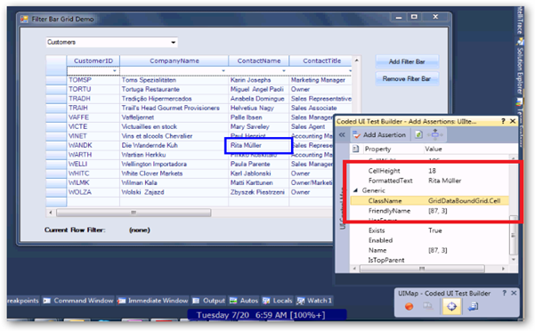
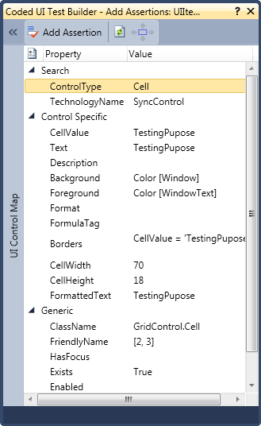

::: {style="DISPLAY: none"}
{#d2h_url_template}{#d2h_package_url style="WIDTH: 0px; DISPLAY: none; HEIGHT: 0px"}
:::

::::: {#nsbanner .d2h_main_nsbanner style="BORDER-BOTTOM: #999999 1px solid; POSITION: relative; PADDING-BOTTOM: 0px; BACKGROUND-COLOR: transparent; PADDING-LEFT: 0px; PADDING-RIGHT: 0px; DISPLAY: none; BORDER-TOP: #999999 1px solid; PADDING-TOP: 0px; LEFT: 0px"}
:::: {#TitleRow .d2h_main_titlerow style="PADDING-BOTTOM: 4px; BACKGROUND-COLOR: transparent; PADDING-LEFT: 22px; WIDTH: 100%; PADDING-RIGHT: 10px; DISPLAY: none; PADDING-TOP: 4px"}
::: {#ienav .d2h_main_ienav style="DISPLAY: none"}
{#D2HPrevious .D2HPreviousEnabled}  {#D2HNext .D2HNextEnabled}
:::
::::
:::::

:::: {#nstext .d2h_main_nstext style="PADDING-BOTTOM: 10px; BACKGROUND-COLOR: transparent; PADDING-LEFT: 22px; PADDING-RIGHT: 10px; HEIGHT: 100%; OVERFLOW: auto; PADDING-TOP: 5px" hasuserbackground="true" valign="bottom"}
::: {#d2h_breadcrumbs .d2h_breadcrumbs}
[Essential Studio User Guide Documentation](ms-xhelp:///?Id=12457748-09e3-4d74-a240-8e049cedf030){.d2h_breadcrumbsNormal}[ \> ]{.d2h_breadcrumbsLinkSeparator}[User Interface Edition](ms-xhelp:///?Id=c29296b7-531c-413b-a0ec-488ca1f7f669){.d2h_breadcrumbsNormal}[ \> ]{.d2h_breadcrumbsLinkSeparator}[Essential Windows](ms-xhelp:///?Id=e60759d8-47a4-4570-9d7a-16a68d63f2ea){.d2h_breadcrumbsNormal}[ \> ]{.d2h_breadcrumbsLinkSeparator}[Essential Grid]{.d2h_breadcrumbsContentsOnly}[ \> ]{.d2h_breadcrumbsLinkSeparator}[Grid Controls](ms-xhelp:///?Id=bf2d70d7-33dc-4c67-a55d-4fcf8d51dc2b){.d2h_breadcrumbsNormal}[ \> ]{.d2h_breadcrumbsLinkSeparator}[Coded UI Support in Windows Grids](ms-xhelp:///?Id=0a6976ce-36ff-4e74-a944-071ba87311e8){.d2h_breadcrumbsNormal}
:::

### Testing the Application with Generated Coded UI Tests {#testing-the-application-with-generated-coded-ui-tests style="tab-stops: 0pt"}

 

To test the application with generated coded UI Tests:

[]{style="FONT-FAMILY: 'Trebuchet MS','sans-serif'; COLOR: #15428b; FONT-SIZE: 9pt"} 

1.   Add a TestMethod called CodedUITestMethod1.

[]{style="FONT-FAMILY: 'Trebuchet MS','sans-serif'; COLOR: #15428b; FONT-SIZE: 9pt"} 

+------------------------------------------------------------------------------------------------------------------------------------------------------------------------------------------------------------------------------------------------------------------------------------------------+
| **[\[C#\]]{style="FONT-FAMILY: 'Courier New'; FONT-SIZE: 9pt"}**[ ]{style="FONT-FAMILY: 'Courier New'"}[]{style="FONT-FAMILY: 'Courier New'"}                                                                                                                                                  |
|                                                                                                                                                                                                                                                                                                |
| [  \[[TestMethod]{style="COLOR: #2b91af"}\]]{style="FONT-FAMILY: 'Courier New'; FONT-SIZE: 9.5pt"}                                                                                                                                                                                             |
|                                                                                                                                                                                                                                                                                                |
| [public]{style="FONT-FAMILY: 'Courier New'; COLOR: blue; FONT-SIZE: 9.5pt"}[ [void]{style="COLOR: blue"} CodedUITestMethod1()]{style="FONT-FAMILY: 'Courier New'; FONT-SIZE: 9.5pt"}                                                                                                           |
|                                                                                                                                                                                                                                                                                                |
| [{]{style="FONT-FAMILY: 'Courier New'; FONT-SIZE: 9.5pt"}                                                                                                                                                                                                                                      |
|                                                                                                                                                                                                                                                                                                |
| [     ]{style="FONT-FAMILY: 'Courier New'; FONT-SIZE: 9.5pt"}[// To generate codes for this test, select \"Generate Code for Coded UI Test\" from the shortcut menu and select one of the menu items.]{style="FONT-FAMILY: 'Courier New'; COLOR: green"}[]{style="FONT-FAMILY: 'Courier New'"} |
|                                                                                                                                                                                                                                                                                                |
| [     [// For more information on generated code, see: http://go.microsoft.com/fwlink/?LinkId=179463]{style="COLOR: green"}]{style="FONT-FAMILY: 'Courier New'"}                                                                                                                               |
|                                                                                                                                                                                                                                                                                                |
| [}]{style="FONT-FAMILY: 'Courier New'; FONT-SIZE: 9.5pt"}                                                                                                                                                                                                                                      |
+------------------------------------------------------------------------------------------------------------------------------------------------------------------------------------------------------------------------------------------------------------------------------------------------+

[]{style="FONT-FAMILY: 'Calibri','sans-serif'"} 

+-------------------------------------------------------------------------------------------------------------------------------------------------------------------------------------------------------+
| **[\[VB\]]{style="FONT-FAMILY: 'Courier New'"}**[ ]{style="FONT-FAMILY: 'Courier New'"}[]{style="FONT-FAMILY: 'Courier New'"}                                                                         |
|                                                                                                                                                                                                       |
| [  \<[TestMethod]{style="COLOR: #2b91af"}()\>]{style="FONT-FAMILY: 'Courier New'"}                                                                                                                    |
|                                                                                                                                                                                                       |
| [Public]{style="FONT-FAMILY: 'Courier New'; COLOR: blue"}[ [Sub]{style="COLOR: blue"} CodedUITestMethod1()]{style="FONT-FAMILY: 'Courier New'"}                                                       |
|                                                                                                                                                                                                       |
| [            [\'            ]{style="COLOR: green"}]{style="FONT-FAMILY: 'Courier New'"}                                                                                                              |
|                                                                                                                                                                                                       |
| [  ['To generate codes for this test, select \"Generate Code for Coded UI Test\" from the shortcut menu and select one of the menu items.]{style="COLOR: green"}]{style="FONT-FAMILY: 'Courier New'"} |
|                                                                                                                                                                                                       |
| [  [\' For more information on generated code, see: http://go.microsoft.com/fwlink/?LinkId=179463]{style="COLOR: green"}]{style="FONT-FAMILY: 'Courier New'"}                                         |
|                                                                                                                                                                                                       |
| [            [\']{style="COLOR: green"}]{style="FONT-FAMILY: 'Courier New'"}                                                                                                                          |
|                                                                                                                                                                                                       |
| [End]{style="FONT-FAMILY: 'Courier New'; COLOR: blue"}[ [Sub]{style="COLOR: blue"}]{style="FONT-FAMILY: 'Courier New'"}[]{style="FONT-FAMILY: 'Courier New'"}                                         |
+-------------------------------------------------------------------------------------------------------------------------------------------------------------------------------------------------------+

[]{style="FONT-FAMILY: 'Calibri','sans-serif'"} 

2.   Build and run the **Grid** application that was configured already.

3.   Right-click the **TestMethod** body and then select **Generate Code for Coded UI Test** -\> **Use Coded UI Test Builder** as shown in the following screenshot:

[]{style="FONT-FAMILY: 'Trebuchet MS','sans-serif'; COLOR: #15428b; FONT-SIZE: 9pt"} 

{border="0"}

*[Figure ]{style="FONT-SIZE: 9pt"}[492]{style="FONT-SIZE: 9pt"}[: Opening Coded UI Test Builder]{style="FONT-SIZE: 9pt"}*

*[]{style="FONT-FAMILY: 'Trebuchet MS','sans-serif'; COLOR: #1f497d; FONT-SIZE: 8pt"}* 

4.   Click the **Record** button to perform actions. In this scenario, add a text **Hello World** in a cell \[x, y\].

 

{border="0"}

*[Figure ]{style="FONT-SIZE: 9pt"}[493]{style="FONT-SIZE: 9pt"}[: Coded UI Map]{style="FONT-SIZE: 9pt"}[]{style="FONT-FAMILY: 'Trebuchet MS','sans-serif'; COLOR: #1f497d; FONT-SIZE: 8pt"}*

*[]{style="FONT-FAMILY: 'Trebuchet MS','sans-serif'; COLOR: #1f497d; FONT-SIZE: 8pt"}* 

{border="0"}

*[Figure ]{style="FONT-SIZE: 9pt"}[494]{style="FONT-SIZE: 9pt"}[: Identifying the Table of the Syncfusion Grid]{style="FONT-SIZE: 9pt"}*

 

{border="0"}

*[Figure ]{style="FONT-SIZE: 9pt"}[495]{style="FONT-SIZE: 9pt"}[: Identifying a Cell in the Syncfusion Grid]{style="FONT-SIZE: 9pt"}*

 

5.   Assert the cell value using the cross-hair present in the **Coded UI Test builder**.

6.   Click the cross-hair and hover to the cell. It will display the **Assert** window as shown in the following screenshot:

{border="0"}

*[Figure ]{style="FONT-SIZE: 9pt"}[496]{style="FONT-SIZE: 9pt"}[: Assert Window]{style="FONT-SIZE: 9pt"}*

*[]{style="FONT-SIZE: 9pt"}* 

*[]{style="FONT-SIZE: 9pt"}* 

[]{#related-topics}
::::
