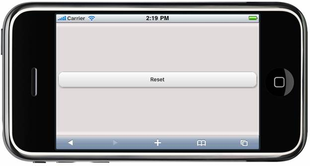

::: {style="DISPLAY: none"}
{#d2h_url_template} {#d2h_package_url style="WIDTH: 0px; DISPLAY: none; HEIGHT: 0px"}
:::

::: {.d2h_secondary_topic style="PADDING-BOTTOM: 10pt; MARGIN: 0pt; PADDING-LEFT: 0pt; PADDING-RIGHT: 0pt; PADDING-TOP: 0pt"}
##### Text {#text style="tab-stops: 0pt"}

The user can provide the text for the Form Button control. The text can be set for the Form Button control by using the **Text** property.

Properties

  ------ -------------------------------------- ------------------ ------------------ ------------
  Name   Description                            Type of property   Value it accepts   Dependency
  Text   Sets the text for the button control   String             ActionBuilder      \-
  ------ -------------------------------------- ------------------ ------------------ ------------

 

Using Builder

The following steps explain how to set the text settings in the Form Button control using Builder.

1.   In the **view**, invoke the **Button** helper with the control ID as the first argument followed by the **Text** methods with their respective text as desired by the user.

+-----------------------------------------------------------------------------------------------------------------------------------------------------------------------------------------------------------------------------------------------------------------------------------------------------------------------------------------------------------------------------------------------------------------------------------------------------------------------------------------+
| **[\[ASPX\]]{style="FONT-FAMILY: 'Courier New'"}**                                                                                                                                                                                                                                                                                                                                                                                                                                      |
|                                                                                                                                                                                                                                                                                                                                                                                                                                                                                         |
| [        ]{style="FONT-FAMILY: 'Courier New'"} [\<%]{style="FONT-FAMILY: 'Courier New'; BACKGROUND: yellow"} [=]{style="FONT-FAMILY: 'Courier New'; COLOR: blue"} [ Html.MobSyncfusion().Button([\"button\"]{style="COLOR: #a31515"}).Text([\"Reset\"]{style="COLOR: #a31515"}).AutoFormat([MobSkins]{style="COLOR: #2b91af"}.Spinach)[%\>]{style="BACKGROUND: yellow"}]{style="FONT-FAMILY: 'Courier New'"}                                                                            |
|                                                                                                                                                                                                                                                                                                                                                                                                                                                                                         |
| **[\[Razor\]]{style="FONT-FAMILY: 'Courier New'"}**                                                                                                                                                                                                                                                                                                                                                                                                                                     |
|                                                                                                                                                                                                                                                                                                                                                                                                                                                                                         |
| [        ]{style="FONT-FAMILY: 'Courier New'; COLOR: blue"} [\@{]{style="FONT-FAMILY: 'Courier New'; BACKGROUND: yellow"} []{style="FONT-FAMILY: 'Courier New'"} [Html.MobSyncfusion().Button([\"button\"]{style="COLOR: #a31515"}).Text([\"Reset\"]{style="COLOR: #a31515"}).AutoFormat([MobSkins]{style="COLOR: #2b91af"}.Spinach)]{style="FONT-FAMILY: 'Courier New'"} [.Render(); ]{style="FONT-FAMILY: 'Courier New'"} [}]{style="FONT-FAMILY: 'Courier New'; BACKGROUND: yellow"} |
+-----------------------------------------------------------------------------------------------------------------------------------------------------------------------------------------------------------------------------------------------------------------------------------------------------------------------------------------------------------------------------------------------------------------------------------------------------------------------------------------+

 

2.   Build and run the application.

 

Using Properties Model

The following steps explain how to set the text settings in the Form Button control using the properties model:

1.   In the **Controller**, create an instance of **MobButtonModel**, define the **Text** property and pass the instance through **ViewData** to the **view** as given below:**

*[[]{style="TEXT-DECORATION: none"}]{.underline}*  

+-------------------------------------------------------------------------------------------------------------------------------------------------------------------------+
| **[Controller]{style="FONT-FAMILY: 'Courier New'"}**                                                                                                                    |
|                                                                                                                                                                         |
| [        [public]{style="COLOR: blue"}[ActionResult]{style="COLOR: #2b91af"} Button()]{style="FONT-FAMILY: 'Courier New'"}                                              |
|                                                                                                                                                                         |
| [        {]{style="FONT-FAMILY: 'Courier New'"}                                                                                                                         |
|                                                                                                                                                                         |
| [            [MobButtonModel]{style="COLOR: #2b91af"} model = [new]{style="COLOR: blue"}[MobButtonModel]{style="COLOR: #2b91af"}()]{style="FONT-FAMILY: 'Courier New'"} |
|                                                                                                                                                                         |
| [            {]{style="FONT-FAMILY: 'Courier New'"}                                                                                                                     |
|                                                                                                                                                                         |
| [                ]{style="FONT-FAMILY: 'Courier New'"} [Text=[\"Reset\"]{style="COLOR: #a31515"},]{style="FONT-FAMILY: 'Courier New'"}                                  |
|                                                                                                                                                                         |
| [                AutoFormat=[MobSkins]{style="COLOR: #2b91af"}.Spinach]{style="FONT-FAMILY: 'Courier New'"}                                                             |
|                                                                                                                                                                         |
| [            };]{style="FONT-FAMILY: 'Courier New'"}                                                                                                                    |
|                                                                                                                                                                         |
| [            ViewData\[[\"button\"]{style="COLOR: #a31515"}\] = model;]{style="FONT-FAMILY: 'Courier New'"}                                                             |
|                                                                                                                                                                         |
| [            [return]{style="COLOR: blue"} View();]{style="FONT-FAMILY: 'Courier New'"}                                                                                 |
|                                                                                                                                                                         |
| [        }]{style="FONT-FAMILY: 'Courier New'"}                                                                                                                         |
+-------------------------------------------------------------------------------------------------------------------------------------------------------------------------+

 

2.   In the **view**, invoke the **Button** helper with the **ViewData** key as the first argument.

 

+----------------------------------------------------------------------------------------------------------------------------------------------------------------------------------------------------------------------------------------------------------------------------------------------------------------------------------------------------------------------------+
| **[\[ASPX\]]{style="FONT-FAMILY: 'Courier New'"}**                                                                                                                                                                                                                                                                                                                         |
|                                                                                                                                                                                                                                                                                                                                                                            |
| [       [\<%]{style="BACKGROUND: yellow"}[=]{style="COLOR: blue"}]{style="FONT-FAMILY: 'Courier New'"} [ Html.MobSyncfusion().Button([\"button\"]{style="COLOR: #a31515"}]{style="FONT-FAMILY: 'Courier New'"} [)]{style="FONT-FAMILY: 'Courier New'; COLOR: black"} [% \>]{style="FONT-FAMILY: 'Courier New'; BACKGROUND: yellow"} []{style="FONT-FAMILY: 'Courier New'"} |
|                                                                                                                                                                                                                                                                                                                                                                            |
| []{style="FONT-FAMILY: 'Courier New'"}                                                                                                                                                                                                                                                                                                                                     |
|                                                                                                                                                                                                                                                                                                                                                                            |
| **[\[Razor\]]{style="FONT-FAMILY: 'Courier New'"}**                                                                                                                                                                                                                                                                                                                        |
|                                                                                                                                                                                                                                                                                                                                                                            |
| [       [\@{]{style="BACKGROUND: yellow"}]{style="FONT-FAMILY: 'Courier New'"} [ Html.MobSyncfusion().Button([\"button\"]{style="COLOR: #a31515"}]{style="FONT-FAMILY: 'Courier New'"} [)]{style="FONT-FAMILY: 'Courier New'; COLOR: black"} [.Render();[}]{style="BACKGROUND: yellow"}]{style="FONT-FAMILY: 'Courier New'"}                                               |
+----------------------------------------------------------------------------------------------------------------------------------------------------------------------------------------------------------------------------------------------------------------------------------------------------------------------------------------------------------------------------+

[]{style="BACKGROUND: yellow"} 

3.   Build and run the application.

 

The output is shown in the following screenshot.

{border="0"}

Figure 211: Button---Text Property Icons

[]{#related-topics}
:::
