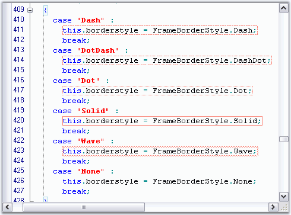

::: {style="DISPLAY: none"}
{#d2h_url_template}{#d2h_package_url style="WIDTH: 0px; DISPLAY: none; HEIGHT: 0px"}
:::

::::: {.d2h_secondary_topic style="PADDING-BOTTOM: 10pt; MARGIN: 0pt; PADDING-LEFT: 0pt; PADDING-RIGHT: 0pt; PADDING-TOP: 0pt"}
#### Text Border {#text-border style="tab-stops: 0pt"}

 

This section discusses how borders can be set for the text in the Edit Control.

 

Edit Control supports borders for its text by using the methods given below.

 

::: {align="center"}
  --------------------- ----------------------------------------------------
  Edit Control Method   Description
  SetTextBorder         Sets border around text.
  RemoveTextBorder      Removes border around text with given coordinates.
  --------------------- ----------------------------------------------------
:::

 

::: {align="center"}
+-----------------------------------+-------------------------------------------------------------------+
| Edit Control Border Enumerator    | Description                                                       |
+-----------------------------------+-------------------------------------------------------------------+
| FrameBorderStyle                  | Specifies the style of border line. The options provided are      |
|                                   |                                                                   |
|                                   |                                                                   |
|                                   |                                                                   |
|                                   | [·      ]{style="FONT-FAMILY: Symbol"}Dash                        |
|                                   |                                                                   |
|                                   | [·      ]{style="FONT-FAMILY: Symbol"}DashDot                     |
|                                   |                                                                   |
|                                   | [·      ]{style="FONT-FAMILY: Symbol"}Dot                         |
|                                   |                                                                   |
|                                   | [·      ]{style="FONT-FAMILY: Symbol"}None                        |
|                                   |                                                                   |
|                                   | [·      ]{style="FONT-FAMILY: Symbol"}Solid                       |
|                                   |                                                                   |
|                                   | [·      ]{style="FONT-FAMILY: Symbol"}Wave                        |
+-----------------------------------+-------------------------------------------------------------------+
| BorderWeight                      | Specifies the weight of the border line. The options provided are |
|                                   |                                                                   |
|                                   |                                                                   |
|                                   |                                                                   |
|                                   | [·      ]{style="FONT-FAMILY: Symbol"}Bold                        |
|                                   |                                                                   |
|                                   | [·      ]{style="FONT-FAMILY: Symbol"}Double                      |
|                                   |                                                                   |
|                                   | [·      ]{style="FONT-FAMILY: Symbol"}Thin                        |
+-----------------------------------+-------------------------------------------------------------------+
:::

[]{style="FONT-FAMILY: 'Trebuchet MS','sans-serif'; COLOR: #15428b; FONT-SIZE: 9pt"} 

+----------------------------------------------------------------------------------------------------------------------------------------------------------------------------------------------------------------------------------------------------------------------------------------------------------------------------------------------------------------------------------------+
| **[\[C#\]]{style="FONT-FAMILY: 'Courier New'; COLOR: black"}**                                                                                                                                                                                                                                                                                                                         |
|                                                                                                                                                                                                                                                                                                                                                                                        |
| []{style="FONT-FAMILY: 'Courier New'; COLOR: black"}                                                                                                                                                                                                                                                                                                                                   |
|                                                                                                                                                                                                                                                                                                                                                                                        |
| [// Set borders for the specified text range.]{style="FONT-FAMILY: 'Courier New'; COLOR: green"}                                                                                                                                                                                                                                                                                       |
|                                                                                                                                                                                                                                                                                                                                                                                        |
| [this]{style="FONT-FAMILY: 'Courier New'; COLOR: blue"}[.editControl1.SetTextBorder([new]{style="COLOR: blue"} [Point]{style="COLOR: teal"}(1, 13), [new]{style="COLOR: blue"} [Point]{style="COLOR: teal"}(15, 13), [Color]{style="COLOR: teal"}.Red, [FrameBorderStyle]{style="COLOR: teal"}.Wave, [BorderWeight]{style="COLOR: teal"}.Double);]{style="FONT-FAMILY: 'Courier New'"} |
|                                                                                                                                                                                                                                                                                                                                                                                        |
| []{style="FONT-FAMILY: 'Courier New'"}                                                                                                                                                                                                                                                                                                                                                 |
|                                                                                                                                                                                                                                                                                                                                                                                        |
| [// Remove borders from the specified text range.]{style="FONT-FAMILY: 'Courier New'; COLOR: green"}                                                                                                                                                                                                                                                                                   |
|                                                                                                                                                                                                                                                                                                                                                                                        |
| [this]{style="FONT-FAMILY: 'Courier New'; COLOR: blue"}[.editControl1.RemoveTextBorder([new]{style="COLOR: blue"} [Point]{style="COLOR: teal"}(1, 13), [new]{style="COLOR: blue"} [Point]{style="COLOR: teal"}(15, 13);]{style="FONT-FAMILY: 'Courier New'"}                                                                                                                           |
+----------------------------------------------------------------------------------------------------------------------------------------------------------------------------------------------------------------------------------------------------------------------------------------------------------------------------------------------------------------------------------------+

[]{style="FONT-FAMILY: 'Trebuchet MS','sans-serif'; COLOR: #15428b; FONT-SIZE: 9pt"} 

+------------------------------------------------------------------------------------------------------------------------------------------------------------------------------------------------------------------------------------------------------------------+
| **[\[VB.NET\]]{style="FONT-FAMILY: 'Courier New'; COLOR: black"}**                                                                                                                                                                                               |
|                                                                                                                                                                                                                                                                  |
| []{style="FONT-FAMILY: 'Courier New'; COLOR: black"}                                                                                                                                                                                                             |
|                                                                                                                                                                                                                                                                  |
| [\' Set borders for the specified text range.]{style="FONT-FAMILY: 'Courier New'; COLOR: green"}                                                                                                                                                                 |
|                                                                                                                                                                                                                                                                  |
| [Me]{style="FONT-FAMILY: 'Courier New'; COLOR: blue"}[.editControl1.SetTextBorder([New]{style="COLOR: blue"} Point(1, 13), [New]{style="COLOR: blue"} Point(15, 13), Color.Red, FrameBorderStyle.Wave, BorderWeight.Double)]{style="FONT-FAMILY: 'Courier New'"} |
|                                                                                                                                                                                                                                                                  |
| []{style="FONT-FAMILY: 'Courier New'"}                                                                                                                                                                                                                           |
|                                                                                                                                                                                                                                                                  |
| [\' Remove borders from the specified text range.]{style="FONT-FAMILY: 'Courier New'; COLOR: green"}                                                                                                                                                             |
|                                                                                                                                                                                                                                                                  |
| [Me]{style="FONT-FAMILY: 'Courier New'; COLOR: blue"}[.editControl1.RemoveTextBorder([New]{style="COLOR: blue"} Point(1, 13), [New]{style="COLOR: blue"} Point(15, 13)]{style="FONT-FAMILY: 'Courier New'"}                                                      |
+------------------------------------------------------------------------------------------------------------------------------------------------------------------------------------------------------------------------------------------------------------------+

[]{style="FONT-FAMILY: 'Trebuchet MS','sans-serif'; COLOR: #15428b; FONT-SIZE: 9pt"} 

{border="0"}

Figure 40: Text Borders in Edit Control

 

A sample which demonstrates the above feature is available in the following sample installation path.

 

..\\My Documents\\Syncfusion\\EssentialStudio\\***Version Number***\\Windows\\Edit.Windows\\Samples\\2.0\\Advanced Editor Functions\\BordersDemo

 

**See Also**

 

[Underlines, Wavelines and StrikeThrough]{.UGHyperlink}[]{.UGHyperlink}

 

[]{#related-topics}
:::::
