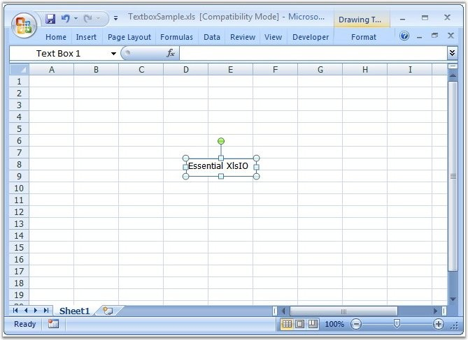

::: {style="DISPLAY: none"}
{#d2h_url_template}{#d2h_package_url style="WIDTH: 0px; DISPLAY: none; HEIGHT: 0px"}
:::

::: {.d2h_secondary_topic style="PADDING-BOTTOM: 10pt; MARGIN: 0pt; PADDING-LEFT: 0pt; PADDING-RIGHT: 0pt; PADDING-TOP: 0pt"}
#### Text Box {#text-box style="tab-stops: 0pt"}

**[]{style="FONT-FAMILY: 'Segoe UI','sans-serif'; COLOR: black"}** 

Essential XlsIO can now read and write text boxes. The **ITextBoxShape** interface lets you add a new text box inside a worksheet. The **IFill** interface is used to customize the inner appearance of the textbox. **IShapeLineFormat** interface is used to modify the border. Various other properties like Horizontal and Vertical Alignment, Alternative Text, Text Rotation, and so on, are also supported.

[]{style="FONT-FAMILY: 'Trebuchet MS','sans-serif'; COLOR: #15428b; FONT-SIZE: 9pt"} 

+-------------------------------------------------------------------------------------------------------------------------------------------------------------+
| **[\[C#\]]{style="FONT-FAMILY: 'Courier New'"}**                                                                                                            |
|                                                                                                                                                             |
| **[]{style="FONT-FAMILY: 'Courier New'"}**                                                                                                                  |
|                                                                                                                                                             |
| [// Creates a new Text Box.]{style="FONT-FAMILY: 'Courier New'; COLOR: green"}                                                                              |
|                                                                                                                                                             |
| [ITextBoxShape]{style="FONT-FAMILY: 'Courier New'; COLOR: teal"}[ textbox = sheet.TextBoxes.AddTextBox(3, 7, 25, 100);]{style="FONT-FAMILY: 'Courier New'"} |
|                                                                                                                                                             |
| [textbox.Text = [\"Essential XlsIO\"]{style="COLOR: maroon"};]{style="FONT-FAMILY: 'Courier New'"}                                                          |
|                                                                                                                                                             |
| []{style="FONT-FAMILY: 'Courier New'; COLOR: green"}                                                                                                        |
|                                                                                                                                                             |
| [// Reads a Text Box.]{style="FONT-FAMILY: 'Courier New'; COLOR: green"}                                                                                    |
|                                                                                                                                                             |
| [ITextBoxShape]{style="FONT-FAMILY: 'Courier New'; COLOR: teal"}[ shape1 = sheet.TextBoxes\[0\];]{style="FONT-FAMILY: 'Courier New'"}                       |
|                                                                                                                                                             |
| [shape1.Name = [\"First TextBox\"]{style="COLOR: maroon"};]{style="FONT-FAMILY: 'Courier New'"}                                                             |
|                                                                                                                                                             |
| [shape1.Fill.ForeColor = [Color]{style="COLOR: teal"}.Gold;]{style="FONT-FAMILY: 'Courier New'"}                                                            |
|                                                                                                                                                             |
| [shape1.Fill.BackColor = [Color]{style="COLOR: teal"}.Black;]{style="FONT-FAMILY: 'Courier New'"}                                                           |
|                                                                                                                                                             |
| [shape1.Fill.Pattern = [ExcelGradientPattern]{style="COLOR: teal"}.Pat_90_Percent;]{style="FONT-FAMILY: 'Courier New'"}                                     |
+-------------------------------------------------------------------------------------------------------------------------------------------------------------+

[]{style="FONT-FAMILY: 'Trebuchet MS','sans-serif'; COLOR: #15428b; FONT-SIZE: 9pt"} 

+------------------------------------------------------------------------------------------------------------------------------------------------------------------------------------------+
| **[\[VB.NET\]]{style="FONT-FAMILY: 'Courier New'"}**                                                                                                                                     |
|                                                                                                                                                                                          |
| **[]{style="FONT-FAMILY: 'Courier New'"}**                                                                                                                                               |
|                                                                                                                                                                                          |
| [\' Creates a new Text Box.]{style="FONT-FAMILY: 'Courier New'; COLOR: green"}                                                                                                           |
|                                                                                                                                                                                          |
| [Dim]{style="FONT-FAMILY: 'Courier New'; COLOR: blue"}[ textbox [As]{style="COLOR: blue"} ITextBoxShape = sheet.TextBoxes.AddTextBox(3, 7, 25, 100)]{style="FONT-FAMILY: 'Courier New'"} |
|                                                                                                                                                                                          |
| [textbox.Text = [\"Essential XlsIO\"]{style="COLOR: maroon"}]{style="FONT-FAMILY: 'Courier New'"}                                                                                        |
|                                                                                                                                                                                          |
| []{style="FONT-FAMILY: 'Courier New'; COLOR: green"}                                                                                                                                     |
|                                                                                                                                                                                          |
| [\' Reads a Text Box.]{style="FONT-FAMILY: 'Courier New'; COLOR: green"}                                                                                                                 |
|                                                                                                                                                                                          |
| [ITextBoxShape shape1 = sheet.TextBoxes(0)]{style="FONT-FAMILY: 'Courier New'"}                                                                                                          |
|                                                                                                                                                                                          |
| [shape1.Name = [\"First TextBox\"]{style="COLOR: maroon"}]{style="FONT-FAMILY: 'Courier New'"}                                                                                           |
|                                                                                                                                                                                          |
| [shape1.Fill.ForeColor = Color.Gold]{style="FONT-FAMILY: 'Courier New'"}                                                                                                                 |
|                                                                                                                                                                                          |
| [shape1.Fill.BackColor = Color.Black]{style="FONT-FAMILY: 'Courier New'"}                                                                                                                |
|                                                                                                                                                                                          |
| [shape1.Fill.Pattern = ExcelGradientPattern.Pat_90_Percent]{style="FONT-FAMILY: 'Courier New'"}                                                                                          |
+------------------------------------------------------------------------------------------------------------------------------------------------------------------------------------------+

**[]{style="FONT-FAMILY: 'Trebuchet MS','sans-serif'; COLOR: #15428b; FONT-SIZE: 9pt"}** 

{border="0"}

Figure 96: TextBox created using XlsIO**[]{style="FONT-FAMILY: 'Trebuchet MS','sans-serif'; COLOR: #15428b"}**

[]{style="FONT-FAMILY: 'Trebuchet MS','sans-serif'; COLOR: #15428b; FONT-SIZE: 9pt"} 

 

[]{#related-topics}
:::
