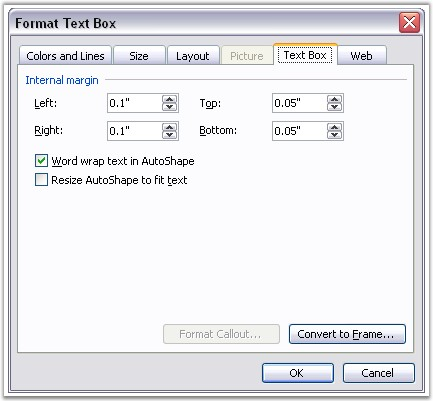

::: {style="DISPLAY: none"}
{#d2h_url_template}{#d2h_package_url style="WIDTH: 0px; DISPLAY: none; HEIGHT: 0px"}
:::

:::::: {.d2h_secondary_topic style="PADDING-BOTTOM: 10pt; MARGIN: 0pt; PADDING-LEFT: 0pt; PADDING-RIGHT: 0pt; PADDING-TOP: 0pt"}
#### Text Box Format {#text-box-format style="tab-stops: 0pt"}

 

**WTextBoxFormat** class defines formatting for the Text Box.

 

{border="0"}

Figure 77: Format Text Box Dialog Box

 

 

Position

 

Absolute positioning of text box is defined by using the VerticalPosition and HorizontalPosition properties. Measure unit is point. Relative positioning is defined by using the HorizontalAlignment and VerticalAlignment properties.

 

HorizontalAlignment returns an object of type, ShapeHorizontalAlignment. The following are the variants for setting the Horizontal alignment of a picture.

 

[·      ]{style="FONT-FAMILY: Symbol"}**None**: no horizontal alignment

[·      ]{style="FONT-FAMILY: Symbol"}**Left**: left horizontal alignment

[·      ]{style="FONT-FAMILY: Symbol"}**Center**: center horizontal alignment

[·      ]{style="FONT-FAMILY: Symbol"}**Right**: right horizontal alignment

[·      ]{style="FONT-FAMILY: Symbol"}**Inside**: inside horizontal alignment

[·      ]{style="FONT-FAMILY: Symbol"}**Outside**: outside horizontal alignment

 

VerticalAlignment returns an object of type, ShapeVerticalAlignment. The following are the variants for setting the Vertical alignment of a picture.

 

[·      ]{style="FONT-FAMILY: Symbol"}**Bottom**: picture is aligned to the bottom of the reference origin

[·      ]{style="FONT-FAMILY: Symbol"}**Center**: picture is centered relative to the reference origin

[·      ]{style="FONT-FAMILY: Symbol"}**Inline**: inline vertical alignment

[·      ]{style="FONT-FAMILY: Symbol"}**Inside**: inside vertical alignment

[·      ]{style="FONT-FAMILY: Symbol"}**None**: picture is explicitly positioned by using position properties

[·      ]{style="FONT-FAMILY: Symbol"}**Outside**: outside vertical alignment

[·      ]{style="FONT-FAMILY: Symbol"}**Top**: picture is aligned to the top of the reference origin

 

**HorizontalOrigin** and **VerticalOrigin** properties define the reference origin which is used for relative positioning of the picture.

 

HorizontalOrigin property returns a value of type, HorizontalOrigin. The following are the variants for setting the Horizontal origin of a picture.

 

[·      ]{style="FONT-FAMILY: Symbol"}Margin

[·      ]{style="FONT-FAMILY: Symbol"}Page

[·      ]{style="FONT-FAMILY: Symbol"}Column

[·      ]{style="FONT-FAMILY: Symbol"}Character

 

**VerticalOrigin** property returns a value of type, VerticalOrigin. The following are the variants for setting the Vertical origin of a picture.

 

[·      ]{style="FONT-FAMILY: Symbol"}Margin

[·      ]{style="FONT-FAMILY: Symbol"}Page

[·      ]{style="FONT-FAMILY: Symbol"}Paragraph

[·      ]{style="FONT-FAMILY: Symbol"}Line

 

Border Style

 

You can specify the style of the border line of the text box by using the **LineStyle** property. It provides the following options.

 

[·      ]{style="FONT-FAMILY: Symbol"}Simple

[·      ]{style="FONT-FAMILY: Symbol"}Double

[·      ]{style="FONT-FAMILY: Symbol"}ThickThin

[·      ]{style="FONT-FAMILY: Symbol"}ThinThick

[·      ]{style="FONT-FAMILY: Symbol"}Triple

 

Class Hierarchy

 

FormatBase

            \|

            WTextBoxFormat

 

**Public Constructor**

 

::: {align="center"}
  ----------------------------------------------- ---------------------------------------------------------
  Name                                            Description
  WTextBoxFormat.WTextBoxFormat (IWordDocument)   Initializes a new instance of the WTextBoxFormat class.
  ----------------------------------------------- ---------------------------------------------------------
:::

 

Public Properties

 

::: {align="center"}
  --------------------- ---------------------------------------------------------------------------
  Name                  Description
  FillColor             Gets or sets fill color for textbox.
  Height                Gets or sets the textbox height (in points). 
  HorizontalAlignment   Gets or sets horizontal alignment of textbox. 
  HorizontalOrigin      Gets or sets horizontal origin.  
  HorizontalPosition    Gets or sets the horizontal position of textbox (in points).  
  LineColor             Gets or sets line color.  
  LineDashing           Gets or sets line dashing for textbox.  
  LineStyle             Gets or sets linestyle of textbox.  
  LineWidth             Gets or sets the line width of textbox (in points).  
  NoLine                Gets or sets value which defines if there is a line around textbox shape.
  TextWrappingStyle     Gets or sets text Wrapping style.
  TextWrappingType      Gets or sets wrapping type for textbox.  
  VerticalAlignment     Gets or sets vertical alignment of textbox.  
  VerticalOrigin        Gets or sets vertical origin.  
  VerticalPosition      Gets or sets the textbox vertical position (in points).  
  Width                 Gets or sets the textbox width (in points).  
  --------------------- ---------------------------------------------------------------------------
:::

 

Public Methods

 

::: {align="center"}
  ------------ ------------------------
  Name         Description
  Clone        Clones textbox format.
  ------------ ------------------------
:::

 

The following example illustrates how to use the WTextBox and TextBoxFormat classes.

 

+--------------------------------------------------------------------------------------------------------------------------------------------------------------------------------+
| **[\[C#\]]{style="FONT-FAMILY: 'Courier New'; COLOR: black"}**                                                                                                                 |
|                                                                                                                                                                                |
| []{style="FONT-FAMILY: 'Courier New'"}                                                                                                                                         |
|                                                                                                                                                                                |
| [IWordDocument]{style="FONT-FAMILY: 'Courier New'; COLOR: teal"}[ doc = [new]{style="COLOR: blue"} [WordDocument]{style="COLOR: teal"}();]{style="FONT-FAMILY: 'Courier New'"} |
|                                                                                                                                                                                |
| [IWSection]{style="FONT-FAMILY: 'Courier New'; COLOR: teal"}[ section = doc.AddSection();]{style="FONT-FAMILY: 'Courier New'"}                                                 |
|                                                                                                                                                                                |
| [IWParagraph]{style="FONT-FAMILY: 'Courier New'; COLOR: teal"}[ paragraph = section.AddParagraph();]{style="FONT-FAMILY: 'Courier New'"}                                       |
|                                                                                                                                                                                |
| [section.PageSetup.DifferentFirstPage = [true]{style="COLOR: blue"};]{style="FONT-FAMILY: 'Courier New'"}                                                                      |
|                                                                                                                                                                                |
| [section.PageSetup.DifferentOddAndEvenPages = [true]{style="COLOR: blue"};]{style="FONT-FAMILY: 'Courier New'"}                                                                |
|                                                                                                                                                                                |
| []{style="FONT-FAMILY: 'Courier New'"}                                                                                                                                         |
|                                                                                                                                                                                |
| [// Main doc textboxes]{style="FONT-FAMILY: 'Courier New'; COLOR: green"}                                                                                                      |
|                                                                                                                                                                                |
| [paragraph.AppendText([\"Testing textboxes\"]{style="COLOR: maroon"});]{style="FONT-FAMILY: 'Courier New'"}                                                                    |
|                                                                                                                                                                                |
| [// 1 textbox]{style="FONT-FAMILY: 'Courier New'; COLOR: green"}                                                                                                               |
|                                                                                                                                                                                |
| [IWTextBox]{style="FONT-FAMILY: 'Courier New'; COLOR: teal"}[ mainTextbox = paragraph.AppendTextBox(150, 110);]{style="FONT-FAMILY: 'Courier New'"}                            |
|                                                                                                                                                                                |
| [mainTextbox.TextBoxBody.AddParagraph().AppendText([\"Textbox text 1\"]{style="COLOR: maroon"});]{style="FONT-FAMILY: 'Courier New'"}                                          |
|                                                                                                                                                                                |
| [mainTextbox.TextBoxFormat.FillColor = System.Drawing.[Color]{style="COLOR: teal"}.Blue;]{style="FONT-FAMILY: 'Courier New'"}                                                  |
|                                                                                                                                                                                |
| [mainTextbox.TextBoxFormat.LineDashing = [LineDashing]{style="COLOR: teal"}.LongDashDotDotGEL;]{style="FONT-FAMILY: 'Courier New'"}                                            |
|                                                                                                                                                                                |
| [mainTextbox.TextBoxFormat.LineWidth = 4.0f;]{style="FONT-FAMILY: 'Courier New'"}                                                                                              |
|                                                                                                                                                                                |
| [// 2 textbox ]{style="FONT-FAMILY: 'Courier New'; COLOR: green"}                                                                                                              |
|                                                                                                                                                                                |
| [IWTextBox]{style="FONT-FAMILY: 'Courier New'; COLOR: teal"}[ mainTextbox1 = paragraph.AppendTextBox(150, 100);]{style="FONT-FAMILY: 'Courier New'"}                           |
|                                                                                                                                                                                |
| [mainTextbox1.TextBoxFormat.VerticalPosition = 500;]{style="FONT-FAMILY: 'Courier New'"}                                                                                       |
|                                                                                                                                                                                |
| [mainTextbox1.TextBoxBody.AddParagraph().AppendText([\"Another textbox\"]{style="COLOR: maroon"});]{style="FONT-FAMILY: 'Courier New'"}                                        |
|                                                                                                                                                                                |
| [mainTextbox1.TextBoxFormat.FillColor = System.Drawing.[Color]{style="COLOR: teal"}.Yellow;]{style="FONT-FAMILY: 'Courier New'"}                                               |
|                                                                                                                                                                                |
| [mainTextbox1.TextBoxFormat.LineDashing = [LineDashing]{style="COLOR: teal"}.DashGEL;]{style="FONT-FAMILY: 'Courier New'"}                                                     |
|                                                                                                                                                                                |
| [mainTextbox1.TextBoxFormat.LineWidth = 3.75f;]{style="FONT-FAMILY: 'Courier New'"}                                                                                            |
|                                                                                                                                                                                |
| [mainTextbox1.TextBoxFormat.TextWrappingStyle = [TextWrappingStyle]{style="COLOR: teal"}.Through;]{style="FONT-FAMILY: 'Courier New'"}                                         |
|                                                                                                                                                                                |
| [mainTextbox1.TextBoxFormat.TextWrappingType = [TextWrappingType]{style="COLOR: teal"}.Both;]{style="FONT-FAMILY: 'Courier New'"}                                              |
|                                                                                                                                                                                |
| [mainTextbox1.TextBoxFormat.HorizontalAlignment = ]{style="FONT-FAMILY: 'Courier New'"}                                                                                        |
|                                                                                                                                                                                |
| [ShapeHorizontalAlignment]{style="FONT-FAMILY: 'Courier New'; COLOR: teal"}[.Center;]{style="FONT-FAMILY: 'Courier New'"}                                                      |
|                                                                                                                                                                                |
| [mainTextbox1.TextBoxFormat.VerticalAlignment = [ShapeVerticalAlignment]{style="COLOR: teal"}.Bottom;]{style="FONT-FAMILY: 'Courier New'"}                                     |
|                                                                                                                                                                                |
| []{style="FONT-FAMILY: 'Courier New'"}                                                                                                                                         |
|                                                                                                                                                                                |
| [//Header/footer textboxes]{style="FONT-FAMILY: 'Courier New'; COLOR: green"}                                                                                                  |
|                                                                                                                                                                                |
| [paragraph = [new]{style="COLOR: blue"} [WParagraph]{style="COLOR: teal"}(doc);]{style="FONT-FAMILY: 'Courier New'"}                                                           |
|                                                                                                                                                                                |
| [paragraph.AppendText([\"Hello textboxes\"]{style="COLOR: maroon"});]{style="FONT-FAMILY: 'Courier New'"}                                                                      |
|                                                                                                                                                                                |
| [IWTextBox]{style="FONT-FAMILY: 'Courier New'; COLOR: teal"}[ textbox = paragraph.AppendTextBox(20, 50);]{style="FONT-FAMILY: 'Courier New'"}                                  |
|                                                                                                                                                                                |
| [textbox.TextBoxBody.AddParagraph().AppendText([\"Header textbox\"]{style="COLOR: maroon"});]{style="FONT-FAMILY: 'Courier New'"}                                              |
|                                                                                                                                                                                |
| [textbox.TextBoxFormat.FillColor = System.Drawing.[Color]{style="COLOR: teal"}.Blue;]{style="FONT-FAMILY: 'Courier New'"}                                                      |
|                                                                                                                                                                                |
| [textbox.TextBoxFormat.LineDashing = [LineDashing]{style="COLOR: teal"}.LongDashDotDotGEL;]{style="FONT-FAMILY: 'Courier New'"}                                                |
|                                                                                                                                                                                |
| [textbox.TextBoxFormat.LineWidth = 4.0f;]{style="FONT-FAMILY: 'Courier New'"}                                                                                                  |
|                                                                                                                                                                                |
| []{style="FONT-FAMILY: 'Courier New'"}                                                                                                                                         |
|                                                                                                                                                                                |
| [IWTextBox]{style="FONT-FAMILY: 'Courier New'; COLOR: teal"}[ textbox1 = paragraph.AppendTextBox(250, 50);]{style="FONT-FAMILY: 'Courier New'"}                                |
|                                                                                                                                                                                |
| [textbox1.TextBoxBody.AddParagraph().AppendText([\"Header textbox 2\"]{style="COLOR: maroon"});]{style="FONT-FAMILY: 'Courier New'"}                                           |
|                                                                                                                                                                                |
| [textbox1.TextBoxFormat.FillColor = System.Drawing.[Color]{style="COLOR: teal"}.Tomato;]{style="FONT-FAMILY: 'Courier New'"}                                                   |
|                                                                                                                                                                                |
| [textbox1.TextBoxFormat.VerticalPosition = 250;]{style="FONT-FAMILY: 'Courier New'"}                                                                                           |
|                                                                                                                                                                                |
| [textbox1.TextBoxFormat.LineStyle = [TextBoxLineStyle]{style="COLOR: teal"}.Triple;]{style="FONT-FAMILY: 'Courier New'"}                                                       |
|                                                                                                                                                                                |
| [textbox1.TextBoxFormat.LineDashing = [LineDashing]{style="COLOR: teal"}.LongDashGEL;]{style="FONT-FAMILY: 'Courier New'"}                                                     |
|                                                                                                                                                                                |
| [textbox1.TextBoxFormat.LineWidth = 6.0f;]{style="FONT-FAMILY: 'Courier New'"}                                                                                                 |
|                                                                                                                                                                                |
| [textbox1.TextBoxFormat.NoLine = [true]{style="COLOR: blue"};            ]{style="FONT-FAMILY: 'Courier New'"}                                                                 |
|                                                                                                                                                                                |
| []{style="FONT-FAMILY: 'Courier New'"}                                                                                                                                         |
|                                                                                                                                                                                |
| [section.HeadersFooters.FirstPageHeader.Paragraphs.Add(paragraph);]{style="FONT-FAMILY: 'Courier New'"}                                                                        |
|                                                                                                                                                                                |
| []{style="FONT-FAMILY: 'Courier New'"}                                                                                                                                         |
|                                                                                                                                                                                |
| [paragraph = [new]{style="COLOR: blue"} [WParagraph]{style="COLOR: teal"}(doc);]{style="FONT-FAMILY: 'Courier New'"}                                                           |
|                                                                                                                                                                                |
| [paragraph.AppendText([\"Hello footer textbox\"]{style="COLOR: maroon"});]{style="FONT-FAMILY: 'Courier New'"}                                                                 |
|                                                                                                                                                                                |
| [IWTextBox]{style="FONT-FAMILY: 'Courier New'; COLOR: teal"}[ textbox2 = paragraph.AppendTextBox(120, 100);]{style="FONT-FAMILY: 'Courier New'"}                               |
|                                                                                                                                                                                |
| [textbox2.TextBoxFormat.VerticalPosition = 5;]{style="FONT-FAMILY: 'Courier New'"}                                                                                             |
|                                                                                                                                                                                |
| [textbox2.TextBoxBody.AddParagraph().AppendText([\"Footer textbox\"]{style="COLOR: maroon"});]{style="FONT-FAMILY: 'Courier New'"}                                             |
|                                                                                                                                                                                |
| [textbox2.TextBoxFormat.FillColor = System.Drawing.[Color]{style="COLOR: teal"}.Yellow;]{style="FONT-FAMILY: 'Courier New'"}                                                   |
|                                                                                                                                                                                |
| [textbox2.TextBoxFormat.LineDashing = [LineDashing]{style="COLOR: teal"}.DashGEL;]{style="FONT-FAMILY: 'Courier New'"}                                                         |
|                                                                                                                                                                                |
| [textbox2.TextBoxFormat.LineWidth = 3.75f;]{style="FONT-FAMILY: 'Courier New'"}                                                                                                |
|                                                                                                                                                                                |
| [textbox2.TextBoxFormat.TextWrappingStyle = [TextWrappingStyle]{style="COLOR: teal"}.Square;]{style="FONT-FAMILY: 'Courier New'"}                                              |
|                                                                                                                                                                                |
| [textbox2.TextBoxFormat.HorizontalAlignment = [ShapeHorizontalAlignment]{style="COLOR: teal"}.Left;]{style="FONT-FAMILY: 'Courier New'"}                                       |
|                                                                                                                                                                                |
| [textbox2.TextBoxFormat.VerticalAlignment = [ShapeVerticalAlignment]{style="COLOR: teal"}.Bottom;]{style="FONT-FAMILY: 'Courier New'"}                                         |
|                                                                                                                                                                                |
| [section.HeadersFooters.FirstPageFooter.Paragraphs.Add(paragraph);]{style="FONT-FAMILY: 'Courier New'"}                                                                        |
|                                                                                                                                                                                |
| [doc.Save([\"TextBoxes.doc\"]{style="COLOR: maroon"});]{style="FONT-FAMILY: 'Courier New'"}                                                                                    |
+--------------------------------------------------------------------------------------------------------------------------------------------------------------------------------+

 

+--------------------------------------------------------------------------------------------------------------------------------------------------------------------------------------+
| **[\[VB\]]{style="FONT-FAMILY: 'Courier New'; COLOR: black"}**                                                                                                                       |
|                                                                                                                                                                                      |
| []{style="FONT-FAMILY: 'Courier New'"}                                                                                                                                               |
|                                                                                                                                                                                      |
| [Dim]{style="FONT-FAMILY: 'Courier New'; COLOR: blue"}[ doc [As]{style="COLOR: blue"} IWordDocument = [New]{style="COLOR: blue"} WordDocument()]{style="FONT-FAMILY: 'Courier New'"} |
|                                                                                                                                                                                      |
| [Dim]{style="FONT-FAMILY: 'Courier New'; COLOR: blue"}[ section [As]{style="COLOR: blue"} IWSection = doc.AddSection()]{style="FONT-FAMILY: 'Courier New'"}                          |
|                                                                                                                                                                                      |
| [Dim]{style="FONT-FAMILY: 'Courier New'; COLOR: blue"}[ paragraph [As]{style="COLOR: blue"} IWParagraph = section.AddParagraph()]{style="FONT-FAMILY: 'Courier New'"}                |
|                                                                                                                                                                                      |
| [section.PageSetup.DifferentFirstPage = [True]{style="COLOR: blue"}]{style="FONT-FAMILY: 'Courier New'"}                                                                             |
|                                                                                                                                                                                      |
| [section.PageSetup.DifferentOddAndEvenPages = [True]{style="COLOR: blue"}]{style="FONT-FAMILY: 'Courier New'"}                                                                       |
|                                                                                                                                                                                      |
| []{style="FONT-FAMILY: 'Courier New'; COLOR: blue"}                                                                                                                                  |
|                                                                                                                                                                                      |
| [\' Main doc textboxes]{style="FONT-FAMILY: 'Courier New'; COLOR: green"}                                                                                                            |
|                                                                                                                                                                                      |
| [paragraph.AppendText([\"Testing textboxes\"]{style="COLOR: maroon"})]{style="FONT-FAMILY: 'Courier New'"}                                                                           |
|                                                                                                                                                                                      |
| []{style="FONT-FAMILY: 'Courier New'"}                                                                                                                                               |
|                                                                                                                                                                                      |
| [\' 1 textbox]{style="FONT-FAMILY: 'Courier New'; COLOR: green"}                                                                                                                     |
|                                                                                                                                                                                      |
| [Dim]{style="FONT-FAMILY: 'Courier New'; COLOR: blue"}[ mainTextbox [As]{style="COLOR: blue"} IWTextBox = paragraph.AppendTextBox(150, 110)]{style="FONT-FAMILY: 'Courier New'"}     |
|                                                                                                                                                                                      |
| [mainTextbox.TextBoxBody.AddParagraph().AppendText([\"Textbox text 1\"]{style="COLOR: maroon"})]{style="FONT-FAMILY: 'Courier New'"}                                                 |
|                                                                                                                                                                                      |
| [mainTextbox.TextBoxFormat.FillColor = System.Drawing.Color.Blue]{style="FONT-FAMILY: 'Courier New'"}                                                                                |
|                                                                                                                                                                                      |
| [mainTextbox.TextBoxFormat.LineDashing = LineDashing.LongDashDotDotGEL]{style="FONT-FAMILY: 'Courier New'"}                                                                          |
|                                                                                                                                                                                      |
| [ mainTextbox.TextBoxFormat.LineWidth = 4.0f]{style="FONT-FAMILY: 'Courier New'"}                                                                                                    |
|                                                                                                                                                                                      |
| []{style="FONT-FAMILY: 'Courier New'"}                                                                                                                                               |
|                                                                                                                                                                                      |
| [\' 2 textbox ]{style="FONT-FAMILY: 'Courier New'; COLOR: green"}                                                                                                                    |
|                                                                                                                                                                                      |
| [Dim]{style="FONT-FAMILY: 'Courier New'; COLOR: blue"}[ mainTextbox1 [As]{style="COLOR: blue"} IWTextBox = paragraph.AppendTextBox(150, 100)]{style="FONT-FAMILY: 'Courier New'"}    |
|                                                                                                                                                                                      |
| [mainTextbox1.TextBoxFormat.VerticalPosition = 500]{style="FONT-FAMILY: 'Courier New'"}                                                                                              |
|                                                                                                                                                                                      |
| [mainTextbox1.TextBoxBody.AddParagraph().AppendText([\"Another textbox\"]{style="COLOR: maroon"})]{style="FONT-FAMILY: 'Courier New'"}                                               |
|                                                                                                                                                                                      |
| [mainTextbox1.TextBoxFormat.FillColor = System.Drawing.Color.Yellow]{style="FONT-FAMILY: 'Courier New'"}                                                                             |
|                                                                                                                                                                                      |
| [mainTextbox1.TextBoxFormat.LineDashing = LineDashing.DashGEL]{style="FONT-FAMILY: 'Courier New'"}                                                                                   |
|                                                                                                                                                                                      |
| [mainTextbox1.TextBoxFormat.LineWidth = 3.75f]{style="FONT-FAMILY: 'Courier New'"}                                                                                                   |
|                                                                                                                                                                                      |
| [mainTextbox1.TextBoxFormat.TextWrappingStyle = TextWrappingStyle.Through]{style="FONT-FAMILY: 'Courier New'"}                                                                       |
|                                                                                                                                                                                      |
| [mainTextbox1.TextBoxFormat.TextWrappingType = TextWrappingType.Both]{style="FONT-FAMILY: 'Courier New'"}                                                                            |
|                                                                                                                                                                                      |
| [mainTextbox1.TextBoxFormat.HorizontalAlignment = ShapeHorizontalAlignment.Center]{style="FONT-FAMILY: 'Courier New'"}                                                               |
|                                                                                                                                                                                      |
| [mainTextbox1.TextBoxFormat.VerticalAlignment = ShapeVerticalAlignment.Bottom]{style="FONT-FAMILY: 'Courier New'"}                                                                   |
|                                                                                                                                                                                      |
| []{style="FONT-FAMILY: 'Courier New'"}                                                                                                                                               |
|                                                                                                                                                                                      |
| [\'Header/footer textboxes]{style="FONT-FAMILY: 'Courier New'; COLOR: green"}                                                                                                        |
|                                                                                                                                                                                      |
| [paragraph = [New]{style="COLOR: blue"} WParagraph(doc)]{style="FONT-FAMILY: 'Courier New'"}                                                                                         |
|                                                                                                                                                                                      |
| [paragraph.AppendText([\"Hello textboxes\"]{style="COLOR: maroon"})]{style="FONT-FAMILY: 'Courier New'"}                                                                             |
|                                                                                                                                                                                      |
| [Dim]{style="FONT-FAMILY: 'Courier New'; COLOR: blue"}[ textbox [As]{style="COLOR: blue"} IWTextBox = paragraph.AppendTextBox(20, 50)]{style="FONT-FAMILY: 'Courier New'"}           |
|                                                                                                                                                                                      |
| [textbox.TextBoxBody.AddParagraph().AppendText([\"Header textbox\"]{style="COLOR: maroon"})]{style="FONT-FAMILY: 'Courier New'"}                                                     |
|                                                                                                                                                                                      |
| [textbox.TextBoxFormat.FillColor = System.Drawing.Color.Blue]{style="FONT-FAMILY: 'Courier New'"}                                                                                    |
|                                                                                                                                                                                      |
| [textbox.TextBoxFormat.LineDashing = LineDashing.LongDashDotDotGEL]{style="FONT-FAMILY: 'Courier New'"}                                                                              |
|                                                                                                                                                                                      |
| [textbox.TextBoxFormat.LineWidth = 4.0f]{style="FONT-FAMILY: 'Courier New'"}                                                                                                         |
|                                                                                                                                                                                      |
| []{style="FONT-FAMILY: 'Courier New'"}                                                                                                                                               |
|                                                                                                                                                                                      |
| [Dim]{style="FONT-FAMILY: 'Courier New'; COLOR: blue"}[ textbox1 [As]{style="COLOR: blue"} IWTextBox = paragraph.AppendTextBox(250, 50)]{style="FONT-FAMILY: 'Courier New'"}         |
|                                                                                                                                                                                      |
| [textbox1.TextBoxBody.AddParagraph().AppendText([\"Header textbox 2\"]{style="COLOR: maroon"})]{style="FONT-FAMILY: 'Courier New'"}                                                  |
|                                                                                                                                                                                      |
| [textbox1.TextBoxFormat.FillColor = System.Drawing.Color.Tomato]{style="FONT-FAMILY: 'Courier New'"}                                                                                 |
|                                                                                                                                                                                      |
| [textbox1.TextBoxFormat.VerticalPosition = 250]{style="FONT-FAMILY: 'Courier New'"}                                                                                                  |
|                                                                                                                                                                                      |
| [textbox1.TextBoxFormat.LineStyle = TextBoxLineStyle.Triple]{style="FONT-FAMILY: 'Courier New'"}                                                                                     |
|                                                                                                                                                                                      |
| [textbox1.TextBoxFormat.LineDashing = LineDashing.LongDashGEL]{style="FONT-FAMILY: 'Courier New'"}                                                                                   |
|                                                                                                                                                                                      |
| [textbox1.TextBoxFormat.LineWidth = 6.0f]{style="FONT-FAMILY: 'Courier New'"}                                                                                                        |
|                                                                                                                                                                                      |
| [textbox1.TextBoxFormat.NoLine = [True]{style="COLOR: blue"}]{style="FONT-FAMILY: 'Courier New'"}                                                                                    |
|                                                                                                                                                                                      |
| []{style="FONT-FAMILY: 'Courier New'; COLOR: blue"}                                                                                                                                  |
|                                                                                                                                                                                      |
| [section.HeadersFooters.FirstPageHeader.Paragraphs.Add(paragraph)]{style="FONT-FAMILY: 'Courier New'"}                                                                               |
|                                                                                                                                                                                      |
| []{style="FONT-FAMILY: 'Courier New'"}                                                                                                                                               |
|                                                                                                                                                                                      |
| [paragraph = [New]{style="COLOR: blue"} WParagraph(doc)]{style="FONT-FAMILY: 'Courier New'"}                                                                                         |
|                                                                                                                                                                                      |
| [paragraph.AppendText([\"Hello footer textbox\"]{style="COLOR: maroon"})]{style="FONT-FAMILY: 'Courier New'"}                                                                        |
|                                                                                                                                                                                      |
| [Dim]{style="FONT-FAMILY: 'Courier New'; COLOR: blue"}[ textbox2 [As]{style="COLOR: blue"} IWTextBox = paragraph.AppendTextBox(120, 100)]{style="FONT-FAMILY: 'Courier New'"}        |
|                                                                                                                                                                                      |
| [Private]{style="FONT-FAMILY: 'Courier New'; COLOR: blue"}[ textbox2.TextBoxFormat.VerticalPosition = 5]{style="FONT-FAMILY: 'Courier New'"}                                         |
|                                                                                                                                                                                      |
| [textbox2.TextBoxBody.AddParagraph().AppendText([\"Footer textbox\"]{style="COLOR: maroon"})]{style="FONT-FAMILY: 'Courier New'"}                                                    |
|                                                                                                                                                                                      |
| [textbox2.TextBoxFormat.FillColor = System.Drawing.Color.Yellow]{style="FONT-FAMILY: 'Courier New'"}                                                                                 |
|                                                                                                                                                                                      |
| [textbox2.TextBoxFormat.LineDashing = LineDashing.DashGEL]{style="FONT-FAMILY: 'Courier New'"}                                                                                       |
|                                                                                                                                                                                      |
| [textbox2.TextBoxFormat.LineWidth = 3.75f]{style="FONT-FAMILY: 'Courier New'"}                                                                                                       |
|                                                                                                                                                                                      |
| [textbox2.TextBoxFormat.TextWrappingStyle = TextWrappingStyle.Square]{style="FONT-FAMILY: 'Courier New'"}                                                                            |
|                                                                                                                                                                                      |
| [textbox2.TextBoxFormat.HorizontalAlignment = ShapeHorizontalAlignment.Left]{style="FONT-FAMILY: 'Courier New'"}                                                                     |
|                                                                                                                                                                                      |
| [textbox2.TextBoxFormat.VerticalAlignment = ShapeVerticalAlignment.Bottom]{style="FONT-FAMILY: 'Courier New'"}                                                                       |
|                                                                                                                                                                                      |
| [section.HeadersFooters.FirstPageFooter.Paragraphs.Add(paragraph)]{style="FONT-FAMILY: 'Courier New'"}                                                                               |
|                                                                                                                                                                                      |
| [doc.Save([\"TextBoxes.doc\"]{style="COLOR: maroon"})]{style="FONT-FAMILY: 'Courier New'"}                                                                                           |
+--------------------------------------------------------------------------------------------------------------------------------------------------------------------------------------+

[]{#related-topics}
::::::
