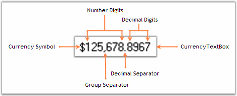
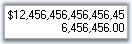
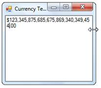
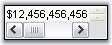
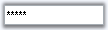
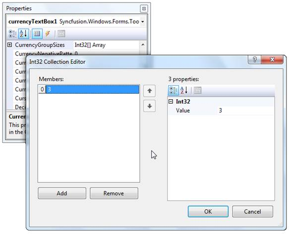
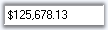
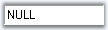

::: {style="DISPLAY: none"}
{#d2h_url_template}{#d2h_package_url style="WIDTH: 0px; DISPLAY: none; HEIGHT: 0px"}
:::

::::::::: {.d2h_secondary_topic style="PADDING-BOTTOM: 10pt; MARGIN: 0pt; PADDING-LEFT: 0pt; PADDING-RIGHT: 0pt; PADDING-TOP: 0pt"}
##### Text Field {#text-field style="tab-stops: 0pt"}

The text field of a CurrencyTextBox control can be customized using the properties available. The below image illustrates the various sections of the control.[]{style="COLOR: black"}

[]{style="COLOR: black"} 

{border="0"}

[]{style="COLOR: black"} 

Figure 501: TextField of CurrencyTextBox

 

###### 3.3.8.6.4.1 Text {#text style="tab-stops: 0pt"}

The default text in the CurrencyTextBox can be edited through **Text** property. Default value is \$2.00. The text can be aligned to Left, Right or Center using **TextAlign** property.[]{style="COLOR: black"}

[]{style="COLOR: black"} 

+-------------------------------------------------------------------------------------------------------------------------------------------------------------------------------------------------------------------------------------------------------------------------------------------------------------------------+
| **[\[C#\]]{style="FONT-FAMILY: 'Courier New'; COLOR: black"}**[]{style="COLOR: black"}                                                                                                                                                                                                                                  |
|                                                                                                                                                                                                                                                                                                                         |
| []{style="COLOR: black"}                                                                                                                                                                                                                                                                                                |
|                                                                                                                                                                                                                                                                                                                         |
| [this]{style="FONT-FAMILY: 'Courier New'; COLOR: blue"}[.currencyTextBox2.Text = ]{style="FONT-FAMILY: 'Courier New'; COLOR: black"}[\"\$25.00\"]{style="FONT-FAMILY: 'Courier New'; COLOR: maroon"}[;]{style="FONT-FAMILY: 'Courier New'; COLOR: black"}[]{style="COLOR: black"}                                       |
|                                                                                                                                                                                                                                                                                                                         |
| [this]{style="FONT-FAMILY: 'Courier New'; COLOR: blue"}[.currencyTextBox1.TextAlign = System.Windows.Forms.]{style="FONT-FAMILY: 'Courier New'; COLOR: black"}[HorizontalAlignment]{style="FONT-FAMILY: 'Courier New'; COLOR: teal"}[.Right;]{style="FONT-FAMILY: 'Courier New'; COLOR: black"}[]{style="COLOR: black"} |
+-------------------------------------------------------------------------------------------------------------------------------------------------------------------------------------------------------------------------------------------------------------------------------------------------------------------------+

[]{style="COLOR: black"} 

+----------------------------------------------------------------------------------------------------------------------------------------------------------------------------------------------------------------------------+
| **[\[VB.NET\]]{style="FONT-FAMILY: 'Courier New'; COLOR: black"}**[]{style="COLOR: black"}                                                                                                                                 |
|                                                                                                                                                                                                                            |
| []{style="COLOR: black"}                                                                                                                                                                                                   |
|                                                                                                                                                                                                                            |
| [Me]{style="FONT-FAMILY: 'Courier New'; COLOR: blue"}[.currencyTextBox2.Text = ]{style="FONT-FAMILY: 'Courier New'; COLOR: black"}[\"\$25.00\"]{style="FONT-FAMILY: 'Courier New'; COLOR: maroon"}[]{style="COLOR: black"} |
|                                                                                                                                                                                                                            |
| [Me]{style="FONT-FAMILY: 'Courier New'; COLOR: blue"}[.currencyTextBox1.TextAlign = System.Windows.Forms.HorizontalAlignment.Right]{style="FONT-FAMILY: 'Courier New'; COLOR: black"}[]{style="COLOR: black"}              |
+----------------------------------------------------------------------------------------------------------------------------------------------------------------------------------------------------------------------------+

[]{style="COLOR: black"} 

{border="0"}

[]{style="COLOR: black"} 

Figure 502: Text = \"\$2500\"

[]{style="COLOR: black"} 

Multiline Feature[]{style="COLOR: black"}

[]{style="COLOR: black"} 

The CurrencyTextBox control can be made multiline by setting **Multiline **property to true. Using the below properties we can control the behavior of control. []{style="COLOR: black"}

[       ]{style="COLOR: #15428b"}[]{style="COLOR: black"}

::: {align="center"}
+----------------------------------------------------+------------------------------------------------------------------------------------------------------------------------------------------------------+
| CurrencyTextBox Properties[]{style="COLOR: black"} | Description[]{style="COLOR: black"}                                                                                                                  |
+----------------------------------------------------+------------------------------------------------------------------------------------------------------------------------------------------------------+
| Lines[]{style="COLOR: black"}                      | This property can hold an array of string values when multiline feature is enabled.[]{style="COLOR: black"}                                          |
+----------------------------------------------------+------------------------------------------------------------------------------------------------------------------------------------------------------+
| WordWrap[]{style="COLOR: black"}                   | Setting this property to true, will automatically wrap the digits if the textbox is resized.[]{style="COLOR: black"}                                 |
+----------------------------------------------------+------------------------------------------------------------------------------------------------------------------------------------------------------+
| ScrollBar[]{style="COLOR: black"}                  | We can show scrollbars for the control when multiline feature is enabled. The different options are,[]{style="COLOR: black"}                         |
|                                                    |                                                                                                                                                      |
|                                                    | []{style="COLOR: black"}                                                                                                                             |
|                                                    |                                                                                                                                                      |
|                                                    | Horizontal - Displays horizontal scrollbar,[]{style="COLOR: black"}                                                                                  |
|                                                    |                                                                                                                                                      |
|                                                    | Vertical - Displays vertical scrollbar,[]{style="COLOR: black"}                                                                                      |
|                                                    |                                                                                                                                                      |
|                                                    | Both - Enables horizontal scrollbar, when WordWrap = false  and enables vertical scrollbar when WordWrap is set to true, and[]{style="COLOR: black"} |
|                                                    |                                                                                                                                                      |
|                                                    | None.[]{style="COLOR: black"}                                                                                                                        |
+----------------------------------------------------+------------------------------------------------------------------------------------------------------------------------------------------------------+
:::

[]{style="COLOR: black"} 

+----------------------------------------------------------------------------------------------------------------------------------------------------------------------------------------------------------------------------------------------------------------------------------------------------------------+
| **[\[C#\]]{style="FONT-FAMILY: 'Courier New'; COLOR: black"}**[]{style="COLOR: black"}                                                                                                                                                                                                                         |
|                                                                                                                                                                                                                                                                                                                |
| []{style="COLOR: black"}                                                                                                                                                                                                                                                                                       |
|                                                                                                                                                                                                                                                                                                                |
| [this]{style="FONT-FAMILY: 'Courier New'; COLOR: blue"}[.currencyTextBox1.Multiline = ]{style="FONT-FAMILY: 'Courier New'; COLOR: black"}[true]{style="FONT-FAMILY: 'Courier New'; COLOR: blue"}[;]{style="FONT-FAMILY: 'Courier New'; COLOR: black"}[]{style="COLOR: black"}                                  |
|                                                                                                                                                                                                                                                                                                                |
| [this]{style="FONT-FAMILY: 'Courier New'; COLOR: blue"}[.currencyTextBox2.Text = ]{style="FONT-FAMILY: 'Courier New'; COLOR: black"}[\"\$12,456,456,456,456,456,456,456.00\"]{style="FONT-FAMILY: 'Courier New'; COLOR: maroon"}[;]{style="FONT-FAMILY: 'Courier New'; COLOR: black"}[]{style="COLOR: black"}  |
|                                                                                                                                                                                                                                                                                                                |
| [this]{style="FONT-FAMILY: 'Courier New'; COLOR: blue"}[.currencyTextBox2.WordWrap = \"]{style="FONT-FAMILY: 'Courier New'; COLOR: black"}[true]{style="FONT-FAMILY: 'Courier New'; COLOR: blue"}[\"]{style="FONT-FAMILY: 'Courier New'; COLOR: black"}[]{style="COLOR: black"}                                |
|                                                                                                                                                                                                                                                                                                                |
| [this]{style="FONT-FAMILY: 'Courier New'; COLOR: blue"}[.currencyTextBox1.ScrollBars = System.Windows.Forms.]{style="FONT-FAMILY: 'Courier New'; COLOR: black"}[ScrollBars]{style="FONT-FAMILY: 'Courier New'; COLOR: teal"}[.Both;]{style="FONT-FAMILY: 'Courier New'; COLOR: black"}[]{style="COLOR: black"} |
+----------------------------------------------------------------------------------------------------------------------------------------------------------------------------------------------------------------------------------------------------------------------------------------------------------------+

[]{style="COLOR: black"} 

+--------------------------------------------------------------------------------------------------------------------------------------------------------------------------------------------------------------------------------------------------------+
| **[\[VB.NET\]]{style="FONT-FAMILY: 'Courier New'; COLOR: black"}**[]{style="COLOR: black"}                                                                                                                                                             |
|                                                                                                                                                                                                                                                        |
| []{style="COLOR: black"}                                                                                                                                                                                                                               |
|                                                                                                                                                                                                                                                        |
| [Me]{style="FONT-FAMILY: 'Courier New'; COLOR: blue"}[.currencyTextBox1.Multiline = ]{style="FONT-FAMILY: 'Courier New'; COLOR: black"}[True]{style="FONT-FAMILY: 'Courier New'; COLOR: blue"}[]{style="COLOR: black"}                                 |
|                                                                                                                                                                                                                                                        |
| [Me]{style="FONT-FAMILY: 'Courier New'; COLOR: blue"}[.currencyTextBox2.Text = ]{style="FONT-FAMILY: 'Courier New'; COLOR: black"}[\"\$12,456,456,456,456,456,456,456.00\"]{style="FONT-FAMILY: 'Courier New'; COLOR: maroon"}[]{style="COLOR: black"} |
|                                                                                                                                                                                                                                                        |
| [Me]{style="FONT-FAMILY: 'Courier New'; COLOR: blue"}[.currencyTextBox2.WordWrap = ]{style="FONT-FAMILY: 'Courier New'; COLOR: black"}[True]{style="FONT-FAMILY: 'Courier New'; COLOR: blue"}[]{style="COLOR: black"}                                  |
|                                                                                                                                                                                                                                                        |
| [Me]{style="FONT-FAMILY: 'Courier New'; COLOR: blue"}[.currencyTextBox1.ScrollBars = System.Windows.Forms.ScrollBars.Both]{style="FONT-FAMILY: 'Courier New'; COLOR: black"}[]{style="COLOR: black"}                                                   |
+--------------------------------------------------------------------------------------------------------------------------------------------------------------------------------------------------------------------------------------------------------+

[]{style="COLOR: black"} 

{border="0"}

[]{style="COLOR: black"} 

Figure 503: Multiline = \"True\"

[]{style="COLOR: black"} 

{border="0"}[]{style="COLOR: black"}

[]{style="COLOR: black"} 

Figure 504: CurrencyTextBox Being Resized at Run Time, When WordWrap = \"True\"[]{style="COLOR: black"}

[]{style="COLOR: black"} 

{border="0"}

 

Figure 505: CurrencyTextBox Control with Horizontal and Vertical Scrollbars

[]{style="COLOR: black"} 

Password Character[]{style="COLOR: black"}

[]{style="COLOR: black"} 

We can display password characters instead of the digits in the text field using **PasswordChar** property. To use the system password character in the text field, set **UseSystemPasswordChar** property to true.[]{style="COLOR: black"}

[]{style="COLOR: black"} 

+--------------------------------------------------------------------------------------------------------------------------------------------------------------------------------------------------------------------------------------------------------------------------------------------+
| **[\[C#\]]{style="FONT-FAMILY: 'Courier New'; COLOR: black"}**[]{style="COLOR: black"}                                                                                                                                                                                                     |
|                                                                                                                                                                                                                                                                                            |
| []{style="COLOR: black"}                                                                                                                                                                                                                                                                   |
|                                                                                                                                                                                                                                                                                            |
| [this]{style="FONT-FAMILY: 'Courier New'; COLOR: blue"}[.currencyTextBox1.UseSystemPasswordChar = ]{style="FONT-FAMILY: 'Courier New'; COLOR: black"}[false]{style="FONT-FAMILY: 'Courier New'; COLOR: blue"}[;]{style="FONT-FAMILY: 'Courier New'; COLOR: black"}[]{style="COLOR: black"} |
|                                                                                                                                                                                                                                                                                            |
| [this]{style="FONT-FAMILY: 'Courier New'; COLOR: blue"}[.currencyTextBox1.PasswordChar = ]{style="FONT-FAMILY: 'Courier New'; COLOR: black"}[\'\*\']{style="FONT-FAMILY: 'Courier New'; COLOR: maroon"}[;]{style="FONT-FAMILY: 'Courier New'; COLOR: black"}[]{style="COLOR: black"}       |
+--------------------------------------------------------------------------------------------------------------------------------------------------------------------------------------------------------------------------------------------------------------------------------------------+

[]{style="COLOR: black"} 

+-------------------------------------------------------------------------------------------------------------------------------------------------------------------------------------------------------------------------------------+
| **[\[VB.NET\]]{style="FONT-FAMILY: 'Courier New'; COLOR: black"}**[]{style="COLOR: black"}                                                                                                                                          |
|                                                                                                                                                                                                                                     |
| []{style="COLOR: black"}                                                                                                                                                                                                            |
|                                                                                                                                                                                                                                     |
| [Me]{style="FONT-FAMILY: 'Courier New'; COLOR: blue"}[.currencyTextBox1.UseSystemPasswordChar = ]{style="FONT-FAMILY: 'Courier New'; COLOR: black"}[False]{style="FONT-FAMILY: 'Courier New'; COLOR: blue"}[]{style="COLOR: black"} |
|                                                                                                                                                                                                                                     |
| [Me]{style="FONT-FAMILY: 'Courier New'; COLOR: blue"}[.currencyTextBox1.PasswordChar = ]{style="FONT-FAMILY: 'Courier New'; COLOR: black"}[\'\*\']{style="FONT-FAMILY: 'Courier New'; COLOR: maroon"}[]{style="COLOR: black"}       |
+-------------------------------------------------------------------------------------------------------------------------------------------------------------------------------------------------------------------------------------+

[]{style="COLOR: black"} 

{border="0"}

[]{style="COLOR: black"} 

Figure 506: PasswordChar = \'\*\'

[]{style="COLOR: black"} 

Banner Text Support[]{style="COLOR: black"}

[]{style="COLOR: black"} 

We can set banner text for the CurrencyTextBox control. Refer [[BannerTextProvider Component]{style="COLOR: blue"}](http://help.syncfusion.com/ug_82/WindowsFormsUI_Tools/BannerText.html) topic for more details.[]{style="COLOR: black"}

We need to do the below settings to make Banner text feature available for the control.[]{style="COLOR: black"}

[]{style="COLOR: black"} 

+-------------------------------------------------------------------------------------------------------------------------------------------------------------------------------------------------------------------------------------------------------------------------------+
| **[\[C#\]]{style="FONT-FAMILY: 'Courier New'; COLOR: black"}**[]{style="COLOR: black"}                                                                                                                                                                                        |
|                                                                                                                                                                                                                                                                               |
| []{style="COLOR: black"}                                                                                                                                                                                                                                                      |
|                                                                                                                                                                                                                                                                               |
| [this]{style="FONT-FAMILY: 'Courier New'; COLOR: blue"}[.currencyTextBox1.AllowNull = ]{style="FONT-FAMILY: 'Courier New'; COLOR: black"}[true]{style="FONT-FAMILY: 'Courier New'; COLOR: blue"}[;]{style="FONT-FAMILY: 'Courier New'; COLOR: black"}[]{style="COLOR: black"} |
|                                                                                                                                                                                                                                                                               |
| [this]{style="FONT-FAMILY: 'Courier New'; COLOR: blue"}[.currencyTextBox1.NullString = \"\";]{style="FONT-FAMILY: 'Courier New'; COLOR: black"}[]{style="COLOR: black"}                                                                                                       |
|                                                                                                                                                                                                                                                                               |
| [this]{style="FONT-FAMILY: 'Courier New'; COLOR: blue"}[.currencyTextBox1.Text = \"\";]{style="FONT-FAMILY: 'Courier New'; COLOR: black"}[]{style="COLOR: black"}                                                                                                             |
+-------------------------------------------------------------------------------------------------------------------------------------------------------------------------------------------------------------------------------------------------------------------------------+

[]{style="COLOR: black"} 

+------------------------------------------------------------------------------------------------------------------------------------------------------------------------------------------------------------------------+
| **[\[VB.NET\]]{style="FONT-FAMILY: 'Courier New'; COLOR: black"}**[]{style="COLOR: black"}                                                                                                                             |
|                                                                                                                                                                                                                        |
| []{style="COLOR: black"}                                                                                                                                                                                               |
|                                                                                                                                                                                                                        |
| [Me]{style="FONT-FAMILY: 'Courier New'; COLOR: blue"}[.currencyTextBox1.AllowNull = ]{style="FONT-FAMILY: 'Courier New'; COLOR: black"}[True]{style="FONT-FAMILY: 'Courier New'; COLOR: blue"}[]{style="COLOR: black"} |
|                                                                                                                                                                                                                        |
| [Me]{style="FONT-FAMILY: 'Courier New'; COLOR: blue"}[.currencyTextBox1.NullString = \"\"]{style="FONT-FAMILY: 'Courier New'; COLOR: black"}[]{style="COLOR: black"}                                                   |
|                                                                                                                                                                                                                        |
| [Me]{style="FONT-FAMILY: 'Courier New'; COLOR: blue"}[.currencyTextBox1.Text = \"\"]{style="FONT-FAMILY: 'Courier New'; COLOR: black"}[]{style="COLOR: black"}                                                         |
+------------------------------------------------------------------------------------------------------------------------------------------------------------------------------------------------------------------------+

[]{style="COLOR: black"} 

{border="0"}

[]{style="COLOR: black"} 

Figure 507: Banner Text set for CurrencyTextBox[]{style="COLOR: black"}

 

###### 3.3.8.6.4.2 [[Number and Decimal Digits]{style="COLOR: windowtext; TEXT-DECORATION: none; text-underline: none"}](http://help.syncfusion.com/ug_82/WindowsFormsUI_Tools/DecimalSettings.html) {#number-and-decimal-digits style="tab-stops: 0pt"}

The CurrencyTextBox text field has a number part and a decimal part. The properties which controls appearance and behavior of the text field are discussed in this section.[]{style="COLOR: black"}

[]{style="COLOR: black"} 

Number part[]{style="COLOR: black"}

[]{style="COLOR: black"} 

The below properties lets you decide the formatting of the number part of CurrencyTextBox control.[]{style="COLOR: black"}

[]{style="COLOR: black"} 

::: {align="center"}
  ---------------------------------------------------- --------------------------------------------------------------------------------------------------------------------------------------------------------------------------------------------------------------------
  CurrencyTextBox Properties[]{style="COLOR: black"}   Description[]{style="COLOR: black"}
  CurrencyNumberDigits[]{style="COLOR: black"}         Specifies the number of digits for the number part. This is not part of the globalization structure. The default value is 27.[]{style="COLOR: black"}
  CurrencyPositivePattern[]{style="COLOR: black"}      This property specifies the pattern to use when the value is positive.[]{style="COLOR: black"}
  CurrencyNegativePattern[]{style="COLOR: black"}      This property specifies the pattern to use when the value is negative. For example, set CurrencyNegativePattern to be 2 or 3 and then hit -ve symbol, you will know the change of display.[]{style="COLOR: black"}
  ---------------------------------------------------- --------------------------------------------------------------------------------------------------------------------------------------------------------------------------------------------------------------------
:::

[]{style="COLOR: black"} 

+-----------------------------------------------------------------------------------------------------------------------------------------------------------------------------------+
| **[\[C#\]]{style="FONT-FAMILY: 'Courier New'; COLOR: black"}**[]{style="COLOR: black"}                                                                                            |
|                                                                                                                                                                                   |
| []{style="COLOR: black"}                                                                                                                                                          |
|                                                                                                                                                                                   |
| [this]{style="FONT-FAMILY: 'Courier New'; COLOR: blue"}[.currencyTextBox1.NumberDigits = 10;]{style="FONT-FAMILY: 'Courier New'; COLOR: black"}[]{style="COLOR: black"}           |
|                                                                                                                                                                                   |
| [this]{style="FONT-FAMILY: 'Courier New'; COLOR: blue"}[.currencyTextBox1.CurrencyPositivePattern = 1;]{style="FONT-FAMILY: 'Courier New'; COLOR: black"}[]{style="COLOR: black"} |
|                                                                                                                                                                                   |
| [this]{style="FONT-FAMILY: 'Courier New'; COLOR: blue"}[.currencyTextBox1.CurrencyNegativePattern = 2;]{style="FONT-FAMILY: 'Courier New'; COLOR: black"}[]{style="COLOR: black"} |
+-----------------------------------------------------------------------------------------------------------------------------------------------------------------------------------+

[]{style="COLOR: black"} 

+--------------------------------------------------------------------------------------------------------------------------------------------------------------------------------+
| **[\[VB.NET\]]{style="FONT-FAMILY: 'Courier New'; COLOR: black"}**[]{style="COLOR: black"}                                                                                     |
|                                                                                                                                                                                |
| []{style="COLOR: black"}                                                                                                                                                       |
|                                                                                                                                                                                |
| [Me]{style="FONT-FAMILY: 'Courier New'; COLOR: blue"}[.currencyTextBox1.NumberDigits = 10]{style="FONT-FAMILY: 'Courier New'; COLOR: black"}[]{style="COLOR: black"}           |
|                                                                                                                                                                                |
| [Me]{style="FONT-FAMILY: 'Courier New'; COLOR: blue"}[.currencyTextBox1.CurrencyPositivePattern = 1]{style="FONT-FAMILY: 'Courier New'; COLOR: black"}[]{style="COLOR: black"} |
|                                                                                                                                                                                |
| [Me]{style="FONT-FAMILY: 'Courier New'; COLOR: blue"}[.currencyTextBox1.CurrencyNegativePattern = 2]{style="FONT-FAMILY: 'Courier New'; COLOR: black"}[]{style="COLOR: black"} |
+--------------------------------------------------------------------------------------------------------------------------------------------------------------------------------+

[]{style="COLOR: black"} 

Decimal Part[]{style="COLOR: black"}

[]{style="COLOR: black"} 

The below properties lets you decide the formatting of the CurrencyTextBox control\'s number part.[]{style="COLOR: black"}

[]{style="COLOR: black"} 

::: {align="center"}
  ---------------------------------------------------- -------------------------------------------------------------------------------------------------------------------------------------------------------------------------------------------------------------------------------------------------------------------------------------------------------------------------------------------------------------------------------------------------------------------------------------------------
  CurrencyTextBox Properties[]{style="COLOR: black"}   Description[]{style="COLOR: black"}
  CurrencyDecimalDigits[]{style="COLOR: black"}        Gets or sets the maximum number of digits for the decimal portion of the currency. The default value is 2.[]{style="COLOR: black"}
  CurrencyDecimalSeparator[]{style="COLOR: black"}     Gets or sets the decimal separator character that will be used for the display. The default decimal character \'.\' can be overridden by other special characters that can be specified by this property**.**[]{style="COLOR: black"}
  CurrencyGroupSeparator[]{style="COLOR: black"}       Gets or sets the separator used for grouping the digits.[]{style="COLOR: black"}
  CurrencyGroupSizes[]{style="COLOR: black"}           Gets or sets the grouping of CurrencyDigits in the CurrencyTextBox.[]{style="COLOR: black"}
  DecimalValue[]{style="COLOR: black"}                 Specifies the decimal value of the control. **Decimal values** can be entered in the CurrencyTextBox by clicking inside the decimal part of the text and then typing. Alternatively, the decimal character can be entered by clicking on the decimal character on the keyboard first and the cursor will move to the decimal part of the text. The decimal part is truncated based on the number of characters allowed.[]{style="COLOR: black"}
  RemoveDecimalZeros[]{style="COLOR: black"}           Specifies whether to remove last decimal zeros in the currency value.[]{style="COLOR: black"}
  ---------------------------------------------------- -------------------------------------------------------------------------------------------------------------------------------------------------------------------------------------------------------------------------------------------------------------------------------------------------------------------------------------------------------------------------------------------------------------------------------------------------
:::

[]{style="COLOR: black"} 

{border="0"}[]{style="COLOR: black"}

 

Figure 508: Specifying the GroupSize Through CurrencyGroupSizes Property

[]{style="COLOR: black"} 

+---------------------------------------------------------------------------------------------------------------------------------------------------------------------------------------------------------------------------------------------------------------------------------------------------+
| **[\[C#\]]{style="FONT-FAMILY: 'Courier New'; COLOR: black"}**[]{style="COLOR: black"}                                                                                                                                                                                                            |
|                                                                                                                                                                                                                                                                                                   |
| []{style="COLOR: black"}                                                                                                                                                                                                                                                                          |
|                                                                                                                                                                                                                                                                                                   |
| [this]{style="FONT-FAMILY: 'Courier New'; COLOR: blue"}[.currencyTextBox1.CurrencyDecimalDigits = 3;]{style="FONT-FAMILY: 'Courier New'; COLOR: black"}[]{style="COLOR: black"}                                                                                                                   |
|                                                                                                                                                                                                                                                                                                   |
| [this]{style="FONT-FAMILY: 'Courier New'; COLOR: blue"}[.currencyTextBox1.CurrencyDecimalSeparator = \".\";]{style="FONT-FAMILY: 'Courier New'; COLOR: black"}[]{style="COLOR: black"}                                                                                                            |
|                                                                                                                                                                                                                                                                                                   |
| [this]{style="FONT-FAMILY: 'Courier New'; COLOR: blue"}[.currencyTextBox1.CurrencyGroupSeparator = \",\";]{style="FONT-FAMILY: 'Courier New'; COLOR: black"}[]{style="COLOR: black"}                                                                                                              |
|                                                                                                                                                                                                                                                                                                   |
| [this]{style="FONT-FAMILY: 'Courier New'; COLOR: blue"}[.currencyTextBox1.CurrencyGroupSizes = ]{style="FONT-FAMILY: 'Courier New'; COLOR: black"}[new]{style="FONT-FAMILY: 'Courier New'; COLOR: blue"}[ int\[\] {3};]{style="FONT-FAMILY: 'Courier New'; COLOR: black"}[]{style="COLOR: black"} |
|                                                                                                                                                                                                                                                                                                   |
| [this]{style="FONT-FAMILY: 'Courier New'; COLOR: blue"}[.currencyTextBox1.RemoveDecimalZeros = ]{style="FONT-FAMILY: 'Courier New'; COLOR: black"}[true]{style="FONT-FAMILY: 'Courier New'; COLOR: blue"}[;]{style="FONT-FAMILY: 'Courier New'; COLOR: black"}[]{style="COLOR: black"}            |
+---------------------------------------------------------------------------------------------------------------------------------------------------------------------------------------------------------------------------------------------------------------------------------------------------+

[]{style="COLOR: black"} 

+---------------------------------------------------------------------------------------------------------------------------------------------------------------------------------------------------------------------------------------------------------------------------------------------------------------------------------------------------------------------------------------------------------+
| **[\[VB.NET\]]{style="FONT-FAMILY: 'Courier New'; COLOR: black"}**[]{style="COLOR: black"}                                                                                                                                                                                                                                                                                                              |
|                                                                                                                                                                                                                                                                                                                                                                                                         |
| []{style="COLOR: black"}                                                                                                                                                                                                                                                                                                                                                                                |
|                                                                                                                                                                                                                                                                                                                                                                                                         |
| [Me]{style="FONT-FAMILY: 'Courier New'; COLOR: blue"}[.currencyTextBox1.CurrencyDecimalDigits = 3]{style="FONT-FAMILY: 'Courier New'; COLOR: black"}[]{style="COLOR: black"}                                                                                                                                                                                                                            |
|                                                                                                                                                                                                                                                                                                                                                                                                         |
| [Me]{style="FONT-FAMILY: 'Courier New'; COLOR: blue"}[.currencyTextBox1.CurrencyDecimalSeparator = ]{style="FONT-FAMILY: 'Courier New'; COLOR: black"}[\".\"]{style="FONT-FAMILY: 'Courier New'; COLOR: maroon"}[]{style="COLOR: black"}                                                                                                                                                                |
|                                                                                                                                                                                                                                                                                                                                                                                                         |
| [Me]{style="FONT-FAMILY: 'Courier New'; COLOR: blue"}[.currencyTextBox1.CurrencyGroupSeparator = ]{style="FONT-FAMILY: 'Courier New'; COLOR: black"}[\",\"]{style="FONT-FAMILY: 'Courier New'; COLOR: maroon"}[]{style="COLOR: black"}                                                                                                                                                                  |
|                                                                                                                                                                                                                                                                                                                                                                                                         |
| [Me]{style="FONT-FAMILY: 'Courier New'; COLOR: blue"}[.currencyTextBox1.CurrencyGroupSizes = ]{style="FONT-FAMILY: 'Courier New'; COLOR: black"}[New]{style="FONT-FAMILY: 'Courier New'; COLOR: blue"}[ ]{style="FONT-FAMILY: 'Courier New'; COLOR: black"}[Integer]{style="FONT-FAMILY: 'Courier New'; COLOR: blue"}[() {3}]{style="FONT-FAMILY: 'Courier New'; COLOR: black"}[]{style="COLOR: black"} |
|                                                                                                                                                                                                                                                                                                                                                                                                         |
| [Me]{style="FONT-FAMILY: 'Courier New'; COLOR: blue"}[.currencyTextBox1.RemoveDecimalZeros = ]{style="FONT-FAMILY: 'Courier New'; COLOR: black"}[True]{style="FONT-FAMILY: 'Courier New'; COLOR: blue"}[]{style="COLOR: black"}                                                                                                                                                                         |
+---------------------------------------------------------------------------------------------------------------------------------------------------------------------------------------------------------------------------------------------------------------------------------------------------------------------------------------------------------------------------------------------------------+

[]{style="COLOR: black"} 

{border="0"}

[]{style="COLOR: black"} 

Figure 509: CurrencyDecimalDigits = \"3\"; Separator = \".\"; GroupSeparator = \",\"; GroupSizes = \"3\"[]{style="COLOR: black"}

[]{style="COLOR: black"} 

{border="0"}

Figure 510: RemoveDecimalZeros = \"True\"

 

###### 3.3.8.6.4.3 [[Negative Part]{style="COLOR: windowtext; TEXT-DECORATION: none; text-underline: none"}](http://help.syncfusion.com/ug_82/WindowsFormsUI_Tools/NegativePart.html) {#negative-part style="tab-stops: 0pt"}

The default negative sign \'-\' can be changed by **NegativeSign** property to any other special characters. We can specify the behavior of the Currency TextBox by **NegativeInputPendingOnSelectAll** when its content is fully selected and negative key is pressed by the user. when NegativeInputPendingOnSelectAll set to \'True\', the current value is not changed. The next key stroke is taken to a new value and the entire content of the TextBox is replaced by the negative value of the key stroke entered.[]{style="COLOR: black"}

[]{style="COLOR: black"} 

For example, if the current value of the TextBox is 1.00 with all the text being selected and when the user presses the negative key followed by key 5, the value will be  \'-5\'.[]{style="COLOR: black"}

[]{style="COLOR: black"} 

When it is set to false, the current value is changed to negative value immediately. For example, if the current value of the TextBox is 1.00 awith all the text being selected and when the user presses the negative key, the value is \'-1\'.[]{style="COLOR: black"}

[]{style="COLOR: black"} 

+-----------------------------------------------------------------------------------------------------------------------------------------------------------------------------------------------------------------------------------------------------------------------------------------------------+
| **[\[C#\]]{style="FONT-FAMILY: 'Courier New'; COLOR: black"}**[]{style="COLOR: black"}                                                                                                                                                                                                              |
|                                                                                                                                                                                                                                                                                                     |
| []{style="COLOR: black"}                                                                                                                                                                                                                                                                            |
|                                                                                                                                                                                                                                                                                                     |
| [this]{style="FONT-FAMILY: 'Courier New'; COLOR: blue"}[.currencyTextBox1.NegativeSign = \"-\";]{style="FONT-FAMILY: 'Courier New'; COLOR: black"}[]{style="COLOR: black"}                                                                                                                          |
|                                                                                                                                                                                                                                                                                                     |
| [this]{style="FONT-FAMILY: 'Courier New'; COLOR: blue"}[.currencyTextBox1.NegativeInputPendingOnSelectAll = ]{style="FONT-FAMILY: 'Courier New'; COLOR: black"}[true]{style="FONT-FAMILY: 'Courier New'; COLOR: blue"}[;]{style="FONT-FAMILY: 'Courier New'; COLOR: black"}[]{style="COLOR: black"} |
+-----------------------------------------------------------------------------------------------------------------------------------------------------------------------------------------------------------------------------------------------------------------------------------------------------+

[]{style="COLOR: black"} 

+----------------------------------------------------------------------------------------------------------------------------------------------------------------------------------------------------------------------------------------------+
| **[\[VB.NET\]]{style="FONT-FAMILY: 'Courier New'; COLOR: black"}**[]{style="COLOR: black"}                                                                                                                                                   |
|                                                                                                                                                                                                                                              |
| []{style="COLOR: black"}                                                                                                                                                                                                                     |
|                                                                                                                                                                                                                                              |
| [Me]{style="FONT-FAMILY: 'Courier New'; COLOR: blue"}[.currencyTextBox1.NegativeSign = ]{style="FONT-FAMILY: 'Courier New'; COLOR: black"}[\"-\"]{style="FONT-FAMILY: 'Courier New'; COLOR: maroon"}[]{style="COLOR: black"}                 |
|                                                                                                                                                                                                                                              |
| [Me]{style="FONT-FAMILY: 'Courier New'; COLOR: blue"}[.currencyTextBox1.NegativeInputPendingOnSelectAll = ]{style="FONT-FAMILY: 'Courier New'; COLOR: black"}[True]{style="FONT-FAMILY: 'Courier New'; COLOR: blue"}[]{style="COLOR: black"} |
+----------------------------------------------------------------------------------------------------------------------------------------------------------------------------------------------------------------------------------------------+

 

###### 3.3.8.6.4.4 [[Values]{style="COLOR: windowtext; TEXT-DECORATION: none; text-underline: none"}](http://help.syncfusion.com/ug_82/WindowsFormsUI_Tools/Values1.html) {#values style="tab-stops: 0pt"}

The maximum and minimum value of the currency can be specified by MaxValue and MinValue properties.[]{style="COLOR: black"}

[]{style="COLOR: black"} 

::: {align="center"}
  ------------------------------------------------------- ------------------------------------------------------------------------------------------------------------------------------------------------------------
  CurrencyTextBox Properties[]{style="COLOR: black"}      Description[]{style="COLOR: black"}
  MaxValue[]{style="COLOR: black"}                        It sets the maximum value to the currency TextBox. The default value is 79228162514264337593543950335.[]{style="COLOR: black"}
  MinValue[]{style="COLOR: black"}                        It sets the minimum value to the currency TextBox. The default value is 79228162514264337593543950335.[]{style="COLOR: black"}
  EnforceMinMaxDuringValidating[]{style="COLOR: black"}   If the minimum and maximum values are not met, the validating event will be handled and cancelled if this property is set to true.[]{style="COLOR: black"}
  ------------------------------------------------------- ------------------------------------------------------------------------------------------------------------------------------------------------------------
:::

[]{style="COLOR: black"} 

+--------------------------------------------------------------------------------------------------------------------------------------------------------------------------------------------------------------------------------------------------------------------------------------------------+
| **[\[C#\]]{style="FONT-FAMILY: 'Courier New'; COLOR: black"}**[]{style="COLOR: black"}                                                                                                                                                                                                           |
|                                                                                                                                                                                                                                                                                                  |
| []{style="COLOR: black"}                                                                                                                                                                                                                                                                         |
|                                                                                                                                                                                                                                                                                                  |
| [this]{style="FONT-FAMILY: 'Courier New'; COLOR: blue"}[.currencyTextBox1.MaxValue=10;]{style="FONT-FAMILY: 'Courier New'; COLOR: black"}[]{style="COLOR: black"}                                                                                                                                |
|                                                                                                                                                                                                                                                                                                  |
| [this]{style="FONT-FAMILY: 'Courier New'; COLOR: blue"}[.currencyTextBox1.MinValue=0;]{style="FONT-FAMILY: 'Courier New'; COLOR: black"}[]{style="COLOR: black"}                                                                                                                                 |
|                                                                                                                                                                                                                                                                                                  |
| [this]{style="FONT-FAMILY: 'Courier New'; COLOR: blue"}[.currencyTextBox1.EnforceMinMaxDuringValidating= ]{style="FONT-FAMILY: 'Courier New'; COLOR: black"}[true]{style="FONT-FAMILY: 'Courier New'; COLOR: blue"}[;]{style="FONT-FAMILY: 'Courier New'; COLOR: black"}[]{style="COLOR: black"} |
+--------------------------------------------------------------------------------------------------------------------------------------------------------------------------------------------------------------------------------------------------------------------------------------------------+

[]{style="COLOR: black"} 

+-------------------------------------------------------------------------------------------------------------------------------------------------------------------------------------------------------------------------------------------------------------------------------------------------+
| **[\[VB.NET\]]{style="FONT-FAMILY: 'Courier New'; COLOR: black"}**[]{style="COLOR: black"}                                                                                                                                                                                                      |
|                                                                                                                                                                                                                                                                                                 |
| []{style="COLOR: black"}                                                                                                                                                                                                                                                                        |
|                                                                                                                                                                                                                                                                                                 |
| [Me]{style="FONT-FAMILY: 'Courier New'; COLOR: blue"}[.currencyTextBox1.MaxValue=10]{style="FONT-FAMILY: 'Courier New'; COLOR: black"}[]{style="COLOR: black"}                                                                                                                                  |
|                                                                                                                                                                                                                                                                                                 |
| [Me]{style="FONT-FAMILY: 'Courier New'; COLOR: blue"}[.currencyTextBox1.MinValue=0]{style="FONT-FAMILY: 'Courier New'; COLOR: black"}[]{style="COLOR: black"}                                                                                                                                   |
|                                                                                                                                                                                                                                                                                                 |
| [Me]{style="FONT-FAMILY: 'Courier New'; COLOR: blue"}[.currencyTextBox1.EnforceMinMaxDuringValidating = ]{style="FONT-FAMILY: 'Courier New'; COLOR: black"}[True]{style="FONT-FAMILY: 'Courier New'; COLOR: blue"}[;]{style="FONT-FAMILY: 'Courier New'; COLOR: black"}[]{style="COLOR: black"} |
+-------------------------------------------------------------------------------------------------------------------------------------------------------------------------------------------------------------------------------------------------------------------------------------------------+

[]{style="COLOR: black"} 

Null String[]{style="COLOR: black"}

[]{style="COLOR: black"} 

If you want to display null string instead of actual [[decimal]{style="FONT-FAMILY: 'Verdana','sans-serif'; COLOR: blue; FONT-SIZE: 8pt"}](http://help.syncfusion.com/ug_82/WindowsFormsUI_Tools/DecimalSettings.html) values, you can set **NullString **property to any values. To display the null string set** AllowNull **to true.[]{style="COLOR: black"}

[]{style="COLOR: black"} 

::: {align="center"}
  ---------------------------------------------------- -----------------------------------------------------------------------------------------------------------------------------
  CurrencyTextBox Properties[]{style="COLOR: black"}   Description[]{style="COLOR: black"}
  NullString[]{style="COLOR: black"}                   Sets the Null string to be displayed when the decimal value is zero.[]{style="COLOR: black"}
  AllowNull[]{style="COLOR: black"}                    Specifies if the NullString will be used when the value is Null.**NullString** must be set to true.[]{style="COLOR: black"}
  ---------------------------------------------------- -----------------------------------------------------------------------------------------------------------------------------
:::

[]{style="COLOR: black"} 

+--------------------------------------------------------------------------------------------------------------------------------------------------------------------------------------------------------------------------------------------------------------------------------------+
| **[\[C#\]]{style="FONT-FAMILY: 'Courier New'; COLOR: black"}**[]{style="COLOR: black"}                                                                                                                                                                                               |
|                                                                                                                                                                                                                                                                                      |
| []{style="COLOR: black"}                                                                                                                                                                                                                                                             |
|                                                                                                                                                                                                                                                                                      |
| [this]{style="FONT-FAMILY: 'Courier New'; COLOR: blue"}[.currencyTextBox1.NullString = ]{style="FONT-FAMILY: 'Courier New'; COLOR: black"}[\"NULL\"]{style="FONT-FAMILY: 'Courier New'; COLOR: maroon"}[;]{style="FONT-FAMILY: 'Courier New'; COLOR: black"}[]{style="COLOR: black"} |
|                                                                                                                                                                                                                                                                                      |
| [this]{style="FONT-FAMILY: 'Courier New'; COLOR: blue"}[.currencyTextBox1.AllowNull = ]{style="FONT-FAMILY: 'Courier New'; COLOR: black"}[true]{style="FONT-FAMILY: 'Courier New'; COLOR: blue"}[;]{style="FONT-FAMILY: 'Courier New'; COLOR: black"}[]{style="COLOR: black"}        |
+--------------------------------------------------------------------------------------------------------------------------------------------------------------------------------------------------------------------------------------------------------------------------------------+

[]{style="COLOR: black"} 

+-------------------------------------------------------------------------------------------------------------------------------------------------------------------------------------------------------------------------------+
| **[\[VB.NET\]]{style="FONT-FAMILY: 'Courier New'; COLOR: black"}**[]{style="COLOR: black"}                                                                                                                                    |
|                                                                                                                                                                                                                               |
| []{style="COLOR: black"}                                                                                                                                                                                                      |
|                                                                                                                                                                                                                               |
| [Me]{style="FONT-FAMILY: 'Courier New'; COLOR: blue"}[.currencyTextBox1.NullString = ]{style="FONT-FAMILY: 'Courier New'; COLOR: black"}[\"NULL\"]{style="FONT-FAMILY: 'Courier New'; COLOR: maroon"}[]{style="COLOR: black"} |
|                                                                                                                                                                                                                               |
| [Me]{style="FONT-FAMILY: 'Courier New'; COLOR: blue"}[.currencyTextBox1.AllowNull = ]{style="FONT-FAMILY: 'Courier New'; COLOR: black"}[True]{style="FONT-FAMILY: 'Courier New'; COLOR: blue"}[]{style="COLOR: black"}        |
+-------------------------------------------------------------------------------------------------------------------------------------------------------------------------------------------------------------------------------+

[]{style="COLOR: black"} 

{border="0"}

[]{style="COLOR: black"} 

Figure 511: NullString = \"NULL\"

 

###### 3.3.8.6.4.5 [[Currency Symbol]{style="COLOR: windowtext; TEXT-DECORATION: none; text-underline: none"}](http://help.syncfusion.com/ug_82/WindowsFormsUI_Tools/CurrencySymbol.html) {#currency-symbol style="tab-stops: 0pt"}

The currency symbol that will be used for formatting the display is specified by setting **CurrencySymbol** to any special characters.[]{style="COLOR: black"}

[]{style="COLOR: black"} 

::: {align="center"}
  -------------------------------------------------- -------------------------------------------------------------------------------------------------------------------------------------
  CurrencyTextBox Property[]{style="COLOR: black"}   Description[]{style="COLOR: black"}
  CurrencySymbol[]{style="COLOR: black"}             This property specifies the currency symbol to be used in the CurrencyTextBox. The default value is \'\$\'.[]{style="COLOR: black"}
  -------------------------------------------------- -------------------------------------------------------------------------------------------------------------------------------------
:::

[]{style="COLOR: black"} 

+------------------------------------------------------------------------------------------------------------------------------------------------------------------------------+
| **[\[C#\]]{style="FONT-FAMILY: 'Courier New'; COLOR: black"}**[]{style="COLOR: black"}                                                                                       |
|                                                                                                                                                                              |
| []{style="COLOR: black"}                                                                                                                                                     |
|                                                                                                                                                                              |
| [this]{style="FONT-FAMILY: 'Courier New'; COLOR: blue"}[.currencyTextBox1.CurrencySymbol = \"#\";]{style="FONT-FAMILY: 'Courier New'; COLOR: black"}[]{style="COLOR: black"} |
+------------------------------------------------------------------------------------------------------------------------------------------------------------------------------+

[]{style="COLOR: black"} 

+--------------------------------------------------------------------------------------------------------------------------------------------------------------------------------------------------------------------------------+
| **[\[VB.NET\]]{style="FONT-FAMILY: 'Courier New'; COLOR: black"}**[]{style="COLOR: black"}                                                                                                                                     |
|                                                                                                                                                                                                                                |
| []{style="COLOR: black"}                                                                                                                                                                                                       |
|                                                                                                                                                                                                                                |
| [Me]{style="FONT-FAMILY: 'Courier New'; COLOR: blue"}[.currencyTextBox1.CurrencySymbol = ]{style="FONT-FAMILY: 'Courier New'; COLOR: black"}[\"#\"]{style="FONT-FAMILY: 'Courier New'; COLOR: maroon"}[]{style="COLOR: black"} |
+--------------------------------------------------------------------------------------------------------------------------------------------------------------------------------------------------------------------------------+

 

[]{#related-topics}
:::::::::
