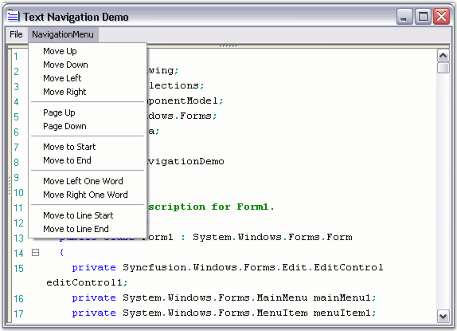

::: {style="DISPLAY: none"}
{#d2h_url_template}{#d2h_package_url style="WIDTH: 0px; DISPLAY: none; HEIGHT: 0px"}
:::

::::: {#nsbanner .d2h_main_nsbanner style="BORDER-BOTTOM: #999999 1px solid; POSITION: relative; PADDING-BOTTOM: 0px; BACKGROUND-COLOR: transparent; PADDING-LEFT: 0px; PADDING-RIGHT: 0px; DISPLAY: none; BORDER-TOP: #999999 1px solid; PADDING-TOP: 0px; LEFT: 0px"}
:::: {#TitleRow .d2h_main_titlerow style="PADDING-BOTTOM: 4px; BACKGROUND-COLOR: transparent; PADDING-LEFT: 22px; WIDTH: 100%; PADDING-RIGHT: 10px; DISPLAY: none; PADDING-TOP: 4px"}
::: {#ienav .d2h_main_ienav style="DISPLAY: none"}
{#D2HPrevious .D2HPreviousEnabled}  {#D2HNext .D2HNextEnabled}
:::
::::
:::::

::::::::: {#nstext .d2h_main_nstext style="PADDING-BOTTOM: 10px; BACKGROUND-COLOR: transparent; PADDING-LEFT: 22px; PADDING-RIGHT: 10px; HEIGHT: 100%; OVERFLOW: auto; PADDING-TOP: 5px" hasuserbackground="true" valign="bottom"}
::: {#d2h_breadcrumbs .d2h_breadcrumbs}
[Essential Studio User Guide Documentation](ms-xhelp:///?Id=12457748-09e3-4d74-a240-8e049cedf030){.d2h_breadcrumbsNormal}[ \> ]{.d2h_breadcrumbsLinkSeparator}[User Interface Edition](ms-xhelp:///?Id=c29296b7-531c-413b-a0ec-488ca1f7f669){.d2h_breadcrumbsNormal}[ \> ]{.d2h_breadcrumbsLinkSeparator}[Essential Windows](ms-xhelp:///?Id=e60759d8-47a4-4570-9d7a-16a68d63f2ea){.d2h_breadcrumbsNormal}[ \> ]{.d2h_breadcrumbsLinkSeparator}[Essential Edit]{.d2h_breadcrumbsContentsOnly}[ \> ]{.d2h_breadcrumbsLinkSeparator}[Concepts And Features](ms-xhelp:///?Id=7c39cee6-8434-4711-a18e-efaba8ac85c0){.d2h_breadcrumbsNormal}[ \> ]{.d2h_breadcrumbsLinkSeparator}[Text Visualization](ms-xhelp:///?Id=03937960-0195-4ded-b842-e48212f822d3){.d2h_breadcrumbsNormal}
:::

### Text Navigation {#text-navigation style="tab-stops: 0pt"}

 

Edit Control offers extensive support for text navigation. You can perform navigation at character, word, line, page or entire document levels. Here is a brief summary of the APIs available at each level.

 

**Character Level Navigation**

[]{style="COLOR: #4a5c8c"} 

The following APIs enable text navigation in the Edit Control, in terms of characters or columns.

 

::: {align="center"}
  --------------------- ----------------------------------
  Edit Control Method   Description
  MoveUp                Moves cursor up, if possible.
  MoveDown              Moves cursor down, if possible.
  MoveLeft              Moves cursor left, if possible.
  MoveRight             Moves cursor right, if possible.
  --------------------- ----------------------------------
:::

[]{style="FONT-FAMILY: 'Trebuchet MS','sans-serif'; COLOR: #15428b; FONT-SIZE: 9pt"} 

+-------------------------------------------------------------------------------------------------------------------------------------------------------------------------+
| **[\[C#\]]{style="FONT-FAMILY: 'Courier New'; COLOR: black"}**                                                                                                          |
|                                                                                                                                                                         |
| [\                                                                                                                                                                      |
| ]{style="FONT-FAMILY: 'Courier New'; COLOR: black"}[this]{style="FONT-FAMILY: 'Courier New'; COLOR: blue"}[.editControl1.MoveUp();]{style="FONT-FAMILY: 'Courier New'"} |
|                                                                                                                                                                         |
| [this]{style="FONT-FAMILY: 'Courier New'; COLOR: blue"}[.editControl1.MoveDown();]{style="FONT-FAMILY: 'Courier New'"}                                                  |
|                                                                                                                                                                         |
| [this]{style="FONT-FAMILY: 'Courier New'; COLOR: blue"}[.editControl1.MoveLeft();]{style="FONT-FAMILY: 'Courier New'"}                                                  |
|                                                                                                                                                                         |
| [this]{style="FONT-FAMILY: 'Courier New'; COLOR: blue"}[.editControl1.MoveRight();]{style="FONT-FAMILY: 'Courier New'"}                                                 |
+-------------------------------------------------------------------------------------------------------------------------------------------------------------------------+

[]{style="FONT-FAMILY: 'Trebuchet MS','sans-serif'; COLOR: #15428b; FONT-SIZE: 9pt"} 

+----------------------------------------------------------------------------------------------------------------------------------------------------------------------+
| **[\[VB.NET\]]{style="FONT-FAMILY: 'Courier New'; COLOR: black"}**                                                                                                   |
|                                                                                                                                                                      |
| [\                                                                                                                                                                   |
| ]{style="FONT-FAMILY: 'Courier New'; COLOR: black"}[Me]{style="FONT-FAMILY: 'Courier New'; COLOR: blue"}[.editControl1.MoveUp()]{style="FONT-FAMILY: 'Courier New'"} |
|                                                                                                                                                                      |
| [Me]{style="FONT-FAMILY: 'Courier New'; COLOR: blue"}[.editControl1.MoveDown()]{style="FONT-FAMILY: 'Courier New'"}                                                  |
|                                                                                                                                                                      |
| [Me]{style="FONT-FAMILY: 'Courier New'; COLOR: blue"}[.editControl1.MoveLeft()]{style="FONT-FAMILY: 'Courier New'"}                                                  |
|                                                                                                                                                                      |
| [Me]{style="FONT-FAMILY: 'Courier New'; COLOR: blue"}[.editControl1.MoveRight()]{style="FONT-FAMILY: 'Courier New'"}                                                 |
+----------------------------------------------------------------------------------------------------------------------------------------------------------------------+

[]{style="FONT-FAMILY: 'Trebuchet MS','sans-serif'; COLOR: #15428b; FONT-SIZE: 9pt"} 

Word Level Navigation

[]{style="COLOR: #4a5c8c; FONT-SIZE: 9pt"} 

[The following APIs enable text navigation in the Edit Control, in terms of words.]{style="FONT-SIZE: 9pt"}

[]{style="FONT-SIZE: 9pt"} 

::: {align="center"}
  --------------------- ---------------------------------------
  Edit Control Method   Description
  MoveLeftWord          Moves caret to the left by one word.
  MoveRightWord         Moves caret to the right by one word.
  --------------------- ---------------------------------------
:::

[]{style="FONT-FAMILY: 'Trebuchet MS','sans-serif'; COLOR: #15428b; FONT-SIZE: 9pt"} 

+-------------------------------------------------------------------------------------------------------------------------------------------------------------------------------+
| **[\[C#\]]{style="FONT-FAMILY: 'Courier New'; COLOR: black"}**                                                                                                                |
|                                                                                                                                                                               |
| [\                                                                                                                                                                            |
| ]{style="FONT-FAMILY: 'Courier New'; COLOR: black"}[this]{style="FONT-FAMILY: 'Courier New'; COLOR: blue"}[.editControl1.MoveLeftWord();]{style="FONT-FAMILY: 'Courier New'"} |
|                                                                                                                                                                               |
| [this]{style="FONT-FAMILY: 'Courier New'; COLOR: blue"}[.editControl1.MoveRightWord();]{style="FONT-FAMILY: 'Courier New'"}                                                   |
+-------------------------------------------------------------------------------------------------------------------------------------------------------------------------------+

[]{style="FONT-FAMILY: 'Trebuchet MS','sans-serif'; COLOR: #15428b; FONT-SIZE: 9pt"} 

+-----------------------------------------------------------------------------------------------------------------------------------------------------------------------------+
| **[\[VB.NET\]]{style="FONT-FAMILY: 'Courier New'; COLOR: black"}**                                                                                                          |
|                                                                                                                                                                             |
| [\                                                                                                                                                                          |
| ]{style="FONT-FAMILY: 'Courier New'; COLOR: black"}[Me]{style="FONT-FAMILY: 'Courier New'; COLOR: blue"}[.editControl1.MoveLeftWord();]{style="FONT-FAMILY: 'Courier New'"} |
|                                                                                                                                                                             |
| [Me]{style="FONT-FAMILY: 'Courier New'; COLOR: blue"}[.editControl1.MoveRightWord();]{style="FONT-FAMILY: 'Courier New'"}                                                   |
+-----------------------------------------------------------------------------------------------------------------------------------------------------------------------------+

[]{style="FONT-FAMILY: 'Trebuchet MS','sans-serif'; COLOR: #4a5c8c; FONT-SIZE: 8pt"} 

Line Level Navigation

 

The following APIs enable text navigation in the Edit Control, in terms of lines.

 

::: {align="center"}
  --------------------- ------------------------------------------------------------------------------
  Edit Control Method   Description
  MoveToLineStart       Moves caret to the beginning of the line. First whitespaces will be skipped.
  MoveToLineEnd         Moves caret to the end of the line.
  --------------------- ------------------------------------------------------------------------------
:::

[]{style="FONT-FAMILY: 'Trebuchet MS','sans-serif'; COLOR: #15428b; FONT-SIZE: 9pt"} 

+----------------------------------------------------------------------------------------------------------------------------------------------------------------------------------+
| **[\[C#\]]{style="FONT-FAMILY: 'Courier New'; COLOR: black"}**                                                                                                                   |
|                                                                                                                                                                                  |
| [\                                                                                                                                                                               |
| ]{style="FONT-FAMILY: 'Courier New'; COLOR: black"}[this]{style="FONT-FAMILY: 'Courier New'; COLOR: blue"}[.editControl1.MoveToLineStart();]{style="FONT-FAMILY: 'Courier New'"} |
|                                                                                                                                                                                  |
| [this]{style="FONT-FAMILY: 'Courier New'; COLOR: blue"}[.editControl1.MoveToLineEnd();]{style="FONT-FAMILY: 'Courier New'"}                                                      |
+----------------------------------------------------------------------------------------------------------------------------------------------------------------------------------+

[]{style="FONT-FAMILY: 'Trebuchet MS','sans-serif'; COLOR: #15428b; FONT-SIZE: 9pt"} 

+--------------------------------------------------------------------------------------------------------------------------------------------------------------------------------+
| **[\[VB.NET\]]{style="FONT-FAMILY: 'Courier New'; COLOR: black"}**                                                                                                             |
|                                                                                                                                                                                |
| [\                                                                                                                                                                             |
| ]{style="FONT-FAMILY: 'Courier New'; COLOR: black"}[Me]{style="FONT-FAMILY: 'Courier New'; COLOR: blue"}[.editControl1.MoveToLineStart();]{style="FONT-FAMILY: 'Courier New'"} |
|                                                                                                                                                                                |
| [Me]{style="FONT-FAMILY: 'Courier New'; COLOR: blue"}[.editControl1.MoveToLineEnd();]{style="FONT-FAMILY: 'Courier New'"}                                                      |
+--------------------------------------------------------------------------------------------------------------------------------------------------------------------------------+

 

**Page Level Navigation**

[]{style="COLOR: #4a5c8c"} 

The following APIs enable text navigation in the Edit Control, in terms of pages.

 

::: {align="center"}
  --------------------- ----------------------------
  Edit Control Method   Description
  MovePageUp            Moves caret one page up.
  MovePageDown          Moves caret one page down.
  --------------------- ----------------------------
:::

[]{style="FONT-FAMILY: 'Trebuchet MS','sans-serif'; COLOR: #15428b; FONT-SIZE: 9pt"} 

+-----------------------------------------------------------------------------------------------------------------------------------------------------------------------------+
| **[\[C#\]]{style="FONT-FAMILY: 'Courier New'; COLOR: black"}**                                                                                                              |
|                                                                                                                                                                             |
| [\                                                                                                                                                                          |
| ]{style="FONT-FAMILY: 'Courier New'; COLOR: black"}[this]{style="FONT-FAMILY: 'Courier New'; COLOR: blue"}[.editControl1.MovePageUp();]{style="FONT-FAMILY: 'Courier New'"} |
|                                                                                                                                                                             |
| [this]{style="FONT-FAMILY: 'Courier New'; COLOR: blue"}[.editControl1.MovePageDown();]{style="FONT-FAMILY: 'Courier New'"}                                                  |
+-----------------------------------------------------------------------------------------------------------------------------------------------------------------------------+

[]{style="FONT-FAMILY: 'Trebuchet MS','sans-serif'; COLOR: #15428b; FONT-SIZE: 9pt"} 

+---------------------------------------------------------------------------------------------------------------------------------------------------------------------------+
| **[\[VB.NET\]]{style="FONT-FAMILY: 'Courier New'; COLOR: black"}**                                                                                                        |
|                                                                                                                                                                           |
| [\                                                                                                                                                                        |
| ]{style="FONT-FAMILY: 'Courier New'; COLOR: black"}[Me]{style="FONT-FAMILY: 'Courier New'; COLOR: blue"}[.editControl1.MovePageUp();]{style="FONT-FAMILY: 'Courier New'"} |
|                                                                                                                                                                           |
| [Me]{style="FONT-FAMILY: 'Courier New'; COLOR: blue"}[.editControl1.MovePageDown();]{style="FONT-FAMILY: 'Courier New'"}                                                  |
+---------------------------------------------------------------------------------------------------------------------------------------------------------------------------+

 

**Document Level Navigation**

[]{style="COLOR: #4a5c8c"} 

The following APIs enable text navigation in the Edit Control, in terms of documents.

 

::: {align="center"}
  --------------------- -------------------------------------------
  Edit Control Method   Description
  MoveToBeginning       Moves caret to the beginning of the file.
  MoveToEnd             Moves caret to the end of the file.
  --------------------- -------------------------------------------
:::

[]{style="FONT-FAMILY: 'Trebuchet MS','sans-serif'; COLOR: #15428b; FONT-SIZE: 9pt"} 

+----------------------------------------------------------------------------------------------------------------------------------------------------------------------------------+
| **[\[C#\]]{style="FONT-FAMILY: 'Courier New'; COLOR: black"}**                                                                                                                   |
|                                                                                                                                                                                  |
| [\                                                                                                                                                                               |
| ]{style="FONT-FAMILY: 'Courier New'; COLOR: black"}[this]{style="FONT-FAMILY: 'Courier New'; COLOR: blue"}[.editControl1.MoveToBeginning();]{style="FONT-FAMILY: 'Courier New'"} |
|                                                                                                                                                                                  |
| [this]{style="FONT-FAMILY: 'Courier New'; COLOR: blue"}[.editControl1.MoveToEnd();]{style="FONT-FAMILY: 'Courier New'"}                                                          |
+----------------------------------------------------------------------------------------------------------------------------------------------------------------------------------+

[]{style="FONT-FAMILY: 'Trebuchet MS','sans-serif'; COLOR: #15428b; FONT-SIZE: 9pt"} 

+--------------------------------------------------------------------------------------------------------------------------------------------------------------------------------+
| **[\[VB.NET\]]{style="FONT-FAMILY: 'Courier New'; COLOR: black"}**                                                                                                             |
|                                                                                                                                                                                |
| [\                                                                                                                                                                             |
| ]{style="FONT-FAMILY: 'Courier New'; COLOR: black"}[Me]{style="FONT-FAMILY: 'Courier New'; COLOR: blue"}[.editControl1.MoveToBeginning();]{style="FONT-FAMILY: 'Courier New'"} |
|                                                                                                                                                                                |
| [Me]{style="FONT-FAMILY: 'Courier New'; COLOR: blue"}[.editControl1.MoveToEnd();]{style="FONT-FAMILY: 'Courier New'"}                                                          |
+--------------------------------------------------------------------------------------------------------------------------------------------------------------------------------+

[]{style="FONT-FAMILY: 'Trebuchet MS','sans-serif'; COLOR: #15428b; FONT-SIZE: 9pt"} 

{border="0"}

Figure 14: Text Navigation Options in Edit Control

 

A sample which demonstrates Text Navigation is available in the following sample installation path.

 

***..\\My Documents\\Syncfusion\\EssentialStudio\\Version Number\\Windows\\Edit.Windows\\Samples\\2.0\\Text Navigation\\TextNavigationDemo***

 

[]{#p33} 

More:

[ ]{#related-topics}

[{border="0" align="absMiddle"}Positions and Offsets](ms-xhelp:///?Id=7c521236-4ae6-412b-a56d-75a2ca39928b){style="TEXT-DECORATION: none"}
:::::::::
