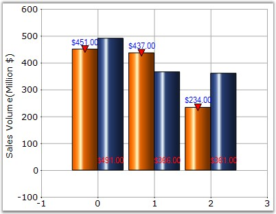

::: {style="DISPLAY: none"}
{#d2h_url_template}{#d2h_package_url style="WIDTH: 0px; DISPLAY: none; HEIGHT: 0px"}
:::

:::: {.d2h_secondary_topic style="PADDING-BOTTOM: 10pt; MARGIN: 0pt; PADDING-LEFT: 0pt; PADDING-RIGHT: 0pt; PADDING-TOP: 0pt"}
#### TextOrientation {#textorientation style="tab-stops: 0pt"}

**[]{style="FONT-FAMILY: 'Trebuchet MS','sans-serif'; FONT-SIZE: 9pt"}** 

It is used to align the text of the series within the data point region.

[]{style="FONT-FAMILY: 'Trebuchet MS','sans-serif'; FONT-SIZE: 9pt"} 

::: {align="center"}
+---------------------------------------+--------------------------------------------------------------------------------+
| **[]{style="FONT-FAMILY: 'Trebuchet MS','sans-serif'; FONT-SIZE: 9pt"}**                                               |
|                                                                                                                        |
| Details                                                                                                                |
+---------------------------------------+--------------------------------------------------------------------------------+
| Possible Values                       | Center - Aligns to the center of the point.                                    |
|                                       |                                                                                |
|                                       | Down - Aligns below the point.                                                 |
|                                       |                                                                                |
|                                       | Left - Aligns to the left position to the point.                               |
|                                       |                                                                                |
|                                       | RegionCenter - Aligns below the region that represents the points.             |
|                                       |                                                                                |
|                                       | RegionDown - Aligns below the region that represents the points.               |
|                                       |                                                                                |
|                                       | RegionUp - Aligns to the top of the region that represents the points.         |
|                                       |                                                                                |
|                                       | Right - Aligns to the right of the point.                                      |
|                                       |                                                                                |
|                                       | Smart - Aligns in a manner that is appropriate to the situation.               |
|                                       |                                                                                |
|                                       | SymbolCenter - Text is centered to the symbol that is associated to the point. |
|                                       |                                                                                |
|                                       | Up - Aligns to the top of the point.                                           |
|                                       |                                                                                |
|                                       | UpLeft - Aligns to the top left corner of the point.                           |
|                                       |                                                                                |
|                                       | UpRight - Aligns to the top right corner of the point.                         |
+---------------------------------------+--------------------------------------------------------------------------------+
| Default Value                         | Up                                                                             |
+---------------------------------------+--------------------------------------------------------------------------------+
| 2D / 3D Limitations                   | No                                                                             |
+---------------------------------------+--------------------------------------------------------------------------------+
| Applies to Chart Element              | Any Series                                                                     |
+---------------------------------------+--------------------------------------------------------------------------------+
| Applies to Chart Types                | All chart types                                                                |
+---------------------------------------+--------------------------------------------------------------------------------+
:::

**[]{style="FONT-FAMILY: 'Trebuchet MS','sans-serif'; FONT-SIZE: 9pt"}** 

Here is some sample code.

[]{style="FONT-FAMILY: 'Trebuchet MS','sans-serif'; FONT-SIZE: 9pt"} 

Series Wide Setting

**[]{style="FONT-FAMILY: 'Trebuchet MS','sans-serif'"}** 

+----------------------------------------------------------------------------------------------------------------------------------------------------------------------------------------------------------------------------------------------------------------------------------------------------------+
| **[\[C#\]]{style="FONT-FAMILY: 'Courier New'; COLOR: black"}**                                                                                                                                                                                                                                           |
|                                                                                                                                                                                                                                                                                                          |
| **[]{style="FONT-FAMILY: 'Courier New'; COLOR: black"}**                                                                                                                                                                                                                                                 |
|                                                                                                                                                                                                                                                                                                          |
| [// Text Orientation of chart series]{style="FONT-FAMILY: 'Courier New'; COLOR: green"}                                                                                                                                                                                                                  |
|                                                                                                                                                                                                                                                                                                          |
| [this]{style="FONT-FAMILY: 'Courier New'; COLOR: blue"}[.ChartWebControl1.Series\[1\].Style.TextOrientation = ]{style="FONT-FAMILY: 'Courier New'; COLOR: black"}[ChartTextOrientation]{style="FONT-FAMILY: 'Courier New'; COLOR: teal"}[.RegionDown;]{style="FONT-FAMILY: 'Courier New'; COLOR: black"} |
|                                                                                                                                                                                                                                                                                                          |
| [this]{style="FONT-FAMILY: 'Courier New'; COLOR: blue"}[.ChartWebControl1.Series\[0\].Style.TextOrientation = ]{style="FONT-FAMILY: 'Courier New'; COLOR: black"}[ChartTextOrientation]{style="FONT-FAMILY: 'Courier New'; COLOR: teal"}[.Up;]{style="FONT-FAMILY: 'Courier New'; COLOR: black"}         |
|                                                                                                                                                                                                                                                                                                          |
| [this]{style="FONT-FAMILY: 'Courier New'; COLOR: blue"}[.ChartWebControl1.Series\[0\].Style.TextColor=]{style="FONT-FAMILY: 'Courier New'; COLOR: black"}[Color]{style="FONT-FAMILY: 'Courier New'; COLOR: teal"}[.Blue;]{style="FONT-FAMILY: 'Courier New'; COLOR: black"}                              |
|                                                                                                                                                                                                                                                                                                          |
| [this]{style="FONT-FAMILY: 'Courier New'; COLOR: blue"}[.ChartWebControl1.Series\[1\].Style.TextColor=]{style="FONT-FAMILY: 'Courier New'; COLOR: black"}[Color]{style="FONT-FAMILY: 'Courier New'; COLOR: teal"}[.Red;]{style="FONT-FAMILY: 'Courier New'; COLOR: black"}                               |
+----------------------------------------------------------------------------------------------------------------------------------------------------------------------------------------------------------------------------------------------------------------------------------------------------------+

[]{style="FONT-FAMILY: 'Trebuchet MS','sans-serif'; FONT-SIZE: 9pt"} 

+-------------------------------------------------------------------------------------------------------------------------------------------------------------------------------------------------------------------------------------------------------------------------------------------------------------+
| **[\[VB.NET\]]{style="FONT-FAMILY: 'Courier New'; COLOR: black"}**                                                                                                                                                                                                                                          |
|                                                                                                                                                                                                                                                                                                             |
| **[]{style="FONT-FAMILY: 'Courier New'; COLOR: black"}**                                                                                                                                                                                                                                                    |
|                                                                                                                                                                                                                                                                                                             |
| [\' Text Orientation of chart series]{style="FONT-FAMILY: 'Courier New'; COLOR: green"}                                                                                                                                                                                                                     |
|                                                                                                                                                                                                                                                                                                             |
| [Private Me]{style="FONT-FAMILY: 'Courier New'; COLOR: blue"}[.ChartWebControl1.Series(1).Style.TextOrientation = ]{style="FONT-FAMILY: 'Courier New'; COLOR: black"}[ChartTextOrientation]{style="FONT-FAMILY: 'Courier New'; COLOR: teal"}[.RegionDown]{style="FONT-FAMILY: 'Courier New'; COLOR: black"} |
|                                                                                                                                                                                                                                                                                                             |
| [Private Me]{style="FONT-FAMILY: 'Courier New'; COLOR: blue"}[.ChartWebControl1.Series(0).Style.TextOrientation = ]{style="FONT-FAMILY: 'Courier New'; COLOR: black"}[ChartTextOrientation]{style="FONT-FAMILY: 'Courier New'; COLOR: teal"}[.Up]{style="FONT-FAMILY: 'Courier New'; COLOR: black"}         |
|                                                                                                                                                                                                                                                                                                             |
| [Private Me]{style="FONT-FAMILY: 'Courier New'; COLOR: blue"}[.ChartWebControl1.Series(0).Style.TextColor=]{style="FONT-FAMILY: 'Courier New'; COLOR: black"}[Color]{style="FONT-FAMILY: 'Courier New'; COLOR: teal"}[.Blue]{style="FONT-FAMILY: 'Courier New'; COLOR: black"}                              |
|                                                                                                                                                                                                                                                                                                             |
| [Private Me]{style="FONT-FAMILY: 'Courier New'; COLOR: blue"}[.ChartWebControl1.Series(1).Style.TextColor=]{style="FONT-FAMILY: 'Courier New'; COLOR: black"}[Color]{style="FONT-FAMILY: 'Courier New'; COLOR: teal"}[.Red]{style="FONT-FAMILY: 'Courier New'; COLOR: black"}                               |
+-------------------------------------------------------------------------------------------------------------------------------------------------------------------------------------------------------------------------------------------------------------------------------------------------------------+

**[]{style="FONT-FAMILY: 'Trebuchet MS','sans-serif'; FONT-SIZE: 9pt"}** 

{border="0"}

**[]{style="FONT-FAMILY: 'Trebuchet MS','sans-serif'; FONT-SIZE: 9pt"}** 

Figure 213: Text Orientation set for the Chart Series

**[]{style="FONT-FAMILY: 'Trebuchet MS','sans-serif'"}** 

Specific Data Point Setting

**[]{style="FONT-FAMILY: 'Courier New'; COLOR: black; FONT-SIZE: 9pt"}** 

Text orientation for specific data points can be set using **Series.Style\[i\].TextOrientation** property, where \"i\" represents the index of data points ranging from 0 to n.

[]{style="FONT-FAMILY: 'Trebuchet MS','sans-serif'; FONT-SIZE: 9pt"} 

+----------------------------------------------------------------------------------------------------------------------------------------------------------------------------------------------------------------------------------------------------------------------------------------------------------------+
| **[\[C#\]]{style="FONT-FAMILY: 'Courier New'; COLOR: black"}**                                                                                                                                                                                                                                                 |
|                                                                                                                                                                                                                                                                                                                |
| **[]{style="FONT-FAMILY: 'Courier New'; COLOR: black"}**                                                                                                                                                                                                                                                       |
|                                                                                                                                                                                                                                                                                                                |
| [this]{style="FONT-FAMILY: 'Courier New'; COLOR: blue"}[.ChartWebControl1.Series\[1\].Styles\[0\].TextOrientation = ]{style="FONT-FAMILY: 'Courier New'; COLOR: black"}[ChartTextOrientation]{style="FONT-FAMILY: 'Courier New'; COLOR: teal"}[.RegionDown;]{style="FONT-FAMILY: 'Courier New'; COLOR: black"} |
|                                                                                                                                                                                                                                                                                                                |
| [this]{style="FONT-FAMILY: 'Courier New'; COLOR: blue"}[.ChartWebControl1.Series\[0\].Styles\[0\].TextOrientation = ]{style="FONT-FAMILY: 'Courier New'; COLOR: black"}[ChartTextOrientation]{style="FONT-FAMILY: 'Courier New'; COLOR: teal"}[.Up;]{style="FONT-FAMILY: 'Courier New'; COLOR: black"}         |
|                                                                                                                                                                                                                                                                                                                |
| [this]{style="FONT-FAMILY: 'Courier New'; COLOR: blue"}[.ChartWebControl1.Series\[0\].Styles\[0\].TextColor=]{style="FONT-FAMILY: 'Courier New'; COLOR: black"}[Color]{style="FONT-FAMILY: 'Courier New'; COLOR: teal"}[.Blue;]{style="FONT-FAMILY: 'Courier New'; COLOR: black"}                              |
|                                                                                                                                                                                                                                                                                                                |
| [this]{style="FONT-FAMILY: 'Courier New'; COLOR: blue"}[.ChartWebControl1.Series\[1\].Styles\[0\].TextColor=]{style="FONT-FAMILY: 'Courier New'; COLOR: black"}[Color]{style="FONT-FAMILY: 'Courier New'; COLOR: teal"}[.Red;]{style="FONT-FAMILY: 'Courier New'; COLOR: black"}                               |
|                                                                                                                                                                                                                                                                                                                |
| []{style="FONT-FAMILY: 'Courier New'; COLOR: black"}                                                                                                                                                                                                                                                           |
|                                                                                                                                                                                                                                                                                                                |
| [this]{style="FONT-FAMILY: 'Courier New'; COLOR: blue"}[.ChartWebControl1.Series\[1\].Styles\[1\].TextOrientation = ]{style="FONT-FAMILY: 'Courier New'; COLOR: black"}[ChartTextOrientation]{style="FONT-FAMILY: 'Courier New'; COLOR: teal"}[.Smart;]{style="FONT-FAMILY: 'Courier New'; COLOR: black"}      |
|                                                                                                                                                                                                                                                                                                                |
| [this]{style="FONT-FAMILY: 'Courier New'; COLOR: blue"}[.ChartWebControl1.Series\[0\].Styles\[1\].TextOrientation = ]{style="FONT-FAMILY: 'Courier New'; COLOR: black"}[ChartTextOrientation]{style="FONT-FAMILY: 'Courier New'; COLOR: teal"}[.UpRight;]{style="FONT-FAMILY: 'Courier New'; COLOR: black"}    |
|                                                                                                                                                                                                                                                                                                                |
| [this]{style="FONT-FAMILY: 'Courier New'; COLOR: blue"}[.ChartWebControl1.Series\[0\].Styles\[1\].TextColor=]{style="FONT-FAMILY: 'Courier New'; COLOR: black"}[Color]{style="FONT-FAMILY: 'Courier New'; COLOR: teal"}[.Green;]{style="FONT-FAMILY: 'Courier New'; COLOR: black"}                             |
|                                                                                                                                                                                                                                                                                                                |
| [this]{style="FONT-FAMILY: 'Courier New'; COLOR: blue"}[.ChartWebControl1.Series\[1\].Styles\[1\].TextColor=]{style="FONT-FAMILY: 'Courier New'; COLOR: black"}[Color]{style="FONT-FAMILY: 'Courier New'; COLOR: teal"}[.Yellow;]{style="FONT-FAMILY: 'Courier New'; COLOR: black"}                            |
+----------------------------------------------------------------------------------------------------------------------------------------------------------------------------------------------------------------------------------------------------------------------------------------------------------------+

[]{style="FONT-FAMILY: 'Trebuchet MS','sans-serif'; FONT-SIZE: 9pt"} 

+-----------------------------------------------------------------------------------------------------------------------------------------------------------------------------------------------------------------------------------------------------------------------------------------------------------------+
| **[\[VB.NET\]]{style="FONT-FAMILY: 'Courier New'; COLOR: black"}**                                                                                                                                                                                                                                              |
|                                                                                                                                                                                                                                                                                                                 |
| **[]{style="FONT-FAMILY: 'Courier New'; COLOR: black"}**                                                                                                                                                                                                                                                        |
|                                                                                                                                                                                                                                                                                                                 |
| [Private Me]{style="FONT-FAMILY: 'Courier New'; COLOR: blue"}[.ChartWebControl1.Series(1).Styles(0).TextOrientation = ]{style="FONT-FAMILY: 'Courier New'; COLOR: black"}[ChartTextOrientation]{style="FONT-FAMILY: 'Courier New'; COLOR: teal"}[.RegionDown]{style="FONT-FAMILY: 'Courier New'; COLOR: black"} |
|                                                                                                                                                                                                                                                                                                                 |
| [Private Me]{style="FONT-FAMILY: 'Courier New'; COLOR: blue"}[.ChartWebControl1.Series(0).Styles(0).TextOrientation = ]{style="FONT-FAMILY: 'Courier New'; COLOR: black"}[ChartTextOrientation]{style="FONT-FAMILY: 'Courier New'; COLOR: teal"}[.Up]{style="FONT-FAMILY: 'Courier New'; COLOR: black"}         |
|                                                                                                                                                                                                                                                                                                                 |
| [Private Me]{style="FONT-FAMILY: 'Courier New'; COLOR: blue"}[.ChartWebControl1.Series(0).Styles(0).TextColor=]{style="FONT-FAMILY: 'Courier New'; COLOR: black"}[Color]{style="FONT-FAMILY: 'Courier New'; COLOR: teal"}[.Blue]{style="FONT-FAMILY: 'Courier New'; COLOR: black"}                              |
|                                                                                                                                                                                                                                                                                                                 |
| [Private Me]{style="FONT-FAMILY: 'Courier New'; COLOR: blue"}[.ChartWebControl1.Series(1).Styles(0).TextColor=]{style="FONT-FAMILY: 'Courier New'; COLOR: black"}[Color]{style="FONT-FAMILY: 'Courier New'; COLOR: teal"}[.Red]{style="FONT-FAMILY: 'Courier New'; COLOR: black"}                               |
|                                                                                                                                                                                                                                                                                                                 |
| []{style="FONT-FAMILY: 'Courier New'; COLOR: black"}                                                                                                                                                                                                                                                            |
|                                                                                                                                                                                                                                                                                                                 |
| [Private Me]{style="FONT-FAMILY: 'Courier New'; COLOR: blue"}[.ChartWebControl1.Series(1).Styles(1).TextOrientation = ]{style="FONT-FAMILY: 'Courier New'; COLOR: black"}[ChartTextOrientation]{style="FONT-FAMILY: 'Courier New'; COLOR: teal"}[.Smart]{style="FONT-FAMILY: 'Courier New'; COLOR: black"}      |
|                                                                                                                                                                                                                                                                                                                 |
| [Private Me]{style="FONT-FAMILY: 'Courier New'; COLOR: blue"}[.ChartWebControl1.Series(0).Styles(1).TextOrientation = ]{style="FONT-FAMILY: 'Courier New'; COLOR: black"}[ChartTextOrientation]{style="FONT-FAMILY: 'Courier New'; COLOR: teal"}[.UpRight]{style="FONT-FAMILY: 'Courier New'; COLOR: black"}    |
|                                                                                                                                                                                                                                                                                                                 |
| [Private Me]{style="FONT-FAMILY: 'Courier New'; COLOR: blue"}[.ChartWebControl1.Series(0).Styles(1).TextColor=]{style="FONT-FAMILY: 'Courier New'; COLOR: black"}[Color]{style="FONT-FAMILY: 'Courier New'; COLOR: teal"}[.Green]{style="FONT-FAMILY: 'Courier New'; COLOR: black"}                             |
|                                                                                                                                                                                                                                                                                                                 |
| [Private Me]{style="FONT-FAMILY: 'Courier New'; COLOR: blue"}[.ChartWebControl1.Series(1).Styles(1).TextColor=]{style="FONT-FAMILY: 'Courier New'; COLOR: black"}[Color]{style="FONT-FAMILY: 'Courier New'; COLOR: teal"}[.Yellow]{style="FONT-FAMILY: 'Courier New'; COLOR: black"}                            |
+-----------------------------------------------------------------------------------------------------------------------------------------------------------------------------------------------------------------------------------------------------------------------------------------------------------------+

**[]{style="FONT-FAMILY: 'Trebuchet MS','sans-serif'; FONT-SIZE: 9pt"}** 

See Also

[]{style="FONT-FAMILY: 'Segoe UI','sans-serif'; COLOR: blue; FONT-SIZE: 9pt"} 

[Chart Types]{.UGHyperlink}[]{.UGHyperlink}

[]{#p163} 

[]{#related-topics}
::::
