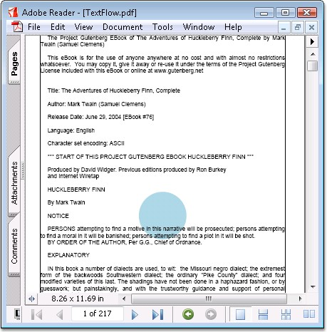

::: {style="DISPLAY: none"}
{#d2h_url_template}{#d2h_package_url style="WIDTH: 0px; DISPLAY: none; HEIGHT: 0px"}
:::

::: {.d2h_secondary_topic style="PADDING-BOTTOM: 10pt; MARGIN: 0pt; PADDING-LEFT: 0pt; PADDING-RIGHT: 0pt; PADDING-TOP: 0pt"}
##### Text Pagination {#text-pagination style="tab-stops: 0pt"}

[]{style="FONT-FAMILY: 'Trebuchet MS','sans-serif'; COLOR: #15428b; FONT-SIZE: 9pt"} 

Text in a PDF document can flow through multiple pages. You can specify different formats for the text element using **PDFStringFormat** class of Essential PDF. The following code snippet illustrates how to draw the text element of a PDF document with the custom formats.

[]{style="FONT-FAMILY: 'Trebuchet MS','sans-serif'; COLOR: #15428b; FONT-SIZE: 9pt"} 

+-------------------------------------------------------------------------------------------------------------------------------------------------------------------------------------------------+
| **[\[C#\]]{style="FONT-FAMILY: 'Courier New'; COLOR: black"}**                                                                                                                                  |
|                                                                                                                                                                                                 |
| []{style="FONT-FAMILY: 'Courier New'; COLOR: black"}                                                                                                                                            |
|                                                                                                                                                                                                 |
| [//Create a new PDF document.]{style="FONT-FAMILY: 'Courier New'; COLOR: green"}                                                                                                                |
|                                                                                                                                                                                                 |
| [PdfDocument doc = [new]{style="COLOR: blue"} PdfDocument();]{style="FONT-FAMILY: 'Courier New'"}                                                                                               |
|                                                                                                                                                                                                 |
| []{style="FONT-FAMILY: 'Courier New'; COLOR: green"}                                                                                                                                            |
|                                                                                                                                                                                                 |
| [//Add a page to the document.]{style="FONT-FAMILY: 'Courier New'; COLOR: green"}                                                                                                               |
|                                                                                                                                                                                                 |
| [PdfPage page = doc.Pages.Add();]{style="FONT-FAMILY: 'Courier New'"}                                                                                                                           |
|                                                                                                                                                                                                 |
| []{style="FONT-FAMILY: 'Courier New'"}                                                                                                                                                          |
|                                                                                                                                                                                                 |
| [//Read the text from the text file]{style="FONT-FAMILY: 'Courier New'; COLOR: green"}                                                                                                          |
|                                                                                                                                                                                                 |
| [string]{style="FONT-FAMILY: 'Courier New'; COLOR: blue"}[ path = [\"../../../../../Data/SampleText.txt\"]{style="COLOR: maroon"};]{style="FONT-FAMILY: 'Courier New'"}                         |
|                                                                                                                                                                                                 |
| [StreamReader reader = [new]{style="COLOR: blue"} StreamReader(path, [Encoding]{style="COLOR: teal"}.ASCII);]{style="FONT-FAMILY: 'Courier New'"}                                               |
|                                                                                                                                                                                                 |
| [string]{style="FONT-FAMILY: 'Courier New'; COLOR: blue"}[ text = reader.ReadToEnd();]{style="FONT-FAMILY: 'Courier New'"}                                                                      |
|                                                                                                                                                                                                 |
| [reader.Close();]{style="FONT-FAMILY: 'Courier New'"}                                                                                                                                           |
|                                                                                                                                                                                                 |
| []{style="FONT-FAMILY: 'Courier New'"}                                                                                                                                                          |
|                                                                                                                                                                                                 |
| [//Set the formats for the text]{style="FONT-FAMILY: 'Courier New'; COLOR: green"}                                                                                                              |
|                                                                                                                                                                                                 |
| [PdfStringFormat]{style="FONT-FAMILY: 'Courier New'; COLOR: teal"}[ format = [new]{style="COLOR: blue"} [PdfStringFormat]{style="COLOR: teal"}();]{style="FONT-FAMILY: 'Courier New'"}          |
|                                                                                                                                                                                                 |
| [format.Alignment = [PdfTextAlignment]{style="COLOR: teal"}.Justify;]{style="FONT-FAMILY: 'Courier New'"}                                                                                       |
|                                                                                                                                                                                                 |
| [format.LineAlignment = [PdfVerticalAlignment]{style="COLOR: teal"}.Top;]{style="FONT-FAMILY: 'Courier New'"}                                                                                   |
|                                                                                                                                                                                                 |
| [format.ParagraphIndent = 15f;]{style="FONT-FAMILY: 'Courier New'"}                                                                                                                             |
|                                                                                                                                                                                                 |
| []{style="FONT-FAMILY: 'Courier New'"}                                                                                                                                                          |
|                                                                                                                                                                                                 |
| [//Create a text element ]{style="FONT-FAMILY: 'Courier New'; COLOR: green"}                                                                                                                    |
|                                                                                                                                                                                                 |
| [PdfTextElement]{style="FONT-FAMILY: 'Courier New'; COLOR: teal"}[ element = [new]{style="COLOR: blue"} [PdfTextElement]{style="COLOR: teal"}(text, font);]{style="FONT-FAMILY: 'Courier New'"} |
|                                                                                                                                                                                                 |
| [element.Brush = [new]{style="COLOR: blue"} [PdfSolidBrush]{style="COLOR: teal"}([Color]{style="COLOR: teal"}.Black);]{style="FONT-FAMILY: 'Courier New'"}                                      |
|                                                                                                                                                                                                 |
| [element.StringFormat = format;]{style="FONT-FAMILY: 'Courier New'"}                                                                                                                            |
|                                                                                                                                                                                                 |
| [element.Font = [new]{style="COLOR: blue"} [PdfStandardFont]{style="COLOR: teal"}([PdfFontFamily]{style="COLOR: teal"}.Helvetica, 12);]{style="FONT-FAMILY: 'Courier New'"}                     |
|                                                                                                                                                                                                 |
| []{style="FONT-FAMILY: 'Courier New'"}                                                                                                                                                          |
|                                                                                                                                                                                                 |
| [//Set the properties to paginate the text.]{style="FONT-FAMILY: 'Courier New'; COLOR: green"}                                                                                                  |
|                                                                                                                                                                                                 |
| [PdfLayoutFormat]{style="FONT-FAMILY: 'Courier New'; COLOR: teal"}[ layoutFormat = [new]{style="COLOR: blue"} [PdfLayoutFormat]{style="COLOR: teal"}();]{style="FONT-FAMILY: 'Courier New'"}    |
|                                                                                                                                                                                                 |
| [layoutFormat.Break = [PdfLayoutBreakType]{style="COLOR: teal"}.FitPage;]{style="FONT-FAMILY: 'Courier New'"}                                                                                   |
|                                                                                                                                                                                                 |
| [layoutFormat.Layout = [PdfLayoutType]{style="COLOR: teal"}.Paginate;]{style="FONT-FAMILY: 'Courier New'"}                                                                                      |
|                                                                                                                                                                                                 |
| []{style="FONT-FAMILY: 'Courier New'"}                                                                                                                                                          |
|                                                                                                                                                                                                 |
| [//Draw the text element with the properties and formats set.]{style="FONT-FAMILY: 'Courier New'; COLOR: green"}                                                                                |
|                                                                                                                                                                                                 |
| [PdfTextLayoutResult]{style="FONT-FAMILY: 'Courier New'; COLOR: teal"}[ result = element.Draw(page, bounds, layoutFormat);]{style="FONT-FAMILY: 'Courier New'"}                                 |
|                                                                                                                                                                                                 |
| []{style="FONT-FAMILY: 'Courier New'"}                                                                                                                                                          |
|                                                                                                                                                                                                 |
| [//Save the document.]{style="FONT-FAMILY: 'Courier New'; COLOR: green"}                                                                                                                        |
|                                                                                                                                                                                                 |
| [doc.Save([\"Sample.pdf\"]{style="COLOR: maroon"});]{style="FONT-FAMILY: 'Courier New'"}                                                                                                        |
+-------------------------------------------------------------------------------------------------------------------------------------------------------------------------------------------------+

[]{style="FONT-FAMILY: 'Trebuchet MS','sans-serif'; COLOR: #15428b; FONT-SIZE: 9pt"} 

+-----------------------------------------------------------------------------------------------------------------------------------------------------------------------------------------------------------------------------+
| **[\[]{style="FONT-FAMILY: 'Courier New'; COLOR: black"}[VB.NET[\]]{style="COLOR: black"}]{style="FONT-FAMILY: 'Courier New'"}**                                                                                            |
|                                                                                                                                                                                                                             |
| []{style="FONT-FAMILY: 'Courier New'; COLOR: green"}                                                                                                                                                                        |
|                                                                                                                                                                                                                             |
| [\'Create a new PDF document.]{style="FONT-FAMILY: 'Courier New'; COLOR: green"}                                                                                                                                            |
|                                                                                                                                                                                                                             |
| [Dim]{style="FONT-FAMILY: 'Courier New'; COLOR: blue"}[ doc [As]{style="COLOR: blue"} PdfDocument = [New]{style="COLOR: blue"} PdfDocument()]{style="FONT-FAMILY: 'Courier New'"}                                           |
|                                                                                                                                                                                                                             |
| []{style="FONT-FAMILY: 'Courier New'"}                                                                                                                                                                                      |
|                                                                                                                                                                                                                             |
| [\'Set compression level]{style="FONT-FAMILY: 'Courier New'; COLOR: green"}                                                                                                                                                 |
|                                                                                                                                                                                                                             |
| [doc.Compression = PdfCompressionLevel.None]{style="FONT-FAMILY: 'Courier New'"}                                                                                                                                            |
|                                                                                                                                                                                                                             |
| []{style="FONT-FAMILY: 'Courier New'"}                                                                                                                                                                                      |
|                                                                                                                                                                                                                             |
| [\'Add a page to the document.]{style="FONT-FAMILY: 'Courier New'; COLOR: green"}                                                                                                                                           |
|                                                                                                                                                                                                                             |
| [Dim]{style="FONT-FAMILY: 'Courier New'; COLOR: blue"}[ page [As]{style="COLOR: blue"} PdfPage = doc.Pages.Add()]{style="FONT-FAMILY: 'Courier New'"}                                                                       |
|                                                                                                                                                                                                                             |
| []{style="FONT-FAMILY: 'Courier New'"}                                                                                                                                                                                      |
|                                                                                                                                                                                                                             |
| [\'Read the text from the text file]{style="FONT-FAMILY: 'Courier New'; COLOR: green"}                                                                                                                                      |
|                                                                                                                                                                                                                             |
| [Dim]{style="FONT-FAMILY: 'Courier New'; COLOR: blue"}[ path [As]{style="COLOR: blue"} [String]{style="COLOR: blue"} = [\"../../../../../Data/SampleText.txt\"]{style="COLOR: maroon"}]{style="FONT-FAMILY: 'Courier New'"} |
|                                                                                                                                                                                                                             |
| [Dim]{style="FONT-FAMILY: 'Courier New'; COLOR: blue"}[ reader [As]{style="COLOR: blue"} StreamReader = [New]{style="COLOR: blue"} StreamReader(path, Encoding.ASCII)]{style="FONT-FAMILY: 'Courier New'"}                  |
|                                                                                                                                                                                                                             |
| [Dim]{style="FONT-FAMILY: 'Courier New'; COLOR: blue"}[ text [As]{style="COLOR: blue"} [String]{style="COLOR: blue"} = reader.ReadToEnd()]{style="FONT-FAMILY: 'Courier New'"}                                              |
|                                                                                                                                                                                                                             |
| [reader.Close()]{style="FONT-FAMILY: 'Courier New'"}                                                                                                                                                                        |
|                                                                                                                                                                                                                             |
| []{style="FONT-FAMILY: 'Courier New'"}                                                                                                                                                                                      |
|                                                                                                                                                                                                                             |
| [\'Set the formats for the text]{style="FONT-FAMILY: 'Courier New'; COLOR: green"}                                                                                                                                          |
|                                                                                                                                                                                                                             |
| [Dim]{style="FONT-FAMILY: 'Courier New'; COLOR: blue"}[ format [As]{style="COLOR: blue"} PdfStringFormat = [New]{style="COLOR: blue"} PdfStringFormat()]{style="FONT-FAMILY: 'Courier New'"}                                |
|                                                                                                                                                                                                                             |
| [format.Alignment = PdfTextAlignment.Justify]{style="FONT-FAMILY: 'Courier New'"}                                                                                                                                           |
|                                                                                                                                                                                                                             |
| [format.LineAlignment = PdfVerticalAlignment.Top]{style="FONT-FAMILY: 'Courier New'"}                                                                                                                                       |
|                                                                                                                                                                                                                             |
| [format.ParagraphIndent = 15f]{style="FONT-FAMILY: 'Courier New'"}                                                                                                                                                          |
|                                                                                                                                                                                                                             |
| []{style="FONT-FAMILY: 'Courier New'"}                                                                                                                                                                                      |
|                                                                                                                                                                                                                             |
| [\'Create a text element ]{style="FONT-FAMILY: 'Courier New'; COLOR: green"}                                                                                                                                                |
|                                                                                                                                                                                                                             |
| [Dim]{style="FONT-FAMILY: 'Courier New'; COLOR: blue"}[ element [As]{style="COLOR: blue"} PdfTextElement = [New]{style="COLOR: blue"} PdfTextElement(text, font)]{style="FONT-FAMILY: 'Courier New'"}                       |
|                                                                                                                                                                                                                             |
| [element.Brush = [New]{style="COLOR: blue"} PdfSolidBrush(Color.Black)]{style="FONT-FAMILY: 'Courier New'"}                                                                                                                 |
|                                                                                                                                                                                                                             |
| [element.StringFormat = format]{style="FONT-FAMILY: 'Courier New'"}                                                                                                                                                         |
|                                                                                                                                                                                                                             |
| [element.Font = [New]{style="COLOR: blue"} PdfStandardFont(PdfFontFamily.Helvetica, 12)]{style="FONT-FAMILY: 'Courier New'"}                                                                                                |
|                                                                                                                                                                                                                             |
| []{style="FONT-FAMILY: 'Courier New'"}                                                                                                                                                                                      |
|                                                                                                                                                                                                                             |
| [\'Set the properties to paginate the text.]{style="FONT-FAMILY: 'Courier New'; COLOR: green"}                                                                                                                              |
|                                                                                                                                                                                                                             |
| [Dim]{style="FONT-FAMILY: 'Courier New'; COLOR: blue"}[ layoutFormat [As]{style="COLOR: blue"} PdfLayoutFormat = [New]{style="COLOR: blue"} PdfLayoutFormat()]{style="FONT-FAMILY: 'Courier New'"}                          |
|                                                                                                                                                                                                                             |
| [layoutFormat.Break = PdfLayoutBreakType.FitPage]{style="FONT-FAMILY: 'Courier New'"}                                                                                                                                       |
|                                                                                                                                                                                                                             |
| [layoutFormat.Layout = PdfLayoutType.Paginate]{style="FONT-FAMILY: 'Courier New'"}                                                                                                                                          |
|                                                                                                                                                                                                                             |
| [Dim]{style="FONT-FAMILY: 'Courier New'; COLOR: blue"}[ bounds [As]{style="COLOR: blue"} RectangleF = [New]{style="COLOR: blue"} RectangleF(PointF.Empty, page.Graphics.ClientSize)]{style="FONT-FAMILY: 'Courier New'"}    |
|                                                                                                                                                                                                                             |
| []{style="FONT-FAMILY: 'Courier New'"}                                                                                                                                                                                      |
|                                                                                                                                                                                                                             |
| [\'Draw the text element with the properties and formats set.]{style="FONT-FAMILY: 'Courier New'; COLOR: green"}                                                                                                            |
|                                                                                                                                                                                                                             |
| [Dim]{style="FONT-FAMILY: 'Courier New'; COLOR: blue"}[ result [As]{style="COLOR: blue"} PdfTextLayoutResult = element.Draw(page, bounds, layoutFormat)]{style="FONT-FAMILY: 'Courier New'"}                                |
|                                                                                                                                                                                                                             |
| []{style="FONT-FAMILY: 'Courier New'"}                                                                                                                                                                                      |
|                                                                                                                                                                                                                             |
| [\'Save the document.]{style="FONT-FAMILY: 'Courier New'; COLOR: green"}                                                                                                                                                    |
|                                                                                                                                                                                                                             |
| [doc.Save([\"Sample.pdf\"]{style="COLOR: maroon"})]{style="FONT-FAMILY: 'Courier New'"}                                                                                                                                     |
+-----------------------------------------------------------------------------------------------------------------------------------------------------------------------------------------------------------------------------+

[]{style="FONT-FAMILY: 'Trebuchet MS','sans-serif'; COLOR: #15428b; FONT-SIZE: 9pt"} 

{border="0"}

Figure 35: Text Pagination

 

 

 

[]{#related-topics}
:::
