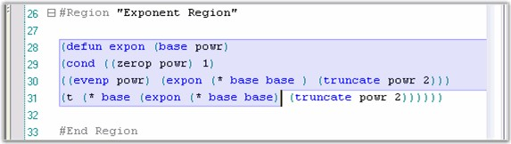
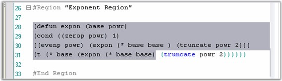

::: {style="DISPLAY: none"}
{#d2h_url_template}{#d2h_package_url style="WIDTH: 0px; DISPLAY: none; HEIGHT: 0px"}
:::

:::::::: {.d2h_secondary_topic style="PADDING-BOTTOM: 10pt; MARGIN: 0pt; PADDING-LEFT: 0pt; PADDING-RIGHT: 0pt; PADDING-TOP: 0pt"}
#### Text Selection {#text-selection style="tab-stops: 0pt"}

 

The Edit Control supports text selection operations through the use of the APIs discussed in this section.

 

**Selecting Text**

 

Edit Control provides support to select text programmatically. The **StartSelection** and **StopSelection** methods are used to programmatically specify the starting and ending bounds for the text to be selected.

 

::: {align="center"}
  --------------------- ---------------------------------------------------------
  Edit Control Method   Description
  StartSelection        Sets selection start at the specified position in text.
  StopSelection         Sets selection end at the specified position in text.
  SetSelection          Sets selected area of the text.
  SelectLine            Selects line with specified index.
  SelectAll             Selects all text.
  --------------------- ---------------------------------------------------------
:::

\
Line selection in Edit Control is extended by using the **ExtendSelectionToFarRight** property.

 

::: {align="center"}
  --------------------------- ------------------------------------------------------------------------------------------
  Edit Control Property       Description
  ExtendSelectionToFarRight   Gets / sets value indicating whether line selection should be extended to the far right.
  --------------------------- ------------------------------------------------------------------------------------------
:::

 

+---------------------------------------------------------------------------------------------------------------------------------------------------------------------+
| **[\[C#\]]{style="FONT-FAMILY: 'Courier New'; COLOR: black"}**                                                                                                      |
|                                                                                                                                                                     |
| []{style="FONT-FAMILY: 'Courier New'; COLOR: black"}                                                                                                                |
|                                                                                                                                                                     |
| [// Specifies start position for selecting text.]{style="FONT-FAMILY: 'Courier New'; COLOR: green"}                                                                 |
|                                                                                                                                                                     |
| [this]{style="FONT-FAMILY: 'Courier New'; COLOR: blue"}[.editControl1.StartSelection(1, 1);]{style="FONT-FAMILY: 'Courier New'"}                                    |
|                                                                                                                                                                     |
| []{style="FONT-FAMILY: 'Courier New'"}                                                                                                                              |
|                                                                                                                                                                     |
| [// Specifies end position for selecting text.]{style="FONT-FAMILY: 'Courier New'; COLOR: green"}                                                                   |
|                                                                                                                                                                     |
| [this]{style="FONT-FAMILY: 'Courier New'; COLOR: blue"}[.editControl1.StopSelection(10, 1);]{style="FONT-FAMILY: 'Courier New'"}                                    |
|                                                                                                                                                                     |
| []{style="FONT-FAMILY: 'Courier New'"}                                                                                                                              |
|                                                                                                                                                                     |
| [// Selects line with specified index.]{style="FONT-FAMILY: 'Courier New'; COLOR: green"}                                                                           |
|                                                                                                                                                                     |
| [this]{style="FONT-FAMILY: 'Courier New'; COLOR: blue"}[.editControl1.SelectLine(5);]{style="FONT-FAMILY: 'Courier New'"}                                           |
|                                                                                                                                                                     |
| []{style="FONT-FAMILY: 'Courier New'"}                                                                                                                              |
|                                                                                                                                                                     |
| [// Extend line selection to far right.]{style="FONT-FAMILY: 'Courier New'; COLOR: green"}                                                                          |
|                                                                                                                                                                     |
| [this]{style="FONT-FAMILY: 'Courier New'; COLOR: blue"}[.editControl1.ExtendSelectionToFarRight = [true]{style="COLOR: blue"};]{style="FONT-FAMILY: 'Courier New'"} |
+---------------------------------------------------------------------------------------------------------------------------------------------------------------------+

[]{style="FONT-FAMILY: 'Trebuchet MS','sans-serif'; COLOR: #15428b; FONT-SIZE: 9pt"} 

+------------------------------------------------------------------------------------------------------------------------------------------------------------------+
| **[\[VB.NET\]]{style="FONT-FAMILY: 'Courier New'; COLOR: black"}**                                                                                               |
|                                                                                                                                                                  |
| []{style="FONT-FAMILY: 'Courier New'; COLOR: black"}                                                                                                             |
|                                                                                                                                                                  |
| [\' Specifies start position for selecting text.]{style="FONT-FAMILY: 'Courier New'; COLOR: green"}                                                              |
|                                                                                                                                                                  |
| [Me]{style="FONT-FAMILY: 'Courier New'; COLOR: blue"}[.editControl1.StartSelection(1, 1)]{style="FONT-FAMILY: 'Courier New'"}                                    |
|                                                                                                                                                                  |
| []{style="FONT-FAMILY: 'Courier New'"}                                                                                                                           |
|                                                                                                                                                                  |
| [\' Specifies end position for selecting text.]{style="FONT-FAMILY: 'Courier New'; COLOR: green"}                                                                |
|                                                                                                                                                                  |
| [Me]{style="FONT-FAMILY: 'Courier New'; COLOR: blue"}[.editControl1.StopSelection(5, 1)]{style="FONT-FAMILY: 'Courier New'"}                                     |
|                                                                                                                                                                  |
| []{style="FONT-FAMILY: 'Courier New'"}                                                                                                                           |
|                                                                                                                                                                  |
| [\' Selects line with specified index.]{style="FONT-FAMILY: 'Courier New'; COLOR: green"}                                                                        |
|                                                                                                                                                                  |
| [Me]{style="FONT-FAMILY: 'Courier New'; COLOR: blue"}[.editControl1.SelectLine(5)]{style="FONT-FAMILY: 'Courier New'"}                                           |
|                                                                                                                                                                  |
| []{style="FONT-FAMILY: 'Courier New'"}                                                                                                                           |
|                                                                                                                                                                  |
| [\' Extend line selection to far right.]{style="FONT-FAMILY: 'Courier New'; COLOR: green"}                                                                       |
|                                                                                                                                                                  |
| [Me]{style="FONT-FAMILY: 'Courier New'; COLOR: blue"}[.editControl1.ExtendSelectionToFarRight = [True]{style="COLOR: blue"}]{style="FONT-FAMILY: 'Courier New'"} |
+------------------------------------------------------------------------------------------------------------------------------------------------------------------+

 

Text can also be selected after drag / drop operations by using the below given property.

 

::: {align="center"}
  ------------------------- -------------------------------------------------------------------------
  Edit Control Property     Description
  SelectTextAfterDragDrop   Specifies whether text should be selected after drag / drop operations.
  ------------------------- -------------------------------------------------------------------------
:::

[]{style="FONT-FAMILY: 'Trebuchet MS','sans-serif'; COLOR: #15428b; FONT-SIZE: 9pt"} 

+-------------------------------------------------------------------------------------------------------------------------------------------------------------------+
| **[\[C#\]]{style="FONT-FAMILY: 'Courier New'; COLOR: black"}**                                                                                                    |
|                                                                                                                                                                   |
| []{style="FONT-FAMILY: 'Courier New'; COLOR: black"}                                                                                                              |
|                                                                                                                                                                   |
| [this]{style="FONT-FAMILY: 'Courier New'; COLOR: blue"}[.editControl1.SelectTextAfterDragDrop = [true]{style="COLOR: blue"};]{style="FONT-FAMILY: 'Courier New'"} |
+-------------------------------------------------------------------------------------------------------------------------------------------------------------------+

[]{style="FONT-FAMILY: 'Trebuchet MS','sans-serif'; COLOR: #15428b; FONT-SIZE: 9pt"} 

+----------------------------------------------------------------------------------------------------------------------------------------------------------------+
| **[\[VB.NET\]]{style="FONT-FAMILY: 'Courier New'; COLOR: black"}**                                                                                             |
|                                                                                                                                                                |
| []{style="FONT-FAMILY: 'Courier New'; COLOR: black"}                                                                                                           |
|                                                                                                                                                                |
| [Me]{style="FONT-FAMILY: 'Courier New'; COLOR: blue"}[.editControl1.SelectTextAfterDragDrop = [True]{style="COLOR: blue"}]{style="FONT-FAMILY: 'Courier New'"} |
+----------------------------------------------------------------------------------------------------------------------------------------------------------------+

 

**Selected Text**

 

The following properties can be used to get / set selected text.

 

::: {align="center"}
  ----------------------- ----------------------------
  Edit Control Property   Description
  SelectedText            Gets / sets selected text.
  Selection               Gets selected text range.
  ----------------------- ----------------------------
:::

[]{style="FONT-FAMILY: 'Trebuchet MS','sans-serif'; COLOR: #15428b; FONT-SIZE: 9pt"} 

+-------------------------------------------------------------------------------------------------------------------------------------------------------------------+
| **[\[C#\]]{style="FONT-FAMILY: 'Courier New'; COLOR: black"}**                                                                                                    |
|                                                                                                                                                                   |
| []{style="FONT-FAMILY: 'Courier New'; COLOR: black"}                                                                                                              |
|                                                                                                                                                                   |
| [// Returns the currently selected text in the Edit Control.]{style="FONT-FAMILY: 'Courier New'; COLOR: green"}                                                   |
|                                                                                                                                                                   |
| [string]{style="FONT-FAMILY: 'Courier New'; COLOR: blue"}[ editText = [this]{style="COLOR: blue"}.editControl1.SelectedText;]{style="FONT-FAMILY: 'Courier New'"} |
+-------------------------------------------------------------------------------------------------------------------------------------------------------------------+

[]{style="FONT-FAMILY: 'Trebuchet MS','sans-serif'; COLOR: #15428b; FONT-SIZE: 9pt"} 

+----------------------------------------------------------------------------------------------------------------------------------------------------------------------------------------------+
| **[\[VB.NET\]]{style="FONT-FAMILY: 'Courier New'; COLOR: black"}**                                                                                                                           |
|                                                                                                                                                                                              |
| []{style="FONT-FAMILY: 'Courier New'; COLOR: black"}                                                                                                                                         |
|                                                                                                                                                                                              |
| [\' Returns the currently selected text in the Edit Control.]{style="FONT-FAMILY: 'Courier New'; COLOR: green"}                                                                              |
|                                                                                                                                                                                              |
| [Dim ]{style="FONT-FAMILY: 'Courier New'; COLOR: blue"}[editText [as String]{style="COLOR: blue"} = [Me]{style="COLOR: blue"}.editControl1.SelectedText]{style="FONT-FAMILY: 'Courier New'"} |
+----------------------------------------------------------------------------------------------------------------------------------------------------------------------------------------------+

 

**Transparent Selection**

 

Setting the **TransparentSelection** property to **True**, will highlight the selected text range with a transparent blue background (which will let you view the syntax highlighting in the text within the selected region), as shown in the following screenshot.

 

{border="0"}

Figure 41: Transparent Selection Enabled

 

Setting the **TransparentSelection** property to **False**, will highlight the selected text range with a dark background (which will not let you view the syntax highlighting in the text within the selected region), as shown in the following screenshot.

 

{border="0"}

Figure 42: Transparent Selection Disabled

 

**Cancelling / Resetting Selection**

[]{style="FONT-FAMILY: 'Verdana','sans-serif'; COLOR: #4a5c8c; FONT-SIZE: 8pt"} 

Text selection can be either cancelled or reset by using the below given methods.

[]{style="FONT-FAMILY: 'Verdana','sans-serif'; COLOR: #4a5c8c; FONT-SIZE: 8pt"} 

::: {align="center"}
  --------------------------------------------------------------------- --------------------------------------------------------------------------
  [     Edit Control Method     ]{style="FONT-FAMILY: 'Courier New'"}   [Description]{style="FONT-FAMILY: 'Courier New'"}
  SelectionCancel                                                       Removes selection and causes invalidation of the area that was selected.
  ResetSelection                                                        Resets selection.
  --------------------------------------------------------------------- --------------------------------------------------------------------------
:::

[]{style="FONT-FAMILY: 'Trebuchet MS','sans-serif'; COLOR: #15428b; FONT-SIZE: 9pt"} 

+-------------------------------------------------------------------------------------------------------------------------------+
| **[\[C#\]]{style="FONT-FAMILY: 'Courier New'; COLOR: black"}**                                                                |
|                                                                                                                               |
| []{style="FONT-FAMILY: 'Courier New'; COLOR: black"}                                                                          |
|                                                                                                                               |
| [// Removes selection from text.]{style="FONT-FAMILY: 'Courier New'; COLOR: green"}                                           |
|                                                                                                                               |
| [this]{style="FONT-FAMILY: 'Courier New'; COLOR: blue"}[.editControl1.SelectionCancel();]{style="FONT-FAMILY: 'Courier New'"} |
|                                                                                                                               |
| []{style="FONT-FAMILY: 'Courier New'"}                                                                                        |
|                                                                                                                               |
| [// Resets selection.]{style="FONT-FAMILY: 'Courier New'; COLOR: green"}                                                      |
|                                                                                                                               |
| [this]{style="FONT-FAMILY: 'Courier New'; COLOR: blue"}[.editControl1.ResetSelection();]{style="FONT-FAMILY: 'Courier New'"}  |
+-------------------------------------------------------------------------------------------------------------------------------+

[]{style="FONT-FAMILY: 'Trebuchet MS','sans-serif'; COLOR: #15428b; FONT-SIZE: 9pt"} 

+----------------------------------------------------------------------------------------------------------------------------+
| **[\[VB.NET\]]{style="FONT-FAMILY: 'Courier New'; COLOR: black"}**                                                         |
|                                                                                                                            |
| []{style="FONT-FAMILY: 'Courier New'; COLOR: black"}                                                                       |
|                                                                                                                            |
| [\' Removes selection from text.]{style="FONT-FAMILY: 'Courier New'; COLOR: green"}                                        |
|                                                                                                                            |
| [Me]{style="FONT-FAMILY: 'Courier New'; COLOR: blue"}[.editControl1.SelectionCancel()]{style="FONT-FAMILY: 'Courier New'"} |
|                                                                                                                            |
| []{style="FONT-FAMILY: 'Courier New'"}                                                                                     |
|                                                                                                                            |
| [\' Resets selection.]{style="FONT-FAMILY: 'Courier New'; COLOR: green"}                                                   |
|                                                                                                                            |
| [Me]{style="FONT-FAMILY: 'Courier New'; COLOR: blue"}[.editControl1.ResetSelection()]{style="FONT-FAMILY: 'Courier New'"}  |
+----------------------------------------------------------------------------------------------------------------------------+

 

[]{#p60} 

[]{style="FONT-FAMILY: 'Trebuchet MS','sans-serif'; FONT-SIZE: 12pt"} 

[]{#related-topics}
::::::::
