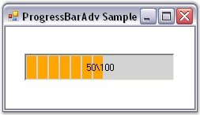

::: {style="DISPLAY: none"}
{#d2h_url_template}{#d2h_package_url style="WIDTH: 0px; DISPLAY: none; HEIGHT: 0px"}
:::

:::: {.d2h_secondary_topic style="PADDING-BOTTOM: 10pt; MARGIN: 0pt; PADDING-LEFT: 0pt; PADDING-RIGHT: 0pt; PADDING-TOP: 0pt"}
##### Text Settings {#text-settings style="tab-stops: 0pt"}

[]{style="COLOR: #15428b"} 

The below are ProgressBarAdv properties to customize the text and its alignment.

[]{style="COLOR: #15428b"} 

::: {align="center"}
  ------------------------- --------------------------------------------------------------------
  ProgressBarAdv Property   Description
  TextAlignment             The text on the progress bar can be set to left, center and right.
  TextOrientation           Indicates the property which decides the orientation of the text.
  TextShadow                Indicates the visibility of the text shadow.
  TextStyle                 Indicates the style of the text.
  TextVisible               Determines if the text of the ProgressBarAdv is visible.
  ------------------------- --------------------------------------------------------------------
:::

[]{style="COLOR: #15428b"} 

+--------------------------------------------------------------------------------------------------------------------------------------------------------------------------------------------------------------+
| **[\[C#\]]{style="FONT-FAMILY: 'Courier New'; COLOR: black"}**                                                                                                                                               |
|                                                                                                                                                                                                              |
| []{style="FONT-FAMILY: 'Courier New'; COLOR: black"}                                                                                                                                                         |
|                                                                                                                                                                                                              |
| [this]{style="FONT-FAMILY: 'Courier New'; COLOR: blue"}[.progressBarAdv1.TextOrientation = System.Windows.Forms.[Orientation]{style="COLOR: teal"}.Horizontal;]{style="FONT-FAMILY: 'Courier New'"}          |
|                                                                                                                                                                                                              |
| [this]{style="FONT-FAMILY: 'Courier New'; COLOR: blue"}[.progressBarAdv1.TextAlignment = Syncfusion.Windows.Forms.Tools.[TextAlignment]{style="COLOR: teal"}.Center;]{style="FONT-FAMILY: 'Courier New'"}    |
|                                                                                                                                                                                                              |
| [this]{style="FONT-FAMILY: 'Courier New'; COLOR: blue"}[.progressBarAdv1.TextStyle = Syncfusion.Windows.Forms.Tools.[ProgressBarTextStyles]{style="COLOR: teal"}.Value;]{style="FONT-FAMILY: 'Courier New'"} |
|                                                                                                                                                                                                              |
| [this]{style="FONT-FAMILY: 'Courier New'; COLOR: blue"}[.progressBarAdv1.TextShadow = [false]{style="COLOR: blue"};]{style="FONT-FAMILY: 'Courier New'"}                                                     |
|                                                                                                                                                                                                              |
| [this]{style="FONT-FAMILY: 'Courier New'; COLOR: blue"}[.progressBarAdv1.TextVisible = [true]{style="COLOR: blue"};]{style="FONT-FAMILY: 'Courier New'"}                                                     |
+--------------------------------------------------------------------------------------------------------------------------------------------------------------------------------------------------------------+

[]{style="COLOR: #15428b"} 

+------------------------------------------------------------------------------------------------------------------------------------------------------------------------------------+
| **[\[VB.NET\]]{style="FONT-FAMILY: 'Courier New'; COLOR: black"}**                                                                                                                 |
|                                                                                                                                                                                    |
| []{style="FONT-FAMILY: 'Courier New'; COLOR: black"}                                                                                                                               |
|                                                                                                                                                                                    |
| [Me]{style="FONT-FAMILY: 'Courier New'; COLOR: blue"}[.progressBarAdv1.TextOrientation = System.Windows.Forms.Orientation.Horizontal]{style="FONT-FAMILY: 'Courier New'"}          |
|                                                                                                                                                                                    |
| [Me]{style="FONT-FAMILY: 'Courier New'; COLOR: blue"}[.progressBarAdv1.TextAlignment = Syncfusion.Windows.Forms.Tools.TextAlignment.Center]{style="FONT-FAMILY: 'Courier New'"}    |
|                                                                                                                                                                                    |
| [Me]{style="FONT-FAMILY: 'Courier New'; COLOR: blue"}[.progressBarAdv1.TextStyle = Syncfusion.Windows.Forms.Tools.ProgressBarTextStyles.Value]{style="FONT-FAMILY: 'Courier New'"} |
|                                                                                                                                                                                    |
| [Me]{style="FONT-FAMILY: 'Courier New'; COLOR: blue"}[.progressBarAdv1.TextShadow = [False]{style="COLOR: blue"}]{style="FONT-FAMILY: 'Courier New'"}                              |
|                                                                                                                                                                                    |
| [Me]{style="FONT-FAMILY: 'Courier New'; COLOR: blue"}[.progressBarAdv1.TextVisible = [True]{style="COLOR: blue"}]{style="FONT-FAMILY: 'Courier New'"}                              |
+------------------------------------------------------------------------------------------------------------------------------------------------------------------------------------+

[]{style="COLOR: #15428b"} 

[{border="0"}]{style="COLOR: #15428b"}[]{style="COLOR: #15428b"}

[]{style="COLOR: #15428b"} 

Figure 975: ProgressBarAdv with Text properties Set

 

 

 

 

[]{#related-topics}
::::
