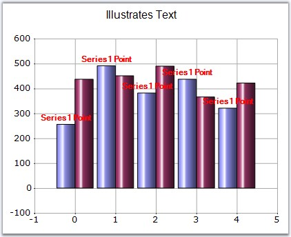
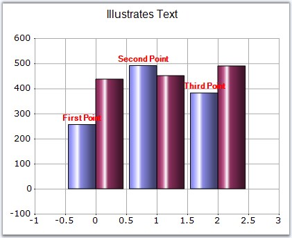

::: {style="DISPLAY: none"}
{#d2h_url_template}{#d2h_package_url style="WIDTH: 0px; DISPLAY: none; HEIGHT: 0px"}
:::

::: {.d2h_secondary_topic style="PADDING-BOTTOM: 10pt; MARGIN: 0pt; PADDING-LEFT: 0pt; PADDING-RIGHT: 0pt; PADDING-TOP: 0pt"}
#### Text (Style) {#text-style style="tab-stops: 0pt"}

**[]{style="FONT-FAMILY: 'Trebuchet MS','sans-serif'; FONT-SIZE: 9pt"}** 

Series Wide Setting

**[]{style="FONT-FAMILY: 'Trebuchet MS','sans-serif'"}** 

Datapoint labels for a series can be specified using **Series.Style.Text** property.

[]{style="FONT-FAMILY: 'Trebuchet MS','sans-serif'; FONT-SIZE: 9pt"} 

+-----------------------------------------------------------------------------------------------------------------------------+
| **[\[C#\]]{style="FONT-FAMILY: 'Courier New'; COLOR: black"}**                                                              |
|                                                                                                                             |
| **[]{style="FONT-FAMILY: 'Courier New'; COLOR: black"}**                                                                    |
|                                                                                                                             |
| [//labels for the series]{style="FONT-FAMILY: 'Courier New'; COLOR: green"}                                                 |
|                                                                                                                             |
| [ChartWebControl1.Series\[0\].Style.DisplayText = [true]{style="COLOR: blue"};]{style="FONT-FAMILY: 'Courier New'"}         |
|                                                                                                                             |
| [ChartWebControl1.Series\[0\].Style.Text = [\"Series1 Point\"]{style="COLOR: maroon"};]{style="FONT-FAMILY: 'Courier New'"} |
+-----------------------------------------------------------------------------------------------------------------------------+

[]{style="FONT-FAMILY: 'Trebuchet MS','sans-serif'; FONT-SIZE: 9pt"} 

+--------------------------------------------------------------------------------------------------------------------------+
| **[\[VB.NET\]]{style="FONT-FAMILY: 'Courier New'; COLOR: black"}**                                                       |
|                                                                                                                          |
| **[]{style="FONT-FAMILY: 'Courier New'; COLOR: black"}**                                                                 |
|                                                                                                                          |
| [\'labels for the series]{style="FONT-FAMILY: 'Courier New'; COLOR: green"}                                              |
|                                                                                                                          |
| [ChartWebControl1.Series\[0\].Style.DisplayText = [True]{style="COLOR: blue"}]{style="FONT-FAMILY: 'Courier New'"}       |
|                                                                                                                          |
| [ChartWebControl1.Series(0).Style.Text = [\"Series1 Point\"]{style="COLOR: maroon"}]{style="FONT-FAMILY: 'Courier New'"} |
+--------------------------------------------------------------------------------------------------------------------------+

[                                                                                 ]{style="FONT-FAMILY: 'Trebuchet MS','sans-serif'; FONT-SIZE: 9pt"}

{border="0"}

**[]{style="FONT-FAMILY: 'Trebuchet MS','sans-serif'; FONT-SIZE: 9pt"}** 

Figure 208: DataPoint Labels displayed for the Series

[                                                                                 ]{style="FONT-FAMILY: 'Trebuchet MS','sans-serif'; FONT-SIZE: 9pt"}

Specific Data Point Setting

**[]{style="FONT-FAMILY: 'Trebuchet MS','sans-serif'"}** 

Labels for specific data points can be specified through **Series.Styles\[0\].Text** property.

**[]{style="FONT-FAMILY: 'Trebuchet MS','sans-serif'; FONT-SIZE: 9pt"}** 

+----------------------------------------------------------------------------------------------------------------------------------+
| **[\[C#\]]{style="FONT-FAMILY: 'Courier New'; COLOR: black"}**                                                                   |
|                                                                                                                                  |
| []{style="FONT-FAMILY: 'Courier New'"}                                                                                           |
|                                                                                                                                  |
| [//labels for the individual datapoints in the series]{style="FONT-FAMILY: 'Courier New'; COLOR: green"}                         |
|                                                                                                                                  |
| [ChartWebControl1.Series\[0\].Style.DisplayText = [true]{style="COLOR: blue"};]{style="FONT-FAMILY: 'Courier New'"}              |
|                                                                                                                                  |
| [ChartWebControl1.Series\[0\].Styles\[0\].Text = [\"First Point\"]{style="COLOR: maroon"};]{style="FONT-FAMILY: 'Courier New'"}  |
|                                                                                                                                  |
| [ChartWebControl1.Series\[0\].Styles\[1\].Text = [\"Second Point\"]{style="COLOR: maroon"};]{style="FONT-FAMILY: 'Courier New'"} |
|                                                                                                                                  |
| [ChartWebControl1.Series\[0\].Styles\[2\].Text = [\"Third Point\"]{style="COLOR: maroon"};]{style="FONT-FAMILY: 'Courier New'"}  |
+----------------------------------------------------------------------------------------------------------------------------------+

[]{style="FONT-FAMILY: 'Trebuchet MS','sans-serif'; FONT-SIZE: 9pt"} 

+-----------------------------------------------------------------------------------------------------------------------------+
| **[\[VB.NET\]]{style="FONT-FAMILY: 'Courier New'; COLOR: black"}**                                                          |
|                                                                                                                             |
| **[]{style="FONT-FAMILY: 'Courier New'; COLOR: black"}**                                                                    |
|                                                                                                                             |
| [\'labels for the individual datapoints in the series]{style="FONT-FAMILY: 'Courier New'; COLOR: green"}                    |
|                                                                                                                             |
| [ChartWebControl1.Series\[0\].Style.DisplayText = [True]{style="COLOR: blue"}]{style="FONT-FAMILY: 'Courier New'"}          |
|                                                                                                                             |
| [ChartWebControl1.Series(0).Styles(0).Text = [\"First Point\"]{style="COLOR: maroon"}]{style="FONT-FAMILY: 'Courier New'"}  |
|                                                                                                                             |
| [ChartWebControl1.Series(0).Styles(1).Text = [\"Second Point\"]{style="COLOR: maroon"}]{style="FONT-FAMILY: 'Courier New'"} |
|                                                                                                                             |
| [ChartWebControl1.Series(0).Styles(2).Text = [\"Third Point\"]{style="COLOR: maroon"}]{style="FONT-FAMILY: 'Courier New'"}  |
+-----------------------------------------------------------------------------------------------------------------------------+

**[]{style="FONT-FAMILY: 'Trebuchet MS','sans-serif'; FONT-SIZE: 9pt"}** 

{border="0"}

**[]{style="FONT-FAMILY: 'Trebuchet MS','sans-serif'; FONT-SIZE: 9pt"}** 

Figure 209: Using Series.Styles\[0\].Text in Column Chart

**[]{style="FONT-FAMILY: 'Trebuchet MS','sans-serif'"}** 

   {border="0"}         

**[]{style="FONT-FAMILY: 'Trebuchet MS','sans-serif'"}** 

Figure 210: Using Series.Styles\[0\].Text in Pie Chart

**[]{style="FONT-FAMILY: 'Trebuchet MS','sans-serif'"}** 

See Also

**[]{style="FONT-FAMILY: 'Trebuchet MS','sans-serif'; FONT-SIZE: 9pt"}** 

[Chart Types]{.UGHyperlink}[]{.UGHyperlink}

[]{#p159} 

 

[]{#related-topics}
:::
