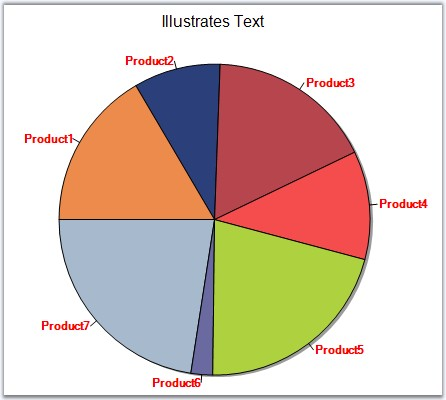

::: {style="DISPLAY: none"}
{#d2h_url_template}{#d2h_package_url style="WIDTH: 0px; DISPLAY: none; HEIGHT: 0px"}
:::

::: {.d2h_secondary_topic style="PADDING-BOTTOM: 10pt; MARGIN: 0pt; PADDING-LEFT: 0pt; PADDING-RIGHT: 0pt; PADDING-TOP: 0pt"}
#### Text (Style) {#text-style style="tab-stops: 0pt"}

 

Series Wide Setting

 

Datapoint labels for a series can be specified using **Series.Style.Text** property.

 

+--------------------------------------------------------------------------------------------------------------------------+
| **[\[C#\]]{style="FONT-FAMILY: 'Courier New'; COLOR: black"}**                                                           |
|                                                                                                                          |
| **[]{style="FONT-FAMILY: 'Courier New'; COLOR: black"}**                                                                 |
|                                                                                                                          |
| [//labels for the series]{style="FONT-FAMILY: 'Courier New'; COLOR: green"}                                              |
|                                                                                                                          |
| [chartControl1.Series\[0\].Style.DisplayText = [true]{style="COLOR: blue"};]{style="FONT-FAMILY: 'Courier New'"}         |
|                                                                                                                          |
| [chartControl1.Series\[0\].Style.Text = [\"Series1 Point\"]{style="COLOR: maroon"};]{style="FONT-FAMILY: 'Courier New'"} |
+--------------------------------------------------------------------------------------------------------------------------+

 

+-----------------------------------------------------------------------------------------------------------------------+
| **[\[VB.NET\]]{style="FONT-FAMILY: 'Courier New'; COLOR: black"}**                                                    |
|                                                                                                                       |
| **[]{style="FONT-FAMILY: 'Courier New'; COLOR: black"}**                                                              |
|                                                                                                                       |
| [\'labels for the series]{style="FONT-FAMILY: 'Courier New'; COLOR: green"}                                           |
|                                                                                                                       |
| [chartControl1.Series\[0\].Style.DisplayText = [True]{style="COLOR: blue"}]{style="FONT-FAMILY: 'Courier New'"}       |
|                                                                                                                       |
| [chartControl1.Series(0).Style.Text = [\"Series1 Point\"]{style="COLOR: maroon"}]{style="FONT-FAMILY: 'Courier New'"} |
+-----------------------------------------------------------------------------------------------------------------------+

                                                                

{border="0"}

 

Figure 216: DataPoint Labels displayed for the Series

                                                                

Specific Data Point Setting

 

Labels for specific data points can be specified through **Series.Styles\[0\].Text** property.

 

+--------------------------------------------------------------------------------------------------------------------------------------------------------+
| **[\[C#\]]{style="FONT-FAMILY: 'Courier New'; COLOR: black"}**                                                                                         |
|                                                                                                                                                        |
| []{style="FONT-FAMILY: 'Courier New'"}                                                                                                                 |
|                                                                                                                                                        |
| [//labels for the individual datapoints in the series]{style="FONT-FAMILY: 'Courier New'; COLOR: green"}                                               |
|                                                                                                                                                        |
| [chartControl1.Series\[0\]]{style="FONT-FAMILY: 'Courier New'"}[.Style.DisplayText = [true]{style="COLOR: blue"};]{style="FONT-FAMILY: 'Courier New'"} |
|                                                                                                                                                        |
| [chartControl1.Series\[0\].Styles\[0\].Text = [\"First Point\"]{style="COLOR: maroon"};]{style="FONT-FAMILY: 'Courier New'"}                           |
|                                                                                                                                                        |
| [chartControl1.Series\[0\].Styles\[1\].Text = [\"Second Point\"]{style="COLOR: maroon"};]{style="FONT-FAMILY: 'Courier New'"}                          |
|                                                                                                                                                        |
| [chartControl1.Series\[0\].Styles\[2\].Text = [\"Third Point\"]{style="COLOR: maroon"};]{style="FONT-FAMILY: 'Courier New'"}                           |
+--------------------------------------------------------------------------------------------------------------------------------------------------------+

 

+-------------------------------------------------------------------------------------------------------------------------------------------------------+
| **[\[VB.NET\]]{style="FONT-FAMILY: 'Courier New'; COLOR: black"}**                                                                                    |
|                                                                                                                                                       |
| **[]{style="FONT-FAMILY: 'Courier New'; COLOR: black"}**                                                                                              |
|                                                                                                                                                       |
| [\'labels for the individual datapoints in the series]{style="FONT-FAMILY: 'Courier New'; COLOR: green"}                                              |
|                                                                                                                                                       |
| [chartControl1.Series\[0\]]{style="FONT-FAMILY: 'Courier New'"}[.Style.DisplayText = [True]{style="COLOR: blue"}]{style="FONT-FAMILY: 'Courier New'"} |
|                                                                                                                                                       |
| [chartControl1.Series(0).Styles(0).Text = [\"First Point\"]{style="COLOR: maroon"}]{style="FONT-FAMILY: 'Courier New'"}                               |
|                                                                                                                                                       |
| [chartControl1.Series(0).Styles(1).Text = [\"Second Point\"]{style="COLOR: maroon"}]{style="FONT-FAMILY: 'Courier New'"}                              |
|                                                                                                                                                       |
| [chartControl1.Series(0).Styles(2).Text = [\"Third Point\"]{style="COLOR: maroon"}]{style="FONT-FAMILY: 'Courier New'"}                               |
+-------------------------------------------------------------------------------------------------------------------------------------------------------+

 

{border="0"}

 

Figure 217: Using Series.Styles\[0\].Text in Column Chart

 

   {border="0"}         

 

Figure 218: Using Series.Styles\[0\].Text in Pie Chart

 

See Also

 

[Chart Types]{.UGHyperlink}[]{.UGHyperlink}

 

[]{#p158} 

 

[]{#related-topics}
:::
